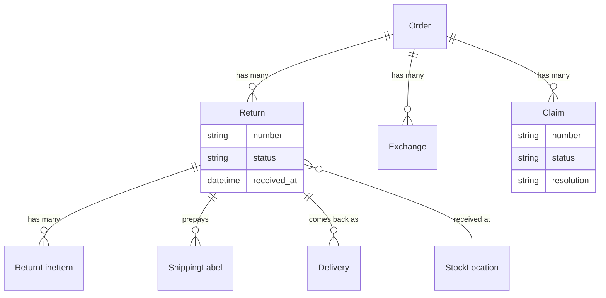

## Overview

Three things can happen after a customer receives an order, and Spree models each on its own:

| Record | What happened | Outcome |
|---|---|---|
| **Return** | Customer sends items back | Money back |
| **Exchange** | Customer sends items back | Different items |
| **Claim** | Item arrived damaged, wrong, or never arrived | Refund, replacement, or both — usually without asking for the goods back |

Keeping them separate matters most for claims. Without a record for "it arrived smashed", merchants end up either creating a manual order or opening a return they immediately mark received — which records the wrong thing and makes damage reporting impossible.



## Statuses

| Record | Statuses |
|---|---|
| **Return** | `requested` → `approved` → `received` → `refunded`, or `canceled` |
| **Exchange** | `requested` → `approved` → `received` → `fulfilled`, or `canceled` |
| **Claim** | `open` → `approved` → `resolved`, or `denied` / `canceled` |

Each step is its own API call, because each one needs information the last one didn't have — what actually turned up, how much to refund, what to send instead.

## Customer self-service

Customers can open a return or a claim on their own order and follow its progress. Approving, receiving and refunding stay with the merchant.

<CodeGroup>

```typescript Store SDK
// Request a return — items refer to units that shipped, not cart line items
const returnRequest = await client.orders.returns.create('or_xxx', {
  items: [{ fulfillment_item_id: 'fi_xxx', quantity: 1 }],
  reason_id: 'rar_xxx',
  memo: 'Too small',
})

// Report a problem
const claim = await client.orders.claims.create('or_xxx', {
  items: [{ line_item_id: 'li_xxx', quantity: 1, description: 'Arrived cracked' }],
  reason_id: 'clr_xxx',
})

// Follow progress
const returns = await client.orders.returns.list('or_xxx')
```

```bash cURL
curl -X POST 'https://api.mystore.com/api/v3/store/orders/or_xxx/returns' \
  -H 'X-Spree-API-Key: pk_xxx' \
  -H 'X-Spree-Token: order_token_xxx' \
  -H 'Content-Type: application/json' \
  -d '{ "items": [{ "fulfillment_item_id": "fi_xxx", "quantity": 1 }],
        "memo": "Too small" }'
```

</CodeGroup>

Claim reasons are records each store owns. New stores are seeded with *Arrived damaged*, *Never arrived*, *Wrong item sent*, *Missing item from order* and *Item not as described*, and merchants can add, rename or remove their own.

## Processing a return

<CodeGroup>

```typescript Admin SDK
// Approve
await adminClient.orders.returns.approve('or_xxx', 'ret_xxx')

// Record what actually arrived
await adminClient.orders.returns.receive('or_xxx', 'ret_xxx', {
  items: [
    { return_line_item_id: 'rli_1', quantity: 2, resellable: true },
    { return_line_item_id: 'rli_2', quantity: 1, resellable: false },
  ],
})

// Refund
await adminClient.orders.returns.refund('or_xxx', 'ret_xxx', {
  amount: '24.99',
  refund_method: 'original_payment',
})
```

```bash cURL
curl -X PATCH 'https://api.mystore.com/api/v3/admin/orders/or_xxx/returns/ret_xxx/receive' \
  -H 'X-Spree-API-Key: sk_xxx' \
  -H 'Content-Type: application/json' \
  -d '{ "items": [{ "return_line_item_id": "rli_1", "quantity": 2, "resellable": true }] }'
```

</CodeGroup>

Receiving takes the quantities the warehouse actually counted, because partial and damaged returns are normal rather than exceptional. A customer says three items are coming; two arrive; one of those can't be sold again. Only resellable goods go back into stock.

Leave `items` out to receive everything as requested. Refunds default to whatever the return is still owed, and can go back to the original payment method or to store credit. A returned item is worth what the customer paid for it after discounts, not its list price, so a free gift sent back refunds nothing. Refunding a return that is owed nothing completes it with no money moved and no refund email; an amount of zero is refused on any return the customer is still owed money on.

### Tax on returns

A return gives back the tax the customer paid on what came back. A $25.00 shirt sold with 10% tax added on top refunds $27.50, and on a store whose prices include VAT the VAT inside the price goes back with it. Delivery and its tax are not refunded.

Each return line shows its worth the way an order line does: `pre_tax_amount` before tax, `included_tax_total` and `additional_tax_total` beside it, and `refund_amount` with the tax included. The return's `refund_tax_total` says how much of `refund_total` is tax, and `expand=return_line_items.tax_lines` (Admin API) lists the tax given back rate by rate.

The store's [tax provider](/developer/core-concepts/taxes) works this out when the return opens, and again just before the money goes back, for the units the warehouse counted. Refunding less than the return is worth — keeping a restocking fee, say — gives the tax back in the same proportion as the goods. If the tax service cannot answer, the return is not opened (or not refunded) and the customer can try again. Claims and exchanges follow the same rules.

### Where the goods come back to

A return is received at a stock location. By default that is wherever the goods
shipped from, which is right until a merchant inspects and restocks returns at
one processing centre — so locations carry a `returns_enabled` flag, and a
return routes to one that accepts them: the seller's for a seller's goods, the
operator's own otherwise. Pass `stock_location_id` when opening the return to
choose explicitly.

### Prepaid return labels

A return can carry its own postage. The label is bought against the same
carrier account the outbound parcel shipped on, and the shipment is booked in
reverse — from the customer's address back to the return's stock location.

Buying one mints a delivery on the return, so the inbound parcel is tracked the
same way an outbound one is. A delivery reporting arrival never receives the
return: arrival is not inspection, and what actually turned up is still counted
by hand.

<CodeGroup>

```typescript Admin SDK
// Buy prepaid postage for the parcel coming back
const label = await adminClient.orders.returns.labels.create('or_xxx', 'ret_xxx')

// Or record one bought elsewhere
await adminClient.orders.returns.labels.create('or_xxx', 'ret_xxx', {
  file: signedBlobId,
  tracking_number: '1Z999AA10123456784',
})
```

```bash cURL
curl -X POST 'https://api.mystore.com/api/v3/admin/orders/or_xxx/returns/ret_xxx/labels' \
  -H 'X-Spree-API-Key: sk_xxx'
```

</CodeGroup>

Customers download the label from the storefront, so a return request can end
with "print this and drop it off" rather than an email exchange. See
[shipping labels](/developer/core-concepts/fulfillments#shipping-labels) for
how postage records work in general.

## Resolving a claim

What to do about a claim is decided when you resolve it, not when the customer opens it — merchants usually decide once they've seen the photos.

<CodeGroup>

```typescript Admin SDK
await adminClient.orders.claims.approve('or_xxx', 'claim_xxx')

await adminClient.orders.claims.resolve('or_xxx', 'claim_xxx', {
  resolution: 'refund_and_replacement',   // or 'refund', 'replacement'
  refund_method: 'store_credit',
  replacement_line_item_ids: ['li_xxx'],
})
```

```bash cURL
curl -X PATCH 'https://api.mystore.com/api/v3/admin/orders/or_xxx/claims/claim_xxx/approve' \
  -H 'X-Spree-API-Key: sk_xxx'

curl -X PATCH 'https://api.mystore.com/api/v3/admin/orders/or_xxx/claims/claim_xxx/resolve' \
  -H 'X-Spree-API-Key: sk_xxx' \
  -H 'Content-Type: application/json' \
  -d '{
    "resolution": "refund_and_replacement",
    "refund_method": "store_credit",
    "replacement_line_item_ids": ["li_xxx"]
  }'
```

</CodeGroup>

A replacement creates a new [fulfillment](/developer/core-concepts/fulfillments) on the original order, so the customer doesn't have to place a second one.

The replacement is filed under the order line it replaces, but it doesn't count toward that line's quantity. Editing the line later, from a claim or an [exchange](#exchanges), adds or removes only the goods the customer paid for and leaves the replacement where it is. Adding a fulfillment for that line works the same way: it takes only the goods the customer paid for, and the replacement stays in its own fulfillment.

If a replacement's fulfillment is canceled, for example because the courier lost the booking, send the goods again by naming that fulfillment as the source of a new one. The new fulfillment takes everything the canceled one held and reserves its stock again. It is priced like any new fulfillment, so pass `cost: 0` to carry over the canceled fulfillment's delivery cost instead, which keeps a free replacement free.

<CodeGroup>

```typescript Admin SDK
await adminClient.orders.fulfillments.create('or_xxx', {
  stock_location_id: 'sloc_xxx',
  source_fulfillment_id: 'ful_xxx', // the canceled replacement fulfillment
  cost: 0,
})
```

```bash cURL
curl -X POST 'https://api.mystore.com/api/v3/admin/orders/or_xxx/fulfillments' \
  -H 'X-Spree-API-Key: sk_xxx' \
  -H 'Content-Type: application/json' \
  -d '{
    "stock_location_id": "sloc_xxx",
    "source_fulfillment_id": "ful_xxx",
    "cost": 0
  }'
```

</CodeGroup>

A claim never refunds more than the customer paid for the claimed items after discounts, tax included. Each claim line reports that ceiling as `paid_amount`, and the `refund_amount` you enter for a line includes its tax. The tax goes back in proportion to the money: refunding half of what a line is worth gives back half its tax, and resolving with a replacement alone gives none back.

## Exchanges

An exchange works like a return, but ends by sending different items instead of refunding:

<CodeGroup>

```typescript Admin SDK
await adminClient.orders.exchanges.approve('or_xxx', 'exch_xxx')
await adminClient.orders.exchanges.receive('or_xxx', 'exch_xxx')
await adminClient.orders.exchanges.fulfill('or_xxx', 'exch_xxx')
```

```bash cURL
curl -X PATCH 'https://api.mystore.com/api/v3/admin/orders/or_xxx/exchanges/exch_xxx/approve' \
  -H 'X-Spree-API-Key: sk_xxx'

curl -X PATCH 'https://api.mystore.com/api/v3/admin/orders/or_xxx/exchanges/exch_xxx/receive' \
  -H 'X-Spree-API-Key: sk_xxx'

curl -X PATCH 'https://api.mystore.com/api/v3/admin/orders/or_xxx/exchanges/exch_xxx/fulfill' \
  -H 'X-Spree-API-Key: sk_xxx'
```

</CodeGroup>

### Settling the difference

An exchange credits what came back and sells the replacement, each with its tax:

- `original_price` is what the customer paid for the items coming back, after discounts and with their tax.
- `new_variant_price` is the replacement, with its own tax. It keeps the deal the customer had: an item bought at 10% off is replaced at 10% off its price, so swapping a size costs nothing.
- `price_difference` is the second less the first.

When you fulfill, a cheaper replacement refunds the difference, to store credit or the original payment. A dearer one adds the difference to the order as an `exchange` [fee](/developer/core-concepts/fees), so the order shows a balance due. Spree never charges a stored card for it; take the payment through the order's [payments](/developer/core-concepts/payments).

## Reporting

Because each one is its own record, you can query them directly:

<CodeGroup>

```typescript Admin SDK
// Everything awaiting action
const pending = await adminClient.returns.list({ status_eq: 'approved' })

// Claims opened this month
const claims = await adminClient.claims.list({
  created_at_gt: '2026-08-01',
})
```

```bash cURL
curl 'https://api.mystore.com/api/v3/admin/returns?q[status_eq]=approved' \
  -H 'X-Spree-API-Key: sk_xxx'

curl 'https://api.mystore.com/api/v3/admin/claims?q[created_at_gt]=2026-08-01' \
  -H 'X-Spree-API-Key: sk_xxx'
```

</CodeGroup>

## Return policy

Spree ships one built-in rule: a return window, counted from when the order was placed and set per market (30 days by default). Whether a customer may open a return is store policy, and it's checked when the return is created — so you can hold customers to that window while letting staff make an exception for a good customer, and vary the rule by market where local law requires it.

Set the return window per market, or express a more specific rule in your own application. See [Configuration](/developer/customization/configuration) and [Services & Workflows](/developer/customization/workflows).

## Events

Each step publishes an [event](/developer/core-concepts/events) — `return.received`, `return.refunded`, `exchange.fulfilled`, `claim.resolved` — which also reach [webhooks](/developer/core-concepts/webhooks).

Returns and claims also update the order's [payment status](/developer/core-concepts/orders#statuses), so a refunded order reflects it without any manual bookkeeping.

## Related

- [Orders](/developer/core-concepts/orders) — payment status after refunds
- [Fulfillments](/developer/core-concepts/fulfillments) — replacement deliveries
- [Inventory](/developer/core-concepts/inventory) — putting returned goods back in stock
