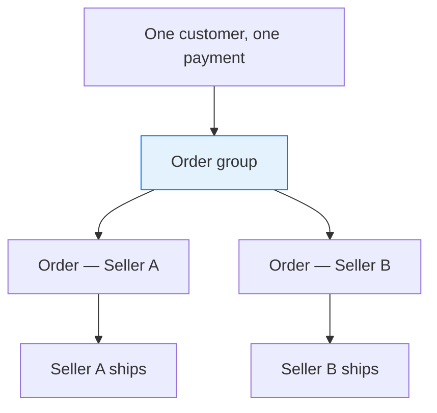
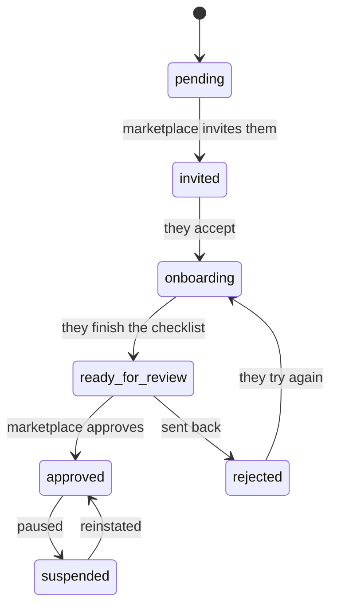
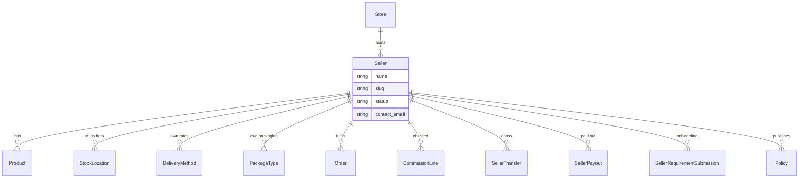
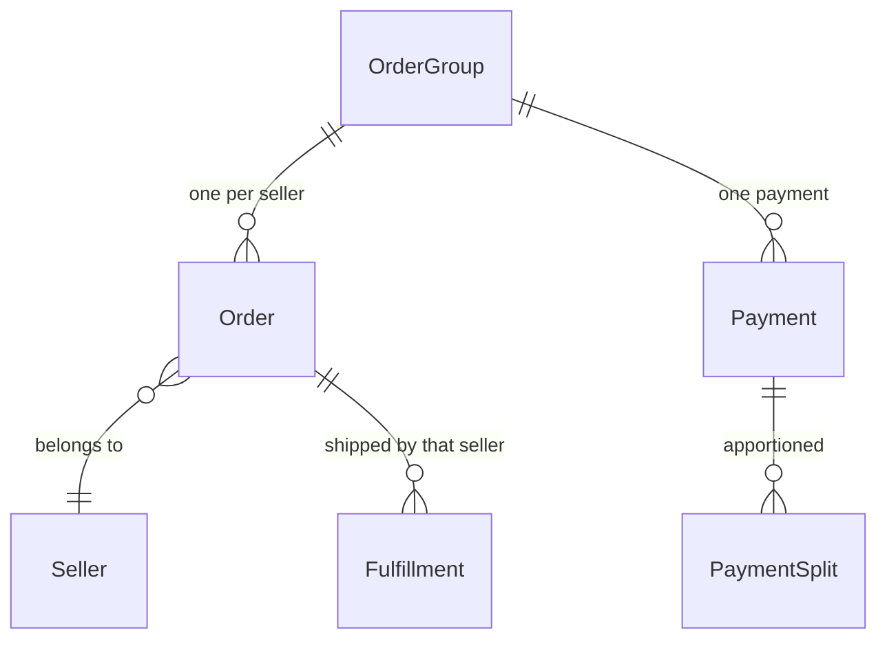
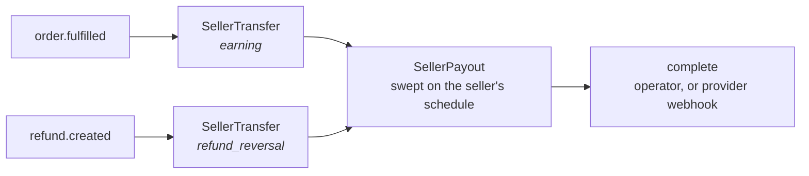

## Overview

A marketplace sells things it doesn't own. Vendors list their own products, the marketplace takes a cut, and a shopper buying from three vendors at once expects one basket and one payment — not three checkouts.

A **seller** is a vendor on your marketplace: their own products, their own staff, their own orders, and their own panel to work in.



<Info>
This is all open source. Sellers, product review, order splitting, commissions and the seller panel ship in the box — you don't need a commercial licence to run a marketplace on Spree.
</Info>

## The seller lifecycle

A seller isn't simply created and switched on. Bringing a vendor onto a marketplace is a process with a decision at the end of it, and the status reflects where they are in it.



| Status | Meaning |
|---|---|
| `pending` | Created, nothing sent yet |
| `invited` | Invitation sent, not yet accepted |
| `onboarding` | Working through the requirements |
| `ready_for_review` | Waiting on the marketplace |
| `approved` | Live — can sell |
| `rejected` | Sent back, with a reason |
| `suspended` | Paused, temporarily |
| `canceled` | Gone |

Only an **approved** seller can sell, and even then not while they're on holiday — sellers can pause their own listings without the marketplace suspending them.

## What a seller owns

A seller is a tenant inside the marketplace: their own catalogue, their own
stock, their own shipping setup and their own money trail. Delivery profiles and
zones stay with the operator — a seller picks from them rather than defining
them.



A seller's delivery methods are their own — internal rates and manual
fulfillment, since carrier accounts stay with the operator. Their package types
sit alongside the marketplace's shared ones, so they can pack into the
operator's standard cartons or record their own.

<CodeGroup>

```typescript Admin SDK
await adminClient.sellers.invite('sel_xxx')
await adminClient.sellers.approve('sel_xxx')
await adminClient.sellers.suspend('sel_xxx', { reason: 'Unresolved delivery complaints' })
```

```bash cURL
# Invite, approve, suspend
curl -X POST 'https://api.mystore.com/api/v3/admin/sellers/sel_xxx/invite' \
  -H 'X-Spree-API-Key: sk_xxx'

curl -X POST 'https://api.mystore.com/api/v3/admin/sellers/sel_xxx/approve' \
  -H 'X-Spree-API-Key: sk_xxx'

curl -X POST 'https://api.mystore.com/api/v3/admin/sellers/sel_xxx/suspend' \
  -H 'X-Spree-API-Key: sk_xxx' \
  -H 'Content-Type: application/json' \
  -d '{ "reason": "Unresolved delivery complaints" }'
```

</CodeGroup>

Status is never set by writing to the field — each move is its own action, so approving a seller can run the checks that belong to approving.

## Onboarding requirements

What a vendor must do before selling differs by marketplace. A hardware marketplace wants insurance documents; a craft marketplace wants a filled-in profile and one product.

So the checklist is **configured, not hardcoded**. Each store defines its own:

<CodeGroup>

```typescript Admin SDK
const { data: types } = await adminClient.sellerRequirements.types()

await adminClient.sellerRequirements.create({
  type: 'minimum_products',
  name: 'List at least three products',
  required: true,
  preferences: { minimum_count: 3 },
})
```

```bash cURL
# Requirement kinds this marketplace offers
curl 'https://api.mystore.com/api/v3/admin/seller_requirements/types' \
  -H 'X-Spree-API-Key: sk_xxx'

# Add one to the checklist
curl -X POST 'https://api.mystore.com/api/v3/admin/seller_requirements' \
  -H 'X-Spree-API-Key: sk_xxx' \
  -H 'Content-Type: application/json' \
  -d '{
    "type": "minimum_products",
    "name": "List at least three products",
    "required": true
  }'
```

</CodeGroup>

Requirements come in three flavours, which is what lets one mechanism cover very different demands:

| Kind | How it's satisfied |
|---|---|
| **Computed** | Automatically, from the seller's own data — a billing address exists, three products are listed |
| **Attested** | The seller confirms something — accepting terms |
| **Verified** | The seller submits something and the marketplace rules on it — a document, an operator review |

Shipped out of the box: accepting terms, completing the profile, a billing address, a returns address, a way to ship, the box they ship in, and a minimum number of products. Also available are generic document upload, attestation, operator review, and required custom fields.

A seller sees their checklist and its progress:

<CodeGroup>

```typescript Seller SDK
const onboarding = await sellerClient.onboarding.get()

onboarding.progress    // { done: 3, total: 5 }
onboarding.requirements.forEach((r) => {
  r.name      // "Accept the seller terms"
  r.status    // complete | incomplete | pending | rejected
  r.required  // whether it blocks approval
})

await sellerClient.onboarding.submitForReview()
```

```bash cURL
curl 'https://marketplace.example.com/api/v3/seller/onboarding' \
  -H 'Authorization: Bearer $SELLER_JWT' \
  -H 'X-Spree-Seller-Id: sel_xxx'
```

</CodeGroup>

The checklist is **worked out when read**, never stored on the seller. So a requirement added next month applies immediately to everyone, and nothing has to be backfilled.

<Note>
The checklist is enforced at exactly two moments — submitting for review, and approval. Approval refuses while a required item is outstanding, unless an operator deliberately overrides it.

Afterwards it's advisory. If a seller's insurance certificate lapses, that's flagged for the marketplace to act on; it does not silently stop their sales mid-trade.
</Note>

## Products belong to sellers

A product can name a seller. No seller means it's the marketplace's own stock — a marketplace that also sells directly is a normal setup.

Sellers don't publish; they **submit**, and the marketplace decides. That review flow, and the statuses behind it, are covered in [Products](/developer/core-concepts/products#seller-submissions).

<CodeGroup>

```typescript Seller SDK
const product = await sellerClient.products.create({ name: 'Handmade Vase' })
await sellerClient.products.submit(product.id)
```

```bash cURL
# Create a product, then submit it for review
curl -X POST 'https://marketplace.example.com/api/v3/seller/products' \
  -H 'Authorization: Bearer $SELLER_JWT' \
  -H 'X-Spree-Seller-Id: sel_xxx' \
  -H 'Content-Type: application/json' \
  -d '{ "name": "Handmade Vase" }'

curl -X POST 'https://marketplace.example.com/api/v3/seller/products/prod_xxx/submit' \
  -H 'Authorization: Bearer $SELLER_JWT' \
  -H 'X-Spree-Seller-Id: sel_xxx'
```

</CodeGroup>

Stores that trust their vendors can turn auto-approval on and skip the queue.

## One checkout, several sellers

This is the part that makes a marketplace different from a shop, and it's worth understanding before you build a storefront against it.

A customer fills one basket, enters one address, and pays once. But each seller needs their own order — they fulfil separately, get paid separately, and must never see each other's business.

So at completion, a checkout spanning several sellers becomes an **order group**: one container holding one order per seller.



| Level | Owns |
|---|---|
| **Order group** | The customer, the addresses, the payment, the combined totals |
| **Order** | One seller's items, fulfillments and money lines |

The single payment is apportioned across the child orders as **payment splits**, so each seller's share of one charge is recorded exactly — which is what makes per-seller refunds and settlement possible later.

Two details worth knowing:

- **Group totals are added up, not divided.** The group's total is the sum of its children, so it always agrees with them.
- **Delivery and order-level fees are shared out by item value**, so a seller whose goods made up most of the basket carries most of the delivery charge.

<Warning>
A storefront must handle the possibility of an order group. Completing a cart may yield one order or several, and a customer's order history should show the group as one purchase rather than confronting them with three orders they don't remember placing separately.

A back office must handle it too: an order raised from the admin divides the same way, so completing one may answer with a group instead of an order.
</Warning>

<CodeGroup>

```typescript Admin SDK
import { isOrderGroup } from '@spree/admin-sdk'

const result = await client.orders.complete('or_UkLWZg9DAJ')

// One order per seller when the order held several sellers' goods.
const orders = isOrderGroup(result) ? result.orders : [result]
```

```bash cURL
curl -X PATCH https://your-store.com/api/v3/admin/orders/or_UkLWZg9DAJ/complete \
  -H "X-Spree-API-Key: sk_xxx" \
  -H "Content-Type: application/json"
```

</CodeGroup>

## Commission

Commission is what the marketplace charges for the sale — configured as **rates**, and recorded per sale as immutable **commission lines**.

<CodeGroup>

```typescript Admin SDK
const { data: lines } = await adminClient.commissionLines.list({
  seller_id_eq: 'sel_xxx',
})
```

```bash cURL
curl 'https://api.mystore.com/api/v3/admin/commission_lines?q[seller_id_eq]=sel_xxx' \
  -H 'X-Spree-API-Key: sk_xxx'
```

</CodeGroup>

Three things are worth knowing here; the rest is on its own page.

- **Rates are tried in list order**, and the first whose rules match wins. A rate with no rules matches everything, so the marketplace default belongs at the bottom.
- **Commission is charged on the seller's net revenue by default**, after discounts and excluding the customer's tax.
- **Commission tax follows the seller's jurisdiction**, not the shopper's — the marketplace is selling a service to the vendor, which is a separate supply from the vendor's sale to the customer.

See [Commissions](/developer/core-concepts/commissions) for rate targeting, the four rule types, per-currency floors and caps, and how a fee is calculated and taxed.

## Payouts

Spree keeps a two-level ledger of what each seller is owed, and settles it on a schedule. Whether money actually moves is the payout provider's job; the books are kept either way.



### Transfers — what an order earned

A seller earns on **fulfillment**, not on payment: the marketplace holds the money until the goods ship, and a digital order fulfils immediately so it earns immediately. When `order.fulfilled` fires, a `Spree::SellerTransfer` of kind `earning` is written for the seller's sale less [commission](/developer/core-concepts/commissions), in the sale's currency.

The amount is payment-source-agnostic — store credit and gift cards are how the customer paid, which is the platform's funding concern, not the seller's.

A refund never edits an earning. `refund.created` writes a second row of kind `refund_reversal` against the same order, so what a seller has earned is always the sum of their transfers, and a reversal that lands after a payout closed falls into the next period rather than rewriting a settlement that already happened.

### Payouts — what was sent

On schedule, a seller's confirmed, unsettled earnings are batched into one `Spree::SellerPayout` per currency and handed to the provider. A payout names exactly which transfers it settled, which is what a seller needs to reconcile a deposit.

Both records share one status set: `pending` → `processing` → `completed`, or `failed` / `unresolved`. **Completing is what debits the balance** — a balance is earnings less *completed* settlements — and nothing completes a payout automatically at creation, because "the money arrived" is a claim about the outside world. An operator running the built-in provider marks it paid once the bank transfer is sent; a connected provider marks it paid when its webhook says so. Either way it publishes `seller_payout.completed`.

`unresolved` is deliberate: a send whose outcome nobody knows keeps its transfers rather than releasing them, since releasing is how the same earnings get sent twice.

### Schedule and thresholds

Each seller settles on their own interval — `daily`, `weekly`, `biweekly`, `monthly`, or `manual` — and only once their balance clears a minimum. Both fall back to the store's defaults (`default_payouts_schedule_interval`, `default_minimum_payout_amount`); below the minimum the balance simply carries forward.

The scheduler is the host app's. Two jobs fan out per seller and the interval logic lives inside them, since a cron expression cannot say "weekly, but from whenever *this* seller was last paid":

| Job | Run it | Does |
|---|---|---|
| `Spree::SellerPayouts::SweepDueJob` | daily | settles every seller who is due |
| `Spree::SellerTransfers::ExecutePendingDueJob` | hourly | retries earnings a provider refused — usually a passing thing |

A project created with `create-spree-app` schedules both already, in
`server/config/recurring.yml`. They are a cheap no-op on a store with no
sellers, so there is nothing to turn off if you are not running a marketplace.

<Warning>
  On an existing project, or one using a scheduler of its own, check both are
  scheduled — a marketplace that never runs the sweep never pays a seller, and
  nothing reports the omission.

```yaml server/config/recurring.yml
production:
  sweep_due_seller_payouts:
    class: Spree::SellerPayouts::SweepDueJob
    schedule: at 3am every day
  execute_pending_seller_transfers:
    class: Spree::SellerTransfers::ExecutePendingDueJob
    schedule: every hour at minute 27
```
</Warning>

A seller on the `manual` interval is skipped by the sweep and settled by hand instead:

<CodeGroup>

```typescript Admin SDK
// Where the seller stands, one row per currency
const { data: balances } = await adminClient.sellers.balances('sel_xxx')

// Settle them now, whatever their schedule says
await adminClient.sellers.settle('sel_xxx')

// The built-in provider: record that the bank transfer went out
await adminClient.sellerPayouts.complete('vpo_xxx', { reference: 'TRN-2026-0912-0042' })
```

```bash cURL
curl 'https://api.mystore.com/api/v3/admin/sellers/sel_xxx/balances' \
  -H 'X-Spree-API-Key: sk_xxx'

curl -X POST 'https://api.mystore.com/api/v3/admin/sellers/sel_xxx/payouts' \
  -H 'X-Spree-API-Key: sk_xxx'

curl -X PATCH 'https://api.mystore.com/api/v3/admin/seller_payouts/vpo_xxx/complete' \
  -H 'X-Spree-API-Key: sk_xxx' \
  -H 'Content-Type: application/json' \
  -d '{ "reference": "TRN-2026-0912-0042" }'
```

</CodeGroup>

Settling answers `201` with the payouts it created, one per currency. When one
currency settles and another is refused it still answers `201`, listing what
failed under `meta.failures` — so check that rather than assuming success. With
nothing to settle it answers `422`.

### Reading the ledger

Across every seller, from the marketplace side:

```typescript Admin SDK
const { data: transfers } = await adminClient.sellerTransfers.list({ seller_id_eq: 'sel_xxx' })
const { data: payouts } = await adminClient.sellerPayouts.list({ status_eq: 'completed' })

const payout = await adminClient.sellerPayouts.get('vpo_xxx')
```

And from the seller's own panel, where every request is already scoped to the
seller signed in — which is why none of these takes a seller ID:

```typescript Seller SDK
// What I'm owed, one row per currency
const { data: balances } = await sellerClient.balances.list()

// What I earned, and which payout settled it
const { data: transfers } = await sellerClient.transfers.list({ payout_id_eq: 'vpo_xxx' })
const { data: payouts } = await sellerClient.payouts.list()
```

All of it is read-only: the ledger is written by fulfilment and the sweep, never
by a seller.

### Payout providers

A provider is a stateless class registered in `Spree.payout_providers` and chosen per store with the `payout_provider` preference. Core ships one:

| Provider | Moves money? | Completion |
|---|---|---|
| `Spree::PayoutProvider::System` (default) | No — keeps the books | The operator marks each payout paid, with the bank reference |
| Stripe Connect (`spree_stripe`) | Yes — transfers each earning to the seller's connected account as goods ship, tied to the charge that funds it | A Stripe webhook, when the money lands |

The contract is small: `transfer!` credits one earning, `pay!` sends one settlement, `reverse!` takes back part of an earning after a refund, and every call carries an idempotency key derived from the ledger row so a retry finds the movement it already made. Providers that need the seller to hold an account with them answer `requires_payout_account?` and implement `onboarding_url` — which is what the **payout account** [onboarding requirement](#onboarding-requirements) drives. A seller gets a fresh link from `POST /seller/onboarding/payout_account`, and `GET /admin/payout_providers` lists what is registered, for a picker.

A connected provider confirms settlements through `POST /api/v3/webhooks/payouts/:payment_method_id` — separate from the payment webhook, because providers scope seller-account events to their own subscription and signing secret. To pay sellers through rails of your own, see [Seller payouts](/developer/providers/payouts).

See [Stripe Connect for marketplaces](/integrations/payments/stripe-connect) for the shipped provider.

<Note>
Refund clawbacks and netting across settlements, reconciliation, KYC operations and seller tax reporting (DAC7) are Spree Enterprise.
</Note>

## The seller panel

Sellers get their own application — not access to the marketplace's dashboard. It's a separate API with its own sign-in, and every request is scoped to the seller making it, so no endpoint even takes a seller ID.

That last point is the security property worth relying on: a seller cannot ask for another seller's data, because there's nowhere in the request to name one.

<CodeGroup>

```typescript Seller SDK
import { createSellerClient } from '@spree/seller-sdk'

const sellerClient = createSellerClient({ baseUrl: 'https://marketplace.example.com' })

await sellerClient.auth.login({ email: 'vendor@example.com', password: '…' })

const { data: orders } = await sellerClient.orders.list()
await sellerClient.orders.fulfillments.fulfill(orderId, fulfillmentId, {
  tracking: '1Z999AA10123456784',
})
```

```bash cURL
# Sign in, then use the returned JWT on every seller call
curl -X POST 'https://marketplace.example.com/api/v3/seller/auth/login' \
  -H 'Content-Type: application/json' \
  -d '{ "email": "vendor@example.com", "password": "…" }'
```

</CodeGroup>

Sellers can manage their profile, invite their own team, list and submit products, see and fulfil their orders, manage their stock locations, delivery methods and packaging, and work through onboarding. They cannot see other sellers, the marketplace's own catalog, or anything belonging to the store at large.

What a seller's staff may do is governed by [roles](/developer/core-concepts/staff-roles) owned by the seller — the same permission system as the back office, with a narrower set of keys, so a seller role can never reach store settings.

## Related

- [Commissions](/developer/core-concepts/commissions) — rates, rules, and what the marketplace charges
- [Products](/developer/core-concepts/products#seller-submissions) — the listing review flow
- [Orders](/developer/core-concepts/orders) — orders and their statuses
- [Delivery setup](/developer/core-concepts/delivery-setup#on-a-marketplace) — how a seller's goods ship, and what they ship in
- [Staff & Roles](/developer/core-concepts/staff-roles) — how seller teams are governed
- [Seller API](/api-reference/seller-api/introduction) — the full endpoint reference
