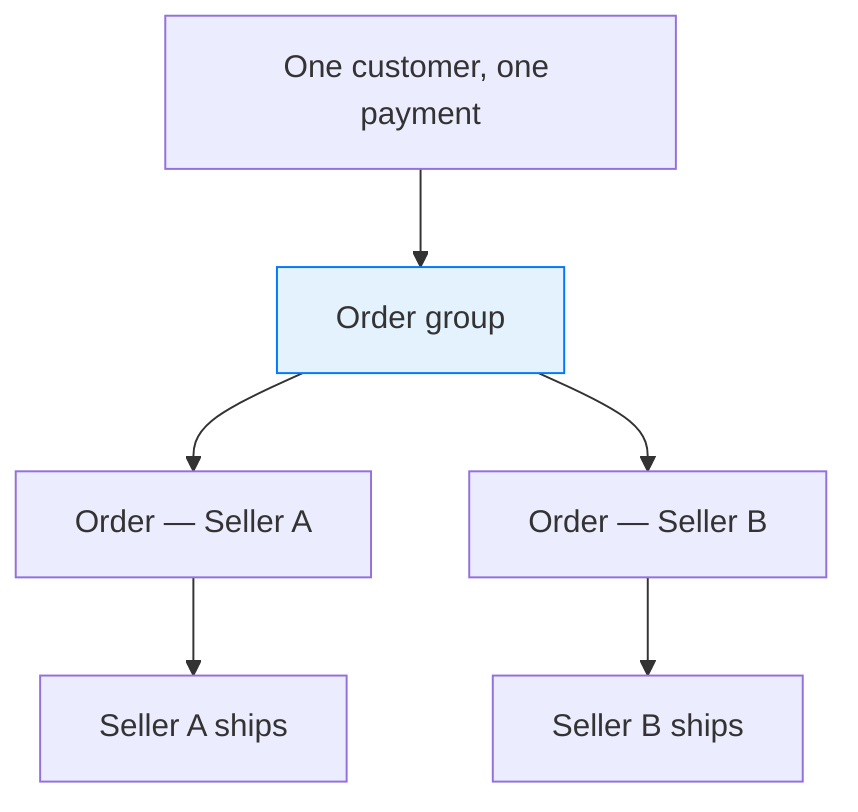
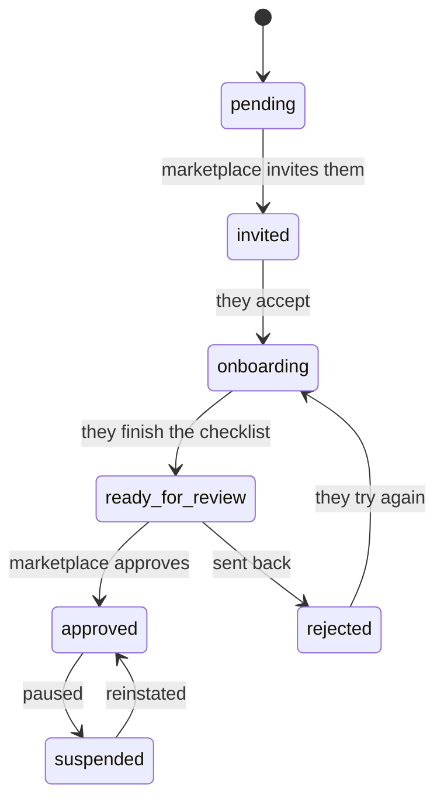
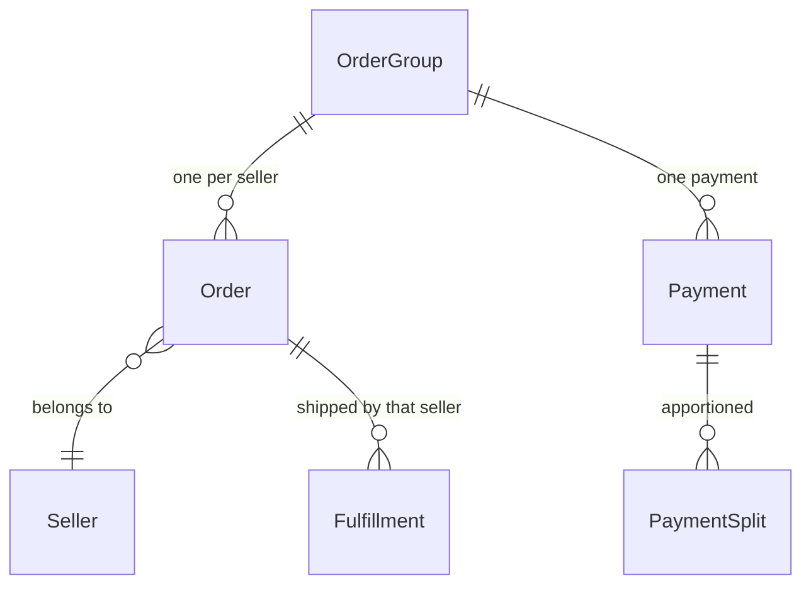

## Overview

A marketplace sells things it doesn't own. Vendors list their own products, the marketplace takes a cut, and a shopper buying from three vendors at once expects one basket and one payment — not three checkouts.

A **seller** is a vendor on your marketplace: their own products, their own staff, their own orders, and their own panel to work in.



<Info>
This is all open source. Sellers, product review, order splitting, commissions and the seller panel ship in the box — you don't need a commercial licence to run a marketplace on Spree.
</Info>

## The seller lifecycle

A seller isn't simply created and switched on. Bringing a vendor onto a marketplace is a process with a decision at the end of it, and the status reflects where they are in it.



| Status | Meaning |
|---|---|
| `pending` | Created, nothing sent yet |
| `invited` | Invitation sent, not yet accepted |
| `onboarding` | Working through the requirements |
| `ready_for_review` | Waiting on the marketplace |
| `approved` | Live — can sell |
| `rejected` | Sent back, with a reason |
| `suspended` | Paused, temporarily |
| `canceled` | Gone |

Only an **approved** seller can sell, and even then not while they're on holiday — sellers can pause their own listings without the marketplace suspending them.

```typescript Admin SDK
await adminClient.sellers.invite('sel_xxx')
await adminClient.sellers.approve('sel_xxx')
await adminClient.sellers.suspend('sel_xxx', { reason: 'Unresolved delivery complaints' })
```

Status is never set by writing to the field — each move is its own action, so approving a seller can run the checks that belong to approving.

## Onboarding requirements

What a vendor must do before selling differs by marketplace. A hardware marketplace wants insurance documents; a craft marketplace wants a filled-in profile and one product.

So the checklist is **configured, not hardcoded**. Each store defines its own:

```typescript Admin SDK
const { data: types } = await adminClient.sellerRequirements.types()

await adminClient.sellerRequirements.create({
  type: 'Spree::SellerRequirements::MinimumProducts',
  name: 'List at least three products',
  required: true,
  preferences: { minimum_count: 3 },
})
```

Requirements come in three flavours, which is what lets one mechanism cover very different demands:

| Kind | How it's satisfied |
|---|---|
| **Computed** | Automatically, from the seller's own data — a billing address exists, three products are listed |
| **Attested** | The seller confirms something — accepting terms |
| **Verified** | The seller submits something and the marketplace rules on it — a document, an operator review |

A document requirement accepts a PDF, an image, or a Word file. The server confirms the type from the file's bytes, so the host needs the Unix `file` command — see [Docker](/developer/deployment/docker).

Shipped out of the box: accepting terms, completing the profile, a billing address, a returns address, and a minimum number of products. Also available are generic document upload, attestation, operator review, and required custom fields.

A seller sees their checklist and its progress:

```typescript Seller SDK
const onboarding = await sellerClient.onboarding.get()

onboarding.progress    // { done: 3, total: 5 }
onboarding.requirements.forEach((r) => {
  r.name      // "Accept the seller terms"
  r.status    // complete | incomplete | pending | rejected
  r.required  // whether it blocks approval
})

await sellerClient.onboarding.submitForReview()
```

The checklist is **worked out when read**, never stored on the seller. So a requirement added next month applies immediately to everyone, and nothing has to be backfilled.

<Note>
The checklist is enforced at exactly two moments — submitting for review, and approval. Approval refuses while a required item is outstanding, unless an operator deliberately overrides it.

Afterwards it's advisory. If a seller's insurance certificate lapses, that's flagged for the marketplace to act on; it does not silently stop their sales mid-trade.
</Note>

## Products belong to sellers

A product can name a seller. No seller means it's the marketplace's own stock — a marketplace that also sells directly is a normal setup.

Sellers don't publish; they **submit**, and the marketplace decides. That review flow, and the statuses behind it, are covered in [Products](/developer/core-concepts/products#seller-submissions).

```typescript Seller SDK
const product = await sellerClient.products.create({ name: 'Handmade Vase' })
await sellerClient.products.submit(product.id)
```

Stores that trust their vendors can turn auto-approval on and skip the queue.

## One checkout, several sellers

This is the part that makes a marketplace different from a shop, and it's worth understanding before you build a storefront against it.

A customer fills one basket, enters one address, and pays once. But each seller needs their own order — they fulfil separately, get paid separately, and must never see each other's business.

So at completion, a checkout spanning several sellers becomes an **order group**: one container holding one order per seller.



| Level | Owns |
|---|---|
| **Order group** | The customer, the addresses, the payment, the combined totals |
| **Order** | One seller's items, fulfillments and money lines |

The single payment is apportioned across the child orders as **payment splits**, so each seller's share of one charge is recorded exactly — which is what makes per-seller refunds and settlement possible later.

Two details worth knowing:

- **Group totals are added up, not divided.** The group's total is the sum of its children, so it always agrees with them.
- **Delivery and order-level fees are shared out by item value**, so a seller whose goods made up most of the basket carries most of the delivery charge.

<Warning>
A storefront must handle the possibility of an order group. Completing a cart may yield one order or several, and a customer's order history should show the group as one purchase rather than confronting them with three orders they don't remember placing separately.
</Warning>

## Commission

Commission is what the marketplace charges for the sale — configured as **rates**, and recorded per sale as immutable **commission lines**.

```typescript Admin SDK
const { data: lines } = await adminClient.commissionLines.list({
  filter: { seller_id_eq: 'sel_xxx' },
})
```

Three things are worth knowing here; the rest is on its own page.

- **Rates are tried in list order**, and the first whose rules match wins. A rate with no rules matches everything, so the marketplace default belongs at the bottom.
- **Commission is charged on the seller's net revenue by default**, after discounts and excluding the customer's tax.
- **Commission tax follows the seller's jurisdiction**, not the shopper's — the marketplace is selling a service to the vendor, which is a separate supply from the vendor's sale to the customer.

See [Commissions](/developer/core-concepts/commissions) for rate targeting, the four rule types, per-currency floors and caps, and how a fee is calculated and taxed.

## Payouts

Spree records what each seller earned and what the marketplace charged: the payment splits say what each seller's share of the money was, and the commission lines say what was deducted.

<Warning>
**Actually moving money to sellers is not implemented in open source.** There is no payout or transfer ledger here — a seller carries payout *preferences* (how often, and a minimum amount), but nothing acts on them.

Paying vendors means connecting a provider such as Stripe Connect, or building against the payment splits and [commission lines](/developer/core-concepts/commissions). Scheduled payout runs, refund clawbacks, reconciliation and tax reporting are Enterprise features.
</Warning>

## The seller panel

Sellers get their own application — not access to the marketplace's dashboard. It's a separate API with its own sign-in, and every request is scoped to the seller making it, so no endpoint even takes a seller ID.

That last point is the security property worth relying on: a seller cannot ask for another seller's data, because there's nowhere in the request to name one.

```typescript Seller SDK
import { createSellerClient } from '@spree/seller-sdk'

const sellerClient = createSellerClient({ baseUrl: 'https://marketplace.example.com' })

await sellerClient.auth.login({ email: 'vendor@example.com', password: '…' })

const { data: orders } = await sellerClient.orders.list()
await sellerClient.orders.fulfillments.fulfill(orderId, fulfillmentId, {
  tracking: '1Z999AA10123456784',
})
```

Sellers can manage their profile, invite their own team, list and submit products, see and fulfil their orders, manage their stock locations, and work through onboarding. They cannot see other sellers, the marketplace's own catalog, or anything belonging to the store at large.

What a seller's staff may do is governed by [roles](/developer/core-concepts/staff-roles) owned by the seller — the same permission system as the back office, with a narrower set of keys, so a seller role can never reach store settings.

## Related

- [Commissions](/developer/core-concepts/commissions) — rates, rules, and what the marketplace charges
- [Products](/developer/core-concepts/products#seller-submissions) — the listing review flow
- [Orders](/developer/core-concepts/orders) — orders and their statuses
- [Staff & Roles](/developer/core-concepts/staff-roles) — how seller teams are governed
- [Seller API](/api-reference/seller-api/introduction) — the full endpoint reference
