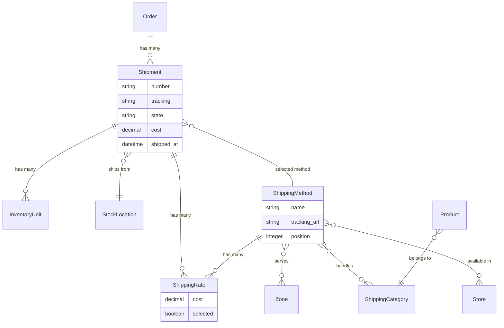
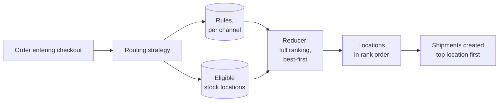
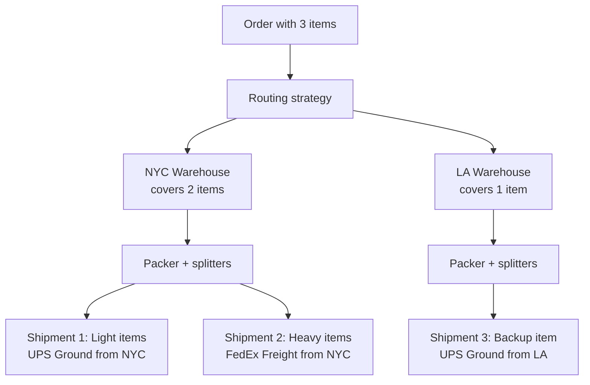

import { Since } from '/snippets/since.mdx';

## Overview

A shipment represents a package being sent to a customer from a [Stock Location](/developer/core-concepts/inventory#stock-locations). Each order can have one or more shipments — Spree automatically splits orders into multiple shipments when items need to ship from different locations or require different shipping methods.



**Key relationships:**
- **Shipment** tracks delivery of items from a [Stock Location](/developer/core-concepts/inventory#stock-locations)
- **Shipping Method** defines the carrier/service (UPS, FedEx, etc.)
- **Shipping Rate** represents the calculated cost for a method
- **[Zone](/developer/core-concepts/addresses#zones)** defines geographic regions for shipping availability
- **Shipping Category** groups products with similar shipping requirements

## Shipment Attributes

The Store API/SDK exposes shipments as `fulfillments` with these attributes:

| Attribute | Description | Example |
|-----------|-------------|---------|
| `number` | Unique fulfillment identifier | `H12345678901` |
| `tracking` | Carrier tracking number | `1Z999AA10123456784` |
| `status` | Current fulfillment status | `shipped` |
| `fulfillment_type` | `shipping` or `digital` | `shipping` |
| `cost` | Delivery cost | `9.99` |
| `fulfilled_at` | When the fulfillment was shipped | `2025-07-21T14:36:00Z` |
| `stock_location` | Where items ship from | `Warehouse NYC` |
| `delivery_method` | The selected delivery method | `{ id: "dm_xxx", name: "UPS Ground" }` |
| `delivery_rates` | Available rates for the customer to pick from | `[{ id: "rate_xxx", cost: "9.99", selected: true, ... }]` |

## Shipment States

<Steps>
  <Step title="pending">
    The shipment has backordered inventory or the order is not yet paid.
  </Step>
  <Step title="ready">
    All items are in stock and the order is paid. Ready to ship.
  </Step>
  <Step title="shipped">
    The shipment is on its way to the customer.
  </Step>
  <Step title="canceled">
    The shipment was canceled. All items are restocked.
  </Step>
</Steps>

## Selecting Shipping Rates

During checkout, after the customer provides a shipping address, Spree calculates available shipping rates for each shipment. The customer must select a rate before proceeding.

<CodeGroup>

```typescript SDK
// Get fulfillments with available delivery rates
// (the Store API/SDK exposes shipments as `fulfillments`)
const order = await client.orders.get(orderId, {
  expand: ['fulfillments'],
})

// Each fulfillment has available delivery rates
order.fulfillments?.forEach(fulfillment => {
  console.log(fulfillment.number)         // "H12345678901"
  console.log(fulfillment.delivery_rates) // [{ id: "rate_xxx", name: "UPS Ground", cost: "9.99", selected: true }, ...]
})

// Select a delivery rate
await client.carts.fulfillments.update(cartId, fulfillment.id, {
  selected_delivery_rate_id: 'rate_xxx',
})
```

```bash cURL
# Get fulfillments
curl 'https://api.mystore.com/api/v3/store/carts/cart_xxx?expand=fulfillments' \
  -H 'X-Spree-API-Key: pk_xxx' \
  -H 'X-Spree-Token: abc123'

# Select a delivery rate
curl -X PATCH 'https://api.mystore.com/api/v3/store/carts/cart_xxx/fulfillments/ful_xxx' \
  -H 'X-Spree-API-Key: pk_xxx' \
  -H 'X-Spree-Token: abc123' \
  -H 'Content-Type: application/json' \
  -d '{ "selected_delivery_rate_id": "rate_xxx" }'
```

</CodeGroup>

## Shipping Methods

Shipping methods represent the carrier services available to customers (e.g., UPS Ground, FedEx Overnight, DHL International). Each shipping method is scoped to:

- **[Zones](/developer/core-concepts/addresses#zones)** — geographic regions where the method is available
- **Shipping Categories** — product groups the method handles
- **[Stores](/developer/core-concepts/stores)** — which stores offer this method

Only methods whose zone matches the customer's shipping address are offered at checkout.

### Shipping Categories

Shipping categories group products with similar shipping requirements. For example:

- **Light** — lightweight items like stickers
- **Regular** — standard products
- **Heavy** — items over a certain weight
- **Oversized** — large items requiring special handling

Each product is assigned a shipping category. Shipping methods can be restricted to handle only certain categories, and the shipping cost calculator uses the category to determine pricing.

### Calculators

Each shipping method uses a [Calculator](/developer/core-concepts/calculators) to determine the cost. Spree includes these built-in calculators:

| Calculator | Description |
|------------|-------------|
| Flat rate per order | Same cost regardless of items |
| Flat rate per item | Fixed cost per item |
| Flat percent | Percentage of the order total |
| Flexible rate | One rate for the first item, another for each additional |
| Price sack | Tiered pricing based on order total |

You can create custom calculators for more complex pricing. See the [Calculators guide](/developer/core-concepts/calculators).

## Order Routing <Since version="5.5" />

When an order moves from cart to checkout, Spree decides which [Stock Location](/developer/core-concepts/inventory#stock-locations) fulfills it. **Order Routing** is the system that makes that decision — driven by configurable rules so merchants can express preferences like "fulfill from the customer's preferred warehouse first," "minimize the number of split shipments," or "always pick the closest location."



### How the decision is made

Each Channel (the distribution surface — online storefront, POS, wholesale portal) has an ordered list of **routing rules**. When the customer enters checkout, Spree walks the rules from highest priority to lowest and asks each rule to rank the candidate locations. The result is a full best-to-worst ordering of every eligible location. The top-ranked location packs as much of the cart as it can; anything it can't cover spills over to the next-ranked location, and so on.

The default rules every channel ships with:

| Order | Rule | What it does |
|---|---|---|
| 1 | **Preferred Location** | If the order has a preferred location set (e.g. by an admin staff member), that location ranks first. Otherwise abstains. |
| 2 | **Minimize Splits** | Prefers locations that can fulfill the most line items single-handedly. The location that covers the most cart on its own ranks higher. |
| 3 | **Default Location** | Tie-breaker: ranks the store default first, then other active locations. Always ranks every candidate so there's always a complete order. |

Reorder them, deactivate them, or add new rules without touching code — they're just rows in `spree_order_routing_rules`.

### Channels

Every order belongs to a Channel. Routing rules are scoped to the channel, so the wholesale channel can have completely different fulfillment logic from the online storefront. New channels seed their own three default rules automatically.

A channel can also override the routing **strategy** entirely — useful when one channel needs an algorithmic shape that's different from rules-walking, e.g. a POS channel that always picks the brick-and-mortar location, or a wholesale channel that delegates routing to an external warehouse management system.

### When it fires

Routing fires once, when the order transitions from `cart` to `address` (the start of checkout). It produces one or more `Shipment`s, each tied to a chosen stock location. The decision is sticky — once the shipments are created, their locations stay fixed unless the merchant edits them in the admin or the cart is cleared and re-routed.

Routing happens **after** stock reservations: by the time routing runs, the cart has already reserved the units it needs. Reservations and routing make their decisions at different layers — reservations protect the variant's total inventory across all locations, routing picks which location ships. They coexist correctly today, with a small inefficiency around location-pinning that's planned to be tightened in 6.0.

### Extending routing

For business-specific logic — proximity to the shipping address, customer-tier-aware fulfillment, refrigerated SKUs, day-of-week dispatch — you write a custom **rule** that plugs into the existing pipeline. For replacing the algorithm entirely (OMS delegation, ML-based routing, multi-order optimization solvers), you write a custom **strategy**.

See the [Build Custom Order Routing](/developer/how-to/custom-order-routing) guide for both.

## Split Shipments

An order's allocation can split along two independent axes:

| Axis | Decided by | Question it answers |
|---|---|---|
| **Across stock locations** | [Order Routing](#order-routing) | _Which_ locations fulfill this order? |
| **Within a stock location** | [Stock Splitters](#stock-splitters) | _How_ do we break each location's allocation into separate packages? |

The two layers compose cleanly — routing picks and ranks the locations, then each chosen location is independently broken down by the splitter chain. The Prioritizer then walks all the resulting packages in rank order and decides which package fulfills each inventory unit.



### How Splitting Works

1. **Order Routing** produces a ranked list of stock locations (best first).
2. **Per-location packing**: each location's units pass through `Spree::Stock::Packer` plus the configured splitter chain (`Spree.stock_splitters`), producing one or more packages per location — broken out by shipping category, on-hand vs backorder, digital vs physical, and so on.
3. **Prioritizer**: walks all resulting packages in rank order and assigns each inventory unit to the first package that has it on hand. Units the top-ranked location can't cover spill into lower-ranked location packages; unfilled units are flagged backordered.
4. **Shipment creation**: each remaining package becomes a `Shipment`. The customer selects a shipping rate for each shipment independently.

## Stock Splitters

Splitters are the per-location half of the split-shipment story. Each splitter takes the packages produced so far for one location and decides whether to break them further along its own axis. Splitters are chained — every splitter's output feeds into the next.

Splitters never see more than one location's allocation at a time, so they cannot overlap with routing's location decision. Routing answers "which locations?"; splitters answer "how do we slice each location's packages?"

### Built-in Splitters

| Splitter | Default? | What it does |
|---|---|---|
| `Spree::Stock::Splitter::ShippingCategory` | Yes | Groups items in each package by their product's [Shipping Category](#shipping-categories), so each package has only one category. Ensures shipping methods scoped to specific categories receive the right items. |
| `Spree::Stock::Splitter::Backordered` | Yes | Splits each package into an on-hand part and a backordered part. The two halves can ship at different times with different ETAs. |
| `Spree::Stock::Splitter::Digital` | Yes | Separates digital items from physical items so digital deliveries don't get bundled with a physical package. |
| `Spree::Stock::Splitter::Weight` | Opt-in | Caps each package at a weight threshold (default `150`). Splits heavy packages until each is under the limit. Used by carriers with per-package weight limits. |

The default chain is set in `Spree::Core::Engine` and can be overridden:

```ruby
# config/initializers/spree.rb
Rails.application.config.spree.stock_splitters = [
  Spree::Stock::Splitter::ShippingCategory,
  Spree::Stock::Splitter::Backordered,
  Spree::Stock::Splitter::Digital,
  Spree::Stock::Splitter::Weight  # add the opt-in weight cap
]
```

The order matters — each splitter's output is the next one's input.

### Extending Splitters

To add custom splitting logic — refrigerated SKUs, gift wrap separation, bulky-vs-small bin separation, anything that needs to fan one location's allocation into multiple shipments — write a new subclass of `Spree::Stock::Splitter::Base`. See the [Build Custom Stock Splitter](/developer/how-to/custom-stock-splitter) guide.

## Examples

### Simple Setup

A store selling T-shirts to the US and Europe with 2 carriers:

| Method | Zone | Pricing |
|--------|------|---------|
| USPS Ground | US | $5 first item + $2 each additional |
| FedEx | EU | $10 per item |

This requires:
- 1 shipping category (default)
- 1 stock location
- 2 shipping methods with appropriate zones and calculators

### Advanced Setup

A store shipping from 2 locations (New York, Los Angeles) with 3 carriers and 3 shipping categories:

| Category / Method | DHL | FedEx | USPS |
|:-|:-|:-|:-|
| Light | $5/item | $10 flat | $8/item |
| Regular | $5/item | $2/item | $8/item |
| Heavy | $50/item | $20 + $15/add'l | $20/item |

## Related Documentation

- [Orders](/developer/core-concepts/orders) — Checkout flow and shipping rate selection
- [Inventory](/developer/core-concepts/inventory) — Stock locations and inventory management
- [Calculators](/developer/core-concepts/calculators) — Shipping rate calculators
- [Addresses](/developer/core-concepts/addresses) — Shipping address and zones
- [Build Custom Order Routing](/developer/how-to/custom-order-routing) — Custom rules and strategies for choosing the fulfillment location
- [Events](/developer/core-concepts/events) — Subscribe to shipment events (e.g., `shipment.shipped`)
