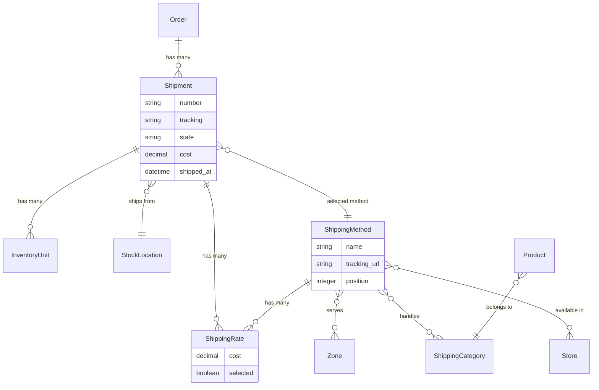
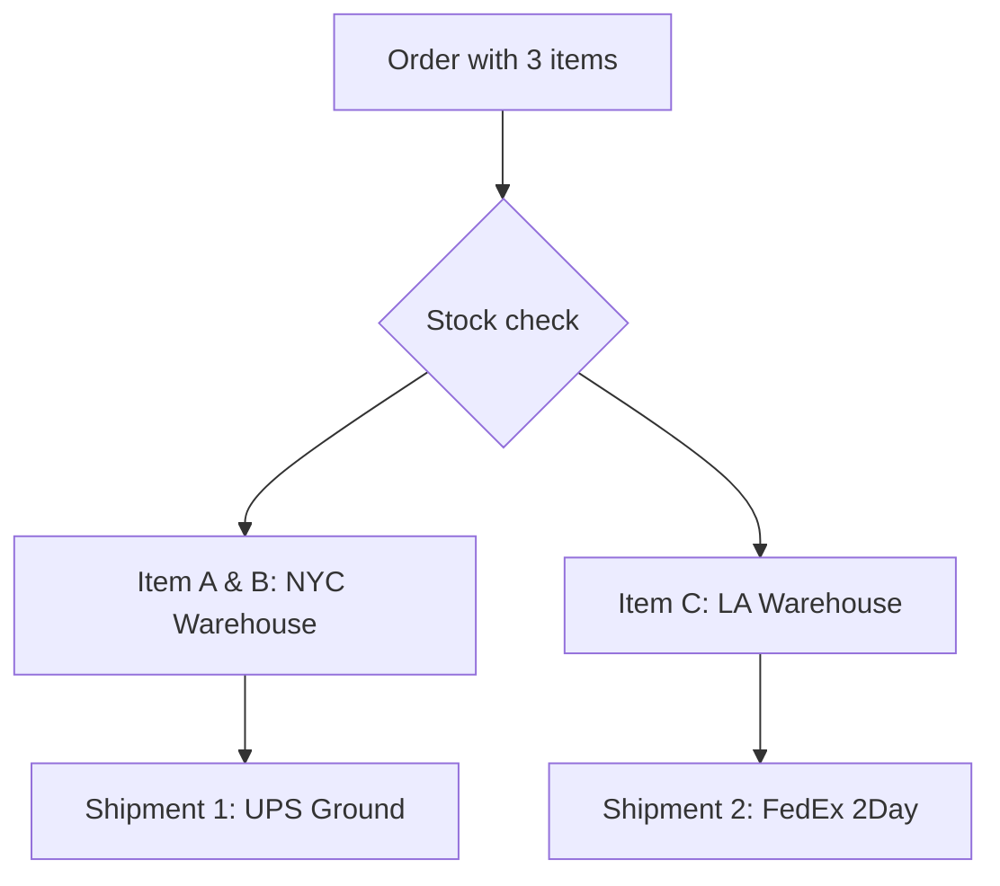

## Overview

A shipment represents a package being sent to a customer from a [Stock Location](/developer/core-concepts/inventory#stock-locations). Each order can have one or more shipments — Spree automatically splits orders into multiple shipments when items need to ship from different locations or require different shipping methods.



**Key relationships:**
- **Shipment** tracks delivery of items from a [Stock Location](/developer/core-concepts/inventory#stock-locations)
- **Shipping Method** defines the carrier/service (UPS, FedEx, etc.)
- **Shipping Rate** represents the calculated cost for a method
- **[Zone](/developer/core-concepts/addresses#zones)** defines geographic regions for shipping availability
- **Shipping Category** groups products with similar shipping requirements

## Shipment Attributes

| Attribute | Description | Example |
|-----------|-------------|---------|
| `number` | Unique shipment identifier | `H12345678901` |
| `tracking` | Carrier tracking number | `1Z999AA10123456784` |
| `state` | Current shipment state | `shipped` |
| `cost` | Shipping cost | `9.99` |
| `shipped_at` | When the shipment was shipped | `2025-07-21T14:36:00Z` |
| `stock_location` | Where items ship from | `Warehouse NYC` |
| `selected_shipping_rate` | The rate chosen by the customer | `{ cost: 9.99, name: "UPS Ground" }` |

## Shipment States

<Steps>
  <Step title="pending">
    The shipment has backordered inventory or the order is not yet paid.
  </Step>
  <Step title="ready">
    All items are in stock and the order is paid. Ready to ship.
  </Step>
  <Step title="shipped">
    The shipment is on its way to the customer.
  </Step>
  <Step title="canceled">
    The shipment was canceled. All items are restocked.
  </Step>
</Steps>

## Selecting Shipping Rates

During checkout, after the customer provides a shipping address, Spree calculates available shipping rates for each shipment. The customer must select a rate before proceeding.

<CodeGroup>

```typescript SDK
// Get shipments with available shipping rates
const order = await client.orders.get(orderId, {
  expand: ['shipments'],
})

// Each shipment has available shipping rates
order.shipments?.forEach(shipment => {
  console.log(shipment.number)           // "H12345678901"
  console.log(shipment.shipping_rates)   // [{ id: "sr_xxx", name: "UPS Ground", cost: "9.99", selected: true }, ...]
})

// Select a shipping rate
await client.carts.shipments.update(cartId, shipment.id, {
  selected_shipping_rate_id: 'sr_xxx',
})
```

```bash cURL
# Get shipments
curl 'https://api.mystore.com/api/v3/store/carts/cart_xxx?expand=shipments' \
  -H 'Authorization: Bearer spree_pk_xxx' \
  -H 'X-Spree-Token: abc123'

# Select a shipping rate
curl -X PATCH 'https://api.mystore.com/api/v3/store/carts/cart_xxx/shipments/shp_xxx' \
  -H 'Authorization: Bearer spree_pk_xxx' \
  -H 'X-Spree-Token: abc123' \
  -H 'Content-Type: application/json' \
  -d '{ "selected_shipping_rate_id": "sr_xxx" }'
```

</CodeGroup>

## Shipping Methods

Shipping methods represent the carrier services available to customers (e.g., UPS Ground, FedEx Overnight, DHL International). Each shipping method is scoped to:

- **[Zones](/developer/core-concepts/addresses#zones)** — geographic regions where the method is available
- **Shipping Categories** — product groups the method handles
- **[Stores](/developer/core-concepts/stores)** — which stores offer this method

Only methods whose zone matches the customer's shipping address are offered at checkout.

### Shipping Categories

Shipping categories group products with similar shipping requirements. For example:

- **Light** — lightweight items like stickers
- **Regular** — standard products
- **Heavy** — items over a certain weight
- **Oversized** — large items requiring special handling

Each product is assigned a shipping category. Shipping methods can be restricted to handle only certain categories, and the shipping cost calculator uses the category to determine pricing.

### Calculators

Each shipping method uses a [Calculator](/developer/core-concepts/calculators) to determine the cost. Spree includes these built-in calculators:

| Calculator | Description |
|------------|-------------|
| Flat rate per order | Same cost regardless of items |
| Flat rate per item | Fixed cost per item |
| Flat percent | Percentage of the order total |
| Flexible rate | One rate for the first item, another for each additional |
| Price sack | Tiered pricing based on order total |

You can create custom calculators for more complex pricing. See the [Calculators guide](/developer/core-concepts/calculators).

## Split Shipments

When items in an order ship from different stock locations or have different shipping categories, Spree automatically splits the order into multiple shipments.



### How Splitting Works

1. When an order reaches the delivery step, Spree evaluates where each item is in stock
2. Items are grouped by stock location and shipping category
3. Each group becomes a separate shipment with its own shipping rates
4. The customer selects a shipping rate for each shipment independently

### Weight Splitting

By default, Spree also splits shipments when a package exceeds a weight threshold (default: 150 units). This prevents individual packages from being too heavy.

<Info>
Split shipment behavior is customizable. See the [Customization Quickstart](/developer/customization/quickstart) for details on creating custom splitting rules.
</Info>

## Examples

### Simple Setup

A store selling T-shirts to the US and Europe with 2 carriers:

| Method | Zone | Pricing |
|--------|------|---------|
| USPS Ground | US | $5 first item + $2 each additional |
| FedEx | EU | $10 per item |

This requires:
- 1 shipping category (default)
- 1 stock location
- 2 shipping methods with appropriate zones and calculators

### Advanced Setup

A store shipping from 2 locations (New York, Los Angeles) with 3 carriers and 3 shipping categories:

| Category / Method | DHL | FedEx | USPS |
|:-|:-|:-|:-|
| Light | $5/item | $10 flat | $8/item |
| Regular | $5/item | $2/item | $8/item |
| Heavy | $50/item | $20 + $15/add'l | $20/item |

## Related Documentation

- [Orders](/developer/core-concepts/orders) — Checkout flow and shipping rate selection
- [Inventory](/developer/core-concepts/inventory) — Stock locations and inventory management
- [Calculators](/developer/core-concepts/calculators) — Shipping rate calculators
- [Addresses](/developer/core-concepts/addresses) — Shipping address and zones
- [Events](/developer/core-concepts/events) — Subscribe to shipment events (e.g., `shipment.shipped`)
