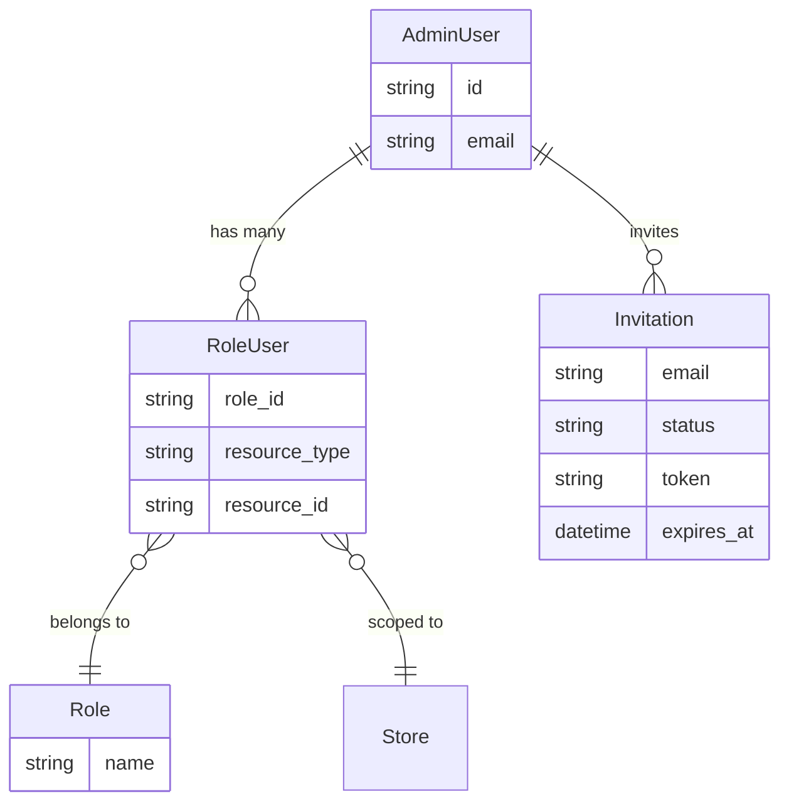
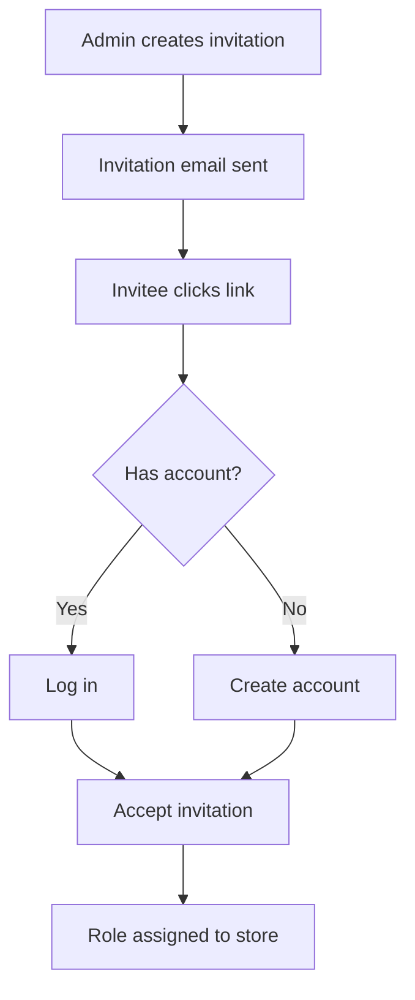

## Overview

Admin users manage the store via the Admin Panel. They have roles that control what they can access.



## Roles

Admin users can have different roles that control their permissions:

| Role | Description |
|------|-------------|
| `admin` | Full access to all Admin Panel features |

<Info>
You can create custom roles with specific permissions. See the [Customize Permissions guide](/developer/customization/permissions) for details.
</Info>

## Creating Admin Users

Use the Spree CLI to create admin users:

```bash
spree user create
```

The CLI will prompt you for the email and password. You can also pass them directly:

```bash
spree user create --email admin@example.com --password secret123
```

The created user gets the `admin` role on the default store.

## Inviting Admin Users

You can invite new admins through the Admin Panel or programmatically.

**Via Admin Panel:**

1. Navigate to **Settings → Users**
2. Click **Invite User**
3. Enter the email address and select a role
4. Click **Send Invitation**

The invitee receives an email with an invitation link. If they already have an account, they log in to accept. Otherwise, they create an account first.



### Invitation Details

| Attribute | Description |
|-----------|-------------|
| `email` | Invitee's email address |
| `token` | Secure token for the invitation link |
| `status` | `pending` or `accepted` |
| `expires_at` | Expiration date (default: 2 weeks) |
| `resource` | The store being granted access to |
| `role` | The role to assign upon acceptance |

### Invitation Events

The invitation system publishes [events](/developer/core-concepts/events) you can subscribe to:

| Event | Description |
|-------|-------------|
| `invitation.created` | Invitation was created (triggers email) |
| `invitation.accepted` | Invitation was accepted and role assigned |
| `invitation.resent` | Invitation was resent to the invitee |

## Permissions

Spree uses [CanCanCan](https://github.com/CanCanCommunity/cancancan) for authorization. Permissions apply to both customers (Store API access) and admins (Admin Panel access).

See the [Customize Permissions guide](/developer/customization/permissions) for details on creating custom roles and permission sets.

## Related Documentation

- [Customers](/developer/core-concepts/customers) — Customer accounts and authentication
- [Stores](/developer/core-concepts/stores) — Multi-store setup
- [Permissions](/developer/customization/permissions) — Roles and authorization
- [Events](/developer/core-concepts/events) — Subscribe to invitation events
