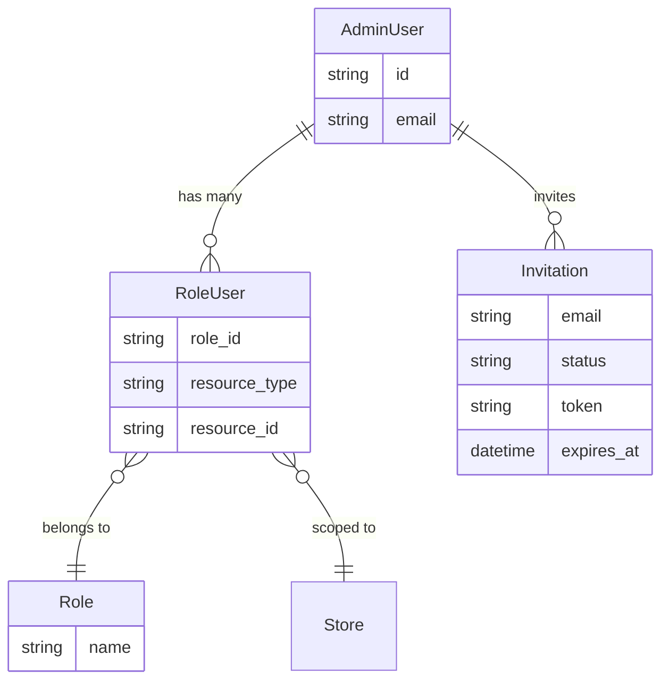
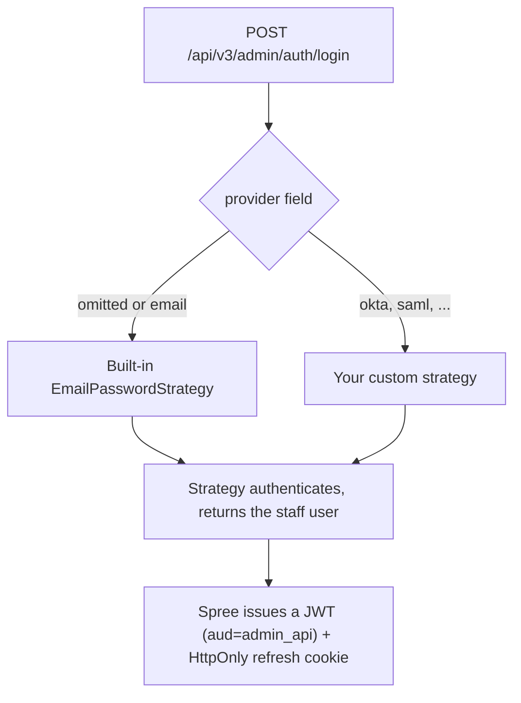
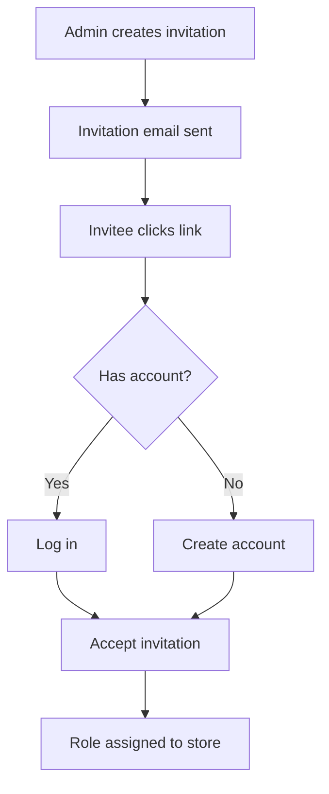

## Overview

Admin users manage the store via the Admin Panel. They have roles that control what they can access.



## Roles

Admin users can have different roles that control their permissions:

| Role | Description |
|------|-------------|
| `admin` | Full access to all Admin Panel features |

<Info>
You can create custom roles with specific permissions. See the [Customize Permissions guide](/developer/customization/permissions) for details.
</Info>

## Creating Admin Users

Use the Spree CLI to create admin users:

```bash
spree user create
```

The CLI will prompt you for the email and password. You can also pass them directly:

```bash
spree user create --email admin@example.com --password secret123
```

The created user gets the `admin` role on the default store.

## Authentication & identity providers

Staff authenticate against the Admin API, which issues a short-lived JWT used for subsequent requests. How a staff member proves who they are is **pluggable** — Spree ships email/password out of the box, and you can plug in any external identity provider (Okta, Microsoft Entra ID, Google Workspace, a custom JWT issuer, SAML, etc.) without changing the rest of the API.

### How admin login works

A staff member logs in via the `POST /api/v3/admin/auth/login` endpoint (see [Admin API Authentication](/api-reference/admin-api/authentication)). The request's `provider` field selects a registered **authentication strategy**. When `provider` is omitted it defaults to `email`, the built-in email/password strategy (which you can also disable and restrict the admin to your preferred SSO provider).



Whichever strategy authenticates the request, Spree issues the **same** credentials in return, so downstream code and the admin SPA never need to know which provider was used:

- a JWT access token (`aud: admin_api`), short-lived by design;
- a rotating refresh token, set as an `HttpOnly` cookie scoped to `/api/v3/admin/auth` (the admin flow keeps it out of the response body — see [Admin Auth & Cookie Refresh](/api-reference/admin-api/authentication)).

The same strategy registry exists on the customer side, so storefront sign-in is pluggable the same way — the only difference is the user class and that the Store API returns the refresh token in the body rather than a cookie.

### Registering a custom identity provider

Follow the [Custom API Authentication how-to](/developer/how-to/custom-api-authentication) for details how to create a custom authentication strategy and register it with the admin API. Once registered, you can use it from the admin SPA or any API client by passing its name in the `provider` field of the login request.

## Inviting Admin Users

You can invite new admins through the Admin Panel or programmatically.

**Via Admin Panel:**

1. Navigate to **Settings → Users**
2. Click **Invite User**
3. Enter the email address and select a role
4. Click **Send Invitation**

**Programmatically:**

Using the [Admin SDK](/developer/sdk/admin/quickstart), call `client.invitations.create`:

```typescript
import { createAdminClient } from '@spree/admin-sdk'

const client = createAdminClient({
  baseUrl: 'https://store.example.com',
  secretKey: 'sk_xxx',
})

const invitation = await client.invitations.create({
  email: 'new-admin@example.com',
  role_id: 'role_xxx',
})
```

Creating an invitation publishes `invitation.created`, which sends the email. Either way, the invitee receives an email with an invitation link. If they already have an account, they log in to accept. Otherwise, they create an account first.



### Invitation Details

| Attribute | Description |
|-----------|-------------|
| `email` | Invitee's email address |
| `token` | Secure token for the invitation link |
| `status` | `pending` or `accepted` |
| `expires_at` | Expiration date (default: 2 weeks) |
| `resource` | The store being granted access to |
| `role` | The role to assign upon acceptance |

### Invitation Events

The invitation system publishes [events](/developer/core-concepts/events) you can subscribe to:

| Event | Description |
|-------|-------------|
| `invitation.created` | Invitation was created (triggers email) |
| `invitation.accepted` | Invitation was accepted and role assigned |
| `invitation.resent` | Invitation was resent to the invitee |

## Permissions

Spree uses [CanCanCan](https://github.com/CanCanCommunity/cancancan) for authorization. Permissions apply to both customers (Store API access) and admins (Admin Panel access).

See the [Customize Permissions guide](/developer/customization/permissions) for details on creating custom roles and permission sets.

## Related Documentation

- [Admin SDK](/developer/sdk/admin/quickstart) — the TypeScript client for back-office automation
- [Custom API Authentication](/developer/how-to/custom-api-authentication) — implement a custom identity-provider strategy (the full guide)
- [Admin API Authentication](/api-reference/admin-api/authentication) — keys, JWTs, scopes, and the refresh-cookie flow
- [Customers](/developer/core-concepts/customers) — Customer accounts and authentication
- [Stores](/developer/core-concepts/stores) — Multi-store setup
- [Permissions](/developer/customization/permissions) — Roles and authorization
- [Events](/developer/core-concepts/events) — Subscribe to invitation events
