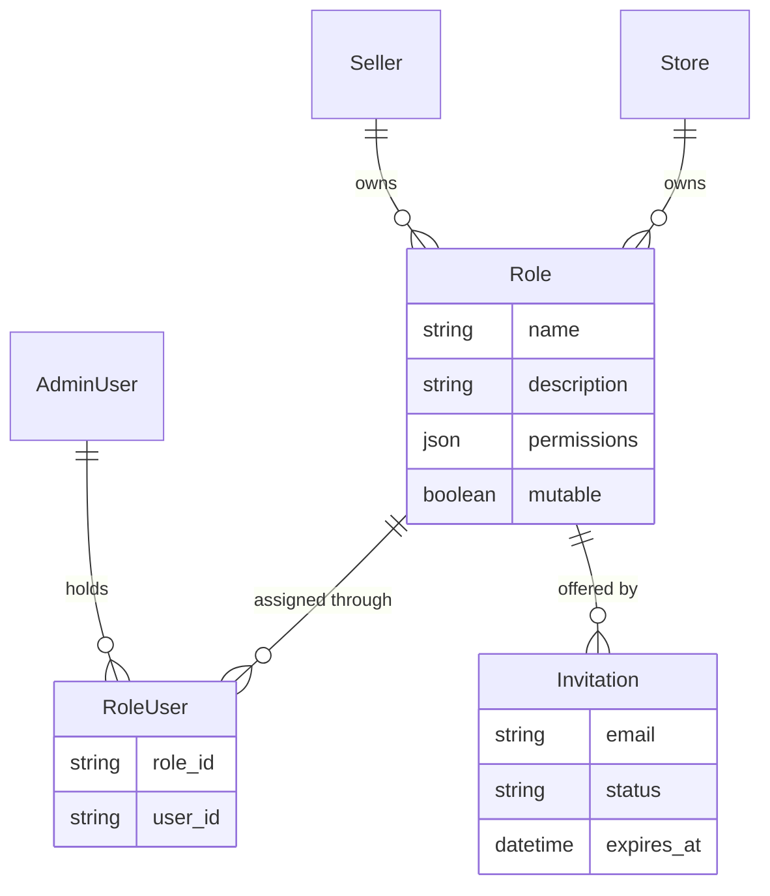
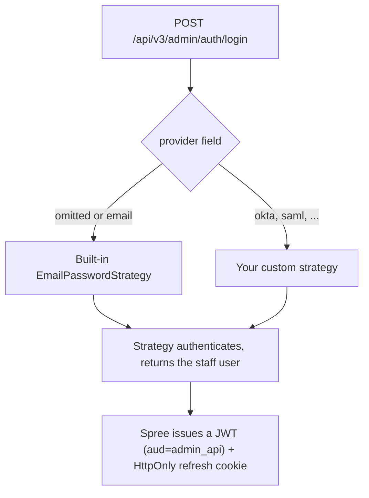
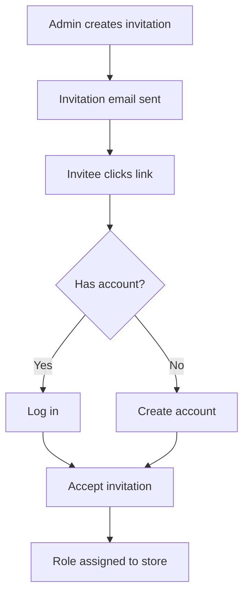

## Overview

Staff manage a store through the dashboard and the Admin API. What each person can do is decided by the **roles** they hold.


```mermaid
erDiagram
    Store ||--o{ Role : "owns"
    Seller ||--o{ Role : "owns"
    Role ||--o{ RoleUser : "assigned through"
    AdminUser ||--o{ RoleUser : "holds"
    Role ||--o{ Invitation : "offered by"

    Role {
        string name
        string description
        json permissions
        boolean mutable
    }
    RoleUser {
        string role_id
        string user_id
    }
    Invitation {
        string email
        string status
        datetime expires_at
    }
```

Two things about that shape matter:

**A role belongs to what it governs.** Every role names its owner — a Store for back-office staff, a [Seller](/developer/core-concepts/sellers) for a marketplace seller's own team. The owner is both who the role belongs to and who it applies to, so a role on a Store is a staff role by construction. Assigning someone a role therefore grants access to that owner and nothing else, which is what keeps one store's staff out of another's data.

Because roles are scoped to their owner, two stores can each define a "Manager" without colliding.

**A role carries its permissions directly.** The role holds a plain list of permission keys, so what a role can do is visible on the role itself rather than assembled from something else at runtime.

## Roles and permissions

A permission key is a verb and a resource — `read_orders`, `write_products`. Roles hold a list of them:

```typescript Admin SDK
const role = await adminClient.roles.create({
  name: 'Fulfillment staff',
  description: 'Can see orders and ship them, nothing else',
  permissions: ['read_orders', 'write_fulfillments', 'read_products'],
})
```

Every grantable key is discoverable, so a permission picker never needs a hardcoded list:

```typescript Admin SDK
const { data: permissions } = await adminClient.permissions.list()
```

Keys are grouped so they can be presented sensibly — orders, catalog, marketing, customers, settings, access and analytics.

| Group | Covers |
|---|---|
| Orders | Orders, payments, fulfillments, refunds, gift cards, store credit |
| Catalog | Products, media, categories, collections, stock, publishing |
| Marketing | Promotions |
| Customers | Customer accounts and groups |
| Settings | Store settings, webhooks, integrations |
| Access | API keys, staff, sellers, commissions |
| Analytics | The dashboard |

<Note>
**The same vocabulary gates API keys.** A secret key's scopes come from this catalog too, so "what may this integration do" and "what may this person do" are described the same way — there is no second permission system to keep in step.
</Note>

### The admin role

Each store gets one protected `admin` role meaning *everything in this store*. It can't be renamed, edited or deleted, and it isn't shared between stores — each owner has its own.

A role is deletable only when nothing depends on it: staff assignments and pending invitations have to be moved first, so nobody silently loses access.

<Info>
Roles are pure data. They're created through the dashboard, the Admin API, or seeds — there's no code-level role definition to keep in sync. For record-level rules beyond what keys express, see [Customize Permissions](/developer/customization/permissions).
</Info>

## Creating Admin Users

Use the Spree CLI to create admin users:

```bash
spree user create
```

The CLI will prompt you for the email and password. You can also pass them directly:

```bash
spree user create --email admin@example.com --password secret123
```

The created user gets the `admin` role on the default store.

## Authentication & identity providers

Staff authenticate against the Admin API, which issues a short-lived JWT used for subsequent requests. How a staff member proves who they are is **pluggable** — Spree ships email/password out of the box, and you can plug in any external identity provider (Okta, Microsoft Entra ID, Google Workspace, a custom JWT issuer, SAML, etc.) without changing the rest of the API.

### How admin login works

A staff member logs in via the `POST /api/v3/admin/auth/login` endpoint (see [Admin API Authentication](/api-reference/admin-api/authentication)). The request's `provider` field selects a registered **authentication strategy**. When `provider` is omitted it defaults to `email`, the built-in email/password strategy (which you can also disable and restrict the admin to your preferred SSO provider).


```mermaid
flowchart TB
    A["POST /api/v3/admin/auth/login"] --> B{"provider field"}
    B -->|"omitted or email"| C["Built-in EmailPasswordStrategy"]
    B -->|"okta, saml, ..."| D["Your custom strategy"]
    C --> E["Strategy authenticates, returns the staff user"]
    D --> E
    E --> F["Spree issues a JWT (aud=admin_api) + HttpOnly refresh cookie"]
```

Whichever strategy authenticates the request, Spree issues the **same** credentials in return, so downstream code and the admin SPA never need to know which provider was used:

- a JWT access token (`aud: admin_api`), short-lived by design;
- a rotating refresh token, set as an `HttpOnly` cookie scoped to `/api/v3/admin/auth` (the admin flow keeps it out of the response body — see [Admin Auth & Cookie Refresh](/api-reference/admin-api/authentication)).

The same strategy registry exists on the customer side, so storefront sign-in is pluggable the same way — the only difference is the user class and that the Store API returns the refresh token in the body rather than a cookie.

### Registering a custom identity provider

Follow the [Custom API Authentication how-to](/developer/how-to/custom-api-authentication) for details how to create a custom authentication strategy and register it with the admin API. Once registered, you can use it from the admin SPA or any API client by passing its name in the `provider` field of the login request.

## Inviting Admin Users

You can invite new admins through the Admin Panel or programmatically.

**Via Admin Panel:**

1. Navigate to **Settings → Users**
2. Click **Invite User**
3. Enter the email address and select a role
4. Click **Send Invitation**

**Programmatically:**

Using the [Admin SDK](/developer/sdk/admin/quickstart), call `client.invitations.create`:

```typescript
import { createAdminClient } from '@spree/admin-sdk'

const client = createAdminClient({
  baseUrl: 'https://store.example.com',
  secretKey: 'sk_xxx',
})

const invitation = await client.invitations.create({
  email: 'new-admin@example.com',
  role_id: 'role_xxx',
})
```

Creating an invitation publishes `invitation.created`, which sends the email. Either way, the invitee receives an email with an invitation link. If they already have an account, they log in to accept. Otherwise, they create an account first.


```mermaid
flowchart TB
    A[Admin creates invitation] --> B[Invitation email sent]
    B --> C[Invitee clicks link]
    C --> D{Has account?}
    D -->|Yes| E[Log in]
    D -->|No| F[Create account]
    E --> G[Accept invitation]
    F --> G
    G --> H[Role assigned to store]
```

### Invitation Details

| Attribute | Description |
|-----------|-------------|
| `email` | Invitee's email address |
| `token` | Secure token for the invitation link |
| `status` | `pending` or `accepted` |
| `expires_at` | Expiration date (default: 2 weeks) |
| `resource` | The store being granted access to |
| `role` | The role to assign upon acceptance |

### Invitation Events

The invitation system publishes [events](/developer/core-concepts/events) you can subscribe to:

| Event | Description |
|-------|-------------|
| `invitation.created` | Invitation was created (triggers email) |
| `invitation.accepted` | Invitation was accepted and role assigned |
| `invitation.resent` | Invitation was resent to the invitee |

## Permissions

Spree uses [CanCanCan](https://github.com/CanCanCommunity/cancancan) for authorization. Permissions apply to both customers (Store API access) and admins (Admin Panel access).

See the [Customize Permissions guide](/developer/customization/permissions) for details on creating custom roles and permission sets.

## Related Documentation

- [Admin SDK](/developer/sdk/admin/quickstart) — the TypeScript client for back-office automation
- [Custom API Authentication](/developer/how-to/custom-api-authentication) — implement a custom identity-provider strategy (the full guide)
- [Admin API Authentication](/api-reference/admin-api/authentication) — keys, JWTs, scopes, and the refresh-cookie flow
- [Customers](/developer/core-concepts/customers) — Customer accounts and authentication
- [Permissions](/developer/customization/permissions) — Roles and authorization
- [Events](/developer/core-concepts/events) — Subscribe to invitation events
