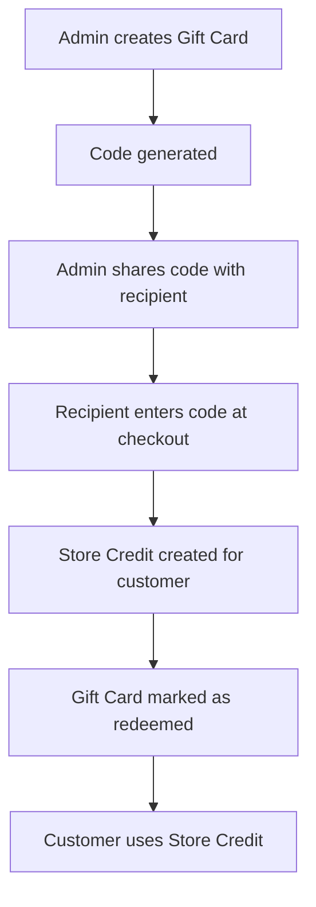
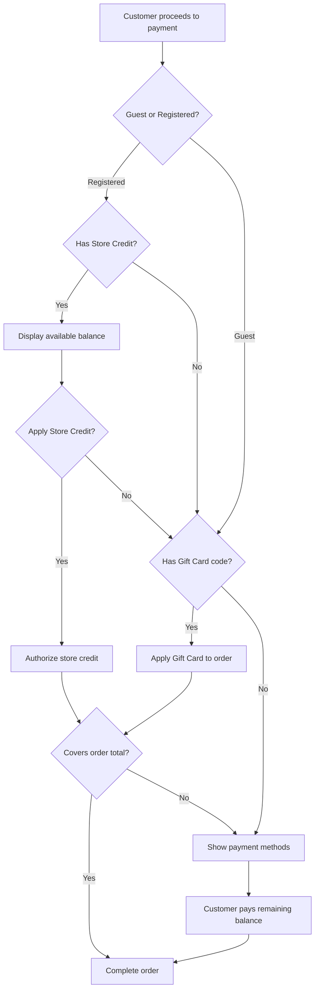

## Overview

Spree provides two stored value mechanisms that customers can use at checkout:

- **Store Credits** - Value assigned directly to a customer's account by admins (refunds, loyalty rewards, compensation)
- **Gift Cards** - Value with a redeemable code that can be shared and redeemed by anyone

| Feature | Store Credit | Gift Card |
|---------|--------------|-----------|
| Purpose | Refunds, loyalty rewards, compensation | Gifting, promotions, marketing |
| Requires account | Yes (tied to customer account) | No (guests can use at checkout) |
| Transferable | No | Yes (code can be shared) |
| Has code | No | Yes |
| Created by | Admin | Admin |
| Assignment | Directly to customer | Applied to order via code |
| Expiration | Configurable by type | Configurable per card |

## Store Credits

Store Credits are monetary values assigned directly to a customer's account. They are commonly used for:

- Refunds (instead of returning money to original payment method)
- Loyalty rewards
- Customer compensation
- Promotional credits

### Store Credit Model


### Store Credit Attributes

| Attribute | Description | Example |
|-----------|-------------|---------|
| `amount` | Total credit amount | `100.00` |
| `amount_used` | Amount already spent | `25.00` |
| `amount_authorized` | Amount currently authorized for pending orders | `0.00` |
| `currency` | Currency code | `USD` |
| `memo` | Optional note about the credit | `Refund for order #R123` |

### Store Credit Categories

Categories help organize store credits by their purpose:

| Category | Description |
|----------|-------------|
| Default | General purpose store credit |
| Gift Card | Store credit created from gift card redemption |

<Info>
Categories can be configured as non-expiring. By default, the "Gift Card" category is non-expiring.
</Info>

### Store Credit Types

Types define the priority in which store credits are applied at checkout:

| Type | Description |
|------|-------------|
| Expiring | Credits that may expire (applied first) |
| Non-expiring | Credits that don't expire (applied last) |

### Store Credit Events

Every action on a store credit is recorded as an event for audit purposes:

| Action | Description |
|--------|-------------|
| `allocation` | Initial credit was assigned |
| `authorize` | Credit was authorized for an order |
| `capture` | Authorized credit was captured |
| `void` | Authorization was voided |
| `credit` | Credit was returned (e.g., order canceled) |

### Assigning Store Credits

#### Via Admin Panel

1. Navigate to **Customers** in the Admin Panel
2. Select a customer
3. Go to the **Store Credits** tab
4. Click **Add Store Credit**
5. Enter the amount, category, and optional memo
6. Click **Create**

#### Via Code

```ruby
customer = Spree.user_class.find_by(email: "customer@example.com")
store = Spree::Store.default
admin = Spree.admin_user_class.first

store_credit = Spree::StoreCredit.create!(
  user: customer,
  store: store,
  amount: 50.00,
  currency: store.default_currency,
  category: Spree::StoreCreditCategory.first,
  created_by: admin,
  memo: "Loyalty reward"
)
```

### Store Credit Methods

```ruby
store_credit = customer.store_credits.first

# Check remaining balance
store_credit.amount_remaining
# => 75.00

# Check if editable (no amount used or authorized)
store_credit.editable?
# => true

# Get total available store credit for a customer
customer.total_available_store_credit
# => 75.00
```

### Store Credit Events

The store credit system publishes lifecycle events:

| Event | Description |
|-------|-------------|
| `store_credit.created` | Store credit was created |
| `store_credit.updated` | Store credit was updated |

## Gift Cards

Gift Cards are stored value codes created by admins that can be shared and redeemed by customers. When redeemed, they create a Store Credit on the customer's account.

### Gift Card Model


### Gift Card Attributes

| Attribute | Description | Example |
|-----------|-------------|---------|
| `code` | Unique redemption code | `abc1234def` |
| `amount` | Total gift card value | `50.00` |
| `amount_used` | Amount already redeemed | `0.00` |
| `state` | Current state | `active` |
| `currency` | Currency code | `USD` |
| `expires_at` | Optional expiration date | `2025-12-31` |

### Gift Card States


| State | Description |
|-------|-------------|
| `active` | Available for redemption |
| `partially_redeemed` | Some value has been redeemed |
| `redeemed` | Fully redeemed |
| `canceled` | Canceled by admin |

<Note>
Gift cards can also be `expired` if `expires_at` date has passed and the card hasn't been fully redeemed.
</Note>

### Gift Card Lifecycle



### Creating Gift Cards

#### Single Gift Card via Admin Panel

1. Navigate to **Gift Cards** in the Admin Panel
2. Click **Create Gift Card**
3. Enter the amount and optional expiration date
4. Click **Create**
5. Share the generated code with the recipient

#### Single Gift Card via Code

```ruby
store = Spree::Store.default
admin = Spree.admin_user_class.first

gift_card = Spree::GiftCard.create!(
  store: store,
  amount: 50.00,
  created_by: admin,
  expires_at: 1.year.from_now
)

gift_card.code
# => "a1b2c3d4e5f6"
```

### Batch Gift Card Generation

For promotions or bulk distribution, you can create multiple gift cards at once using Gift Card Batches:

#### Via Admin Panel

1. Navigate to **Gift Cards** in the Admin Panel
2. Click **Create Batch**
3. Enter:
   - **Prefix** - Code prefix for easy identification (e.g., `HOLIDAY`)
   - **Count** - Number of cards to generate
   - **Amount** - Value per card
   - **Expiration** - Optional expiration date
4. Click **Create**

#### Via Code

```ruby
store = Spree::Store.default
admin = Spree.admin_user_class.first

batch = Spree::GiftCardBatch.create!(
  store: store,
  prefix: "PROMO",
  codes_count: 100,
  amount: 25.00,
  created_by: admin,
  expires_at: 6.months.from_now
)

# Gift cards are generated automatically
batch.gift_cards.count
# => 100

batch.gift_cards.first.code
# => "promoa1b2c3"
```

<Info>
Large batches are processed in the background via `Spree::GiftCards::BulkGenerateJob` to avoid timeout issues.
</Info>

### Redeeming Gift Cards

Gift cards can be redeemed by both **registered customers** and **guest visitors** at checkout. This is a key difference from Store Credits, which require a customer account.

<Info>
Unlike Store Credits which are tied to a customer account, Gift Cards can be applied directly to an order during checkout - no account required. This makes them ideal for gifting to anyone.
</Info>

When a gift card is applied to an order:
- The gift card value is used to pay for the order
- The gift card is marked as redeemed (or partially redeemed)
- No Store Credit is created for guest checkouts

#### Via Store API

Gift cards are applied using the same coupon codes endpoint as promotion codes. The endpoint automatically detects whether the code is a promotion coupon or a gift card.

```javascript
import { createSpreeClient } from '@spree/sdk'

const client = createSpreeClient({
  baseUrl: 'https://your-store.com',
  publishableKey: '<api-key>',
})

// Apply gift card code to order (works for guests and registered customers)
const order = await client.store.orders.couponCodes.apply('or_abc123', 'abc1234def', {
  bearerToken: '<token>',
})
```

```bash
# Apply gift card to order (works for guests and registered customers)
POST /api/v3/store/orders/{order_id}/coupon_codes
{
  "coupon_code": "abc1234def"
}
```

#### Via Code

```ruby
gift_card = Spree::GiftCard.find_by(code: "abc1234def")
order = Spree::Order.find_by(number: "R123456")

# Apply gift card to order
order.gift_card = gift_card
order.save!
```

### Gift Card Events

The gift card system publishes lifecycle events:

| Event | Description |
|-------|-------------|
| `gift_card.created` | Gift card was created |
| `gift_card.redeemed` | Gift card was fully redeemed |
| `gift_card.partially_redeemed` | Gift card was partially redeemed |

## Using at Checkout

Store Credits and Gift Cards work differently at checkout:

- **Store Credits** - Require a customer account; applied from the customer's balance
- **Gift Cards** - Can be used by anyone (guests included); applied directly to the order via code

### Checkout Flow



### Store Credit Priority

When a registered customer has multiple store credits, they are applied in order of priority:

1. **Expiring credits** - Applied first to ensure they're used before expiration
2. **Non-expiring credits** - Applied after expiring credits

## Related Documentation

- [Payments](/developer/core-concepts/payments) - Payment processing and methods
- [Orders](/developer/core-concepts/orders) - Order management
- [Users](/developer/core-concepts/users) - Customer management
- [Events](/developer/core-concepts/events) - Event system and subscribers
