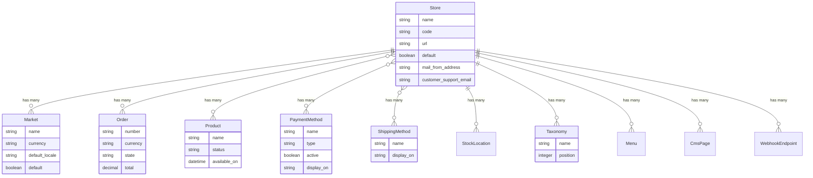

## Overview

The `Spree::Store` model is the center of the Spree ecosystem.

### Store Model Diagram



**Key relationships:**
- **Store** is the central model - all commerce data is scoped to a store
- Each store has one or more [Markets](/developer/core-concepts/markets) that define geographic selling regions with their own currency and locale
- Each store has its own [Orders](/developer/core-concepts/orders), [Products](/developer/core-concepts/products), [Payment Methods](/developer/core-concepts/payments), and [Shipping Methods](/developer/core-concepts/shipments)
- Stores can have different currencies, locales, and configurations
- Content (Menus, CMS Pages) and [Webhooks](/developer/core-concepts/webhooks) are also store-specific

### Store attributes

| Attribute                | Description                                                                 | Example Value |
|--------------------------|-----------------------------------------------------------------------------|---------------|
| `name`                   | The name of the store, typically displayed in the browser title bar and throughout the site. | Spree Demo Site |
| `code`                   | A unique code to identify the store.                                      | `spree-001` |
| `meta_description`       | A brief description of the store for SEO purposes.                         | An exclusive selection of high-quality products. |
| `meta_keywords`          | Relevant keywords associated with the store for SEO.                       | fashion, electronics, books |
| `seo_title`              | A custom SEO title for the store.                                          | Shop the Best Deals Online - Spree Store |
| `mail_from_address`      | The email address used for sending emails from the store.                  | noreply@example.com |
| `default`                | Indicates if the store is the default store.                               | `true` |
| `customer_support_email` | The email address for customer support inquiries.                          | support@example.com |
| `facebook`               | The store's Facebook page URL.                                             | spree |
| `twitter`                | The store's Twitter handle.                                                | @spreecommerce |
| `instagram`              | The store's Instagram profile URL.                                         | https://www.instagram.com/spree |
| `description`            | A detailed description of the store.                                       | Your one-stop shop for everything you need. |
| `address`                | The physical address of the store.                                         | 123 Example St, San Francisco, CA |
| `contact_phone`          | The contact phone number for the store.                                    | `+1 234-567-8900` |
| `new_order_notifications_email` | The email address to send notifications of new orders.                  | orders@example.com |

### Accessing Store in code

To access the current store you can use `current_store` in controllers or `Spree::Store.current` in models/services/jobs.

#### Via Store API

```javascript
import { createSpreeClient } from '@spree/sdk'

const client = createSpreeClient({
  baseUrl: 'https://your-store.com',
  publishableKey: '<api-key>',
})

const store = await client.store.store.get()
```

## Markets

[Markets](/developer/core-concepts/markets) let you segment your store into geographic regions, each with its own currency, locale, and set of countries. For example, a single store can have:

- **North America** — USD, English, ships to US and Canada
- **Europe** — EUR, German, ships to DE, FR, AT, NL
- **United Kingdom** — GBP, English, ships to GB

For full details on creating and managing markets, see the [Markets](/developer/core-concepts/markets) guide.

## Store resources

Each Store can have its own resources. For example, a Store can have its own Products, Taxonomies, Promotions, etc.

| Resource                                          | Relationship                                                                                                                               |
| ------------------------------------------------- | ------------------------------------------------------------------------------------------------------------------------------------------ |
| [**Market**](markets)                          | One Store has many Markets, each defining a geographic region with its own currency and locale                                              |
| [**Order**](orders)                            | One Order belongs to one Store                                                                                                             |
| [**Product**](products)                        | One Product can be associated with many Store(s), you can pick and choose in which Store(s) each Product will be available                 |
| [**Payment Method**](payments)                 | One Payment Method can be associated with many Store(s), you can select in which Stores given Payment Method will be available on Checkout |
| [**Taxonomy**](products#taxons-and-taxonomies) | One Taxonomy belongs to one Store                                                                                                          |
| [**Promotion**](promotions)                    | One Promotion can be associated with multiple Stores                                                                                       |
| **Store Credit**                                  | One Store Credit belongs to and can be used in one Store                                                                                   |

## Multi-store setup

To enable multiple stores please follow our [Multi Store guide](/developer/multi-store/quickstart)
