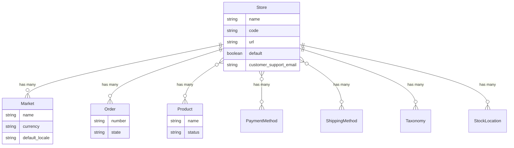

## Overview

The Store is the central model in Spree. Every resource — products, orders, markets, payment methods, taxonomies — is scoped to a store. Most setups use a single store, but Spree supports [multi-store](/developer/multi-store/quickstart) configurations where each store operates independently with its own catalog, branding, and checkout.


```mermaid
erDiagram
    Store ||--o{ Market : "has many"
    Store ||--o{ Order : "has many"
    Store }o--o{ Product : "has many"
    Store }o--o{ PaymentMethod : "has many"
    Store }o--o{ ShippingMethod : "has many"
    Store ||--o{ Taxonomy : "has many"
    Store ||--o{ StockLocation : "has many"

    Store {
        string name
        string code
        string url
        boolean default
        string customer_support_email
    }

    Market {
        string name
        string currency
        string default_locale
    }

    Product {
        string name
        string status
    }

    Order {
        string number
        string state
    }
```

## Store Attributes

| Attribute | Description |
|-----------|-------------|
| `name` | Store name, displayed in the browser title and throughout the site |
| `code` | Unique identifier for the store |
| `url` | Primary URL of the store |
| `meta_description` | SEO description |
| `meta_keywords` | SEO keywords |
| `seo_title` | Custom SEO title |
| `customer_support_email` | Email for customer support inquiries |
| `mail_from_address` | Sender address for transactional emails |
| `logo_image_url` | URL to the store's logo |
| `facebook`, `twitter`, `instagram` | Social media links |
| `payment_methods` | Payment methods available in this store |

## Fetching Store Information

Use the store endpoint to get the current store's configuration — useful for rendering logos, SEO metadata, and footer content:

<CodeGroup>

```typescript SDK
const store = await client.store.store.get()
// {
//   name: "My Store",
//   url: "https://mystore.com",
//   logo_image_url: "https://cdn.mystore.com/logo.png",
//   customer_support_email: "support@mystore.com",
//   payment_methods: [{ id: "pm_xxx", name: "Stripe", kind: "card" }],
//   ...
// }
```

```bash cURL
curl 'https://api.mystore.com/api/v3/store/store' \
  -H 'Authorization: Bearer spree_pk_xxx'
```

</CodeGroup>

## Markets

[Markets](/developer/core-concepts/markets) let you segment your store into geographic regions, each with its own currency, locale, and set of countries. For example, a single store can have:

- **North America** — USD, English, ships to US and Canada
- **Europe** — EUR, German, ships to DE, FR, AT, NL
- **United Kingdom** — GBP, English, ships to GB

See the [Markets](/developer/core-concepts/markets) guide for details.

## Store Resources

Each store has its own set of resources. This means products, orders, and promotions in one store are completely separate from another.

| Resource | Relationship |
|----------|-------------|
| [**Markets**](/developer/core-concepts/markets) | A store has many markets, each defining a geographic region with its own currency and locale |
| [**Orders**](/developer/core-concepts/orders) | An order belongs to one store |
| [**Products**](/developer/core-concepts/products) | A product can be available in multiple stores |
| [**Payment Methods**](/developer/core-concepts/payments) | A payment method can be available in multiple stores |
| [**Shipping Methods**](/developer/core-concepts/shipments) | A shipping method can be available in multiple stores |
| [**Taxonomies**](/developer/core-concepts/products#taxons-and-taxonomies) | A taxonomy belongs to one store |
| [**Promotions**](/developer/core-concepts/promotions) | A promotion can apply to multiple stores |

## Multi-Store Setup

To run multiple stores from a single Spree installation, see the [Multi-Store guide](/developer/multi-store/quickstart). Each store gets its own domain, branding, catalog, and checkout — while sharing the same admin dashboard and infrastructure.

## Related Documentation

- [Markets](/developer/core-concepts/markets) — Multi-region commerce within a store
- [Products](/developer/core-concepts/products) — Product catalog
- [Orders](/developer/core-concepts/orders) — Order management and checkout
- [Multi-Store](/developer/multi-store/quickstart) — Running multiple stores
