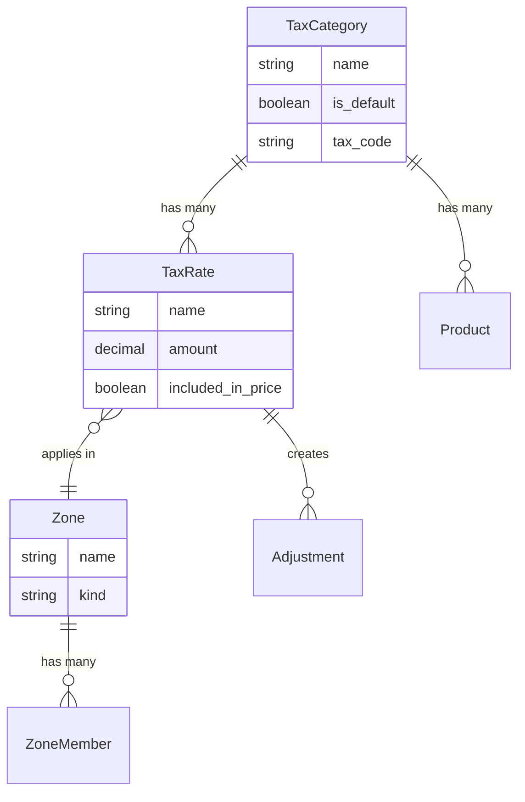

## Overview

Spree uses Tax Categories and Tax Rates to calculate taxes for orders. Products are assigned to tax categories, and tax rates define the percentage charged within specific geographic [Zones](/developer/core-concepts/addresses#zones).

**Key relationships:**
- **Tax Category** groups products for tax purposes (e.g., "Clothing", "Food", "Digital")
- **Tax Rate** defines the percentage and rules for a Tax Category within a [Zone](/developer/core-concepts/addresses#zones)
- **Zone** defines geographic regions (countries or states) where taxes apply
- **[Adjustments](/developer/core-concepts/adjustments)** are created on orders/line items to apply taxes

## Tax Categories

Tax categories group products by how they're taxed. Common examples:

- **Clothing** — standard tax rate
- **Food** — reduced or exempt rate
- **Digital** — different rules per jurisdiction

Each product is assigned a tax category. One category can be set as the default for products that don't have an explicit assignment.

| Attribute | Description | Example |
|-----------|-------------|---------|
| `name` | Category name | `Clothing` |
| `is_default` | Whether this is the default category | `true` |
| `tax_code` | Code from your tax provider (e.g., Stripe, Avalara) | `1257L` |

## Tax Rates

Tax rates define the percentage charged for a specific tax category within a geographic zone.

| Attribute | Description | Example |
|-----------|-------------|---------|
| `name` | Rate name | `California Sales Tax` |
| `amount` | Tax percentage as a decimal | `0.08` (8%) |
| `included_in_price` | Whether tax is included in the displayed price | `false` |
| `zone` | Geographic region where this rate applies | `US` |
| `tax_category` | Products this rate applies to | `Clothing` |

## Tax Types

### Sales Tax (tax-exclusive)

Common in the United States. The displayed price does **not** include tax — tax is added at checkout based on the shipping address.

**Example:** A $17.99 item with 5% sales tax:
- Displayed price: **$17.99**
- Tax at checkout: **$0.90**
- Order total: **$18.89**

### Value Added Tax / VAT (tax-inclusive)

Common in Europe and many other countries. The displayed price **already includes** tax. When shipping outside the tax zone, the tax is removed from the price.

**Example:** A £17.99 item with 5% VAT included:
- Displayed price: **£17.99** (includes £0.86 VAT)
- If shipped outside VAT zone: price reduces to **£17.13**

<Info>
The `tax_inclusive` setting on [Markets](/developer/core-concepts/markets) controls whether prices are displayed with or without tax for each geographic region.
</Info>

## Default Tax Zone

Spree uses a default tax zone to estimate taxes before the customer enters a shipping address. This is important for stores with tax-inclusive pricing (VAT) — it determines which tax rate is assumed in the displayed price.

If the customer's shipping address is outside the default tax zone, the assumed tax is removed and the correct rate for their zone is applied.

## Tax Calculation at Checkout

During checkout, taxes are calculated based on the shipping address:

1. The customer's shipping address determines their [Zone](/developer/core-concepts/addresses#zones)
2. Spree finds matching tax rates for that zone and the product's tax category
3. Tax [Adjustments](/developer/core-concepts/adjustments) are created on line items
4. The order total is updated

<Note>
For complex tax requirements (interstate US sales, international VAT), consider using automated tax calculation. The [Stripe Tax integration](/integrations/payments/stripe) handles this automatically.
</Note>

## Managing Taxes

Tax categories and rates are managed in the Admin Panel under **Settings → Taxes**, or via the Admin API.

### Common Configurations

**US store with state-level sales tax:**
- Create zones for each taxable state
- Create tax rates per zone (e.g., 8.25% for California, 6.25% for Texas)
- Set `included_in_price: false`

**EU store with VAT:**
- Create a zone for EU countries
- Create tax rates per country (e.g., 19% Germany, 20% France)
- Set `included_in_price: true`
- Set the EU zone as the default tax zone

**Digital products in the EU:**
- Create a "Digital" tax category
- Add tax rates for each EU country using the customer's country VAT rate
- Physical products use the seller's country VAT rate

## Related Documentation

- [Markets](/developer/core-concepts/markets) — Tax-inclusive pricing per market
- [Addresses](/developer/core-concepts/addresses) — Zones and address-based taxation
- [Adjustments](/developer/core-concepts/adjustments) — Tax adjustments
- [Orders](/developer/core-concepts/orders) — How taxes affect order totals
