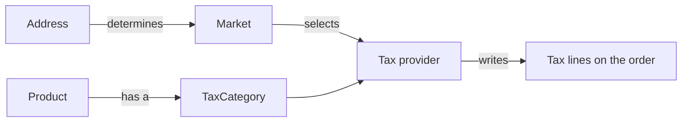

## Overview

Tax is the part of commerce most likely to differ from what you assumed. A US shopper expects `$17.99` on the shelf and a little more at the till. A German shopper expects `€17.99` to be the whole story, VAT already inside it. Both are correct, and a store selling to both has to do both.

Spree handles this by keeping three things separate:

- **What is being sold** — a [tax category](#tax-categories) groups products taxed the same way
- **Where the customer is** — their [market](/developer/core-concepts/markets) and shipping address
- **Who works out the number** — Spree's own rates, or an external tax service

The result of all this is a set of **tax lines** on the order — one per charge, recording what was taxed and at what rate. This page is about how they get their numbers.


```mermaid
flowchart LR
    Product -->|"has a"| TaxCategory
    Address -->|"determines"| Market
    Market -->|"selects"| Provider["Tax provider"]
    TaxCategory --> Provider
    Provider -->|"writes"| TaxLine["Tax lines on the order"]
```

## Tax categories

A tax category is how you say "these things are taxed alike". Children's clothing, books and hot food are treated differently from general goods in many countries, and a tax category is where that distinction lives.

Every product carries one. If you don't choose, the default is used.

| Field | Description | Example |
|---|---|---|
| `name` | What it's called | `Standard`, `Reduced`, `Digital` |
| `is_default` | Used by products that don't pick one | `true` |
| `tax_code` | The code your tax service knows it by | `1257L` |

```typescript Admin SDK
const reduced = await adminClient.taxCategories.create({
  name: 'Reduced rate',
  tax_code: '1257L',
})
```

`tax_code` matters once you connect an external service — it is how you tell that service what kind of thing this is, in the vocabulary it already uses.

## Tax rates

A tax rate is the number itself, plus where it applies and whether it's already in the price.

| Field | Description | Example |
|---|---|---|
| `name` | What appears on the invoice | `VAT 20%` |
| `amount` | The rate as a decimal | `0.2` for 20% |
| `included_in_price` | Whether the price already contains it | `true` in the EU |
| `country_code` / `state_code` | Where it applies | `DE`, or `US` + `CA` |
| `tax_category` | What it applies to | `Standard` |

```typescript Admin SDK
const { data: rates } = await adminClient.taxRates.list()

await adminClient.taxRates.create({
  name: 'VAT 20%',
  amount: '0.2',
  included_in_price: true,
  country_code: 'GB',
  tax_category_id: 'taxcat_xxx',
})
```

Rates name their country and state by **ISO code**, not by an ID — `DE`, `US` + `CA`. There's no separate region record to create first.

## Included or added on

`included_in_price` is the single most consequential setting here, so it's worth being precise about what it does.

<Tabs>
  <Tab title="Added on (US style)">
    The shelf price is what the product costs. Tax is worked out at checkout, once the address is known, and added.

    A $17.99 item at 5%:

    | | |
    |---|---|
    | Price shown | **$17.99** |
    | Tax added | $0.90 |
    | Customer pays | **$18.89** |

    Set `included_in_price: false`.
  </Tab>
  <Tab title="Included (EU style)">
    The shelf price is the whole price. The tax inside it is shown for information — the customer pays the number they saw.

    A £17.99 item at 20% VAT:

    | | |
    |---|---|
    | Price shown | **£17.99** |
    | VAT inside it | £3.00 |
    | Customer pays | **£17.99** |

    Set `included_in_price: true`.
  </Tab>
</Tabs>

<Warning>
When building an order summary, add `additional_tax_total` only. `included_tax_total` is **already inside** the item prices — adding it counts the tax twice. This is the most common bug in a European storefront.
</Warning>

Because prices are shown before anyone knows where the shopper lives, each [Market](/developer/core-concepts/markets) declares whether its prices are quoted with tax included. That's what lets a catalogue page show honest prices to a German visitor and a US visitor at the same time.

## Tax lines

Whatever works out the tax, the record is the same: a tax line per charge, saying what was taxed and how.

| Attribute | Description |
|---|---|
| `label` | What the customer sees — `VAT 20%` |
| `rate` | The rate applied — `"0.2"` |
| `included` | Whether the tax was already inside the displayed price |
| `amount` / `display_amount` | The tax charged |
| `line_item_id` / `fulfillment_id` / `fee_id` | What was taxed — exactly one is set |

```typescript Admin SDK
const { data: taxLines } = await adminClient.orders.taxLines.list('or_xxx')
```

Tax lines attach to a line item, a [fulfillment](/developer/core-concepts/fulfillments), or a [fee](/developer/core-concepts/fees) — so tax on goods and tax on delivery stay separately visible, which is what a tax return needs.

Each line also keeps its own copy of the rate and label. If someone edits that tax rate next year, the order still says what the customer was actually charged.

You never create tax lines yourself; they're written whenever the total is worked out.

## When tax is worked out

Tax is recalculated whenever the answer could have changed — an item added, an address entered, a delivery option chosen. Every one of those requests returns the updated cart, so a storefront never needs a separate "refresh the tax" call.

<Steps>
  <Step title="Before an address is known">
    Prices are shown using the market's tax treatment. For an inclusive market the displayed price is the real one; for an added-on market tax simply hasn't been worked out yet.
  </Step>
  <Step title="Once the shipping address is entered">
    The address decides the real rate. Tax lines are written against each item, the delivery charge, and any taxable fee.
  </Step>
  <Step title="At completion">
    Whatever the tax is at that moment is what's charged, and the order keeps it. A rate change next month does not rewrite an order from last month.
  </Step>
</Steps>

## Connecting a tax service

Spree's built-in rate tables are fine when the rules are simple — one country, or a handful of clearly-defined rates. They become a liability where the rules are not: US sales tax varies by city and changes constantly, and cross-border EU VAT has thresholds that shift with your turnover.

For those, connect a real tax service. **The provider is chosen per [Market](/developer/core-concepts/markets)**, which means one store can use its own rates in a simple market and an external service in a complicated one.

```typescript Admin SDK
const { data: providers } = await adminClient.taxProviders.list()
```

A provider declares up front what it cannot do — no US local tax, no reverse charge — so the dashboard can warn a merchant who pairs it with a market that needs it, rather than quietly under-collecting.

Whichever provider is in use, the result is the same: tax lines on the order, in the same shape. Your storefront code doesn't change.

## Tax-exempt customers

Business customers are often exempt, and the paperwork is real. Spree records a customer's or company's **tax identifier** — a VAT number, an ABN — and can validate it. Companies can also hold exemption certificates, scoped to the country or state that issued them.

Exemption is decided when tax is worked out, not stored as a flag on the customer, so an expired certificate stops applying by itself. See [Companies & Catalogs](/developer/core-concepts/companies-and-catalogs).

## Related

- [Order totals](/developer/core-concepts/order-totals) — how tax rolls into what a customer pays
- [Markets](/developer/core-concepts/markets) — where tax treatment and provider are chosen
- [Addresses](/developer/core-concepts/addresses) — what determines the rate
- [Companies & Catalogs](/developer/core-concepts/companies-and-catalogs) — B2B tax identifiers and exemptions
