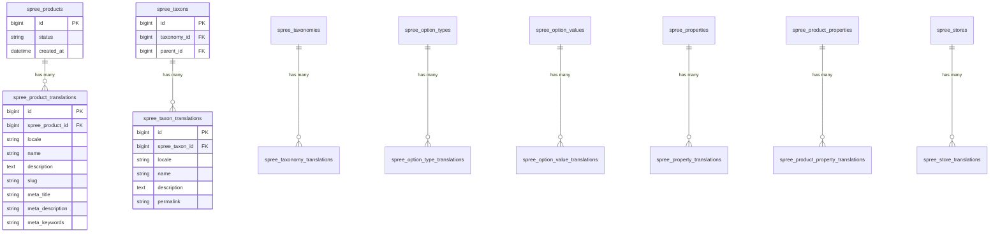

## Overview

Spree supports two types of translations:

1. **Resource Translations** — translatable content fields on models like Products, Taxons, and Stores (e.g., product name, description, slug)
2. **UI Translations** — interface strings used in views and the admin panel (e.g., button labels, flash messages)

For configuring which locales and currencies are available in your store, see [Markets](/developer/core-concepts/markets). Markets control locale and currency assignment per geographic region.

## Resource Translations

Resources with user-facing content fields have built-in support for translations. Translation functionality is handled by the [Mobility gem](https://github.com/shioyama/mobility). Spree allows you to translate the following resources:



| Resource         | Translatable Fields                                                                                                                                                                 |
| ---------------- | ----------------------------------------------------------------------------------------------------------------------------------------------------------------------------------- |
| Product          | `name`, `description`, `slug`, `meta_description`, `meta_keywords`, `meta_title`                                                                                                             |
| Taxon            | `name`, `description`, `permalink`                                                                                                                                                        |
| Taxonomy         | `name`                                                                                                                                                                                |
| Option Type      | `presentation`                                                                                                                                                                  |
| Option Value     | `presentation`                                                                                                                                                                  |
| Property         | `presentation`                                                                                                                                                   |
| Product Property | `value`                                                                                                                                                                 |
| Store            | `name`, `meta_description`, `meta_keywords`, `seo_title`, `facebook`, `twitter`, `instagram`, `customer_support_email`, `description`, `address`, `contact_phone` |

Translatable resources are configured with Mobility's [Table Backend](https://github.com/shioyama/mobility#table-backend-like-globalize) storage strategy. Each translatable resource has a corresponding translations table in the database — for example, product translations are stored in `spree_product_translations`.

<Info>
You can read more about how to work with translations by reading [Mobility's usage docs](https://github.com/shioyama/mobility#usage).
</Info>

### Resource Translations Implementation

Each translatable resource includes the `TranslatableResource` module, which sets the default scope for the resource to `i18n`. This makes it so that when querying the translatable resource on a translatable field, Mobility will know to search in the translation tables. Read more about querying translatable fields and the i18n scope in the [Mobility docs](https://github.com/shioyama/mobility#querying).

Due to some shortcomings of the Mobility gem, not all Active Record Query Interface methods work with translations. This includes:

* selecting `distinct` when ordering by a translated field raises an error. To work around this, explicitly select the translated field that you are ordering by. For example, instead of `Spree::Product.order(:name).distinct` do `Spree::Product.select(:name).order(:name).distinct`
* calling `first_or_create` or `first_or_initialize` on a clause that checks for a translated field does not work correctly with Mobility. For example, the following line of code will not perform as expected: `Spree::Product.where(name: 'Denim Shirt').first_or_create!` Instead, you'll need to rewrite it as an if statement that calls either `first` or `create` like so:

```ruby
if Spree::Product.where(name: 'Denim Shirt').any?
  Spree::Product.where(name: 'Denim Shirt').first
else
  Spree::Product.create!(name: 'Denim Shirt')
end
```

* Joining on a resource with translations and then filtering by a translated field on the resource that you joined does not work correctly. For example, the following statement will not select the correct products: `Spree::Product.joins(:taxons).where(taxons: {name: "30% Off"})`. Instead, you can make use of the `join_translation_table` method in in the `TranslatableResourceScopes` Module. The above query can be rewritten like this:

```ruby
Spree::Product.joins(:taxons)
              .joins_translation_table(Spree::Taxon)
              .where(Spree::Taxon.translation_table_alias => {name: "30% Off"})
```

## The `spree_i18n` project

Spree stores UI translation strings in a separate GitHub project known as [Spree I18n](https://github.com/spree/spree_i18n). This is a standalone project with volunteer committers who maintain the locale files — the same approach followed by the Rails project with [rails-i18n](https://github.com/svenfuchs/rails-i18n).

The project is a Spree extension that contains translation files for the Spree UI in various languages.

To install the Spree I18n extension, run the following command:

```bash
bundle add spree_i18n
```

### Translation Files

Each language is stored in a YAML file located in `config/locales`. Each YAML file contains one top level key which is the language code for the translations contained within that file. The following is a snippet showing the basic layout of a locale file:

```yaml
pt-BR:
  spree:
    say_no: "Não"
    say_yes: "Sim"
```

All translations for Spree are "namespaced" within the `spree` key so that they don't conflict with translations from other parts of the parent application.

<Info>
For locales, we use symbols such as `en`, `es-MX` etc — full list of supported locales is available in the [Spree I18n GitHub repository](https://github.com/spree-contrib/spree_i18n/tree/main/config/locales).
</Info>

Please submit Pull Requests or issues directly to [Spree I18n](https://github.com/spree/spree_i18n) for missing translations.

### Localization Files

Spree maintains its localization information in YAML files using a naming convention similar to that of the Rails project. Each localization filename contains a prefix representing the language code of the locale. For example, the Russian translation is contained in `config/locales/ru.yml`.

Spree has over 43 locale files and counting. See the [GitHub Repository](https://github.com/spree-contrib/spree_i18n/tree/main/config/locales) for a complete list.

### Required Files

Each locale that you wish to support will require both a Rails and Spree translation. The required Spree translation files are available automatically when you install the `spree_i18n` gem.

You don't need to copy any files from `spree_i18n` or `rails-i18n` for their translations to be available within your application. They are made available automatically, because both `spree_i18n` and `rails-i18n` are railties.

## Translating Views

When reviewing the source of any view in Spree you'll notice that all text is rendered by passing a string to a helper method similar to:

```erb
<%= Spree.t(:price) %>
```

The `Spree.t()` helper method looks up the currently configured locale and retrieves the translated value from the relevant locale YAML file. Assuming a default locale, this translation would be fetched from the en translations collated from the application, `spree_i18n` and `rails-i18n`. Its relative key within those translation files would need to be this:

```yaml
en:
  spree:
    price: Price
```

## Localizing Extensions

[Spree extensions](/developer/customization/extensions) can contain their own `config/locales` directory where developers can include YAML files for each language they wish to support.

We strongly urge all extension developers to ensure all customer facing text is rendered via the `Spree.t()` helper method even if they only include a single default language locale file (as other users can simply include the required YAML file and translations in their site extension).

## Related Documentation

- [Markets](/developer/core-concepts/markets) — Locale and currency configuration per geographic region
- [Stores](/developer/core-concepts/stores) — Multi-store setup
- [Products](/developer/core-concepts/products) — Product translations
- [Extensions](/developer/customization/extensions) — Creating extensions with translations
