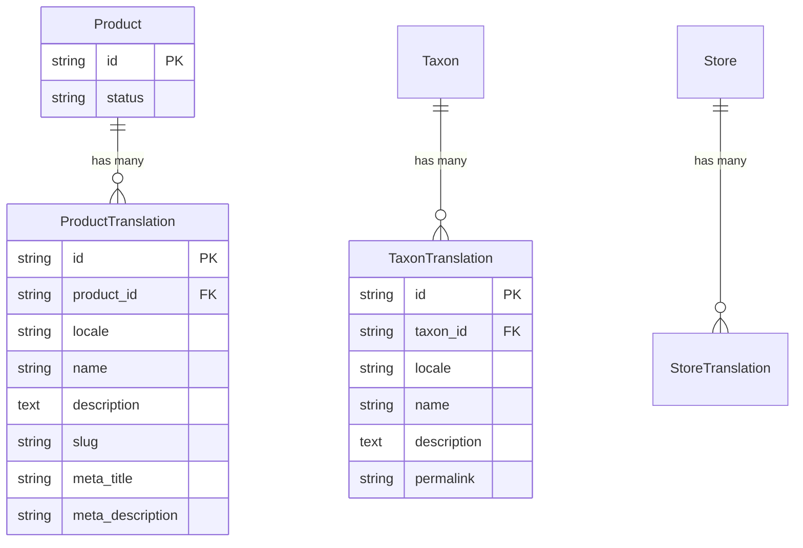

## Overview

Spree supports two types of translations:

1. **Resource Translations** — translatable content fields on models like Products, Taxons, and Stores (e.g., product name, description, slug)
2. **UI Translations** — interface strings used in the admin panel (e.g., button labels, flash messages)

For configuring which locales and currencies are available in your store, see [Markets](/developer/core-concepts/markets). Markets control locale and currency assignment per geographic region.

## Resource Translations

Resources with user-facing content fields have built-in support for translations. Each translatable resource has a corresponding translations table in the database — for example, product translations are stored in `spree_product_translations`.


```mermaid
erDiagram
    Product ||--o{ ProductTranslation : "has many"
    Taxon ||--o{ TaxonTranslation : "has many"
    Store ||--o{ StoreTranslation : "has many"

    Product {
        string id PK
        string status
    }

    ProductTranslation {
        string id PK
        string product_id FK
        string locale
        string name
        text description
        string slug
        string meta_title
        string meta_description
    }

    TaxonTranslation {
        string id PK
        string taxon_id FK
        string locale
        string name
        text description
        string permalink
    }
```

### Translatable Fields

| Resource         | Translatable Fields                                                                                                                                                                 |
| ---------------- | ----------------------------------------------------------------------------------------------------------------------------------------------------------------------------------- |
| Product          | `name`, `description`, `slug`, `meta_description`, `meta_keywords`, `meta_title`                                                                                                             |
| Taxon            | `name`, `description`, `permalink`                                                                                                                                                        |
| Taxonomy         | `name`                                                                                                                                                                                |
| Option Type      | `presentation`                                                                                                                                                                  |
| Option Value     | `presentation`                                                                                                                                                                  |
| Property         | `presentation`                                                                                                                                                   |
| Product Property | `value`                                                                                                                                                                 |
| Store            | `name`, `meta_description`, `meta_keywords`, `seo_title`, `facebook`, `twitter`, `instagram`, `customer_support_email`, `description`, `address`, `contact_phone` |

### Store API

To retrieve translated content, pass the locale via the `X-Spree-Locale` header or the SDK `locale` option:

<CodeGroup>

```typescript SDK
// Fetch product in French
const product = await client.store.products.get('spree-tote', {
  locale: 'fr',
})

product.name        // "Sac Spree"
product.description // "Un sac fourre-tout élégant..."
product.slug        // "sac-spree"

// List taxons in German
const { data: taxons } = await client.store.taxons.list({}, {
  locale: 'de',
})
```

```bash cURL
# Fetch product in French
curl 'https://api.mystore.com/api/v3/store/products/spree-tote' \
  -H 'Authorization: Bearer spree_pk_xxx' \
  -H 'X-Spree-Locale: fr'
```

</CodeGroup>

Slugs are also localized — a product can have different slugs per locale. See [Slugs](/developer/core-concepts/slugs#internationalization) for details.

### Managing Translations

Translations are managed in the Admin Panel. When editing a product, taxon, or other translatable resource, switch the locale selector to enter content in each language.

Translations can also be managed via the Admin API.

## UI Translations

Spree stores UI translation strings in a separate project: [Spree I18n](https://github.com/spree/spree_i18n). This is a community-maintained project with locale files for 43+ languages.

To install UI translations:

```bash
bundle add spree_i18n
```

Once installed, all translation files are available automatically — no need to copy any files.

<Info>
The full list of supported locales is available in the [Spree I18n GitHub repository](https://github.com/spree-contrib/spree_i18n/tree/main/config/locales).
</Info>

## Related Documentation

- [Markets](/developer/core-concepts/markets) — Locale and currency configuration per geographic region
- [Slugs](/developer/core-concepts/slugs) — Localized slugs and URL identifiers
- [Stores](/developer/core-concepts/stores) — Multi-store setup
- [Products](/developer/core-concepts/products) — Product translations
