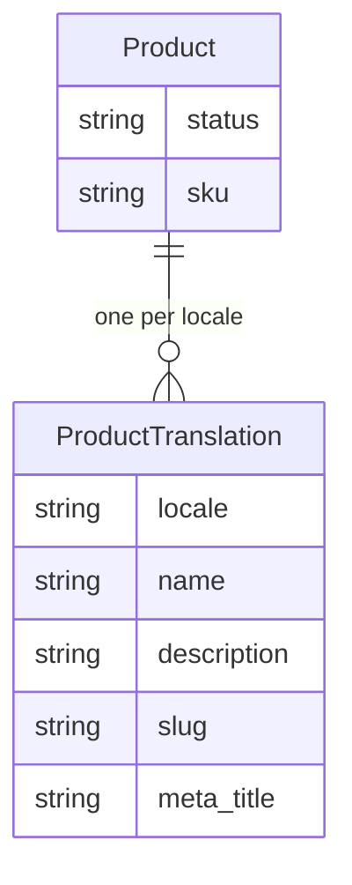

## Overview

Two different things need translating, and they're handled separately because they belong to different people.

**Your content** — product names, descriptions, category names — is written by whoever runs the store. Spree stores a version of each field per language.

**The interface** — button labels, error messages, email wording — is written by Spree, and is already translated into dozens of languages by the community.

<Info>
Which languages a region gets is decided by its [Market](/developer/core-concepts/markets). A market sets the default locale alongside the currency, so a visitor from France lands on French prices and French copy without choosing anything.
</Info>

## Translating content

Every translatable record keeps one row per language, so a product genuinely has a French name rather than a French name pasted over the English one.


```mermaid
erDiagram
    Product ||--o{ ProductTranslation : "one per locale"

    Product {
        string status
        string sku
    }
    ProductTranslation {
        string locale
        string name
        string description
        string slug
        string meta_title
    }
```

### What can be translated

| Resource | Fields |
|---|---|
| Product | `name`, `description`, `slug`, `meta_title`, `meta_description` |
| Category | `name`, `description`, `permalink` |
| Collection | `name`, `description`, `permalink` |
| Product type | `name` |
| Option type | `presentation` |
| Option value | `presentation` |
| Store | `name`, `seo_title`, `meta_description`, `meta_keywords`, and support contact details |
| Policy | `name`, `body` |
| Seller | `name`, `about` |

Note that **slugs are translated too**. A French page can live at `/produits/sac-spree` rather than at the English slug with French words on it — which is what search engines actually reward. See [Slugs](/developer/core-concepts/slugs#internationalization).

## Reading translated content

Ask for a locale and you get that language back. Nothing else about the request changes:

<CodeGroup>

```typescript Store SDK
const product = await client.products.get('spree-tote', {}, { locale: 'fr' })

product.name        // "Sac Spree"
product.description // "Un sac fourre-tout élégant…"
product.slug        // "sac-spree"

const { data: categories } = await client.categories.list({}, { locale: 'de' })
```

```typescript Admin SDK
// The Admin API resolves by ID only — slugs are not accepted here
const product = await adminClient.products.get('prod_86Rf07xd4z', {}, { locale: 'fr' })
```

```bash cURL
curl 'https://api.mystore.com/api/v3/store/products/spree-tote' \
  -H 'X-Spree-API-Key: pk_xxx' \
  -H 'X-Spree-Locale: fr'
```

</CodeGroup>

If a field has no translation for the requested locale, you get the default-language value rather than an empty string — a half-translated catalogue still renders as a usable page.

<Note>
Responses vary by locale, so if you cache them, include the locale in the cache key. Spree sets `Vary` headers for you, which is enough for a CDN but not for a hand-rolled in-memory cache.
</Note>

## Writing translations

Merchants translate in the dashboard, switching locale on the record they're editing. For bulk work — handing a catalogue to a translation agency — export to CSV, translate, and import it back.

Translations can also be written through the Admin API, which is what you'd use to sync from an external translation service:

```typescript Admin SDK
await adminClient.products.update('prod_xxx', {
  translations: {
    fr: { name: 'Sac Spree', description: 'Un sac fourre-tout élégant…' },
    de: { name: 'Spree Tasche' },
  },
})

// Which resources and fields accept translations
const { data: resources } = await adminClient.translatableResources.list()
```

Asking the API which resources are translatable means a translation tool doesn't need a hardcoded list that goes stale.

## Translating the interface

Spree's own strings — everything in the dashboard and in transactional emails — come from a community-maintained project covering 40+ languages.

<CodeGroup>

```bash Spree CLI
spree bundle add spree_i18n
```

```bash Bundler
bundle add spree_i18n
```

</CodeGroup>

That's the whole installation. Locales are picked up automatically; nothing needs copying into your app.

<Info>
See the [supported locales](https://github.com/spree-contrib/spree_i18n/tree/main/config/locales) in the Spree I18n repository. Contributions are welcome if yours is incomplete.
</Info>

## Related

- [Markets](/developer/core-concepts/markets) — which locale and currency a region gets
- [Slugs](/developer/core-concepts/slugs) — localized URLs
- [Custom Fields](/developer/core-concepts/metafields) — translating your own fields
- [Localization](/api-reference/store-api/localization) — the locale, currency and country headers
