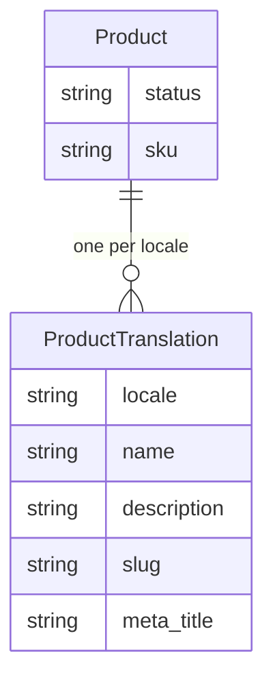

## Overview

Two different things need translating, and they're handled separately because they belong to different people.

**Your content** — product names, descriptions, category names — is written by whoever runs the store. Spree stores a version of each field per language.

**The interface** — button labels, error messages, email wording — is written by Spree, and is already translated into dozens of languages by the community.

<Info>
Which languages a region gets is decided by its [Market](/developer/core-concepts/markets). A market sets the default locale alongside the currency, so a visitor from France lands on French prices and French copy without choosing anything.
</Info>

## Translating content

Every translatable record keeps one row per language, so a product genuinely has a French name rather than a French name pasted over the English one.


```mermaid
erDiagram
    Product ||--o{ ProductTranslation : "one per locale"

    Product {
        string status
        string sku
    }
    ProductTranslation {
        string locale
        string name
        string description
        string slug
        string meta_title
    }
```

### What can be translated

| Resource | Fields |
|---|---|
| Product | `name`, `description`, `slug`, `meta_title`, `meta_description` |
| Category | `name`, `description`, `permalink` |
| Collection | `name`, `description`, `permalink` |
| Product type | `name` |
| Option type | `label` |
| Option value | `label` |
| Store | `name`, `seo_title`, `meta_description`, `meta_keywords`, and support contact details |
| Policy | `name`, `body` |
| Seller | `name`, `about` |

Note that **slugs are translated too**. A French page can live at `/produits/sac-spree` rather than at the English slug with French words on it — which is what search engines actually reward. See [Slugs](/developer/core-concepts/slugs#internationalization).

## Reading translated content

Ask for a locale and you get that language back. Nothing else about the request changes:

<CodeGroup>

```typescript Store SDK
const product = await client.products.get('spree-tote', {}, { locale: 'fr' })

product.name        // "Sac Spree"
product.description // "Un sac fourre-tout élégant…"
product.slug        // "sac-spree"

const { data: categories } = await client.categories.list({}, { locale: 'de' })
```

```typescript Admin SDK
// The Admin API resolves by ID only — slugs are not accepted here
const product = await adminClient.products.get('prod_86Rf07xd4z', {}, { locale: 'fr' })
```

```bash cURL
curl 'https://api.mystore.com/api/v3/store/products/spree-tote' \
  -H 'X-Spree-API-Key: pk_xxx' \
  -H 'X-Spree-Locale: fr'
```

</CodeGroup>

If a field has no translation for the requested locale, you get the default-language value rather than an empty string — a half-translated catalogue still renders as a usable page.

<Note>
Responses vary by locale, so if you cache them, include the locale in the cache key. Spree sets `Vary` headers for you, which is enough for a CDN but not for a hand-rolled in-memory cache.
</Note>

## Writing translations

Merchants translate in the dashboard, switching locale on the record they're editing. For bulk work — handing a catalogue to a translation agency — export to CSV, translate, and import it back.

Translations can also be written through the Admin API, which is what you'd use to sync from an external translation service. Writes go through one batch endpoint — every entry succeeds or none do — so a product and its option values can be translated in a single request:

<CodeGroup>

```typescript Admin SDK
await adminClient.translations.batch([
  {
    resource_type: 'product',
    resource_id: 'prod_xxx',
    values: {
      fr: { name: 'Sac Spree', description: 'Un sac fourre-tout élégant…' },
      de: { name: 'Spree Tasche' },
    },
  },
])

// Which resources and fields accept translations
const { data: resources } = await adminClient.translatableResources.list()
```

```bash cURL
curl -X POST 'https://api.mystore.com/api/v3/admin/translations/batch' \
  -H 'X-Spree-API-Key: sk_xxx' \
  -H 'Content-Type: application/json' \
  -d '{ "translations": [ { "resource_type": "product", "resource_id": "prod_xxx", "values": { "de": { "name": "Baumwolltasche" } } } ] }'
```

</CodeGroup>

Asking the API which resources are translatable means a translation tool doesn't need a hardcoded list that goes stale.

## Translating the interface

Spree's own text — transactional emails, API error messages and validation messages — ships translated into 43 languages besides English as part of Spree itself. There is nothing to install. A key that a language does not translate yet is shown in English.

The admin dashboard carries its own translations, separate from these. See [Dashboard translations](/developer/dashboard/customization/translations).

Regional variants such as `de-CH` or `pt-BR` hold only what differs from their base language and fall back to it. Regional English (`en-GB` and the like) falls back to `en`.

### Using fewer languages

Loading every language costs startup time and memory. An app that serves only some languages can list them, and Spree then loads only those, plus English:

```ruby server/config/application.rb
config.i18n.available_locales = [:en, :de, :fr]
```

### Changing a translation

<Tip>
To change what a customer email says, edit it in the dashboard under **Settings → Emails → Templates** instead. Edits apply per store and per language, and need no deploy. See [Templates merchants edit in the dashboard](/developer/customization/emails#templates-merchants-edit-in-the-dashboard) and the [Emails user guide](/user/settings/emails).
</Tip>

Locale files are for the text the dashboard does not edit: API error messages, checkout requirements, validation messages and staff emails. To change a word or add a language, add the key to a locale file in your app. Your file wins over the one Spree ships.

```yaml server/config/locales/de.yml
de:
  spree:
    checkout_requirements:
      email_required: Bitte geben Sie Ihre E-Mail-Adresse ein
```

Every key lives under `spree`. To read one from your own Ruby code, use its full key:

```ruby server/app/services/my_app/checkout_check.rb
I18n.t('spree.checkout_requirements.email_required')
```

<Info>
`Spree.t` still works in 6.0 but is deprecated and will be removed in 6.1. Use `I18n.t` with the full `spree.` key instead.
</Info>

Corrections to the translations Spree ships are welcome as pull requests to the locale files in the [Spree repository](https://github.com/spree/spree/tree/main/spree/core/config/locales).

## Related

- [Markets](/developer/core-concepts/markets) — which locale and currency a region gets
- [Slugs](/developer/core-concepts/slugs) — localized URLs
- [Custom Fields](/developer/core-concepts/metafields) — translating your own fields
- [Localization](/api-reference/store-api/localization) — the locale, currency and country headers
