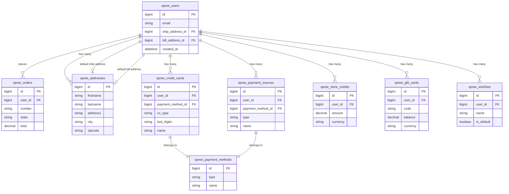
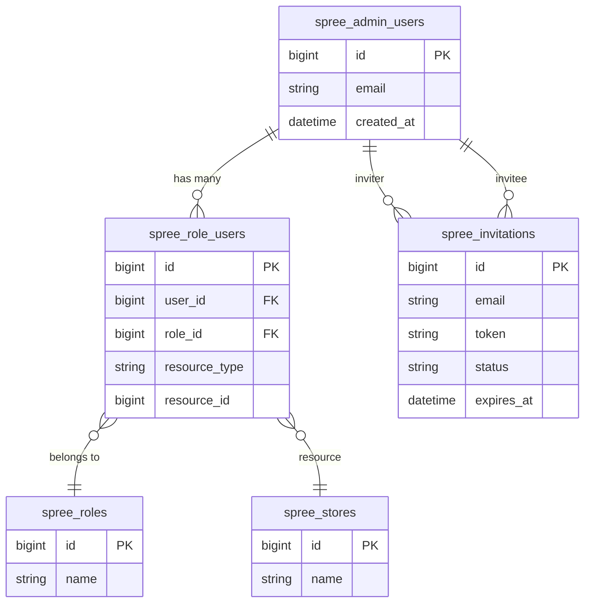
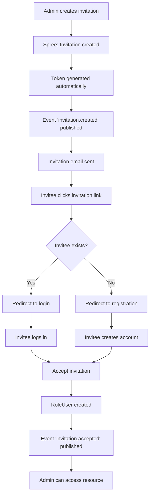

## Overview

In your Spree application you will usually have 2 types of users:

* **Customers** - users who browse and purchase products
* **Admins** - users who manage the store via the Admin Panel

Spree uses two separate user classes to distinguish between them:

| Class | Description | Default |
|-------|-------------|---------|
| `Spree.user_class` | Customers who browse and purchase products | `Spree::User` |
| `Spree.admin_user_class` | Administrators who manage the store via Admin Panel | `Spree::AdminUser` |

<Warning>
Always use `Spree.user_class` and `Spree.admin_user_class` instead of referencing the classes directly. This ensures compatibility with custom user models.
</Warning>

<Info>
You can use your own User classes. More on this in the [Customize Authentication guide](/developer/customization/authentication).
</Info>

## Customers

Customers are users who browse your store and purchase products. They are managed via `Spree.user_class`.



Customers can have:

* **[Addresses](/developer/core-concepts/addresses)** - both billing and shipping
* **[Orders](/developer/core-concepts/orders)** - a list of products that the customer has purchased
* **Credit Cards** - saved credit cards for checkout
* **Payment Sources** - saved non-credit card payment methods (PayPal, Klarna, etc.)
* **Store Credits** - assigned by the store owners, to be used to purchase products
* **Gift Cards** - gift cards owned by or assigned to the customer
* **Wishlists** - a list of products that the customer has marked as a wishlist

### Customer Attributes

| Attribute         | Description                                                                 | Example Value       |
|-------------------|-----------------------------------------------------------------------------|---------------------|
| `email`           | The email address of the customer                                           | `user@example.com`  |
| `ship_address_id` | References the default shipping address                                     | `2`                 |
| `bill_address_id` | References the default billing address                                      | `3`                 |

There will be more attributes provided by [Devise](https://github.com/plataformatec/devise) gem, but these are the most important ones.

### Customer Methods

`Spree.user_class` includes several [ActiveRecord concerns](https://api.rubyonrails.org/v7.1.3.2/classes/ActiveSupport/Concern.html) which provide additional methods:

```ruby
# Find a customer
customer = Spree.user_class.find_by(email: "customer@example.com")

# Get customer orders
customer.orders
```

```ruby Returns the last incomplete order for the given store.
customer.last_incomplete_spree_order(store)
```

```ruby Returns the total amount available store credits for the customer in the given store.
customer.available_store_credits(store)
```

```ruby Returns the default Wishlist for the given Store.
customer.default_wishlist_for_store(store)
```

```ruby Returns a list of all active payment sources (credit cards, PayPal, Klarna, etc.) that can be used on checkout.
customer.payment_sources
```

## Admins

Admins are users who manage the store via the Admin Panel. They are managed via `Spree.admin_user_class`.



### Admin Roles

Admin users can have different roles attached which control their permissions in the Admin Panel.

| Role | Description |
|------|-------------|
| `admin` | Full access to all Admin Panel features |

<Info>
You can create custom roles with specific permissions. See the [Customize Permissions guide](/developer/customization/permissions) for more details.
</Info>

### Managing Admin Access

Resources that include the `Spree::UserManagement` concern (such as `Spree::Store`) provide methods to manage admin access:

```ruby
store = Spree::Store.default
admin = Spree.admin_user_class.find_by(email: "admin@example.com")
role = Spree::Role.find_by(name: 'admin')

# Add an admin to the store with a specific role
store.add_user(admin, role)

# Add an admin with the default role
store.add_user(admin)

# Remove an admin's access to the store
store.remove_user(admin)

# Check admin permissions
admin.has_spree_role?('admin')
```

### Admin User Invitation Flow

Spree uses a custom `Spree::Invitation` model to handle admin user invitations. This provides a secure, token-based invitation system with built-in expiration and role assignment.



#### Invitation Model

The `Spree::Invitation` model tracks:

| Attribute | Description |
|-----------|-------------|
| `email` | Email address of the invitee |
| `token` | Secure token for the invitation link |
| `status` | `pending` or `accepted` |
| `expires_at` | When the invitation expires (default: 2 weeks) |
| `resource` | The resource being granted access to (e.g., Store) |
| `role` | The role to assign upon acceptance |
| `inviter` | The admin who created the invitation |
| `invitee` | The user who accepts the invitation |

#### Inviting an Admin via Admin Panel

1. Navigate to **Settings → Users** in the Admin Panel
2. Click **Invite User**
3. Enter the new admin's email address
4. Select the appropriate role
5. Click **Send Invitation**

The invitee will receive an email with an invitation link.

#### Inviting an Admin via Code

```ruby
# Create an invitation
invitation = Spree::Invitation.create!(
  email: "newadmin@example.com",
  inviter: current_admin_user,
  resource: Spree::Store.default,
  role: Spree::Role.find_by(name: 'admin')
)

# The 'invitation.created' event triggers the email automatically
# To skip the email:
invitation = Spree::Invitation.create!(
  email: "newadmin@example.com",
  inviter: current_admin_user,
  resource: Spree::Store.default,
  role: Spree::Role.find_by(name: 'admin'),
  skip_email: true
)
```

#### Resending an Invitation

```ruby
invitation = Spree::Invitation.pending.find_by(email: "newadmin@example.com")
invitation.resend!
```

#### Accepting an Invitation

When an invitee accepts, the invitation transitions to `accepted` and a `Spree::RoleUser` record is created linking the user to the resource with the specified role.

```ruby
invitation = Spree::Invitation.pending.find_by(token: params[:token])
invitation.invitee = current_admin_user
invitation.accept!
```

#### Invitation Expiration

By default, invitations expire after 2 weeks. You can customize this per invitation:

```ruby
invitation = Spree::Invitation.create!(
  email: "newadmin@example.com",
  inviter: current_admin_user,
  resource: Spree::Store.default,
  role: Spree::Role.find_by(name: 'admin'),
  expires_at: 1.month.from_now
)
```

#### Invitation Events

The invitation system publishes events that you can subscribe to:

| Event | Description |
|-------|-------------|
| `invitation.created` | Invitation was created (triggers email) |
| `invitation.accepted` | Invitation was accepted |
| `invitation.resent` | Invitation was resent |

## Permissions

Spree uses [CanCanCan](https://github.com/CanCanCommunity/cancancan) library to handle authorization for both customers and admins.

More on permissions can be found in the [Customize Permissions guide](/developer/customization/permissions).

## Current User

In Spree controllers or any controller inheriting from `Spree::BaseController`, you can access the current user with `spree_current_user` method:

```ruby
spree_current_user
```

## Related Documentation

- [Addresses](/developer/core-concepts/addresses) - User address management
- [Orders](/developer/core-concepts/orders) - User order history
- [Authentication](/developer/customization/authentication) - Custom authentication
- [Permissions](/developer/customization/permissions) - User permissions and authorization
