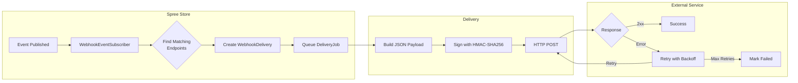

import { Since } from '/snippets/since.mdx';

<Since version="5.3" />

## Overview

Webhooks allow your Spree store to send real-time HTTP POST notifications to external services when events occur. When an order is completed, a product is updated, or inventory changes, Spree can automatically notify your CRM, fulfillment service, analytics platform, or any other system.

Webhooks are built on top of Spree's [event system](/developer/core-concepts/events), providing:

- **Multi-store support** - Each store has its own webhook endpoints
- **Event filtering** - Subscribe to specific events or patterns with wildcards
- **Secure delivery** - HMAC-SHA256 signatures for payload verification
- **Automatic retries** - Failed deliveries retry with exponential backoff
- **Full audit trail** - Track every delivery attempt with response codes and timing

## How Webhooks Work



1. An event is published (e.g., `order.completed`)
2. The `WebhookEventSubscriber` receives all events
3. It finds active webhook endpoints subscribed to that event
4. For each endpoint, it creates a `WebhookDelivery` record and queues a job
5. The job sends an HTTP POST request with the event payload and HMAC signature

## Creating Webhook Endpoints

### Via Admin Panel

Navigate to **Settings → Developers → Webhooks** in the admin panel to create and manage webhook endpoints.

### Via the Admin API

<CodeGroup>

```typescript Admin SDK
import { createAdminClient } from '@spree/admin-sdk'

const client = createAdminClient({
  baseUrl: 'https://store.example.com',
  secretKey: 'sk_xxx',
})

const endpoint = await client.webhookEndpoints.create({
  url: 'https://example.com/webhooks/spree',
  subscriptions: ['order.*', 'product.created'],
  active: true,
})

// secret_key is auto-generated and returned ONLY on create —
// store it now for HMAC signature verification.
endpoint.secret_key // => "a1b2c3d4e5f6..." (64-character hex string)
```

```bash CLI
spree api post /webhook_endpoints -d '{
  "url": "https://example.com/webhooks/spree",
  "subscriptions": ["order.*", "product.created"],
  "active": true
}'
```

</CodeGroup>

<Warning>
The `secret_key` is returned **only once**, in the create response. Save it immediately — it can't be retrieved later and is required to verify webhook signatures.
</Warning>

### Endpoint Attributes

| Attribute | Type | Description |
|-----------|------|-------------|
| `url` | String | The HTTPS endpoint URL to receive webhooks |
| `active` | Boolean | Enable/disable delivery to this endpoint |
| `subscriptions` | Array | Event patterns to subscribe to |
| `secret_key` | String | Auto-generated key for HMAC signature verification |

Endpoints always belong to the current store — the association is set automatically from the request scope, so you never pass it when creating or updating an endpoint.

## Event Subscriptions

The `subscriptions` attribute controls which events trigger webhooks to this endpoint. Set it when creating the endpoint, or change it later:

<CodeGroup>

```typescript Admin SDK
await client.webhookEndpoints.update('whe_xxx', {
  subscriptions: ['order.completed', 'order.canceled'],
})
```

```bash CLI
spree api patch /webhook_endpoints/whe_xxx \
  -d '{"subscriptions": ["order.completed", "order.canceled"]}'
```

</CodeGroup>

The `subscriptions` array accepts exact event names and wildcard patterns:

| `subscriptions` value | Receives |
|---|---|
| `['order.completed', 'order.canceled']` | Only those two events |
| `['order.*']` | All order events |
| `['*.created']` | All creation events |
| `['order.*', 'payment.*', 'shipment.shipped']` | Multiple patterns |
| `[]` or `['*']` | All events |

## Webhook Payload

Each webhook delivery sends a JSON payload with the following structure. The `data` object uses the same [Store API V3 serializers](/api-reference/introduction) as the REST API, so webhook payloads and API responses share the same schema:

```json
{
  "id": "550e8400-e29b-41d4-a716-446655440000",
  "name": "order.completed",
  "created_at": "2025-01-15T10:30:00Z",
  "data": {
    "id": "or_m3Rp9wXz",
    "number": "R123456789",
    "fulfillment_status": "shipped",
    "payment_status": "paid",
    "total": "99.99",
    "display_total": "$99.99",
    "total_quantity": 3,
    "currency": "USD",
    "items": [ ... ],
    "fulfillments": [ ... ],
    "payments": [ ... ]
  },
  "metadata": {
    "spree_version": "5.1.0"
  }
}
```

| Field | Description |
|-------|-------------|
| `id` | Unique UUID for this event |
| `name` | Event name (e.g., `order.completed`) |
| `created_at` | ISO8601 timestamp when event occurred |
| `data` | Serialized resource data (V3 API format with [prefixed IDs](/api-reference/introduction)) |
| `metadata` | Additional context including Spree version |

For complete payload schemas for each event type, see [Webhook Events & Payloads](/api-reference/webhooks-events).

## HTTP Request Details

### Headers

Each webhook request includes these headers:

| Header | Description |
|--------|-------------|
| `Content-Type` | `application/json` |
| `User-Agent` | `Spree-Webhooks/1.0` |
| `X-Spree-Webhook-Event` | Event name (e.g., `order.completed`) |
| `X-Spree-Webhook-Signature` | HMAC-SHA256 signature for verification |
| `X-Spree-Webhook-Timestamp` | Unix timestamp (seconds) generated at send time; included in the HMAC-SHA256 signed string as `{timestamp}.{payload}` and required to verify `X-Spree-Webhook-Signature` |

### Verifying Webhook Signatures

To ensure webhooks are genuinely from your Spree store, verify the signature.

#### Next.js

The [Spree Storefront](https://github.com/spree/storefront) includes a ready-made webhook route handler with signature verification and event routing. See the [storefront email docs](/developer/storefront/nextjs/customization#transactional-emails) for details.

#### Any JavaScript/TypeScript framework

Use `@spree/sdk/webhooks` for framework-agnostic verification:

```typescript
import { verifyWebhookSignature } from '@spree/sdk/webhooks'
import type { WebhookEvent } from '@spree/sdk/webhooks'
import type { Order } from '@spree/sdk'

// Hono, Cloudflare Workers, or any Web Fetch API-based framework
app.post('/webhooks/spree', async (req, res) => {
  const body = await req.text()
  const signature = req.headers['x-spree-webhook-signature']
  const timestamp = req.headers['x-spree-webhook-timestamp']

  if (!verifyWebhookSignature(body, signature, timestamp, process.env.SPREE_WEBHOOK_SECRET!)) {
    return res.status(401).json({ error: 'Invalid signature' })
  }

  const event: WebhookEvent<Order> = JSON.parse(body)
  // handle event...
  res.json({ received: true })
})
```

#### Ruby

```ruby
class WebhooksController < ApplicationController
  skip_before_action :verify_authenticity_token

  def receive
    unless verify_signature
      head :unauthorized
      return
    end

    event = JSON.parse(request.body.read)

    case event['name']
    when 'order.completed'
      handle_order_completed(event['data'])
    when 'product.updated'
      handle_product_updated(event['data'])
    end

    head :ok
  end

  private

  def verify_signature
    payload = request.body.read
    request.body.rewind

    signature = request.headers['X-Spree-Webhook-Signature']
    timestamp = request.headers['X-Spree-Webhook-Timestamp']
    expected = OpenSSL::HMAC.hexdigest('SHA256', ENV['SPREE_WEBHOOK_SECRET'], "#{timestamp}.#{payload}")

    ActiveSupport::SecurityUtils.secure_compare(signature.to_s, expected)
  end
end
```

## Delivery Status & Retries

### Automatic Retries

Failed webhook deliveries automatically retry up to 5 times with exponential backoff. This handles temporary network issues and endpoint downtime.

### Checking Delivery Status

Inspect an endpoint's delivery log, and re-send a failed delivery, via the Admin API:

<CodeGroup>

```typescript Admin SDK
// Recent deliveries for an endpoint
const { data: deliveries } = await client.webhookEndpoints.deliveries.list('whe_xxx')

// Re-send a specific delivery
await client.webhookEndpoints.deliveries.redeliver('whe_xxx', 'whd_xxx')
```

```bash CLI
spree api get /webhook_endpoints/whe_xxx/deliveries -q event_name_eq=order.completed
spree api post /webhook_endpoints/whe_xxx/deliveries/whd_xxx/redeliver
```

</CodeGroup>

### Delivery Attributes

| Attribute | Description |
|-----------|-------------|
| `event_name` | Name of the event delivered |
| `payload` | Complete webhook payload sent |
| `response_code` | HTTP status code (nil if pending) |
| `success` | Boolean indicating 2xx response |
| `execution_time` | Delivery time in milliseconds |
| `error_type` | `'timeout'`, `'connection_error'`, or nil |
| `request_errors` | Error message details |
| `response_body` | Response from endpoint (truncated) |
| `delivered_at` | Timestamp of delivery attempt |

## Configuration

### Enabling/Disabling Webhooks

Webhooks are enabled by default. To disable globally:

```ruby
# config/initializers/spree.rb
Spree::Api::Config.webhooks_enabled = false
```

### SSL Verification

SSL verification is enabled by default in production. In development, it's disabled to allow testing with self-signed certificates:

```ruby
# config/initializers/spree.rb
Spree::Api::Config.webhooks_verify_ssl = true  # Force SSL verification
Spree::Api::Config.webhooks_verify_ssl = false # Disable (not recommended for production)
```

## Available Events

Webhooks can subscribe to any event in Spree's event system. See [Events](/developer/core-concepts/events#available-events) for a complete list.

Common webhook events include:

| Event | Description |
|-------|-------------|
| `order.completed` | Order checkout finished |
| `order.canceled` | Order was canceled |
| `order.paid` | Order is fully paid |
| `shipment.shipped` | Shipment was shipped |
| `payment.paid` | Payment was completed |
| `product.created` | New product created |
| `product.updated` | Product was modified |
| `user.created` | New customer/user registered (the admin user class emits `admin.created`) |

## Testing Webhooks

### In Development

Use tools like [ngrok](https://ngrok.com) or [webhook.site](https://webhook.site) to test webhooks locally. Create a test endpoint pointed at the tunnel:

<CodeGroup>

```typescript Admin SDK
const endpoint = await client.webhookEndpoints.create({
  url: 'https://your-ngrok-url.ngrok.io/webhooks',
  subscriptions: ['order.*'],
  active: true,
})

// Fire a synthetic delivery to confirm it's reachable
await client.webhookEndpoints.sendTest(endpoint.id)
```

```bash CLI
spree api post /webhook_endpoints -d '{
  "url": "https://your-ngrok-url.ngrok.io/webhooks",
  "subscriptions": ["order.*"],
  "active": true
}'
spree api post /webhook_endpoints/whe_xxx/send_test
```

</CodeGroup>

`send_test` delivers a synthetic `webhook.test` event so you can verify the endpoint is reachable and your signature-verification code works, without having to trigger a real order.

### In Tests

```ruby
RSpec.describe 'Webhook delivery' do
  let(:store) { create(:store) }
  let(:endpoint) { create(:webhook_endpoint, store: store, subscriptions: ['order.completed']) }
  let(:order) { create(:completed_order_with_totals, store: store) }

  it 'delivers webhook when order completes' do
    stub_request(:post, endpoint.url).to_return(status: 200)

    expect {
      order.publish_event('order.completed')
    }.to have_enqueued_job(Spree::WebhookDeliveryJob)
  end
end
```

## Best Practices

<CardGroup cols={2}>
  <Card title="Respond quickly" icon="bolt">
    Return a 2xx response as fast as possible. Process webhook data asynchronously in a background job.
  </Card>

  <Card title="Verify signatures" icon="shield">
    Always verify the `X-Spree-Webhook-Signature` header to ensure the webhook is authentic.
  </Card>

  <Card title="Handle duplicates" icon="copy">
    Use the event `id` to detect and handle duplicate deliveries. Webhooks may be retried.
  </Card>

  <Card title="Subscribe selectively" icon="filter">
    Only subscribe to events you need. Use specific patterns rather than `*` when possible.
  </Card>
</CardGroup>

## Troubleshooting

### Webhooks Not Delivering

1. Check that webhooks are enabled: `Spree::Api::Config.webhooks_enabled`
2. Verify the endpoint is active: `endpoint.active?`
3. Confirm the endpoint subscribes to the event: `endpoint.subscribed_to?('order.completed')`
4. Check the event has a `store_id` matching the endpoint's store

### Signature Verification Failing

1. Ensure you're using the raw request body (not parsed JSON)
2. Verify you're using the correct `secret_key` for this endpoint
3. Check that no middleware is modifying the request body

### Deliveries Failing

Check the delivery records for details — each carries `error_type`, `request_errors`, `response_code`, and `response_body`. Filter the log with [Ransack predicates](/api-reference/admin-api/querying) such as `success_eq=false` or `event_name_eq`:

<CodeGroup>

```typescript Admin SDK
const { data: deliveries } = await client.webhookEndpoints.deliveries.list('whe_xxx', {
  success_eq: false,
})
const failed = deliveries[0]
// failed.error_type, failed.request_errors, failed.response_code, failed.response_body
```

```bash CLI
spree api get /webhook_endpoints/whe_xxx/deliveries -q success_eq=false
```

</CodeGroup>

## Related Documentation

- [Events](/developer/core-concepts/events) - Understanding Spree's event system
- [Admin SDK](/developer/sdk/admin/quickstart) - Setting up the `@spree/admin-sdk` client used in the management examples above
- [Customization Quickstart](/developer/customization/quickstart) - Overview of all customization options
- [Dependencies](/developer/customization/dependencies) - Customizing Spree services
