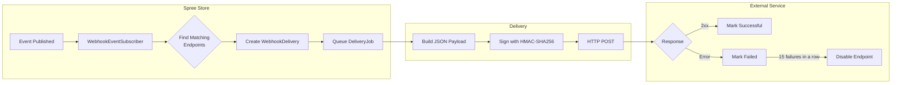

## Overview

Webhooks allow your Spree store to send real-time HTTP POST notifications to external services when events occur. When an order is completed, a product is updated, or inventory changes, Spree can automatically notify your CRM, fulfillment service, analytics platform, or any other system.

Webhooks are built on top of Spree's [event system](/developer/core-concepts/events), providing:

- **Multi-store support** - Each store has its own webhook endpoints
- **Event filtering** - Subscribe to specific events or patterns with wildcards
- **Secure delivery** - HMAC-SHA256 signatures for payload verification
- **Failure handling** - Failed deliveries are retried automatically and can be re-sent by hand, and an endpoint that keeps failing is disabled
- **Full audit trail** - Track every delivery attempt with response codes and timing

## How Webhooks Work


```mermaid
flowchart LR
    subgraph Spree Store
        A[Event Published] --> B[WebhookEventSubscriber]
        B --> C{Find Matching<br/>Endpoints}
        C --> D[Create WebhookDelivery]
        D --> E[Queue DeliveryJob]
    end

    subgraph Delivery
        E --> F[Build JSON Payload]
        F --> G[Sign with HMAC-SHA256]
        G --> H[HTTP POST]
    end

    subgraph External Service
        H --> I{Response}
        I -->|2xx| J[Mark Successful]
        I -->|Error| K[Mark Failed]
        K -->|15 failures in a row| L[Disable Endpoint]
    end
```

1. An event is published (e.g., `order.placed`)
2. The `WebhookEventSubscriber` receives all events
3. It finds active webhook endpoints subscribed to that event
4. For each endpoint, it creates a `WebhookDelivery` record and queues a job
5. The job sends an HTTP POST request with the event payload and HMAC signature

## Creating Webhook Endpoints

### Via Admin Panel

Navigate to **Settings → Developer → Webhooks** in the admin panel to create and manage webhook endpoints.

### Via the Admin API

<CodeGroup>

```typescript Admin SDK
import { createAdminClient } from '@spree/admin-sdk'

const client = createAdminClient({
  baseUrl: 'https://store.example.com',
  secretKey: 'sk_xxx',
})

const endpoint = await client.webhookEndpoints.create({
  url: 'https://example.com/webhooks/spree',
  subscriptions: ['order.*', 'product.created'],
  active: true,
})

// secret_key is auto-generated and returned ONLY on create —
// store it now for HMAC signature verification.
endpoint.secret_key // => "a1b2c3d4e5f6..." (64-character hex string)
```

```bash CLI
spree api post /webhook_endpoints -d '{
  "url": "https://example.com/webhooks/spree",
  "subscriptions": ["order.*", "product.created"],
  "active": true
}'
```

```bash cURL
curl -X POST 'https://api.mystore.com/api/v3/admin/webhook_endpoints' \
  -H 'X-Spree-API-Key: sk_xxx' \
  -H 'Content-Type: application/json' \
  -d '{
    "url": "https://example.com/webhooks/spree",
    "subscriptions": ["order.*", "product.created"],
    "active": true
  }'
```

</CodeGroup>

<Warning>
The `secret_key` is returned **only once**, in the create response. Save it immediately — it can't be retrieved later and is required to verify webhook signatures.
</Warning>

### Endpoint Attributes

| Attribute | Type | Description |
|-----------|------|-------------|
| `url` | String | The HTTPS endpoint URL to receive webhooks |
| `active` | Boolean | Enable/disable delivery to this endpoint |
| `subscriptions` | Array | Event patterns to subscribe to |
| `secret_key` | String | Auto-generated key for HMAC signature verification |

Endpoints always belong to the current store — the association is set automatically from the request scope, so you never pass it when creating or updating an endpoint.

## Event Subscriptions

The `subscriptions` attribute controls which events trigger webhooks to this endpoint. Set it when creating the endpoint, or change it later:

<CodeGroup>

```typescript Admin SDK
await client.webhookEndpoints.update('whe_xxx', {
  subscriptions: ['order.placed', 'order.canceled'],
})
```

```bash CLI
spree api patch /webhook_endpoints/whe_xxx \
  -d '{"subscriptions": ["order.placed", "order.canceled"]}'
```

```bash cURL
curl -X PATCH 'https://api.mystore.com/api/v3/admin/webhook_endpoints/whe_xxx' \
  -H 'X-Spree-API-Key: sk_xxx' \
  -H 'Content-Type: application/json' \
  -d '{ "subscriptions": ["order.placed", "order.canceled"] }'
```

</CodeGroup>

The `subscriptions` array accepts exact event names and wildcard patterns:

| `subscriptions` value | Receives |
|---|---|
| `['order.placed', 'order.canceled']` | Only those two events |
| `['order.*']` | All order events |
| `['*.created']` | All creation events |
| `['order.*', 'payment.*', 'fulfillment.fulfilled']` | Multiple patterns |
| `[]` or `['*']` | All events |

Events that carry a credential — the `*.password_reset_requested` events, which include a reset token — are never matched by a pattern. An endpoint receives them only when it names them, and naming one needs the permission to manage the accounts it concerns.

To see every event you can subscribe to, including those your installed extensions add, list them:

<CodeGroup>

```typescript Admin SDK
const { data: events } = await client.webhookEvents.list()
// [{ name: 'order.placed', group: 'order', credential: false, deprecated: false, ... }, ...]
```

```bash CLI
spree api get /webhook_events
```

```bash cURL
curl 'https://api.mystore.com/api/v3/admin/webhook_events' \
  -H 'X-Spree-API-Key: sk_xxx'
```

</CodeGroup>

Each entry says whether the event carries a credential (and which permission subscribing to it needs), and whether it is a deprecated name along with the event that replaces it.

## Webhook Payload

Each webhook delivery sends a JSON payload with the following structure. The `data` object uses the same [Store API V3 serializers](/api-reference/introduction) as the REST API, so webhook payloads and API responses share the same schema:

```json Payload
{
  "id": "550e8400-e29b-41d4-a716-446655440000",
  "name": "order.placed",
  "created_at": "2025-01-15T10:30:00Z",
  "data": {
    "id": "or_m3Rp9wXz",
    "number": "R123456789",
    "fulfillment_status": "unfulfilled",
    "payment_status": "paid",
    "total": "99.99",
    "display_total": "$99.99",
    "total_quantity": 3,
    "currency": "USD",
    "items": [ ... ],
    "fulfillments": [ ... ],
    "payments": [ ... ]
  },
  "metadata": {
    "spree_version": "6.0.0"
  }
}
```

| Field | Description |
|-------|-------------|
| `id` | Unique UUID for this event |
| `name` | Event name (e.g., `order.placed`) |
| `created_at` | ISO8601 timestamp when event occurred |
| `data` | Serialized resource data (V3 API format with [prefixed IDs](/api-reference/introduction)) |
| `metadata` | Additional context: the Spree version, plus facts about the event itself, such as `notify_customer` |

Payloads carry what a customer could see, never back-office fields such as costs, internal notes or staff names. When an integration needs those, it fetches the record from the Admin API with the `id` in the payload, using a key scoped to what it may read.

For complete payload schemas for each event type, see [Webhook Events & Payloads](/api-reference/webhooks-events).

## HTTP Request Details

### Headers

Each webhook request includes these headers:

| Header | Description |
|--------|-------------|
| `Content-Type` | `application/json` |
| `User-Agent` | `Spree-Webhooks/1.0` |
| `X-Spree-Webhook-Event` | Event name (e.g., `order.placed`) |
| `X-Spree-Webhook-Signature` | HMAC-SHA256 signature for verification |
| `X-Spree-Webhook-Timestamp` | Unix timestamp (seconds) generated at send time; included in the HMAC-SHA256 signed string as `{timestamp}.{payload}` and required to verify `X-Spree-Webhook-Signature` |

### Verifying Webhook Signatures

To ensure webhooks are genuinely from your Spree store, verify the signature.

#### Next.js

The [Spree Storefront](https://github.com/spree/storefront) includes a ready-made webhook route handler with signature verification and event routing. See the [storefront email docs](/developer/storefront/nextjs/customization#transactional-emails) for details.

#### Any JavaScript/TypeScript framework

Use `@spree/sdk/webhooks` for framework-agnostic verification. `constructWebhookEvent` checks the signature and returns a typed event: once you check `event.name`, `event.data` has the type of the record that event carries.

```typescript Store SDK
import { constructWebhookEvent, WebhookVerificationError } from '@spree/sdk/webhooks'
import { webhookEventSchemas } from '@spree/sdk/zod'

// Hono, Cloudflare Workers, or any Web Fetch API-based framework
app.post('/webhooks/spree', async (c) => {
  let event
  try {
    event = constructWebhookEvent(await c.req.text(), c.req.raw.headers, process.env.SPREE_WEBHOOK_SECRET!, {
      schemas: webhookEventSchemas, // optional: validate `data` at runtime
    })
  } catch (error) {
    if (error instanceof WebhookVerificationError) return c.json({ error: 'Invalid signature' }, 401)
    throw error
  }

  switch (event.name) {
    case 'order.placed':
      await fulfil(event.data) // typed as Order
      break
    case 'customer.password_reset_requested':
      await sendResetEmail(event.data.email, event.data.reset_token)
      break
  }

  return c.json({ received: true })
})
```

Pass the body exactly as received: parsing and re-serializing it changes the bytes the signature covers. `verifyWebhookSignature` is still available when you only need the check.

Events your own code or an extension publishes can be typed too, by adding them to `WebhookEventMap`:

```typescript
declare module '@spree/sdk/webhooks' {
  interface WebhookEventMap {
    'loyalty.points_earned': { id: string; points: number }
  }
}
```

#### Ruby

```ruby server/app/controllers/webhooks_controller.rb
class WebhooksController < ApplicationController
  skip_before_action :verify_authenticity_token

  def receive
    unless verify_signature
      head :unauthorized
      return
    end

    event = JSON.parse(request.body.read)

    case event['name']
    when 'order.placed'
      handle_order_placed(event['data'])
    when 'product.updated'
      handle_product_updated(event['data'])
    end

    head :ok
  end

  private

  def verify_signature
    payload = request.body.read
    request.body.rewind

    signature = request.headers['X-Spree-Webhook-Signature']
    timestamp = request.headers['X-Spree-Webhook-Timestamp']
    expected = OpenSSL::HMAC.hexdigest('SHA256', ENV['SPREE_WEBHOOK_SECRET'], "#{timestamp}.#{payload}")

    ActiveSupport::SecurityUtils.secure_compare(signature.to_s, expected)
  end
end
```

## Delivery Status

### Failed Deliveries

Any response other than 2xx — including a timeout or a connection error — marks the delivery as failed. Spree then sends it again, waiting longer before each try, up to 5 attempts in total over about six minutes. The delivery log shows the outcome of the latest attempt. Retries stop as soon as the endpoint is turned off.

Every attempt carries the same event `id`, so use it to ignore an event your receiver has already processed. To send a delivery again after the retries run out, re-send it from the delivery log (see below).

If an endpoint fails 15 deliveries in a row, Spree disables it and emails the store staff. Fix the endpoint, then turn it back on by marking it active again.

### Checking Delivery Status

Inspect an endpoint's delivery log, and re-send a failed delivery, via the Admin API:

<CodeGroup>

```typescript Admin SDK
// Recent deliveries for an endpoint
const { data: deliveries } = await client.webhookEndpoints.deliveries.list('whe_xxx')

// Re-send a specific delivery
await client.webhookEndpoints.deliveries.redeliver('whe_xxx', 'whd_xxx')
```

```bash CLI
spree api get /webhook_endpoints/whe_xxx/deliveries -q event_name_eq=order.placed
spree api post /webhook_endpoints/whe_xxx/deliveries/whd_xxx/redeliver
```

```bash cURL
curl 'https://api.mystore.com/api/v3/admin/webhook_endpoints/whe_xxx/deliveries?q[event_name_eq]=order.placed' \
  -H 'X-Spree-API-Key: sk_xxx'

curl -X POST 'https://api.mystore.com/api/v3/admin/webhook_endpoints/whe_xxx/deliveries/whd_xxx/redeliver' \
  -H 'X-Spree-API-Key: sk_xxx'
```

</CodeGroup>

### Delivery Attributes

| Attribute | Description |
|-----------|-------------|
| `event_name` | Name of the event delivered |
| `payload` | Complete webhook payload sent |
| `response_code` | HTTP status code (nil if pending) |
| `success` | Boolean indicating 2xx response |
| `execution_time` | Delivery time in milliseconds |
| `error_type` | `'timeout'`, `'connection_error'`, or nil |
| `request_errors` | Error message details |
| `response_body` | Response from endpoint (truncated) |
| `delivered_at` | Timestamp of delivery attempt |

## Configuration

Webhooks are on by default and can be switched off installation-wide.

SSL certificates are verified in production, and not in development — so you can point an endpoint at a local tunnel with a self-signed certificate while building. Both are configurable if your environment needs something different.

## Available Events

Webhooks can subscribe to any event in Spree's event system. See [Webhook Events & Payloads](/api-reference/webhooks-events) for the complete list, or [list them through the Admin API](#event-subscriptions) to include the events your extensions add.

Common webhook events include:

| Event | Description |
|-------|-------------|
| `order.placed` | A customer completed checkout |
| `order.paid` | The order is fully paid |
| `order.canceled` | The order was canceled |
| `order.fulfilled` | Everything on the order has shipped |
| `fulfillment.fulfilled` | One parcel went out |
| `payment.completed` | A payment succeeded |
| `product.created` / `product.updated` | Catalog changes |
| `product.out_of_stock` / `product.back_in_stock` | Availability flipped |
| `user.created` | A new customer registered |
| `return.received` | A return arrived |

## Testing Webhooks

### In Development

Use tools like [ngrok](https://ngrok.com) or [webhook.site](https://webhook.site) to test webhooks locally. Create a test endpoint pointed at the tunnel:

<CodeGroup>

```typescript Admin SDK
const endpoint = await client.webhookEndpoints.create({
  url: 'https://your-ngrok-url.ngrok.io/webhooks',
  subscriptions: ['order.*'],
  active: true,
})

// Fire a synthetic delivery to confirm it's reachable
await client.webhookEndpoints.sendTest(endpoint.id)
```

```bash CLI
spree api post /webhook_endpoints -d '{
  "url": "https://your-ngrok-url.ngrok.io/webhooks",
  "subscriptions": ["order.*"],
  "active": true
}'
spree api post /webhook_endpoints/whe_xxx/send_test
```

```bash cURL
curl -X POST 'https://api.mystore.com/api/v3/admin/webhook_endpoints' \
  -H 'X-Spree-API-Key: sk_xxx' \
  -H 'Content-Type: application/json' \
  -d '{
    "url": "https://your-ngrok-url.ngrok.io/webhooks",
    "subscriptions": ["order.*"],
    "active": true
  }'
```

</CodeGroup>

`send_test` delivers a synthetic `webhook.test` event so you can verify the endpoint is reachable and your signature-verification code works, without having to trigger a real order.

## Best Practices

<CardGroup cols={2}>
  <Card title="Respond quickly" icon="bolt">
    Return a 2xx response as fast as possible. Process webhook data asynchronously in a background job.
  </Card>

  <Card title="Verify signatures" icon="shield">
    Always verify the `X-Spree-Webhook-Signature` header to ensure the webhook is authentic.
  </Card>

  <Card title="Handle duplicates" icon="copy">
    Use the event `id` to detect and handle duplicate deliveries. A delivery that is re-sent carries the same event `id`.
  </Card>

  <Card title="Subscribe selectively" icon="filter">
    Only subscribe to events you need. Use specific patterns rather than `*` when possible.
  </Card>
</CardGroup>

## Troubleshooting

### Webhooks Not Delivering

1. Check that webhooks are enabled installation-wide
2. Verify the endpoint is marked active
3. Confirm the endpoint actually subscribes to the event you expect
4. Check the event belongs to the same store as the endpoint

### Signature Verification Failing

1. Ensure you're using the raw request body (not parsed JSON)
2. Verify you're using the correct `secret_key` for this endpoint
3. Check that no middleware is modifying the request body

### Deliveries Failing

Check the delivery records for details — each carries `error_type`, `request_errors`, `response_code`, and `response_body`. Filter the log with [Ransack predicates](/api-reference/admin-api/querying) such as `success_eq=false` or `event_name_eq`:

<CodeGroup>

```typescript Admin SDK
const { data: deliveries } = await client.webhookEndpoints.deliveries.list('whe_xxx', {
  success_eq: false,
})
const failed = deliveries[0]
// failed.error_type, failed.request_errors, failed.response_code, failed.response_body
```

```bash CLI
spree api get /webhook_endpoints/whe_xxx/deliveries -q success_eq=false
```

```bash cURL
curl 'https://api.mystore.com/api/v3/admin/webhook_endpoints/whe_xxx/deliveries?q[success_eq]=false' \
  -H 'X-Spree-API-Key: sk_xxx'
```

</CodeGroup>

## Related Documentation

- [Events](/developer/core-concepts/events) - Understanding Spree's event system
- [Admin SDK](/developer/sdk/admin/quickstart) - Setting up the `@spree/admin-sdk` client used in the management examples above
- [Customization Quickstart](/developer/customization/quickstart) - Overview of all customization options
- [Dependencies](/developer/customization/dependencies) - Customizing Spree services
