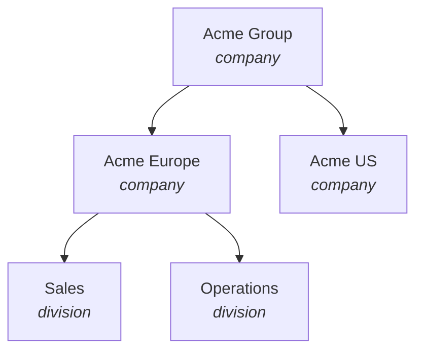
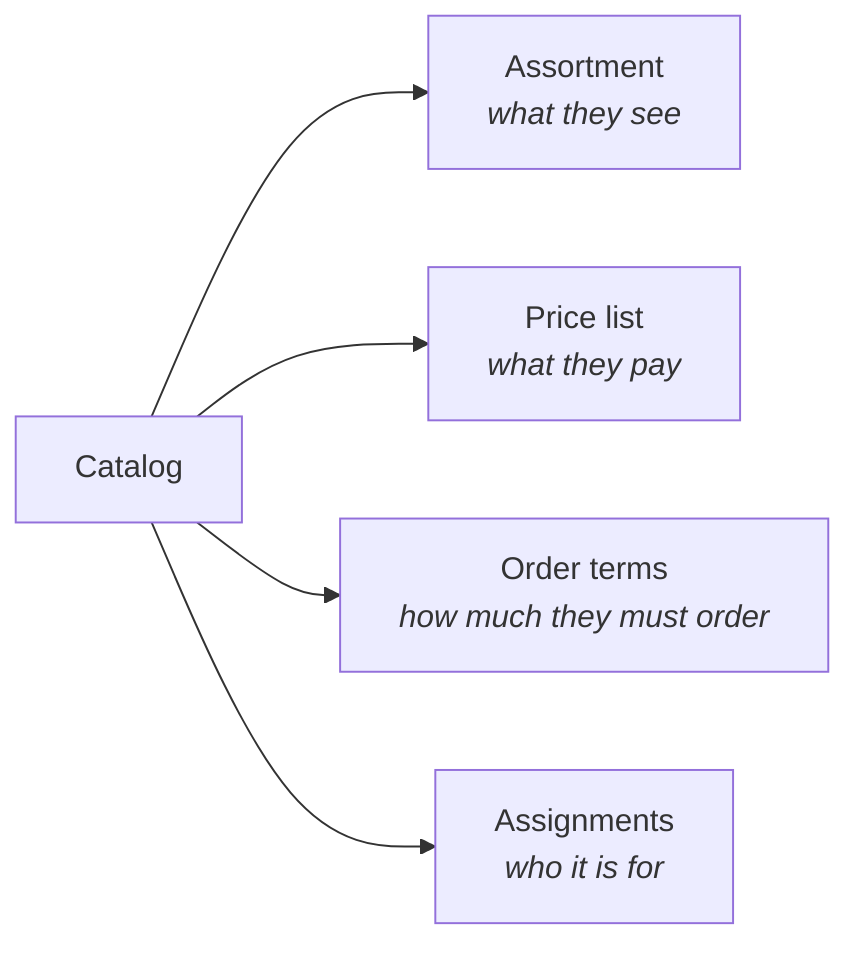

Spree supports selling to businesses out of the box. Buying organizations are first-class records with their own people, addresses and tax registrations. Each one can have its own negotiated range, prices and minimums. A storefront channel can be closed to anyone who has not signed in, and wholesale orders can ship by the carton or pallet with the freight quoted later.

So building a B2B store is mostly configuration, not development. The same Spree install can serve retail shoppers and trade buyers side by side, and most setups need no custom code. This guide walks through each part of a wholesale setup and how to configure it.

## What you get

- **Companies** — buying organizations as a tree of companies and divisions, with members, invitations, a shared address book, and tax registrations on the legal entities.
- **Customer groups** — segments of individual customers, such as approved trade accounts or staff, for buyers who do not purchase on behalf of a company.
- **Catalogs** — the commercial agreement: which products an audience sees, what they pay, and how much they must order.
- **Negotiated and volume pricing** — fixed prices per product, a percentage off the shop price, and quantity breaks, all resolved per buyer.
- **Order terms** — minimum order quantities, order multiples, and a minimum order value in each currency.
- **Gated access** — a sales channel that hides prices from guests or refuses them entirely, with guest checkout switched off.
- **B2B checkout** — the company a purchase is for, its address book, its tax treatment, and the buyer's own purchase order number.
- **Orders on account** — pay-by-invoice at checkout, and staff-keyed draft orders with negotiated line prices, placed with payment still to come.
- **Freight** — carton and pallet packing, volume-based shipment tiers, and delivery rates that are quoted after review.

## Before you start

You need a running Spree 6 project and admin credentials. B2B trading uses the same surfaces as the rest of Spree:

| Surface | Who uses it | Package |
|---|---|---|
| Admin dashboard | Your staff | [`@spree/dashboard`](/developer/dashboard/overview) |
| Storefront | Trade buyers | [Next.js storefront](/developer/storefront/nextjs/wholesale) with the wholesale portal |
| Store API | The storefront, a buyer portal or a mobile app | [`@spree/sdk`](/api-reference/store-api/introduction) |
| Admin API | ERP, CRM and back-office integrations | [`@spree/admin-sdk`](/api-reference/admin-api/introduction) |

Every new store is seeded with the basics of a wholesale setup:

- a **Wholesale** sales channel (code `wholesale`) that requires sign-in and does not allow guest checkout
- a **Wholesale** customer group
- a publishable API key bound to the wholesale channel

To try the whole flow quickly, load the sample data. It adds a demo trade buyer, a wholesale price list with quantity breaks, and a two-level company (*Acme Industrial* with an *Acme EMEA* division) that the buyer belongs to:

<CodeGroup>

```bash Spree CLI
spree sample-data
```

```bash Without CLI
bin/rails spree:load_sample_data
```

</CodeGroup>

The demo buyer signs in as `wholesale@example.com` / `spree123`. The sample data also creates a *Wholesale Assortment* catalog assigned to Acme Industrial. It is created switched off, so activate it when you want to see a restricted range.

## Decide who your buyers are

Spree has two ways to describe a trade buyer. Pick the one that matches how your customers actually buy, because a catalog is assigned to one or the other.

<CardGroup cols={2}>
  <Card title="Companies" icon="building">
    **A person buying on behalf of an organization.** The organization has several buyers, several delivery sites, a VAT number, and a finance team that wants to see everything anyone ordered.

    Use companies for distributors, retailers, contractors and any account with a negotiated deal.
  </Card>
  <Card title="Customer groups" icon="users">
    **An individual in a segment.** A person who qualifies for trade pricing but buys for themselves, such as a sole trader, a professional, a member of staff or a loyalty tier.

    Use customer groups when there is no organization behind the buyer.
  </Card>
</CardGroup>

<Warning>
A buyer purchasing for a company never picks up their customer group's catalogs. Once any catalog is assigned to their company, or to a company above it, that is their agreement. Do not model trade tiers as customer groups on top of companies. Assign each tier's catalog to the companies in that tier instead. See [Catalogs](/developer/core-concepts/catalogs#what-a-shopper-ends-up-seeing).
</Warning>

## Model the buying organizations

A company is a tree. The root is always a legal entity, and beneath it sit subsidiaries and divisions, each with their own people and addresses. Trees are capped at five levels.



| Kind | What it is | Holds tax registrations? |
|---|---|:---:|
| `company` | A legal entity | Yes |
| `division` | An organizational unit inside one | No |

### Create the tree

<CodeGroup>

```typescript Admin SDK
const acme = await adminClient.companies.create({
  name: 'Acme Group',
  kind: 'company',
  po_number_required: true,
})

const europe = await adminClient.companies.create({
  name: 'Acme Europe',
  kind: 'company',
  parent_id: acme.id,
})

await adminClient.companies.create({
  name: 'Sales',
  kind: 'division',
  parent_id: europe.id,
})
```

```bash cURL
curl -X POST 'https://api.mystore.com/api/v3/admin/companies' \
  -H 'X-Spree-API-Key: sk_xxx' \
  -H 'Content-Type: application/json' \
  -d '{ "name": "Acme Group", "kind": "company", "po_number_required": true }'

curl -X POST 'https://api.mystore.com/api/v3/admin/companies' \
  -H 'X-Spree-API-Key: sk_xxx' \
  -H 'Content-Type: application/json' \
  -d '{ "name": "Acme Europe", "kind": "company", "parent_id": "comp_xxx" }'
```

</CodeGroup>

To move a branch, update its `parent_id`. Deleting a node removes its whole subtree, and Spree refuses to delete it once any order exists beneath it.

A delivery site is an address, not a node. Ten warehouses do not mean ten companies. Nodes describe the organization and its legal structure, and addresses describe where goods go.

### Add the buyers

People join a company by email. An existing customer becomes a member immediately. An unknown email receives an invitation that is valid for 30 days, and accepting it creates their account and their membership in one step. The ID prefix tells you which happened: `cmem_` for a membership, `cinv_` for an invitation.

<CodeGroup>

```typescript Admin SDK
const result = await adminClient.companies.memberships.create('comp_xxx', {
  customer_email: 'buyer@acme.example',
})
```

```typescript Store SDK
// A member can add colleagues from the storefront in the same way
const result = await client.companies.members.create('comp_xxx', {
  customer_email: 'colleague@acme.example',
})
```

```bash cURL
curl -X POST 'https://api.mystore.com/api/v3/admin/companies/comp_xxx/memberships' \
  -H 'X-Spree-API-Key: sk_xxx' \
  -H 'Content-Type: application/json' \
  -d '{ "customer_email": "buyer@acme.example" }'
```

</CodeGroup>

**A membership covers the subtree.** A buyer added to *Acme Europe* can act for Sales and Operations beneath it, and a buyer added at the root covers the whole group. Add people at the level they buy for.

### Fill the address book

A company keeps its own labelled addresses, separate from any individual's. One ship-to address and one bill-to address can be the default. At checkout, buyers choose from this book instead of typing an address.

<CodeGroup>

```typescript Admin SDK
await adminClient.companies.addresses.create('comp_xxx', {
  label: 'Northern Warehouse',
  first_name: 'Goods',
  last_name: 'Inwards',
  address1: '14 Dock Road',
  city: 'Rotterdam',
  country_code: 'NL',
  postal_code: '3011',
  default_shipping: true,
})
```

```bash cURL
curl -X POST 'https://api.mystore.com/api/v3/admin/companies/comp_xxx/addresses' \
  -H 'X-Spree-API-Key: sk_xxx' \
  -H 'Content-Type: application/json' \
  -d '{
        "label": "Northern Warehouse",
        "first_name": "Goods",
        "last_name": "Inwards",
        "address1": "14 Dock Road",
        "city": "Rotterdam",
        "country_code": "NL",
        "postal_code": "3011",
        "default_shipping": true
      }'
```

</CodeGroup>

**Read more:** [Companies](/developer/core-concepts/companies) for the full model, and [Companies (operator guide)](/user/customers/companies) for the dashboard screens.

## Segment individual buyers with customer groups

For buyers who are not purchasing for a company, a customer group is the audience. The seeded **Wholesale** group is where approved trade accounts land, and the [wholesale portal](#run-the-wholesale-portal) treats membership of it as approval.

<CodeGroup>

```typescript Admin SDK
const group = await adminClient.customerGroups.create({
  name: 'Trade professionals',
  description: 'Verified trade accounts buying for themselves',
})

// Approve a customer by putting them in the group.
// customer_group_ids replaces the customer's group membership.
await adminClient.customers.update('cust_xxx', {
  customer_group_ids: [group.id],
})
```

```bash cURL
curl -X POST 'https://api.mystore.com/api/v3/admin/customer_groups' \
  -H 'X-Spree-API-Key: sk_xxx' \
  -H 'Content-Type: application/json' \
  -d '{ "name": "Trade professionals" }'

curl -X PATCH 'https://api.mystore.com/api/v3/admin/customers/cust_xxx' \
  -H 'X-Spree-API-Key: sk_xxx' \
  -H 'Content-Type: application/json' \
  -d '{ "customer_group_ids": ["cg_xxx"] }'
```

</CodeGroup>

**Read more:** [Customer Groups (operator guide)](/user/customers/customer-groups).

## Write the commercial agreement

A **catalog** is the agreement with an audience. It answers every commercial question in one place:



### The two ways a catalog is used

Whether the assortment is empty decides how the catalog behaves:

<CardGroup cols={2}>
  <Card title="Pricing overlay" icon="tag">
    **Assortment empty.** The audience browses your whole range, but at the catalog's prices and on its terms.

    Use this for "Acme sees everything, just at their negotiated prices".
  </Card>
  <Card title="Restricted range" icon="filter">
    **Assortment has products.** The audience sees only those products.

    Use this for a wholesale-only range, or a distributor who may only sell certain lines.
  </Card>
</CardGroup>

<Warning>
Adding the first product to an empty catalog does not add one item to what a buyer sees. It switches the catalog into restricting mode, and from then on the buyer sees only that item.
</Warning>

### Create one

A catalog can be created in a single request with its audience, pricing and terms. Catalogs are always created switched off, so nobody sees a half-finished agreement.

<CodeGroup>

```typescript Admin SDK
const catalog = await adminClient.catalogs.create({
  name: 'Acme wholesale',
  description: 'Framework agreement signed March 2026',
  assignments: [{ assignable_type: 'company', assignable_id: 'comp_xxx' }],
  price_list: {
    name: 'Acme pricing',
    price_adjustment_percentage: '-15',
  },
  minimum_order_quantity: 6,
  order_minimums: [{ currency: 'EUR', amount: '500' }],
})

// Optional: restrict the range. Leave the assortment empty for a pricing overlay.
await adminClient.catalogs.products.create(catalog.id, ['prod_xxx', 'prod_yyy'])

// Go live
await adminClient.catalogs.activate(catalog.id)
```

```bash cURL
curl -X POST 'https://api.mystore.com/api/v3/admin/catalogs' \
  -H 'X-Spree-API-Key: sk_xxx' \
  -H 'Content-Type: application/json' \
  -d '{
        "name": "Acme wholesale",
        "assignments": [{ "assignable_type": "company", "assignable_id": "comp_xxx" }],
        "price_list": { "name": "Acme pricing", "price_adjustment_percentage": "-15" },
        "minimum_order_quantity": 6,
        "order_minimums": [{ "currency": "EUR", "amount": "500" }]
      }'

curl -X PATCH 'https://api.mystore.com/api/v3/admin/catalogs/cat_xxx/activate' \
  -H 'X-Spree-API-Key: sk_xxx'
```

</CodeGroup>

A catalog is assigned to **companies** or **customer groups**. A company assignment covers the node and everything beneath it, so assign a group-wide agreement once at the root. Activation is refused for a catalog nobody is assigned to, because it would reach no buyer.

**Deactivate** takes the agreement out of effect and keeps everything it holds, so you can switch it on again later. Deleting a catalog also deletes the price list it owns.

### What a buyer ends up with

<Steps>
  <Step title="Find the catalogs that apply">
    For a company buyer, that means the catalogs on their node and every node above it. For anyone else, their customer groups' catalogs. If neither applies, the channel's default catalog, if it has one.
  </Step>
  <Step title="Combine the assortments">
    The buyer sees everything those catalogs contain, so a division's extra catalog adds to the group's range rather than replacing it. If any one of them is a pricing overlay, nothing is hidden.
  </Step>
  <Step title="Price each line">
    The catalogs' price lists are checked nearest first, so a subsidiary's own agreement beats the group's. Then ordinary price lists whose rules match. Then the product's base price.
  </Step>
</Steps>

When one company holds several catalogs on the same node, the buyer pays the best price among them for the quantity being bought.

**Read more:** [Catalogs](/developer/core-concepts/catalogs) for resolution in full, and [Catalogs (operator guide)](/user/catalogs/catalogs) for the dashboard's setup wizard.

## Set negotiated and volume pricing

A catalog prices through a price list it owns. That list is configured together with the catalog, is never matched by rules of its own, and cannot leak to other shoppers. It supports several ways of stating a price, and they combine.

| Approach | Good for | How |
|---|---|---|
| **Percentage off the shop price** | "15% off everything", with no rows to maintain as your prices change | `price_adjustment_percentage` |
| **Percentage by quantity** | "5% off, 10% from ten units, 20% from fifty" | `price_adjustment_tiers` |
| **Fixed prices per variant** | Contract prices on specific SKUs, in each currency | `prices` |
| **Quantity breaks per variant** | A lower unit price from a given quantity up, on specific SKUs | `prices` with `min_quantity` |

<CodeGroup>

```typescript Admin SDK
await adminClient.catalogs.update('cat_xxx', {
  price_list: {
    // Everything: 5% off, rising with the quantity on the line
    price_adjustment_percentage: '-5',
    price_adjustment_tiers: [
      { min_quantity: 10, percentage: '-10' },
      { min_quantity: 50, percentage: '-20' },
    ],
    // One SKU at a contract price, with a quantity break at 24
    prices: [
      { variant_id: 'variant_xxx', currency: 'EUR', amount: '12.00' },
      { variant_id: 'variant_xxx', currency: 'EUR', min_quantity: 24, amount: '10.50' },
    ],
  },
})
```

```bash cURL
curl -X PATCH 'https://api.mystore.com/api/v3/admin/catalogs/cat_xxx' \
  -H 'X-Spree-API-Key: sk_xxx' \
  -H 'Content-Type: application/json' \
  -d '{
        "price_list": {
          "price_adjustment_percentage": "-5",
          "price_adjustment_tiers": [
            { "min_quantity": 10, "percentage": "-10" },
            { "min_quantity": 50, "percentage": "-20" }
          ],
          "prices": [
            { "variant_id": "variant_xxx", "currency": "EUR", "amount": "12.00" },
            { "variant_id": "variant_xxx", "currency": "EUR", "min_quantity": 24, "amount": "10.50" }
          ]
        }
      }'
```

</CodeGroup>

A few rules keep the maths honest:

- **Quantity is measured per line.** Ten of one SKU reaches a ten-unit break. Five each of two SKUs does not.
- **A variant with quantity breaks is priced by its breaks alone.** The catalog's percentage does not apply on top of them.
- **A break may never cost more than the quantity below it.** Saving is refused, so a buyer never pays more for ordering more. A variant can carry up to ten breaks per currency on one list.
- **Prices are per currency.** Spree never converts a negotiated price, so state the agreement in every currency the buyer trades in.

Volume pricing for everyone, not just one audience, uses a standalone [price list](/developer/core-concepts/pricing#price-lists) with a **Volume** rule. Regional pricing across [markets](/developer/core-concepts/markets) uses a **Market** rule. See [Price Rules](/developer/core-concepts/pricing#price-rules).

To load a large price sheet, import it from a CSV on the price list. See [Importing and exporting prices](/user/pricing/price-lists#importing-and-exporting-prices).

<Note>
The **Customer Group** and **User** price rules still work on price lists that already use them, but they are no longer offered for new ones. To target who gets a price, assign a catalog to them.
</Note>

## Set how much a buyer must order

Wholesale goods are rarely sold one at a time. Two rules govern each line, and one governs the whole order.

| Term | What it says | Example |
|---|---|---|
| `minimum_order_quantity` | The least a buyer may order of a variant | At least 48 |
| `order_multiple` | The step quantities must land on | In sixes |
| Order minimum | The least the whole order's item total must reach, per currency | €500 |

A minimum of 48 with a multiple of 24 allows 48, 72 and 96, and refuses 50. Steps count from a stated minimum, so "at least 50, in 24s" allows 50, 74 and 98.

### Where the terms are set

The quantity rules resolve through three levels. For each rule, the most specific level that states it wins:

1. A per-product override on a catalog
2. The catalog-wide default
3. The variant's own rule, which applies to every buyer, including retail

<CodeGroup>

```typescript Admin SDK
// Catalog-wide default
await adminClient.catalogs.update('cat_xxx', {
  minimum_order_quantity: 6,
  order_multiple: 6,
})

// Per-product overrides, written as a whole set.
// A product whose pair is both null has its overrides cleared.
await adminClient.catalogs.quantityRules.upsert('cat_xxx', {
  terms: {
    prod_xxx: { minimum_order_quantity: 48, order_multiple: 24 },
    prod_yyy: { minimum_order_quantity: null, order_multiple: null },
  },
})

// Minimum order value, one per currency
await adminClient.catalogs.orderMinimums.create('cat_xxx', { currency: 'USD', amount: '600' })
```

```bash cURL
curl -X PUT 'https://api.mystore.com/api/v3/admin/catalogs/cat_xxx/quantity_rules' \
  -H 'X-Spree-API-Key: sk_xxx' \
  -H 'Content-Type: application/json' \
  -d '{ "terms": { "prod_xxx": { "minimum_order_quantity": 48, "order_multiple": 24 } } }'

# A variant's own rule, which every buyer gets
curl -X PATCH 'https://api.mystore.com/api/v3/admin/products/prod_xxx/variants/variant_xxx' \
  -H 'X-Spree-API-Key: sk_xxx' \
  -H 'Content-Type: application/json' \
  -d '{ "minimum_order_quantity": 12, "order_multiple": 12 }'
```

</CodeGroup>

Read the per-product overrides back from the assortment with `adminClient.catalogs.products.list('cat_xxx', { expand: ['quantity_rule'] })`.

### How the storefront sees them

The Store API returns each variant's **resolved** `minimum_order_quantity` and `order_multiple` for the signed-in buyer, so a storefront can draw a quantity stepper without knowing where the rule came from. An unrestricted variant reads `1` and `1`.

The cart carries `order_minimum`, `order_minimum_shortfall` and `below_order_minimum`, which is enough to show "€180 to go" without any arithmetic. These fields are hidden from guests on a channel that hides prices.

Spree enforces the terms on the server:

- **Adding to the cart** refuses a quantity that breaks a rule, and the error names the nearest valid quantities. Spree never rounds a quantity silently.
- **Completing checkout** checks every line again, because an agreement can change while a cart is open. A failing line reports `quantity_rule_violated`.
- **An order below its minimum** shows an `order_minimum_not_met` requirement on the cart and cannot be completed.

Staff are exempt when keying in a draft order. An admin records what the buyer actually negotiated, and the rules must not block an agreed exception.

<Note>
Stored quantities are always units. If a product is sold by the carton, set `purchase_unit: 'carton'` and `units_per_carton` on the variant so the storefront can present "2 cartons" while the order holds 96 units. See [how products pack](/developer/core-concepts/freight#how-products-pack).
</Note>

## Gate the storefront

Channels decide *where* a buyer is shopping. A wholesale channel is an ordinary [sales channel](/developer/core-concepts/channels) with a stricter posture towards visitors who have not signed in.

| Storefront access | Guest sees the catalog | Guest sees prices | Use it for |
|---|:---:|:---:|---|
| `public` | Yes | Yes | An open storefront, which is the default |
| `prices_hidden` | Yes | No, prices come back `null` | A trade catalog you want found by search engines, with pricing only after sign-in |
| `login_required` | No, reads return `401` | No | A closed wholesale portal |

The gate is enforced by the Store API, not by the storefront, so a storefront app cannot loosen it. Signed-in customers are never gated. A companion setting, guest checkout, decides whether an order can be placed without an account.

<CodeGroup>

```typescript Admin SDK
// Gate the wholesale channel, and give its shoppers a default agreement
await adminClient.channels.update('ch_xxx', {
  preferred_storefront_access: 'login_required',
  preferred_guest_checkout: false,
  default_catalog_id: 'cat_xxx',
})

// Or set the fallback for every channel that does not set its own
await adminClient.store.update({
  preferred_storefront_access: 'prices_hidden',
})
```

```bash cURL
curl -X PATCH 'https://api.mystore.com/api/v3/admin/channels/ch_xxx' \
  -H 'X-Spree-API-Key: sk_xxx' \
  -H 'Content-Type: application/json' \
  -d '{
        "preferred_storefront_access": "login_required",
        "preferred_guest_checkout": false,
        "default_catalog_id": "cat_xxx"
      }'
```

</CodeGroup>

Both settings fall back to the store when a channel leaves them empty. A change takes effect on the next request, with no cache to warm and nothing to redeploy.

A channel's **default catalog** applies to everyone buying through it who is not covered by a company or customer group catalog. That is how "everything on the wholesale channel is sold in cases of six" or "the trade channel shows only the professional range" is expressed. Only publish on the wholesale channel the products you want it to carry. See [product visibility](/developer/core-concepts/channels#product-visibility).

A request reaches the wholesale channel in one of two ways:

- the `X-Spree-Channel: wholesale` header, which the Store SDK sends when created with `channel: 'wholesale'`
- a publishable key bound to the channel, like the one seeded for every store

**Read more:** [Storefront access gating](/developer/core-concepts/channels#storefront-access-gating), [Storefront access defaults](/developer/core-concepts/stores#storefront-access-defaults), [Sales Channels (operator guide)](/user/settings/sales-channels).

## Run the wholesale portal

The Next.js storefront ships an optional wholesale portal at `/wholesale`: a gated trade surface running beside your public store, from the same deployment. It is off until you point it at a channel.

```bash storefront/.env.local
# The enable switch: the code of a gated channel on your backend.
# Unset means a retail-only storefront, and every /wholesale route returns 404.
SPREE_WHOLESALE_CHANNEL=wholesale

# Optional: a publishable key bound to that channel.
# Falls back to SPREE_PUBLISHABLE_KEY, since the channel header alone selects the channel.
SPREE_WHOLESALE_PUBLISHABLE_KEY=pk_xxx
```

The portal sends `X-Spree-Channel` on every request, keeps a separate cart for the wholesale surface, and shares the customer's sign-in with the public store. It supports both gated modes:

<Tabs>
  <Tab title="login_required">
    A guest sees a sign-in and apply wall instead of every wholesale page. The Store API refuses their reads, so nothing about the trade catalog or its prices leaks.
  </Tab>
  <Tab title="prices_hidden">
    A guest browses the catalog and product pages read-only. Each price becomes a **sign in for pricing** prompt, and add to cart becomes **sign in to order**. Cart and quick order still require sign-in.
  </Tab>
</Tabs>

Signing in is not the same as being approved. The portal treats membership of the **Wholesale** customer group as approval. A signed-in customer outside the group sees an application-pending state, and an approved buyer gets the trade catalog, quick order and the wholesale cart.

<Note>
The API gates guests. Which signed-in customers count as approved is the portal's decision, made from the `customer_groups` on the customer's profile. Pricing needs no extra guard: a customer outside every trade audience resolves no trade catalog and pays shop prices.
</Note>

The portal is a reference implementation, not a fixed feature. You can gate your main channel instead for a members-only store, drop the public catalog for a login-first B2B storefront, or run several gated channels.

**Read more:** [Wholesale Portal](/developer/storefront/nextjs/wholesale).

## Check out for a company

A cart that names a company becomes a company purchase. That one field decides which catalog prices it, which address book is offered, whose tax registration applies, and who else will see the order.

<CodeGroup>

```typescript Store SDK
// Which companies can this buyer act for?
const { data: memberships } = await client.account.companies()

// Buy for one of them. A buyer with a single membership resolves on their own.
await client.carts.update(cartId, { company_id: 'comp_xxx' })

// Ship to a site from the company's address book
const { data: addresses } = await client.companies.addresses.list('comp_xxx')
```

```bash cURL
curl 'https://api.mystore.com/api/v3/store/account/companies' \
  -H 'X-Spree-API-Key: pk_xxx' \
  -H 'Authorization: Bearer $CUSTOMER_JWT'

curl -X PATCH 'https://api.mystore.com/api/v3/store/carts/cart_xxx' \
  -H 'X-Spree-API-Key: pk_xxx' \
  -H 'Authorization: Bearer $CUSTOMER_JWT' \
  -H 'Content-Type: application/json' \
  -d '{ "company_id": "comp_xxx" }'
```

</CodeGroup>

A buyer can only name a company they have standing on, and a guest cart can never name one. A company ID is not a secret, so this rule stops anyone from claiming another business's prices or tax exemptions.

The company is **frozen onto the order** when it is placed, like the addresses and prices. Reorganize the tree next year and last year's order still explains itself.

### Purchase order numbers

For a corporate buyer, their own purchase order number matters as much as your order number. Their accounting reconciles the order, the invoice and the payment against it.

- The cart and the order carry `po_number`. It shows in order search, on the order, and in the confirmation email.
- Turn on `po_number_required` on a company and its buyers must supply a number before they can complete checkout. The cart reports `po_number_required: true` and a `po_number_required` requirement until they do.
- A buyer can also attach the signed PO document itself: a PDF, an image or a Word file of up to 10 MB, stored privately.

<CodeGroup>

```typescript Store SDK
await client.carts.update(cartId, { po_number: 'PO-2026-0418' })
```

```bash cURL
curl -X PATCH 'https://api.mystore.com/api/v3/store/carts/cart_xxx' \
  -H 'X-Spree-API-Key: pk_xxx' \
  -H 'Authorization: Bearer $CUSTOMER_JWT' \
  -H 'Content-Type: application/json' \
  -d '{ "po_number": "PO-2026-0418" }'

# Attaching the document: ask for an upload URL, upload the file there,
# then send the returned signed_id as po_document on a cart update
curl -X POST 'https://api.mystore.com/api/v3/store/carts/cart_xxx/po_document' \
  -H 'X-Spree-API-Key: pk_xxx' \
  -H 'Authorization: Bearer $CUSTOMER_JWT' \
  -H 'Content-Type: application/json' \
  -d '{
        "blob": {
          "filename": "PO-2026-0418.pdf",
          "byte_size": 48213,
          "checksum": "BASE64_MD5",
          "content_type": "application/pdf"
        }
      }'
```

</CodeGroup>

Staff find orders by PO with `adminClient.orders.list({ po_number_eq: 'PO-2026-0418' })`, and download the document from `GET /api/v3/admin/orders/:id/po_document`. Staff keying in an order are not asked for a PO number, because the reference often arrives with the paperwork later. It can be corrected on a placed order at any time.

### What a finance team sees

<CodeGroup>

```typescript Store SDK
// Every order anyone in the subtree has placed
const { data: orders } = await client.companies.orders.list('comp_xxx')
```

```bash cURL
curl 'https://api.mystore.com/api/v3/store/companies/comp_xxx/orders' \
  -H 'X-Spree-API-Key: pk_xxx' \
  -H 'Authorization: Bearer $CUSTOMER_JWT'
```

</CodeGroup>

This rollup is what a finance team asks for: one place that shows what the whole organization spent. Through the same Store API, members can also manage their colleagues, pending invitations and the address book.

## Take orders on account

Trade buyers often do not pay by card at checkout. Spree supports two ways to take an order now and collect the money later.

<CardGroup cols={2}>
  <Card title="The buyer checks out on account" icon="file-invoice" href="#pay-by-invoice-at-checkout">
    An offline payment method such as **Pay by invoice** or **Bank transfer**. The order is placed at checkout, and staff capture the payment when the money arrives.
  </Card>
  <Card title="Staff key in the order" icon="keyboard" href="#staff-keyed-draft-orders">
    A draft order built by your sales team, with negotiated line prices and the buyer's PO. It is placed with payment still pending.
  </Card>
</CardGroup>

### Pay by invoice at checkout

Spree's built-in **Check** payment method records a payment without contacting any provider. Create one from **Settings → Payment methods** and name it for your terms, such as *Pay by invoice (30 days)*. At completion the payment succeeds immediately and waits as `pending`. Staff capture it from the order once the bank transfer lands. See the [direct payment flow](/developer/core-concepts/payments).

Every active payment method that is visible on the storefront is offered on every order. To offer invoice terms only to company buyers, subclass the method and narrow where it is available:

```ruby server/app/models/spree/payment_method/invoice.rb
module Spree
  class PaymentMethod::Invoice < Spree::PaymentMethod::Check
    # Only purchases made for a company can go on account
    def available_for_order?(order)
      super && order.b2b?
    end
  end
end
```

```ruby server/config/initializers/spree.rb
Rails.application.config.after_initialize do
  Spree.payment_methods << Spree::PaymentMethod::Invoice
end
```

See [Custom payment method](/developer/how-to/custom-payment-method) for the full pattern.

### Staff-keyed draft orders

When an order arrives by email or phone, or after a negotiation, your team builds it as a draft. A draft can name the company, carry the buyer's PO, and set a negotiated unit price on any line.

<CodeGroup>

```typescript Admin SDK
const order = await adminClient.orders.create({
  customer_id: 'cust_xxx',
  channel_id: 'ch_xxx',
  currency: 'EUR',
  po_number: 'PO-2026-0418',
  use_customer_default_address: true,
  items: [
    { variant_id: 'variant_xxx', quantity: 240 },
    // A negotiated price for this order only. The line is marked
    // price_source: 'manual' and is never repriced.
    { variant_id: 'variant_yyy', quantity: 60, price: '8.75' },
  ],
})

// Place it now, invoice later
await adminClient.orders.complete(order.id, { payment_pending: true })
```

```bash cURL
curl -X POST 'https://api.mystore.com/api/v3/admin/orders' \
  -H 'X-Spree-API-Key: sk_xxx' \
  -H 'Content-Type: application/json' \
  -d '{
        "customer_id": "cust_xxx",
        "company_id": "comp_xxx",
        "currency": "EUR",
        "po_number": "PO-2026-0418",
        "items": [
          { "variant_id": "variant_xxx", "quantity": 240 },
          { "variant_id": "variant_yyy", "quantity": 60, "price": "8.75" }
        ]
      }'

curl -X PATCH 'https://api.mystore.com/api/v3/admin/orders/or_xxx/complete' \
  -H 'X-Spree-API-Key: sk_xxx' \
  -H 'Content-Type: application/json' \
  -d '{ "payment_pending": true }'
```

</CodeGroup>

Sending `company_id` when creating or updating a draft makes it a company purchase, with that company's catalog prices and tax treatment. Negotiated prices can only be set before the order is placed. Send `price: null` on a line to return it to catalog pricing. After placement, change money through fees and discounts instead.

Completing with `payment_pending: true` places the order without processing payments. It gets its number, stock is allocated and the `order.placed` event fires, while `payment_status` stays `none`. When the invoice is paid, record the payment against the order and capture it:

```typescript Admin SDK
const payment = await adminClient.orders.payments.create('or_xxx', {
  payment_method_id: 'pm_xxx', // your offline "Bank transfer" method
  amount: '2940.00',
})
await adminClient.orders.payments.capture('or_xxx', payment.id)
```

Drafts live under **Orders → Drafts** in the dashboard. There the unit price is editable on each line, and a negotiated line shows a marker and a reset action. The dashboard's **Complete** action takes payment as usual. Placing an order with payment still pending is done through the Admin API.

<Note>
Payment terms such as net 30, credit limits and deposits are not part of open-source Spree. Partial payments are available. See [Payments](/developer/core-concepts/payments).
</Note>

**Read more:** [Creating orders (operator guide)](/user/orders/creating-orders), [Orders](/developer/core-concepts/orders).

## Handle business tax

Tax registrations and exemption certificates live on **legal entities**. A purchase resolves tax through the nearest `company` node at or above the one it is for. A division uses its parent company's registration.

<Warning>
The lookup stops at the first `company` node, whether or not it holds a registration. A subsidiary with no VAT number of its own therefore has none. It never borrows its parent's, because in most jurisdictions that would be a false declaration.
</Warning>

### Registrations

<CodeGroup>

```typescript Admin SDK
const vat = await adminClient.companies.taxIdentifiers.create('comp_xxx', {
  kind: 'eu_vat',
  value: 'NL123456789B01',
})

// Out of the box this checks format and checksum only. A registry lookup
// (such as VIES) comes from an extension that registers its own validator.
await adminClient.companies.taxIdentifiers.validate('comp_xxx', vat.id)
```

```bash cURL
curl -X POST 'https://api.mystore.com/api/v3/admin/companies/comp_xxx/tax_identifiers' \
  -H 'X-Spree-API-Key: sk_xxx' \
  -H 'Content-Type: application/json' \
  -d '{ "kind": "eu_vat", "value": "NL123456789B01" }'
```

</CodeGroup>

When a sale is for a company, the company's registration takes precedence over the buyer's own, because the invoice is addressed to the business.

### Exemption certificates

A certificate starts `pending` and exempts nothing until staff verify it. Scope it to the country or state that issued it, or leave both empty for one that holds everywhere.

<CodeGroup>

```typescript Admin SDK
const certificate = await adminClient.companies.taxExemptionCertificates.create('comp_xxx', {
  certificate_number: 'RS-44-1901',
  reason_code: 'resale',
  country_code: 'US',
  state_code: 'CA',
  expires_at: '2027-12-31',
  document: signedId, // from adminClient.directUploads.create()
})

await adminClient.companies.taxExemptionCertificates.verify('comp_xxx', certificate.id)
```

```bash cURL
curl -X PATCH 'https://api.mystore.com/api/v3/admin/companies/comp_xxx/tax_exemption_certificates/cert_xxx/verify' \
  -H 'X-Spree-API-Key: sk_xxx'
```

</CodeGroup>

When tax is worked out, the active certificates of the purchase's legal entity that cover the tax address exempt the sale. The order records zero-amount tax lines, so you can explain later why no tax was charged. Read a certificate's `active` rather than its `status`: a verified certificate stops counting once it expires. A verified certificate cannot be deleted, so **revoke** it instead.

<Note>
Spree's built-in tax rates apply exemption certificates. EU reverse charge on business sales needs a [tax service](/developer/core-concepts/taxes#connecting-a-tax-service) that supports it. The built-in rates declare that they do not, so the dashboard can warn a merchant who pairs them with a market that needs it.
</Note>

**Read more:** [Tax-exempt customers](/developer/core-concepts/taxes#tax-exempt-customers), [Companies → Tax](/developer/core-concepts/companies#tax).

## Ship by the carton and pallet

A wholesale order leaves as cartons, a pallet or a container, and international freight is usually quoted by a forwarder after someone looks at the order. Spree handles this alongside retail parcel shipping, on the same products.

<Steps>
  <Step title="Say how each product packs">
    Create a package type of kind `carton` in **Settings → Package types**. Then record on each variant how many units one carton holds, what a packed carton weighs, and how many cartons stack on a pallet. The chain runs from units to cartons, to pallets, to cubic meters and weight.
  </Step>
  <Step title="Read the load">
    Carts and orders carry a **freight summary**: total units, cartons, pallets, cubic meters and weight. When `complete` is false, part of the catalog has no carton data, so treat the figures as a minimum.
  </Step>
  <Step title="Define the shipment tiers">
    Each tier, such as *Cartons*, *Pallet* or *20ft container*, is an ordinary delivery method. A **volume rule** bounds it by cubic meters. A **company rule** offers it only to company purchases, which keeps freight away from retail carts and parcel methods away from trade buyers.
  </Step>
  <Step title="Quote after review">
    A method priced by the **Freight** rate provider returns an unpriced rate. It reads *Quoted after review* rather than *Free*, is sorted after every priced option, and is never preselected. Checkout completes without a shipping price.
  </Step>
</Steps>

<CodeGroup>

```typescript Admin SDK
await adminClient.deliveryMethods.create({
  name: 'Pallet freight',
  rate_provider: 'Spree::DeliveryRateProvider::Freight',
  rules: [
    { type: 'volume_rule', preferences: { minimum_volume: 1, maximum_volume: 15 } },
    { type: 'company_rule', preferences: { company_orders_only: true } },
  ],
})
```

```bash cURL
curl -X POST 'https://api.mystore.com/api/v3/admin/delivery_methods' \
  -H 'X-Spree-API-Key: sk_xxx' \
  -H 'Content-Type: application/json' \
  -d '{
        "name": "Pallet freight",
        "rate_provider": "Spree::DeliveryRateProvider::Freight",
        "rules": [
          { "type": "volume_rule", "preferences": { "minimum_volume": 1, "maximum_volume": 15 } },
          { "type": "company_rule", "preferences": { "company_orders_only": true } }
        ]
      }'
```

</CodeGroup>

When the forwarder's quote comes back, add it to the order as a [fee](/developer/core-concepts/fees) on the consignment. Fees can be added to placed orders and are taxable by default. The same endpoint covers handling charges and other surcharges on trade orders.

<CodeGroup>

```typescript Admin SDK
await adminClient.orders.fees.create('or_xxx', {
  label: 'Pallet freight (forwarder quote)',
  kind: 'surcharge',
  amount: '840.00',
  fulfillment_id: 'ful_xxx',
})
```

```bash cURL
curl -X POST 'https://api.mystore.com/api/v3/admin/orders/or_xxx/fees' \
  -H 'X-Spree-API-Key: sk_xxx' \
  -H 'Content-Type: application/json' \
  -d '{ "label": "Pallet freight (forwarder quote)", "kind": "surcharge", "amount": "840.00", "fulfillment_id": "ful_xxx" }'
```

</CodeGroup>

**Read more:** [Freight](/developer/core-concepts/freight) for the packing chain, the freight summary and shipment tiers, [Delivery setup](/developer/core-concepts/delivery-setup) for profiles, zones and methods, and [Package types (operator guide)](/user/settings/package-types).

## Run it from the dashboard

Everything in this guide can also be managed in the admin dashboard, without the API.

| Screen | What you do there |
|---|---|
| **Customers → Companies** | Build the tree, add members and invitations, keep the address book, record tax registrations and exemption certificates, require a PO number |
| **Customers → Groups** | Create customer groups and approve buyers into them |
| **Products → Catalogs** | Create an agreement with the setup wizard, set its commercial terms, activate and deactivate it |
| **Products → Price Lists** | Standalone market, volume and scheduled pricing, with CSV import and export |
| **Orders → Drafts** | Key in orders with negotiated prices and the buyer's PO |
| **Settings → Sales channels** | Storefront access, guest checkout, default catalog and published products for the wholesale channel |
| **Settings → Store** | Store-wide storefront access and guest checkout defaults |
| **Settings → Package types** | Cartons, pallets and containers |
| **Settings → Delivery profiles** | Freight methods and their volume and company rules |
| **Settings → Payment methods** | Offline methods such as *Pay by invoice* |

To add your own B2B cards, such as a credit account or an ERP reference, the company page has two [slots](/developer/dashboard/slots-catalog): `company.form_main` and `company.form_sidebar`.

## Extend it

The B2B building blocks are ordinary Spree resources, so the usual customization paths apply:

- **Events.** Companies, company invitations and catalogs publish lifecycle events, and orders publish `order.placed`. Subscribe to them to sync accounts and orders with an ERP or CRM. See [Events](/developer/core-concepts/events).
- **External references.** Companies accept `external_references`, so an ERP can address a company by its own account number.
- **Tax identifier validators.** Register a validator that checks numbers against a live registry.
- **Checkout requirements.** Register an extra requirement, such as "a cost center is required", and it appears in the cart's `requirements` next to the built-in ones. See [Checkout customization](/developer/customization/checkout).

## What Spree Enterprise adds

Open-source Spree trusts every member of a company equally. Each member can buy, see the subtree's orders, and manage addresses and colleagues. That is the right default for a company of five people, but not for one of five hundred.

<Card title="Company governance requires a Spree Enterprise licence" icon="lock" href="https://spreecommerce.org/enterprise/">
  Company roles built from capabilities (place orders, approve orders, view purchases, manage members and addresses), order approvals with an `approval_required` checkout response, spending limits per member or per node, and governance audit history. They work through the same endpoints and data, so a storefront built against open source keeps working when governance is switched on.
</Card>

Payment terms and net invoicing, quotes, and a packaged buyer portal are on the Enterprise roadmap. See [Company governance](/developer/core-concepts/companies#company-governance).

## Related

- [Companies](/developer/core-concepts/companies) — the tree, memberships, address book and tax anchoring
- [Catalogs](/developer/core-concepts/catalogs) — assortments, audiences and how pricing resolves
- [Pricing](/developer/core-concepts/pricing) — price lists, rules and the pricing context
- [Channels](/developer/core-concepts/channels) — sales channels and storefront access gating
- [Taxes](/developer/core-concepts/taxes) — tax identifiers, exemptions and tax services
- [Freight](/developer/core-concepts/freight) — cartons, pallets and quoted freight
- [Fees](/developer/core-concepts/fees) — surcharges and handling charges
- [Payments](/developer/core-concepts/payments) — offline methods and partial payments
- [Wholesale Portal](/developer/storefront/nextjs/wholesale) — the Next.js trade surface
- [Sell to Businesses (operator guide)](/user/how-to/selling-to-businesses) — the same setup from the dashboard
- [Catalogs (operator guide)](/user/catalogs/catalogs) — the catalog wizard and order terms
- [Price Lists (operator guide)](/user/pricing/price-lists) — quantity breaks and CSV import
