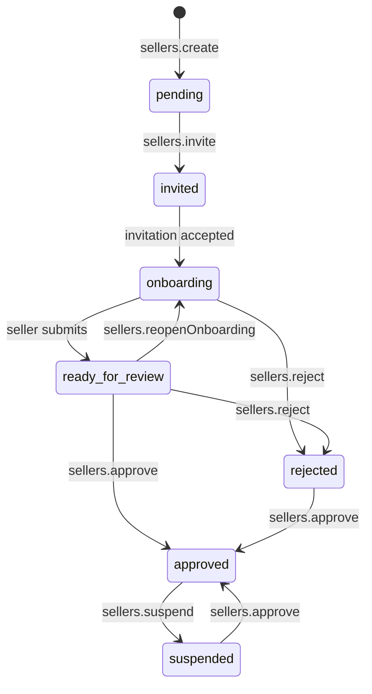
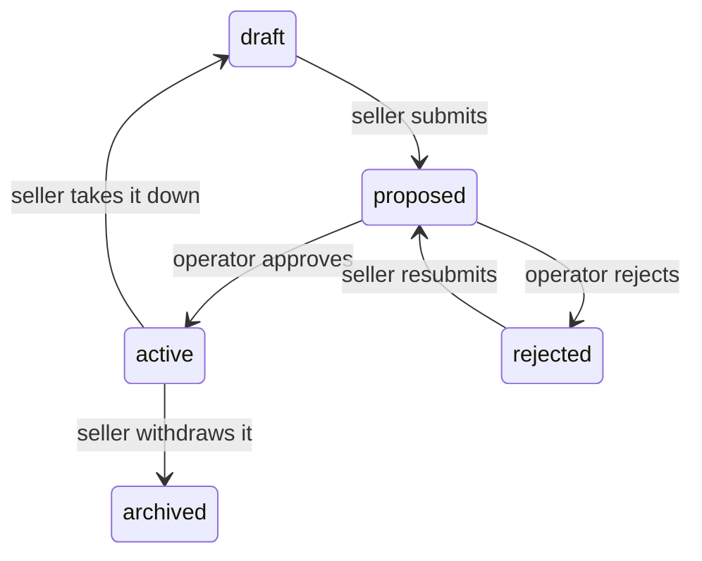
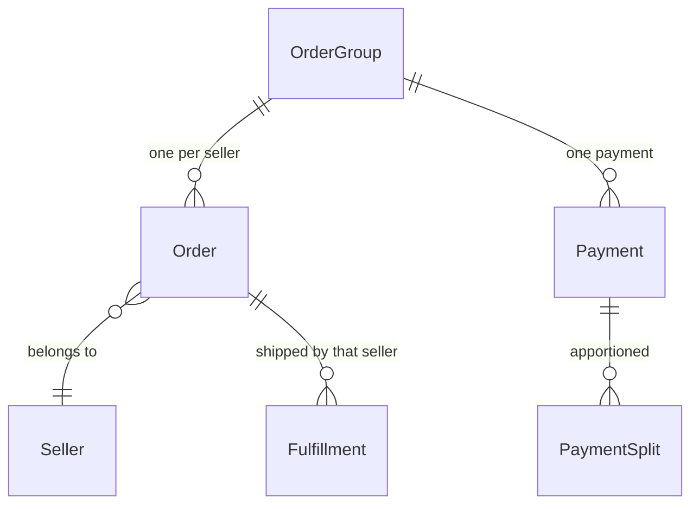

Spree fully supports multi-vendor marketplaces out of the box: sellers are first-class records, orders split per seller at completion, robust commission engine, and a payout ledger with pluggable payout providers.

So building a marketplace doesn't require weeks or months of development, it's just configuring your Spree application to admit sellers, review their submissions, and pay them. In most cases you don't need to customize Spree or write any code at all. This guide is a walkthrough of all elements that make a marketplace, and how to configure them.

## What you get

- **Sellers** — onboard sellers with an operator-configured requirements checklist, review submissions, and approve them for selling.
- **Order splitting** — a customer checks out once; completion produces per-seller orders grouped under one purchase.
- **Commissions** — the platform's cut computed per seller, with EU commission taxation handled.
- **Payouts** — a transfer and payout ledger, with Stripe Connect payouts (Express onboarding, on-fulfillment transfers) shipping in the open-source monorepo.
- **Seller operations** — sellers work through their own dedicated API surface, scoped so a seller only ever sees their own trade.

## Before you start

You need a running Spree 6 project and admin credentials. The marketplace surfaces are:

| Surface | Who uses it | Package |
|---|---|---|
| Admin dashboard | The marketplace operator | [`@spree/dashboard`](/developer/dashboard/overview) |
| Seller panel | Each seller's own team | [`@spree/seller-dashboard`](#step-7-stand-up-the-seller-panel) |
| Admin API | Operator-side integrations | [`@spree/admin-sdk`](/api-reference/admin-api/introduction) |
| Seller API | A signed-in seller only | [`@spree/seller-sdk`](/api-reference/seller-api/introduction) |

To try the flow quickly, you can seed a sample seller with an owner account, a pending invitation and a fund ledger:

<CodeGroup>

```bash Spree CLI
spree rake spree:sellers:sample_data
```

```bash Without CLI
bin/rails spree:sellers:sample_data
```

</CodeGroup>

The task refuses to run outside development and test, because it writes a known password. It signs in at `seller@example.com` / `spree123` — override with `SELLER_EMAIL`, `SELLER_PASSWORD` and `SELLER_NAME`.

## Configure the store for marketplace trading

There is no single "marketplace mode" switch. A store becomes a marketplace when it has sellers; what you configure up front is how strictly it admits them and how it pays them.

### Payout settings

Three store preferences decide how sellers get paid. All three are writable through the Admin API, and they appear in the dashboard under **Settings → Marketplace**.

| Preference | Default | What it decides |
|---|---|---|
| `preferred_payout_provider` | blank | Who moves the money. Blank means core's record-only provider: the ledger is kept correctly and the operator settles by hand. |
| `preferred_default_payouts_schedule_interval` | `monthly` | How often sellers are settled. One of `daily`, `weekly`, `biweekly`, `monthly`, `manual`. A seller can carry its own interval, which wins. |
| `preferred_default_minimum_payout_amount` | `0` | What a seller's balance must reach before a settlement is worth sending. Below it the balance carries to the next period. |

<CodeGroup>

```typescript Admin SDK
await adminClient.store.update({
  preferred_default_payouts_schedule_interval: 'weekly',
  preferred_default_minimum_payout_amount: 25,
})
```

```bash cURL
curl -X PATCH 'https://api.mystore.com/api/v3/admin/store' \
  -H 'X-Spree-API-Key: sk_xxx' \
  -H 'Content-Type: application/json' \
  -d '{
        "preferred_default_payouts_schedule_interval": "weekly",
        "preferred_default_minimum_payout_amount": 25
      }'
```

</CodeGroup>

A mistyped provider key is refused at write time rather than silently ignored, so you cannot end up with a bookkeeping-only ledger and no indication that your choice was dropped. Ask the API which providers are registered before you set one:

```bash
curl 'https://api.mystore.com/api/v3/admin/payout_providers' \
  -H 'X-Spree-API-Key: sk_xxx'
```

### Admission and review settings

Four more preferences decide who gets to trade and what they hear from you. They
sit on the same **Settings → Marketplace** screen, and are writable through the
Admin API like the payout ones.

| Preference | Default | What it decides |
|---|---|---|
| `preferred_auto_approve_sellers` | `false` | Admit a seller the moment they finish the checklist, with nobody looking at them. |
| `preferred_auto_approve_seller_products` | `false` | Put a seller's product on sale the moment they submit it. |
| `preferred_send_seller_transactional_emails` | `true` | Whether Spree emails sellers. Turn it off if you front seller communications yourself. |
| `preferred_default_commission_tax_rate` | `0` | Tax on your commission when neither the rate nor the tax provider names one. |

<CodeGroup>

```typescript Admin SDK
await adminClient.store.update({
  preferred_auto_approve_sellers: false,
  preferred_auto_approve_seller_products: false,
  preferred_send_seller_transactional_emails: true,
  preferred_default_commission_tax_rate: 0.23,
})
```

```bash cURL
curl -X PATCH 'https://api.mystore.com/api/v3/admin/store' \
  -H 'X-Spree-API-Key: sk_xxx' \
  -H 'Content-Type: application/json' \
  -d '{
        "preferred_auto_approve_sellers": false,
        "preferred_auto_approve_seller_products": false,
        "preferred_send_seller_transactional_emails": true,
        "preferred_default_commission_tax_rate": 0.23
      }'
```

</CodeGroup>

<Warning>
Turning either auto-approve preference on removes a human decision from your marketplace. `auto_approve_sellers` lets any applicant who ticks every box start trading; `auto_approve_seller_products` puts their listings on sale without review. Both are appropriate for an invite-only marketplace where you already trust the sellers, and dangerous for an open one.
</Warning>

Commission tax is stored as a fraction — `0.23` means 23%. The dashboard asks for
a percentage and converts, so you only meet the fraction through the API. See
[Tax on commission](/developer/core-concepts/commissions#tax-on-commission) for
when it applies and what overrides it.

## Define what a seller must do before trading

A seller requirement is one thing the marketplace asks of a seller before it will let them trade. The operator composes the checklist from registered **kinds** — rows are configuration, and only a genuinely new kind of check needs code.

The checklist is enforced in exactly two places: when the seller asks to be reviewed, and when the operator approves them. Nothing else consults it.

### The kinds that ship

Thirteen kinds are registered by core. Seven of them are provisioned into a new store's default checklist, in the order a seller meets them.

| `type` | What it asks | Default? | Seller submits? | Operator reviews? |
|---|---|:---:|:---:|:---:|
| `accept_terms` | Read and accept the marketplace terms | ✅ | — | — |
| `complete_profile` | Fill in the public profile shoppers see | ✅ | — | — |
| `billing_address` | The address commission invoices are addressed to | ✅ | — | — |
| `returns_address` | Where customer returns are sent | ✅ | — | — |
| `delivery_method` | At least one way to ship | ✅ | — | — |
| `package_type` | The box they ship orders in, with measurements | ✅ | — | — |
| `minimum_products` | List at least this many products | ✅ | — | — |
| `payout_account` | An account the payout provider will pay | — | — | — |
| `required_custom_fields` | Named custom fields filled in (VAT number, registration number) | — | — | — |
| `policy` | Publish a policy with this name | — | — | — |
| `attestation` | Confirm something in their own right | — | ✅ | — |
| `operator_review` | Something a person at the marketplace checks by hand | — | ✅ | ✅ |
| `document` | Upload a file for the marketplace to review | — | ✅ | ✅ |

The first ten are **computed**: Spree reads the seller's own data and answers for itself, so there is nothing for the seller to submit. The last three take a **submission** — a row recording what the seller said and when — and the bottom two wait for someone to accept it.

Four kinds may be configured more than once per store, because their meaning comes from the operator's own wording: `attestation`, `operator_review`, `document` and `policy`. Those four require a `name`. The rest are one per store.

<Note>
The generic kinds are deliberately absent from the default checklist. An attestation or a document means nothing until the operator has written what they are asking for, so Spree does not guess.
</Note>

### Build the checklist from the registry, never a hardcoded list

Always read the kinds from `types()` rather than shipping your own list — a marketplace's own registered kinds then appear for free. The endpoint returns each kind's `preference_schema`, which is what a configuration form renders from.

<CodeGroup>

```typescript Admin SDK
// What an operator can add, and the shape of each one's config form
const { data: kinds } = await adminClient.sellerRequirements.types()

// Ask every seller for a business registration
await adminClient.sellerRequirements.create({
  type: 'document',
  name: 'Business registration',
  description: 'A certificate of incorporation or equivalent.',
  required: true,
})

// Collect a VAT number through a custom field definition on Spree::Seller
await adminClient.sellerRequirements.create({
  type: 'required_custom_fields',
  custom_field_definition_ids: ['cfd_xxx'],
  required: true,
})
```

```bash cURL
curl 'https://api.mystore.com/api/v3/admin/seller_requirements/types' \
  -H 'X-Spree-API-Key: sk_xxx'

curl -X POST 'https://api.mystore.com/api/v3/admin/seller_requirements' \
  -H 'X-Spree-API-Key: sk_xxx' \
  -H 'Content-Type: application/json' \
  -d '{
        "type": "document",
        "name": "Business registration",
        "description": "A certificate of incorporation or equivalent.",
        "required": true
      }'
```

</CodeGroup>

Each kind takes its own configuration through `preferences`. `accept_terms` carries `terms_body`, `terms_url` and `terms_effective_from` — setting that date is how you ask everyone again after rewriting the terms, since anyone who accepted before it falls back to unmet. `minimum_products` carries `minimum_count`. `complete_profile` carries `require_about`, `require_logo`, `require_cover_photo` and `require_contact_email`.

Two flags govern every row regardless of kind. `required: false` makes a line advisory — it appears on the seller's checklist but does not gate approval. `active: false` retires it without deleting the submissions that answered it. Position is the order sellers work through, and the list is drag-ordered in the dashboard.

<Note>
`type` is write-once. The API strips it on update, because a saved row's submissions answered the old kind. To change a kind, delete the row and create a new one.
</Note>

**Read more:** [Onboarding requirements](/developer/core-concepts/sellers#onboarding-requirements) for the model, and [Seller Requirements](/user/settings/seller-requirements) for the operator's screen.

## Invite a seller and approve them

A seller moves through its life on the marketplace by **workflow**, never by assigning a status. Each transition is its own Admin API action because each carries its own arguments, sends its own mail and runs its own extension hooks — mass assignment would skip all three.



| Status | Meaning |
|---|---|
| `pending` | Created; nothing sent yet |
| `invited` | Someone has been asked to run it, and has not accepted |
| `onboarding` | Somebody accepted and is working through the checklist |
| `ready_for_review` | The seller says they are done; waiting on the operator |
| `approved` | Trading |
| `rejected` | An applicant turned away |
| `suspended` | A trading seller halted; reversible |
| `canceled` | Closed |

### Create and invite

Creating a seller through the workflow provisions a stock location for them, which is where their inventory lives and where customer returns land. A seller without one cannot finish onboarding, so this is not a step an operator can forget.

<CodeGroup>

```typescript Admin SDK
const seller = await adminClient.sellers.create({
  name: 'Bright Sparks',
  contact_email: 'hello@brightsparks.example',
})

// Opens the seller's own team to someone; they join when they accept
await adminClient.sellers.invite(seller.id, { email: 'owner@brightsparks.example' })
```

```bash cURL
curl -X POST 'https://api.mystore.com/api/v3/admin/sellers' \
  -H 'X-Spree-API-Key: sk_xxx' \
  -H 'Content-Type: application/json' \
  -d '{ "name": "Bright Sparks", "contact_email": "hello@brightsparks.example" }'

curl -X POST 'https://api.mystore.com/api/v3/admin/sellers/sel_xxx/invite' \
  -H 'X-Spree-API-Key: sk_xxx' \
  -H 'Content-Type: application/json' \
  -d '{ "email": "owner@brightsparks.example" }'
```

</CodeGroup>

The invited person accepts through the seller panel — the emailed link carries a prefixed ID and a token, which together are the credential. Accepting creates the membership and starts onboarding, so the seller reaches `onboarding` without the operator doing anything more.

Re-inviting is deliberate: invitations expire, and the first one goes to the wrong address often enough. What cannot be re-opened is a seller already trading or already turned away.

`role_id` names a role the seller owns; leave it out and they accept into the seller's own admin role. A seller's roles are the same permission machinery the store's back office uses, pointed at the seller — see [Staff & Roles](/developer/core-concepts/staff-roles).

### Review submissions

The two reviewed kinds (`operator_review`, `document`) leave a submission for someone to decide. Accepting one satisfies that line of the checklist; rejecting sends it back with a note the seller reads.

<CodeGroup>

```typescript Admin SDK
const { data: submissions } = await adminClient.sellers.requirementSubmissions.list('sel_xxx')

await adminClient.sellers.requirementSubmissions.accept('sel_xxx', 'selsub_xxx')

await adminClient.sellers.requirementSubmissions.reject('sel_xxx', 'selsub_xxx', {
  review_note: 'The certificate has expired — please upload a current one.',
})

// Excuse this seller from something the store asks of everyone
await adminClient.sellers.requirementSubmissions.waive('sel_xxx', {
  requirement_id: 'selreq_xxx',
  review_note: 'Verified against Companies House by hand.',
})
```

```bash cURL
curl -X PATCH 'https://api.mystore.com/api/v3/admin/sellers/sel_xxx/requirement_submissions/selsub_xxx/reject' \
  -H 'X-Spree-API-Key: sk_xxx' \
  -H 'Content-Type: application/json' \
  -d '{ "review_note": "The certificate has expired — please upload a current one." }'
```

</CodeGroup>

A submission is `pending`, `accepted`, `rejected` or `waived`. A waiver is the operator recording that they dealt with this outside the marketplace — it reads as met without pretending the seller did it. Submissions accumulate rather than overwrite: the latest row for a (seller, requirement) pair decides the standing, and the ones before it are the record of how you got there.

Uploaded documents are stored privately and served only through the admin and seller branches. They are business registrations and identity documents, and Spree identifies them from their bytes rather than trusting the uploaded filename — a script named `certificate.pdf` is refused.

### Approve, suspend, reject

<CodeGroup>

```typescript Admin SDK
// Where this seller stands against the checklist
const onboarding = await adminClient.sellers.onboarding('sel_xxx')
// → { status, progress: { done, total }, requirements: [...] }

await adminClient.sellers.approve('sel_xxx')

// Admit them anyway, despite an unfinished checklist
await adminClient.sellers.approve('sel_xxx', { override_requirements: true })

// Send them back to fix something
await adminClient.sellers.reopenOnboarding('sel_xxx', {
  note: 'Your returns address is a PO box — we need a street address.',
})

await adminClient.sellers.suspend('sel_xxx', { reason: 'Unresolved delivery complaints' })
await adminClient.sellers.reject('sel_xxx', { reason: 'Outside our categories' })
```

```bash cURL
curl -X PATCH 'https://api.mystore.com/api/v3/admin/sellers/sel_xxx/approve' \
  -H 'X-Spree-API-Key: sk_xxx' \
  -H 'Content-Type: application/json' \
  -d '{ "override_requirements": true }'
```

</CodeGroup>

Approval is refused while a required requirement is unmet, unless `override_requirements` says the operator means it. The override is recorded on the `seller.approved` event along with what was outstanding — the operator can step over the checklist, but not without saying so.

**Suspend and reject are not the same thing.** Reject turns away an applicant who never traded; it refuses an approved seller outright. Suspend halts a trading seller: their catalog stops selling, their record and history stay, and `approve` is the way back. A suspended seller being reinstated is not re-measured against the checklist, because they were admitted once already.

A seller can also take themselves off sale without any operator involvement, by setting `holiday_mode_until`. The catalog stays visible; what stops is selling.

**Read more:** [The seller lifecycle](/developer/core-concepts/sellers#the-seller-lifecycle), [Onboarding](/user/sellers/onboarding), [Managing sellers](/user/sellers/managing-sellers).

## Review what sellers list

Products belong to sellers through `seller_id` on `Spree::Product`. A product with no seller is the marketplace's own.

A marketplace adds two statuses to the product lifecycle that a single-merchant store never sees: `proposed` and `rejected`. A seller never assigns a status — they ask, and the marketplace decides.



| Status | Meaning | Storefront |
|---|---|:---:|
| `draft` | The seller is still working on it | Hidden |
| `proposed` | Submitted, waiting on the marketplace | Hidden |
| `rejected` | Sent back with a reason, awaiting changes | Hidden |
| `active` | Approved and on sale | **Visible** |
| `archived` | Withdrawn | Hidden |

A seller can always take their own listing down — that is not a review decision. Putting one up is.

### How it relates to the submission record

The product's `status` is the operational truth; a `Spree::ProductSubmission` row is the record of how it got there — who asked, who decided, when, and what they told the seller. Its statuses are `pending`, `approved`, `rejected` and `withdrawn`.

Rows accumulate: a seller sent back three times leaves three rows, and the latest one is live. Taking a listing back to `draft` before anyone ruled on it closes the open row as `withdrawn`, so a `pending` row always means the marketplace still owes an answer rather than "abandoned".

<Warning>
A rejection reason belongs on the submission, never on the product. A seller can write their own product's `metadata`, so a note kept there is erased the next time they save. Send it as `reason` to the reject endpoint and Spree puts it where the seller cannot overwrite it.
</Warning>

### Both sides of the review

<CodeGroup>

```typescript Seller SDK
// The seller asks for their listing to go on sale
await sellerClient.products.submit(productId)

// Or a selection of them
await sellerClient.products.bulkSubmit({ ids: [id1, id2] })
```

```typescript Admin SDK
// The operator decides
await adminClient.products.approve('prod_xxx')
await adminClient.products.reject('prod_xxx', {
  reason: 'The lead photo has a competitor watermark.',
})
```

```bash cURL
curl -X PATCH 'https://api.mystore.com/api/v3/admin/products/prod_xxx/reject' \
  -H 'X-Spree-API-Key: sk_xxx' \
  -H 'Content-Type: application/json' \
  -d '{ "reason": "The lead photo has a competitor watermark." }'
```

</CodeGroup>

Filter the review queue with a Ransack query on status: `adminClient.products.list({ status_eq: 'proposed' })`.

With `preferred_auto_approve_seller_products` on, submitting chains straight into approval. The submission row still gets written and carries an `auto_approved` marker, so a blank reviewer reads as "this store does not review listings" rather than as a lost name.

There is no bulk route onto `active` for sellers, and that is deliberate: reaching it is the operator's decision on one listing at a time.

**Read more:** [Seller submissions](/developer/core-concepts/products#seller-submissions), [Seller products](/user/sellers/products).

## Set what the marketplace charges

Commission is what the marketplace takes from a sale. You configure **rates**; Spree records what was actually charged as immutable **commission lines**, frozen when the order was placed.

### Rates and precedence

**The list is the precedence.** Rates are walked top-down and the first whose targeting matches the sale wins. A rate with no rules matches every sale, so anything below it is unreachable — the marketplace default belongs at the bottom of the list. A new rate is placed at the top by default, ahead of anything more general already there.

<CodeGroup>

```typescript Admin SDK
// Discover the rule kinds this marketplace has registered
const { data: ruleTypes } = await adminClient.commissionRates.ruleTypes()

// 8% on one seller's electronics, with a floor and a cap per currency
await adminClient.commissionRates.create({
  name: 'Electronics — Bright Sparks',
  kind: 'percentage',
  value: 8,
  rules: [
    { type: 'seller_rule', preferences: { seller_ids: ['sel_xxx'] } },
  ],
})

// The marketplace default, at the bottom, matching everything
await adminClient.commissionRates.create({
  name: 'Standard commission',
  kind: 'percentage',
  value: 15,
  position: 99,
})
```

```bash cURL
curl -X POST 'https://api.mystore.com/api/v3/admin/commission_rates' \
  -H 'X-Spree-API-Key: sk_xxx' \
  -H 'Content-Type: application/json' \
  -d '{ "name": "Standard commission", "kind": "percentage", "value": 15, "position": 99 }'
```

</CodeGroup>

A rate is either `percentage` (a share of the sale) or `fixed` (a flat fee). A flat fee states its `amounts` per currency — a rate is skipped for a currency it names no amount in, so that sale falls through to the next matching rate rather than being charged a converted figure nobody set.

Rules ride the regular payload as `rules: [...]`, and the server replaces the rate's rules with exactly what it is sent. Every rule must hold for the rate to apply, and a rule naming several records means any of them — so "(Cameras OR Audio) AND that seller" is a category rule holding two ids beside a seller rule holding one.

### Lines are read-only

<CodeGroup>

```typescript Admin SDK
const { data: lines } = await adminClient.commissionLines.list({ seller_id_eq: 'sel_xxx' })
```

```bash cURL
curl 'https://api.mystore.com/api/v3/admin/commission_lines?q[seller_id_eq]=sel_xxx' \
  -H 'X-Spree-API-Key: sk_xxx'
```

</CodeGroup>

There is no write path. Correcting a charge is a reversal, not an edit.

In the EU the fee is a separate supply from the sale, so it is taxed separately — that is what `preferred_default_commission_tax_rate` from step 1 is for, and a rate or a tax provider can name its own.

**Read more:** [Commissions](/developer/core-concepts/commissions) covers the four rule types, gross-versus-net, how delivery is treated, currency floors and caps, and commission tax in full. [Commission rates](/user/sellers/commission-rates) is the operator's screen.

## Understand what a split checkout produces

This is the part that makes a marketplace different from a shop, and a storefront has to handle it.

A customer fills one basket, enters one address, and pays once. But each seller needs their own order — they fulfil separately, get paid separately, and must never see each other's business. So at completion, a checkout spanning several sellers becomes an **order group**: one container holding one order per seller.



| Level | Owns |
|---|---|
| **Order group** | The customer, the addresses, the payment, the combined totals |
| **Order** | One seller's items, fulfillments and money lines |

The single payment is apportioned across the child orders as **payment splits**, so each seller's share of one charge is recorded exactly — which is what makes per-seller refunds and settlement possible later.

Two details worth knowing:

- **Group totals are added up, not divided.** The group's total is the sum of its children, so it always agrees with them.
- **Delivery and order-level fees are shared out by item value**, so a seller whose goods made up most of the basket carries most of the delivery charge.

<Warning>
**A storefront must handle the possibility of an order group.** Completing a cart yields either one order or a group, depending on how many sellers the basket reached. A customer's order history should show the group as one purchase rather than confronting them with three orders they don't remember placing separately.
</Warning>

A single-seller checkout produces no group at all — just the order, exactly as a normal store does. Nothing about a marketplace changes the shape of a single-seller sale.

Operators can read groups back; there is no write path, because everything an operator acts on lives on the orders inside them.

<CodeGroup>

```typescript Admin SDK
const { data: groups } = await adminClient.orderGroups.list()
const group = await adminClient.orderGroups.get('ogrp_xxx', { expand: ['orders'] })
```

```bash cURL
curl 'https://api.mystore.com/api/v3/admin/order_groups/ogrp_xxx?expand=orders' \
  -H 'X-Spree-API-Key: sk_xxx'
```

</CodeGroup>

**Read more:** [One checkout, several sellers](/developer/core-concepts/sellers#one-checkout-several-sellers), [Orders](/developer/core-concepts/orders).

## Pay your sellers

The fund ledger has two levels, and both are written by fulfilment and by the scheduled sweep rather than by a caller.

| Level | Model | Written when |
|---|---|---|
| **Transfer** | `Spree::SellerTransfer` | One order earned one seller something — credited as the goods went out |
| **Payout** | `Spree::SellerPayout` | A settlement was swept up and sent |

A seller's balance is derived from the two rather than stored, per currency, because nothing is ever converted: a seller trading in two currencies accrues two balances and is paid twice. Only settlements known to have completed count against the balance, so one whose outcome was never established still reads as owed — the honest answer while nobody knows, and it cannot be paid twice by mistake.

### The sweep jobs

Two recurring jobs keep the ledger moving. A project created with
`create-spree-app` schedules both already:

```yaml server/config/recurring.yml
production:
  sweep_due_seller_payouts:
    class: Spree::SellerPayouts::SweepDueJob
    schedule: at 3am every day
  execute_pending_seller_transfers:
    class: Spree::SellerTransfers::ExecutePendingDueJob
    schedule: every hour at minute 27
```

<Warning>
On an existing project, or one running a scheduler of its own, confirm both are
scheduled. A marketplace that never runs the sweep never pays a seller, and
nothing reports the omission.
</Warning>

| Job | Run it | Does |
|---|---|---|
| `Spree::SellerPayouts::SweepDueJob` | daily | settles every seller who is due |
| `Spree::SellerTransfers::ExecutePendingDueJob` | hourly | retries earnings a provider refused — usually a passing thing |

### Settling by hand

A seller on the `manual` interval is skipped by the sweep. That is what the interval means: the operator decides when. The same endpoint also pays any seller early.

<CodeGroup>

```typescript Admin SDK
// Where the seller stands, one row per currency
const { data: balances } = await adminClient.sellers.balances('sel_xxx')

// Settle them now, whatever their schedule says — 422 if there is nothing owed
await adminClient.sellers.settle('sel_xxx')

// The built-in provider: record that the bank transfer went out
await adminClient.sellerPayouts.complete('vpo_xxx', { reference: 'TRN-2026-0912-0042' })

// Read the ledger
const { data: transfers } = await adminClient.sellerTransfers.list({ seller_id_eq: 'sel_xxx' })
const { data: payouts } = await adminClient.sellerPayouts.list({ seller_id_eq: 'sel_xxx' })
```

```bash cURL
curl 'https://api.mystore.com/api/v3/admin/sellers/sel_xxx/balances' \
  -H 'X-Spree-API-Key: sk_xxx'

curl -X POST 'https://api.mystore.com/api/v3/admin/sellers/sel_xxx/payouts' \
  -H 'X-Spree-API-Key: sk_xxx'
```

</CodeGroup>

### Payout providers

A provider is a stateless class registered in `Spree.payout_providers` and chosen per store with `preferred_payout_provider`.

| Provider | Moves money? | Completion |
|---|---|---|
| `Spree::PayoutProvider::System` (default) | No — keeps the books | The operator marks each payout paid, with the bank reference |
| Stripe Connect (`spree_stripe`) | Yes — transfers each earning to the seller's connected account as goods ship | A Stripe webhook, when the money lands |

Providers that need a seller to hold an account with them answer `requires_payout_account?` and implement `onboarding_url` — which is what the `payout_account` requirement from step 2 drives. Those links are short-lived and single-use, so the seller panel asks for a fresh one at the moment of clicking rather than minting one while drawing the checklist.

A connected provider confirms settlements through `POST /api/v3/webhooks/payouts/:payment_method_id` — separate from the payment webhook, because providers scope seller-account events to their own subscription and signing secret.

**Read more:** [Payouts](/developer/core-concepts/sellers#payouts) for the ledger, [Stripe Connect for marketplaces](/integrations/payments/stripe-connect) for the shipped provider, [Seller payouts](/developer/providers/payouts) to write your own, and [Payouts settings](/user/settings/marketplace) for the operator's screen.

<Note>
Refund clawbacks and netting across settlements, reconciliation, KYC operations and seller tax reporting (DAC7) are Spree Enterprise.
</Note>

## Stand up the seller panel

Sellers get their own application — never access to the marketplace's dashboard. It is a separate React SPA against a separate API, shipped as `@spree/seller-dashboard`.

It shares its foundations with the admin dashboard: components from `@spree/dashboard-ui`, framework pieces (registries, providers, hooks) from `@spree/dashboard-core`. The two panels therefore stay visually and behaviourally consistent, and anything you learn customizing one applies to the other.

### Scaffold and run it

The panel ships as a shell you render from a thin host app that you own. Two ways to get one:

<CodeGroup>

```bash New project
npx create-spree-app my-marketplace
# Both panels are scaffolded automatically — no prompt to answer
```

```bash Existing project
npx spree add seller-dashboard
```

</CodeGroup>

A new project always gets both admin SPAs, so the starter's Docker image bakes both in; a store that never invites a seller simply leaves `/sellers` unvisited. Either way the host app lands at `apps/seller-dashboard/` with its own `package.json`, Vite config and a `src/plugins.ts` for your customizations. Then:

```bash
cd apps/seller-dashboard && pnpm dev
```

It serves on port **5174** (the admin dashboard is on 5173, so both run side by side).

`.env.local` holds one setting — the Rails server the dev proxy forwards `/api` to:

```bash apps/seller-dashboard/.env.local
VITE_API_PROXY_TARGET=http://localhost:3000
```

<Warning>
Do **not** set `VITE_SPREE_API_URL` in development. It switches the SDK to absolute cross-origin URLs and bypasses the proxy, which breaks the seller refresh-token cookie: the cookie rides under `SameSite=Lax`, and that only works while the panel is same-origin with the API.
</Warning>

### What sellers get out of the box

| Area | Pages |
|---|---|
| Onboarding | The checklist, submissions, payout-account link |
| Products | List, create, edit, submit for review |
| Orders | List, detail, fulfillments, deliveries, labels, returns, exchanges, claims |
| Money | Earnings, payouts |
| Profile | Public profile, tax identifiers |
| Settings | Team, delivery methods, package types, stock locations, policies |
| Auth | Login, forgot/reset password, invitation acceptance |

Sellers cannot see other sellers, the marketplace's own catalog, or anything belonging to the store at large.

### Deploying it

By default the seller panel, same as dashboard is build with Spree docker image and is server via `/sellers` path. You can also deploy it as a static bundle on a CDN or static host. The entire process is baked into the default `Dockerfile` which you get when you scaffold a new project with `create-spree-app`. The `spree build --production` command builds both panels and bakes them into the image, so you can run it as-is. This also automatically resolves CORS issues, since the panel is served from the same origin as the API. 

### Customizing it

`src/plugins.ts` in your host app is where customizations are registered — the same `defineDashboardPlugin` API the admin dashboard uses, because both panels sit on `@spree/dashboard-core`.

```tsx apps/seller-dashboard/src/plugins.ts
import { defineDashboardPlugin } from '@spree/seller-dashboard'
import { PayoutsPage } from './pages/payouts'

defineDashboardPlugin({
  nav: {
    add: [{ key: 'payouts', label: 'Payouts', path: '/payouts', position: 300 }],
    remove: ['team'],
  },
  slots: {
    'seller.team.after': [{ id: 'audit', component: TeamAuditCard }],
  },
})
```

Import everything from `@spree/seller-dashboard` — it re-exports both the framework and the design system, so you never have to work out which package an export lives in.

| What you want | How |
|---|---|
| Add or remove a nav entry | `nav.add` / `nav.remove` in `defineDashboardPlugin` |
| Inject a widget into a built-in page | A [slot](/developer/dashboard/customization/slots) |
| Add a page | A [route](/developer/dashboard/customization/routes) plus a nav entry |
| Add a table column | The [table registry](/developer/dashboard/customization/tables) |
| Change wording | [Translations](/developer/dashboard/customization/translations) merged with `i18n.addResourceBundle` |
| Install a third-party plugin | `npm add <plugin>` and restart — the Vite plugin picks it up from your dependencies |

The seller panel currently exposes just two slots, both on its team page: `seller.team.actions` and `seller.team.after`. (`seller.form_main` and `seller.form_sidebar` sound related but belong to the *admin* dashboard's seller detail page — they are for the operator's view of a seller, not the seller's own.) See the [slots catalog](/developer/dashboard/slots-catalog) for their contexts. To put a widget anywhere else in the panel, add a route rather than looking for a slot that is not there yet.

<Note>
**White-labelling is theming and copy, not a branding config object.** There is no logo or brand-name setting to fill in. You restyle by owning the Tailwind layer in your host app, and you re-word by overriding translation keys. Both are real customization paths — there is simply no shortcut that skips them.
</Note>

<Warning>
**`@spree/seller-dashboard` ships English only.** The admin dashboard ships several locales; the seller panel ships `en.json` and nothing else. A marketplace serving sellers in another language supplies that locale itself, through `i18n.addResourceBundle` in the host app.
</Warning>

**Read more:** [Dashboard overview](/developer/dashboard/overview) for the package split and both customization paths, [Dashboard customization](/developer/dashboard/customization/quickstart) for the registries in detail, and [Plugins](/developer/dashboard/plugins/overview) for shipping a redistributable one.

## Build against the Seller API

If you are not using the shipped panel — a native seller app, an ERP integration, a bespoke portal — the Seller API is the surface, and `@spree/seller-sdk` is the client.

**Every request is scoped to the seller making it. No endpoint takes a seller ID.** That is the security property worth relying on: a seller cannot ask for another seller's data, because there is nowhere in the request to name one.

```bash
npm install @spree/seller-sdk
```

```typescript
import { createSellerClient } from '@spree/seller-sdk'

const sellerClient = createSellerClient({ baseUrl: 'https://marketplace.example.com' })

const tokens = await sellerClient.auth.login({
  email: 'owner@brightsparks.example',
  password: '…',
})
sellerClient.setToken(tokens.token)

// A user who runs several sellers picks which one they are acting as
sellerClient.setSeller('sel_xxx')
```

Authentication is JWT only. **There is deliberately no secret-key equivalent**: a key that acts as a seller without a seller signing in is exactly what the Seller API's design exists to prevent. Sign-in fails for a store staff member who runs no seller, even though staff share the same user class.

The chosen seller travels as `X-Spree-Seller-Id`. The store is derived from the seller server-side and never sent alongside, so no header a client can set widens what it reaches.

### What the client covers

| Namespace | Notable methods |
|---|---|
| `auth` | `login`, `refresh`, `logout`, `providers`, `lookupInvitation`, `acceptInvitation`, `requestPasswordReset` |
| `onboarding` | `get`, `submitForReview`, `payoutAccount` |
| `requirementSubmissions` | `create` — create only; the seller submits again rather than editing |
| `profile`, `taxIdentifiers`, `policies` | The seller's own identity and legal documents |
| `team`, `invitations` | The seller hires and manages their own staff |
| `products` | Full CRUD plus `submit`, `draft`, `archive` and their bulk equivalents |
| `orders` | List and detail, plus `cancel`, `address`, nested `fulfillments`, `deliveries`, `labels`, `returns`, `exchanges`, `claims`, `notes` |
| `balances`, `transfers`, `payouts` | Read-only — written by fulfilment and the sweep, never by the seller |
| `deliveryMethods`, `packageTypes`, `stockLocations` | How and from where they ship |
| `imports`, `exports`, `directUploads` | Bulk listing by CSV, and CSV of what they sold |
| `productTypes`, `deliveryProfiles`, `deliveryZones`, `returnReasons`, `claimReasons`, `trackingCarriers`, `countries` | Read-only marketplace vocabulary a seller picks from |

Two asymmetries are worth noticing, because both are deliberate:

- **A seller cannot set a product's status.** They call `submit`, and the marketplace decides. Bulk moves exist only for the transitions a seller may make alone.
- **A seller cannot mark an order delivered.** That a parcel arrived is the buyer's word, not the sender's, so confirming receipt stays with the operator and the carrier feed.

What a seller's staff may do within all this is governed by [roles the seller owns](/developer/core-concepts/staff-roles) — the same permission system as the back office, with a narrower set of keys, so a seller role can never reach store settings.

**Read more:** [Seller API introduction](/api-reference/seller-api/introduction), [Seller API authentication](/api-reference/seller-api/authentication), [Seller API errors](/api-reference/seller-api/errors).

## Related

- [Sellers](/developer/core-concepts/sellers) — the full model: lifecycle, ownership, order splitting, ledger
- [Commissions](/developer/core-concepts/commissions) — rates, rules, precedence, currency handling, commission tax
- [Products](/developer/core-concepts/products#seller-submissions) — the listing review flow in detail
- [Orders](/developer/core-concepts/orders) — orders and their statuses
- [Customers](/developer/core-concepts/customers) — who buys, across every seller
- [Delivery setup](/developer/core-concepts/delivery-setup#on-a-marketplace) — how a seller's goods ship and what they ship in
- [Staff & Roles](/developer/core-concepts/staff-roles) — how seller teams are governed
- [Seller payouts](/developer/providers/payouts) — writing your own payout provider
- [Stripe Connect](/integrations/payments/stripe-connect) — the shipped payout provider
- [Seller API](/api-reference/seller-api/introduction) — the full endpoint reference
- [Dashboard overview](/developer/dashboard/overview) — customizing either panel
- [Sellers (operator guide)](/user/sellers/sellers) — running a marketplace from the dashboard
- [Seller requirements (operator guide)](/user/settings/seller-requirements) — building the checklist
- [Payouts settings (operator guide)](/user/settings/marketplace) — who pays sellers and how often
