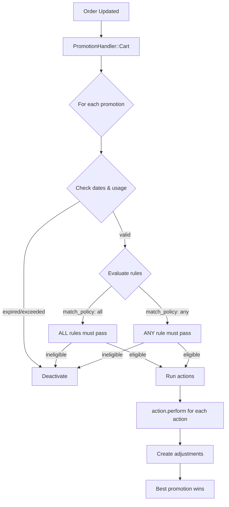

## Overview

Spree's promotion system is built around two extension points: **Rules** (eligibility conditions) and **Actions** (what happens when a promotion applies). While Spree ships with a comprehensive set of [built-in rules and actions](/developer/core-concepts/promotions#rules), you can create custom ones for business-specific logic.

This guide covers:
- Creating a custom promotion rule with admin UI
- Creating a custom promotion action with a calculator
- Understanding the `eligible?`, `actionable?`, and `perform` contracts

Before starting, make sure you understand [how promotions work in Spree](/developer/core-concepts/promotions).

## Custom Promotion Rules

Rules determine whether a promotion is eligible for a given order. Each rule implements `eligible?` which returns `true` or `false`.

### Step 1: Create the Rule Class

Create a new class inheriting from `Spree::PromotionRule`:

```ruby app/models/spree/promotion/rules/minimum_quantity.rb
module Spree
  class Promotion
    module Rules
      class MinimumQuantity < Spree::PromotionRule
        preference :quantity, :integer, default: 5

        def applicable?(promotable)
          promotable.is_a?(Spree::Order)
        end

        def eligible?(order, options = {})
          total_quantity = order.line_items.sum(&:quantity)

          if total_quantity >= preferred_quantity
            true
          else
            eligibility_errors.add(
              :base,
              "Order must contain at least #{preferred_quantity} items"
            )
            false
          end
        end
      end
    end
  end
end
```

#### Key Methods to Implement

| Method | Required | Description |
|--------|----------|-------------|
| `applicable?(promotable)` | Yes | Returns `true` if this rule type can evaluate the promotable (usually `promotable.is_a?(Spree::Order)`) |
| `eligible?(promotable, options = {})` | Yes | Returns `true` if the promotable meets this rule's conditions. Add messages to `eligibility_errors` to explain why not. |
| `actionable?(line_item)` | No | Returns `true` if a specific line item should receive the promotion's action. Defaults to `true`. Override this for rules that target specific items (like product or category rules). |

The `options` hash passed to `eligible?` can include `:user`, `:email`, and other context from the checkout flow.

#### Using Preferences

Rules use Spree's preference system for configuration. Each preference creates getter/setter methods automatically:

```ruby
preference :amount, :decimal, default: 100.00
preference :operator, :string, default: 'gte'
preference :category_ids, :array, default: []

# These create:
# preferred_amount / preferred_amount=
# preferred_operator / preferred_operator=
# preferred_category_ids / preferred_category_ids=
```

Available types: `:string`, `:integer`, `:decimal`, `:boolean`, `:array`.

### Step 2: Register the Rule

Add your rule to the promotion configuration so it appears in the admin panel:

```ruby config/initializers/spree.rb
Rails.application.config.after_initialize do
  Spree.promotions.rules << Spree::Promotion::Rules::MinimumQuantity
end
```

### Step 3: Create the Admin Partial

Create a form partial so admins can configure the rule's preferences. The partial name must match the rule class name in underscore format:

```erb app/views/spree/admin/promotions/rules/_minimum_quantity.html.erb
<div class="row mb-3">
  <%= f.spree_number_field :preferred_quantity, label: Spree.t(:minimum_quantity) %>
</div>
```

### Step 4: Add Translations

```yaml config/locales/en.yml
en:
  spree:
    minimum_quantity: Minimum Quantity
    promotion_rule_types:
      minimum_quantity:
        name: Minimum Quantity
        description: Order must contain at least X items
```

### Step 5: Restart and Test

After restarting your application, the new rule will be available in **Admin > Promotions** when adding rules to a promotion.

### Example: Rule with `actionable?`

When your rule targets specific line items (not the whole order), implement `actionable?` so that actions like `CreateItemAdjustments` only discount matching items:

```ruby app/models/spree/promotion/rules/brand.rb
module Spree
  class Promotion
    module Rules
      class Brand < Spree::PromotionRule
        preference :brand_names, :array, default: []

        def applicable?(promotable)
          promotable.is_a?(Spree::Order)
        end

        def eligible?(order, options = {})
          order.line_items.any? { |li| matches_brand?(li) }
        end

        # Only discount line items from matching brands
        def actionable?(line_item)
          matches_brand?(line_item)
        end

        private

        def matches_brand?(line_item)
          brand = line_item.product.get_metafield('details.brand')&.value
          preferred_brand_names.include?(brand)
        end
      end
    end
  end
end
```

## Custom Promotion Actions

Actions define what happens when a promotion is applied. Most actions create [adjustments](/developer/core-concepts/adjustments) on orders or line items.

### Step 1: Create the Action Class

#### Discount Action (with Calculator)

For actions that create monetary adjustments, include `Spree::CalculatedAdjustments` and `Spree::AdjustmentSource`:

```ruby app/models/spree/promotion/actions/tiered_discount.rb
module Spree
  class Promotion
    module Actions
      class TieredDiscount < Spree::PromotionAction
        include Spree::CalculatedAdjustments
        include Spree::AdjustmentSource

        before_validation -> { self.calculator ||= Calculator::FlatRate.new }

        def perform(options = {})
          order = options[:order]
          return false unless order.present?

          create_unique_adjustment(order, order)
        end

        def compute_amount(order)
          # Tiered discount: $10 off orders over $50, $25 off orders over $100
          discount = case order.item_total
                     when 100..Float::INFINITY then 25
                     when 50..99.99 then 10
                     else 0
                     end

          # Must return negative amount for discounts
          # Cap at order total to prevent negative orders
          [discount, order.item_total].min * -1
        end
      end
    end
  end
end
```

#### Non-Discount Action

For actions that don't create adjustments (e.g., awarding points, sending notifications):

```ruby app/models/spree/promotion/actions/add_loyalty_points.rb
module Spree
  class Promotion
    module Actions
      class AddLoyaltyPoints < Spree::PromotionAction
        preference :points, :integer, default: 100

        def perform(options = {})
          order = options[:order]
          return false unless order.user.present?

          order.user.add_loyalty_points(preferred_points, source: promotion)
          true
        end
      end
    end
  end
end
```

#### Key Methods to Implement

| Method | Required | Description |
|--------|----------|-------------|
| `perform(options = {})` | Yes | Called when the promotion is activated. `options` includes `:order` and `:promotion`. Return `true` if the action was applied. |
| `compute_amount(adjustable)` | For discount actions | Return the adjustment amount (negative for discounts). Cap at the adjustable's total to prevent negative amounts. |
| `revert(options = {})` | No | Called when a promotion is deactivated. Use to undo side effects (e.g., remove added line items). |

#### Available Helper Methods

When you include `Spree::AdjustmentSource`, you get:

```ruby
# Create a single adjustment (e.g., on the order)
create_unique_adjustment(order, adjustable)

# Create adjustments on multiple items (e.g., all line items)
create_unique_adjustments(order, order.line_items)

# With a filter block (e.g., only actionable line items)
create_unique_adjustments(order, order.line_items) do |line_item|
  promotion.line_item_actionable?(order, line_item)
end
```

When you include `Spree::CalculatedAdjustments`, you get:

```ruby
# Delegate to the calculator
compute(adjustable)  # calls calculator.compute(adjustable)

# Set calculator by class name
self.calculator_type = 'Spree::Calculator::FlatRate'

# List available calculators for this action type
self.class.calculators
```

### Step 2: Register the Action

```ruby config/initializers/spree.rb
Rails.application.config.after_initialize do
  Spree.promotions.actions << Spree::Promotion::Actions::TieredDiscount
end
```

### Step 3: Add Translations

```yaml config/locales/en.yml
en:
  spree:
    promotion_action_types:
      tiered_discount:
        name: Tiered Discount
        description: Different discount amounts based on order total tiers
```

### Step 4: Restart and Test

After restarting, the new action will be available in **Admin > Promotions** when adding actions to a promotion.

## How Rules and Actions Work Together

Understanding how Spree evaluates promotions helps you build better custom rules and actions:



**Key points:**
- `match_policy: 'all'` means every rule must return `eligible? == true`
- `match_policy: 'any'` means at least one rule must return `eligible? == true`
- For item-level actions (`CreateItemAdjustments`), `actionable?(line_item)` on each rule filters which line items get the discount
- When multiple promotions compete, Spree picks the best one (largest discount) and marks others as ineligible

## Testing Custom Rules and Actions

```ruby spec/models/spree/promotion/rules/minimum_quantity_spec.rb
require 'spec_helper'

RSpec.describe Spree::Promotion::Rules::MinimumQuantity do
  let(:rule) { described_class.new(preferred_quantity: 3) }
  let(:order) { create(:order_with_line_items, line_items_count: 1) }

  describe '#eligible?' do
    context 'when order has enough items' do
      before { order.line_items.first.update(quantity: 3) }

      it { expect(rule.eligible?(order)).to be true }
    end

    context 'when order does not have enough items' do
      it { expect(rule.eligible?(order)).to be false }

      it 'sets eligibility error' do
        rule.eligible?(order)
        expect(rule.eligibility_errors.full_messages).to include(
          /at least 3 items/
        )
      end
    end
  end
end
```

```ruby spec/models/spree/promotion/actions/tiered_discount_spec.rb
require 'spec_helper'

RSpec.describe Spree::Promotion::Actions::TieredDiscount do
  let(:promotion) { create(:promotion) }
  let(:action) { described_class.create!(promotion: promotion) }

  describe '#compute_amount' do
    it 'returns -10 for orders over $50' do
      order = build(:order, item_total: 75)
      expect(action.compute_amount(order)).to eq(-10)
    end

    it 'returns -25 for orders over $100' do
      order = build(:order, item_total: 150)
      expect(action.compute_amount(order)).to eq(-25)
    end

    it 'returns 0 for orders under $50' do
      order = build(:order, item_total: 30)
      expect(action.compute_amount(order)).to eq(0)
    end
  end
end
```

## Related Documentation

- [Promotions](/developer/core-concepts/promotions) - Promotion architecture and built-in rules/actions
- [Calculators](/developer/core-concepts/calculators) - Available calculator types for promotion actions
- [Adjustments](/developer/core-concepts/adjustments) - How adjustments work on orders and line items
- [Events](/developer/core-concepts/events) - Subscribe to promotion events
