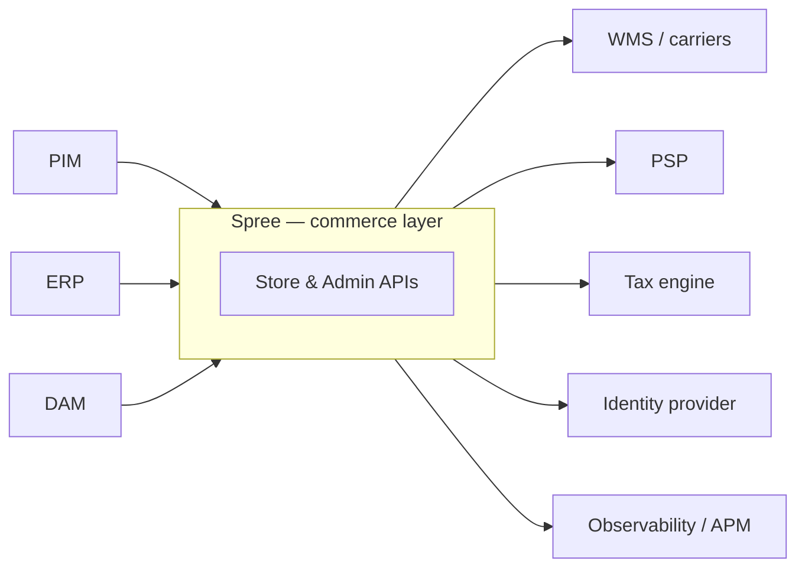

Most mid-size and enterprise merchants do not start from zero. They run an ERP that owns stock, a PIM that owns product data, a DAM that owns media, a warehouse system that ships boxes, and a payment provider with years of history. Replacing all of that to adopt a commerce platform is not a migration — it is a rebuild nobody asked for.

Spree takes the opposite position: **it is the system of record for what the shopper sees, and your existing systems stay the system of record for what is true.** Content, prices and stock sync in and render from Spree's own copy; live calls to your systems happen only at decision moments — pricing a line, adding to cart, taking a stock hold, completing an order.

## The provider contracts

Every connection point is a documented contract with a default implementation that uses Spree's own data — a store that connects nothing works exactly as before.

| Your system | Spree contract | Guide |
|---|---|---|
| ERP (stock levels) | Inventory provider | [Connect your ERP](/developer/providers/erp) |
| PIM (product data, prices) | Pricing provider + data feeds | [Connect your PIM](/developer/providers/pim) |
| DAM (media) | Externally hosted media | [Product media & DAM](/developer/providers/dam) |
| WMS / 3PL / carriers | Fulfillment provider | [Shipping & WMS](/developer/providers/fulfillment) |
| Carrier rate shopping | Delivery rate provider | [Custom delivery rates](/developer/how-to/custom-delivery-rate-provider) |
| PSP | Payment gateway | [Custom payment method](/developer/how-to/custom-payment-method) |
| Tax engine | Tax provider | [Avalara](/integrations/tax/avalara) |
| Search | Search provider | [Custom search provider](/developer/how-to/custom-search-provider) |
| Identity provider (SSO) | OpenID Connect | [Identity & SSO](/developer/providers/sso) |
| APM / observability | OpenTelemetry | [Observability](/developer/providers/observability) |

## Credentials live in one place

Provider credentials are managed through Spree integrations — one admin surface for connecting external services, with secrets stored as masked preferences and connections verified before activation. Provider gems ship an integration class; there are no per-provider credential screens or environment-variable contracts for per-store services.
