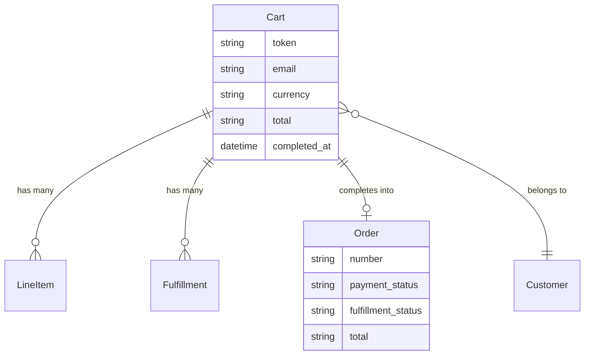

## Overview

A cart is everything that happens before a purchase is final: adding items, entering an address, choosing delivery, and paying. Completing a cart creates an [Order](/v6/developer/core-concepts/orders) — a separate, permanent record.

The two are kept apart because they want opposite things. A cart changes constantly, tolerates half-finished states, and is often abandoned. An order is a financial record: it must not change quietly, and it has to keep saying what the customer actually agreed to pay.



## Cart attributes

| Attribute | Description |
|---|---|
| `id` | Cart ID, e.g. `cart_86Rf07xd4z` |
| `token` | Guest cart token — save it so a guest can return to their cart |
| `email` | Customer's email address |
| `currency` | Cart currency, e.g. `USD` |
| `total_quantity` | Total number of items |
| `requirements` | What the cart still needs before it can be completed |
| `item_total` / `display_item_total` | Sum of line item prices |
| `delivery_total` / `display_delivery_total` | Delivery cost |
| `tax_total` / `display_tax_total` | Total tax |
| `discount_total` / `display_discount_total` | Total discount |
| `total` / `display_total` | Cart total |
| `amount_due` / `display_amount_due` | Still to pay after store credit and gift cards |
| `warnings` | Items removed or changed since the customer last looked |
| `completed_at` | Set once checkout succeeded |

Every amount comes in two forms: `total` is the raw value (`"135.60"`) and [`display_total` is formatted for the currency](/api-reference/store-api/monetary-amounts) (`"$135.60"`). Render the `display_` one.

<Note>
Money is sent as a **string**, not a number. JavaScript numbers can't represent every decimal exactly — `0.1 + 0.2` gives `0.30000000000000004` — which is not something you want inside a price. Let Spree do the arithmetic and render the formatted strings.
</Note>

## Creating a cart and adding items

<CodeGroup>

```typescript Store SDK
// Create a cart
const cart = await client.carts.create()
// cart.token => "abc123" (save this for guest checkout)

// Add an item
await client.carts.items.create(cart.id, {
  variant_id: 'var_xxx',
  quantity: 2,
})

// Update quantity
await client.carts.items.update(cart.id, 'li_xxx', { quantity: 3 })

// Remove an item
await client.carts.items.delete(cart.id, 'li_xxx')
```

```bash cURL
# Create a cart
curl -X POST 'https://api.mystore.com/api/v3/store/carts' \
  -H 'X-Spree-API-Key: pk_xxx'

# Add an item
curl -X POST 'https://api.mystore.com/api/v3/store/carts/cart_xxx/items' \
  -H 'X-Spree-API-Key: pk_xxx' \
  -H 'X-Spree-Token: abc123' \
  -H 'Content-Type: application/json' \
  -d '{ "variant_id": "var_xxx", "quantity": 2 }'

# Update quantity
curl -X PATCH 'https://api.mystore.com/api/v3/store/carts/cart_xxx/items/li_xxx' \
  -H 'X-Spree-API-Key: pk_xxx' \
  -H 'X-Spree-Token: abc123' \
  -H 'Content-Type: application/json' \
  -d '{ "quantity": 3 }'
```

</CodeGroup>

Every change returns the whole cart with new totals, so you never need a second request to refresh the summary.

When a guest signs in, attach their cart to the account:

```typescript Store SDK
await client.carts.associate(cartId, { spreeToken: 'abc123' })
```

## Checkout requirements

A cart tells you what it still needs before it can be completed:

```json
{
  "requirements": [
    {
      "step": "address",
      "field": "email",
      "code": "email_required",
      "message": "Email address is required"
    }
  ]
}
```

An empty `requirements` array means the cart is ready.

This is what lets you design your own checkout. Spree tells you what's missing; you decide how and when to ask for it — one long page, a few steps, or whatever suits your storefront.

## Checkout

<Steps>
  <Step title="Add the customer's details">
    ```typescript Store SDK
    await client.carts.update(cartId, {
      email: 'john@example.com',
      shipping_address: {
        first_name: 'John', last_name: 'Doe',
        address1: '123 Main St', city: 'Los Angeles',
        country_code: 'US', state_abbr: 'CA', postal_code: '90001',
      },
    })
    ```
  </Step>
  <Step title="Choose delivery">
    Each [fulfillment](/v6/developer/core-concepts/fulfillments) offers delivery rates. Pick one per fulfillment.

    ```typescript Store SDK
    const cart = await client.carts.get(cartId)
    await client.carts.fulfillments.update(cartId, cart.fulfillments[0].id, {
      selected_delivery_rate_id: 'rate_xxx',
    })
    ```
  </Step>
  <Step title="Take payment">
    For providers like Stripe, create a payment session and confirm it with their own SDK.

    ```typescript Store SDK
    const session = await client.carts.paymentSessions.create(cartId, {
      payment_method_id: 'pm_xxx',
    })
    // session.external_data.client_secret => use with Stripe.js

    await client.carts.paymentSessions.complete(cartId, session.id)
    ```
  </Step>
  <Step title="Complete the cart">
    ```typescript Store SDK
    const order = await client.carts.complete(cartId)
    ```

    You get back an [Order](/v6/developer/core-concepts/orders).
  </Step>
</Steps>

Discount codes, gift cards and store credit can be applied any time before completion:

```typescript Store SDK
await client.carts.discountCodes.apply(cartId, 'SUMMER20')
await client.carts.giftCards.apply(cartId, 'GIFT-XXXX')
await client.carts.storeCredits.apply(cartId)
```

## What completion guarantees

Completing a cart moves real money, so Spree is careful about it:

**Double submission is safe.** A customer double-clicking "Place order" gets the same order back rather than a second charge. This holds even when your app runs on several servers.

**An interrupted completion recovers.** If something dies after the customer was charged, trying again finishes the job instead of charging twice.

**Totals are worked out at the last moment.** The amount charged is calculated when the cart is completed, not taken from an earlier request — so a price or promotion that changed while the customer was reviewing can't lead to the wrong charge.

If a cart can't be completed you get told why — a payment failure, or unmet [requirements](#checkout-requirements) — and the cart is left alone so the customer can fix it and try again.

## Abandoned carts

Carts emit `cart.created`, `cart.updated` and `cart.deleted` [events](/developer/core-concepts/events), which also reach [webhooks](/developer/core-concepts/webhooks) — enough to drive abandonment email without polling for changes.

Completed carts are kept rather than deleted, and an order records which cart it came from, so you can measure conversion. Abandoned carts are cleared out on a schedule you control; carts with a payment in progress are never removed.

## Related

- [Orders](/v6/developer/core-concepts/orders) — the record a cart becomes
- [Payments](/developer/core-concepts/payments) — payment methods and sessions
- [Fulfillments](/v6/developer/core-concepts/fulfillments) — delivery options
