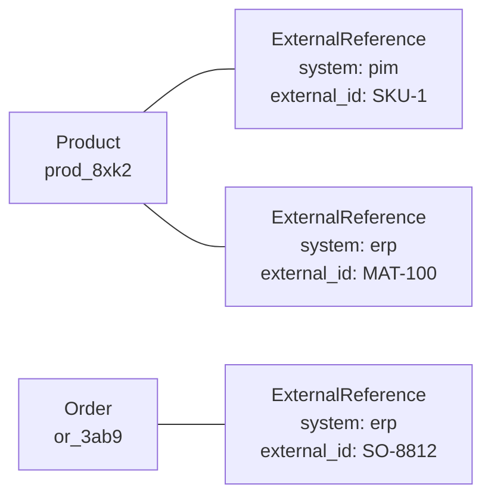

## Overview

A product synced from a PIM is known there by one key. The same product, once its stock is managed in an ERP, is known there by another. Neither is Spree's id, and a single `external_id` column cannot hold both.

An external reference is one row per system per record: *this product is `SKU-1` in the PIM and `MAT-100` in the ERP*. A record can carry as many as it has systems, and a connector reads or writes its own without disturbing another's.



References are **store-scoped** — the same ERP key can mean different records in different stores — and unique in both directions within a store: one reference per system per record, and one record per (system, external id). That second rule is what makes a feed safe to replay.

## Which records carry them

Products, variants, stock levels, stock locations, orders, categories, companies, company locations and media. Each includes `Spree::HasExternalReferences`, which is opt-in per model rather than on every record — only things a connector actually syncs need it.

Customers deliberately do not. A customer is global rather than store-scoped, so a store-scoped reference to one has no unambiguous owner; a business buyer's identity in an ERP lives on their company instead.

## The system key

`system` is a plain string — `erp`, `pim`, `acme_wms` — never a foreign key to a connected integration. Data arrives from systems with no live connector at all (a nightly CSV from a legacy PIM), and those still need somewhere to record identity. Where a connector *does* exist, use its integration's `api_type` as the key so the connector, the references it writes and the settings page all agree on the name.

## Reading and writing in Ruby

```ruby
product.external_id_for('erp')                       # => "MAT-100", or nil
product.set_external_id('erp', 'MAT-100')            # create or update the erp reference
product.set_external_id('erp', nil)                  # remove it
product.assign_external_references(erp: 'MAT-100', pim: 'SKU-1')   # write several; unmentioned systems are left alone

Spree::Product.find_by_external_id('erp', 'MAT-100') # the record that key names, or nil
current_store.products.with_external_id('erp', 'MAT-100')          # as a scope, so store scoping composes
```

`find_by_external_id` is scope-friendly on purpose: chain it onto an already store-scoped relation, exactly as you would any other id arriving off a request, and a key belonging to another store is a 404 rather than a readable record.

## Through the Admin API

Admin serializers render a record's references as a flat map:

```json
{ "id": "prod_8xk2", "name": "Widget", "external_references": { "pim": "SKU-1", "erp": "MAT-100" } }
```

Writing accepts the same map, or a list of `{ system, external_id }` entries — so a client can send back exactly what it read. Systems you do not name keep the reference they have.

```bash
PATCH /api/v3/admin/products/prod_8xk2
{ "external_references": { "erp": "MAT-100" } }
```

Two things make a connector's life easier:

**Member paths accept an external identity.** A connector that only ever learned the ERP's key can read, update and delete without first asking Spree for its id:

```
GET   /api/v3/admin/products/external:erp:MAT-100
PATCH /api/v3/admin/orders/external:erp:SO-8812
```

**A create naming a key Spree already knows updates that record.** A nightly feed cannot know whether Spree has seen a row before, and a replayed `POST` that 422'd on the unique index would read as "the sync is broken" rather than "already imported". So it writes to the existing record instead — using the create action's own parameters, since several controllers permit different keys on create and update.

## Writing the order number back

The outbound direction uses the same table. When an ERP accepts an order it assigns its own number; the handler on `carts.complete.after_finalize` that pushes the order can write that back:

```ruby
Spree.hooks.register('carts.complete.after_finalize') do |flow|
  number = AcmeErp.push_order(flow.order)
  flow.order.set_external_id('erp', number)
end
```

From then on the ERP can address the order as `external:erp:SO-8812`, and a support agent looking at the order's JSON drawer sees the ERP number beside Spree's.

## Where the dashboard shows them

Nowhere dedicated. A foreign key's audience is whoever is debugging a sync — a developer, or a merchant on a support call — not the merchant editing a product, so references appear in the developer JSON drawer available from every record's page header rather than in a card of their own. The companies table offers an off-by-default column for reconciling a list against an ERP.

## What an external reference is not

It is an **identity**, not a dedupe key. A source URL an image was fetched from can legitimately repeat across several products in one store, so it would collide with the unique index — that stays as its own attribute on media. If the thing you want to record can point at more than one record, it is not an external reference.
