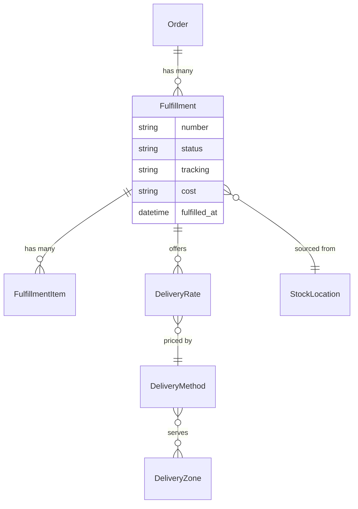

## Overview

A fulfillment is one batch of items going to the customer by one method — a parcel from a warehouse, a digital download, or an order waiting at a pickup counter. An order gets one fulfillment per combination of stock location and delivery method, so an order sourced from two warehouses has two.

The word is deliberately broader than "shipment". A digital download has no carrier, no address and no package, and click-and-collect ships nowhere at all — a fulfillment covers all of them without dragging along fields that make no sense for most.



## Fulfillment attributes

| Attribute | Description |
|---|---|
| `id` | Fulfillment ID, e.g. `ful_86Rf07xd4z` |
| `number` | Fulfillment number, e.g. `F123456789` |
| `status` | See [statuses](#statuses) below |
| `tracking` | Carrier tracking number, once it's on its way |
| `cost` / `display_cost` | Delivery cost for this fulfillment |
| `delivery_rates` | The options the customer can choose from |
| `selected_delivery_rate_id` | The chosen option |
| `fulfilled_at` | When it went out |

## Statuses

| Value | Meaning |
|---|---|
| `pending` | Not ready yet — awaiting payment, or items are on backorder |
| `ready` | Everything in stock and paid for; the warehouse can pick it |
| `backorder` | Waiting on stock |
| `fulfilled` | It went out |
| `canceled` | It won't be sent |

One rule only ever moves one way: once something has gone out, it stays gone out. A later payment problem changes the order's [payment status](/v6/developer/core-concepts/orders#statuses) and leaves the fulfillment alone.

## Delivery types

Every delivery method has a type that decides how it behaves:

| Type | Behaviour |
|---|---|
| `shipping` | Physical delivery to an address. Someone marks it sent. |
| `digital` | Available the moment the order is placed. No address needed. |
| `pickup` | Collection from one of your own stock locations. |
| `pickup_point` | Collection from a third-party point — a locker or partner shop. |

This is what lets a store sell a downloadable album and a vinyl record in the same order without any special handling in your storefront: the download is ready immediately, the record gets a tracking number.

## Choosing delivery at checkout

Each fulfillment on a cart offers delivery rates. The customer picks one per fulfillment.

<CodeGroup>

```typescript Store SDK
const cart = await client.carts.get(cartId)

cart.fulfillments[0].delivery_rates
// => [{ id: 'rate_xxx', name: 'DHL Express', display_cost: '$12.00',
//       estimated_delivery_date: '2026-08-07' }, ...]

await client.carts.fulfillments.update(cartId, cart.fulfillments[0].id, {
  selected_delivery_rate_id: 'rate_xxx',
})
```

```bash cURL
curl -X PATCH 'https://api.mystore.com/api/v3/store/carts/cart_xxx/fulfillments/ful_xxx' \
  -H 'X-Spree-API-Key: pk_xxx' \
  -H 'X-Spree-Token: abc123' \
  -H 'Content-Type: application/json' \
  -d '{ "selected_delivery_rate_id": "rate_xxx" }'
```

</CodeGroup>

Rates carry more than a price — carrier, service level and estimated delivery date — so you can show "DHL Express, arrives Tuesday" instead of just a number.

## Pickup

For pickup methods, ask the API where the customer can collect:

<CodeGroup>

```typescript Store SDK
// Your own pickup-enabled locations
const locations = await client.deliveryMethods.pickupLocations('dm_xxx')

// Third-party pickup points near the customer
const points = await client.deliveryMethods.pickupPoints('dm_xxx', {
  latitude: 34.0522,
  longitude: -118.2437,
})
```

```bash cURL
curl 'https://api.mystore.com/api/v3/store/delivery_methods/dm_xxx/pickup_locations' \
  -H 'X-Spree-API-Key: pk_xxx'
```

</CodeGroup>

## Managing fulfillments

<CodeGroup>

```typescript Admin SDK
// What's ready to pick
const fulfillments = await adminClient.orders.fulfillments.list('or_xxx')

// Add tracking, then mark it sent
await adminClient.orders.fulfillments.update('or_xxx', 'ful_xxx', {
  tracking: '1Z999AA10123456784',
})
await adminClient.orders.fulfillments.fulfill('or_xxx', 'ful_xxx')

// Split it when only part can go now
await adminClient.orders.fulfillments.split('or_xxx', 'ful_xxx', {
  items: [{ fulfillment_item_id: 'fi_xxx', quantity: 1 }],
})

// Cancel
await adminClient.orders.fulfillments.cancel('or_xxx', 'ful_xxx')
```

```bash cURL
curl -X PATCH 'https://api.mystore.com/api/v3/admin/orders/or_xxx/fulfillments/ful_xxx' \
  -H 'X-Spree-API-Key: sk_xxx' \
  -H 'Content-Type: application/json' \
  -d '{ "tracking": "1Z999AA10123456784" }'

curl -X PATCH 'https://api.mystore.com/api/v3/admin/orders/or_xxx/fulfillments/ful_xxx/fulfill' \
  -H 'X-Spree-API-Key: sk_xxx'
```

</CodeGroup>

## Delivery methods and zones

A **delivery method** is what the customer picks — "Standard", "Express", "Collect in store". A **delivery zone** decides where it's available.

Zones match on country and state, and also on postal code prefixes and ranges, so you can offer same-day delivery to a handful of city postcodes without listing every one:

```typescript Admin SDK
await adminClient.deliveryZones.create({
  name: 'London same-day',
  members: [
    { member_type: 'postal_code', country_iso: 'GB', postal_code_prefix: 'SW1' },
    { member_type: 'postal_code', country_iso: 'GB', postal_code_from: 'EC1A', postal_code_to: 'EC1V' },
  ],
})
```

A zone member is either a whole country, a state, or a postal code prefix or range.

<Note>
Delivery zones cover delivery only. Tax is handled separately — see [Taxes](/developer/core-concepts/taxes).
</Note>

### Pricing and rules

Delivery is priced either by a rule you configure in the dashboard — flat rate, per item, price bands — or by asking a carrier for live rates.

Methods can also carry conditions that decide when they're offered at all: free shipping over a certain order value, or heavy items excluded from letter post. These are applied in one place, so both kinds of pricing respect them.

## Events

Fulfillments publish [events](/developer/core-concepts/events) — `fulfillment.created`, `fulfillment.fulfilled`, `fulfillment.canceled` — which also reach [webhooks](/developer/core-concepts/webhooks). Use them to notify a customer, push to a warehouse system, or send tracking emails.

## Related

- [Orders](/v6/developer/core-concepts/orders) — how delivery status rolls up
- [Inventory](/developer/core-concepts/inventory) — stock locations and availability
- [Returns, Exchanges & Claims](/v6/developer/core-concepts/returns-exchanges-claims) — items coming back
