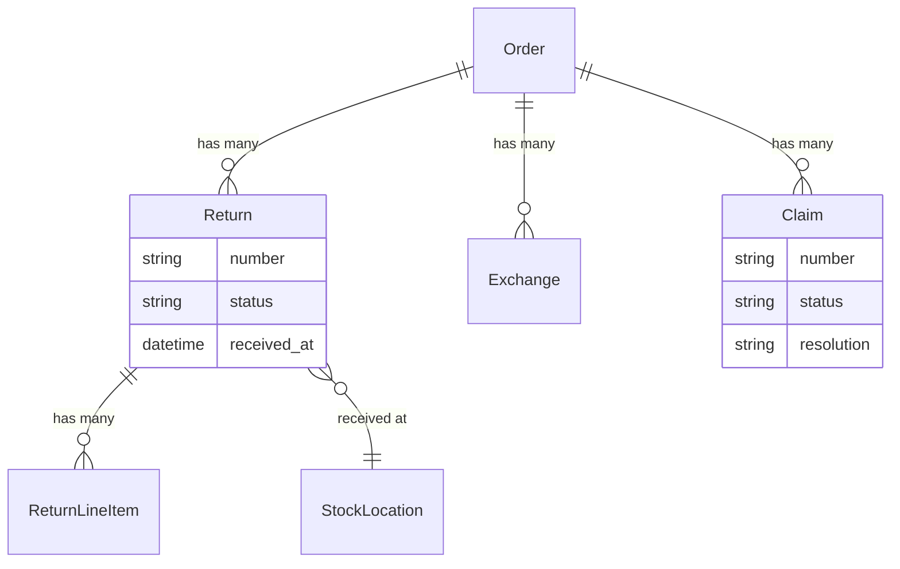

## Overview

Three things can happen after a customer receives an order, and Spree models each on its own:

| Record | What happened | Outcome |
|---|---|---|
| **Return** | Customer sends items back | Money back |
| **Exchange** | Customer sends items back | Different items |
| **Claim** | Item arrived damaged, wrong, or never arrived | Refund, replacement, or both — usually without asking for the goods back |

Keeping them separate matters most for claims. Without a record for "it arrived smashed", merchants end up either creating a manual order or opening a return they immediately mark received — which records the wrong thing and makes damage reporting impossible.



## Statuses

| Record | Statuses |
|---|---|
| **Return** | `requested` → `approved` → `received` → `refunded`, or `canceled` |
| **Exchange** | `requested` → `approved` → `received` → `fulfilled`, or `canceled` |
| **Claim** | `open` → `approved` → `resolved`, or `denied` / `canceled` |

Each step is its own API call, because each one needs information the last one didn't have — what actually turned up, how much to refund, what to send instead.

## Customer self-service

Customers can open a return or a claim on their own order and follow its progress. Approving, receiving and refunding stay with the merchant.

<CodeGroup>

```typescript Store SDK
// Request a return — items refer to units that shipped, not cart line items
const returnRequest = await client.orders.returns.create('or_xxx', {
  items: [{ fulfillment_item_id: 'fi_xxx', quantity: 1 }],
  reason_id: 'rsn_xxx',
  memo: 'Too small',
})

// Report a problem
const claim = await client.orders.claims.create('or_xxx', {
  items: [{ line_item_id: 'li_xxx', quantity: 1, description: 'Arrived cracked' }],
  reason_id: 'clr_xxx',
})

// Follow progress
const returns = await client.orders.returns.list('or_xxx')
```

```bash cURL
curl -X POST 'https://api.mystore.com/api/v3/store/orders/or_xxx/returns' \
  -H 'X-Spree-API-Key: pk_xxx' \
  -H 'X-Spree-Token: order_token_xxx' \
  -H 'Content-Type: application/json' \
  -d '{ "items": [{ "fulfillment_item_id": "fi_xxx", "quantity": 1 }],
        "memo": "Too small" }'
```

</CodeGroup>

Claim types are `damaged`, `missing`, `wrong_item` and `other` out of the box, and a store can add its own.

## Processing a return

<CodeGroup>

```typescript Admin SDK
// Approve
await adminClient.orders.returns.approve('or_xxx', 'ret_xxx')

// Record what actually arrived
await adminClient.orders.returns.receive('or_xxx', 'ret_xxx', {
  items: [
    { return_line_item_id: 'rli_1', quantity: 2, resellable: true },
    { return_line_item_id: 'rli_2', quantity: 1, resellable: false },
  ],
})

// Refund
await adminClient.orders.returns.refund('or_xxx', 'ret_xxx', {
  amount: '24.99',
  refund_method: 'original_payment',
})
```

```bash cURL
curl -X PATCH 'https://api.mystore.com/api/v3/admin/orders/or_xxx/returns/ret_xxx/receive' \
  -H 'X-Spree-API-Key: sk_xxx' \
  -H 'Content-Type: application/json' \
  -d '{ "items": [{ "return_line_item_id": "rli_1", "quantity": 2, "resellable": true }] }'
```

</CodeGroup>

Receiving takes the quantities the warehouse actually counted, because partial and damaged returns are normal rather than exceptional. A customer says three items are coming; two arrive; one of those can't be sold again. Only resellable goods go back into stock.

Leave `items` out to receive everything as requested. Refunds default to whatever the return is still owed, and can go back to the original payment method or to store credit.

## Resolving a claim

What to do about a claim is decided when you resolve it, not when the customer opens it — merchants usually decide once they've seen the photos.

```typescript Admin SDK
await adminClient.orders.claims.approve('or_xxx', 'clm_xxx')

await adminClient.orders.claims.resolve('or_xxx', 'clm_xxx', {
  resolution: 'refund_and_replacement',   // or 'refund', 'replacement'
  refund_method: 'store_credit',
  replacement_line_item_ids: ['li_xxx'],
})
```

A replacement creates a new [fulfillment](/v6/developer/core-concepts/fulfillments) on the original order, so the customer doesn't have to place a second one.

## Exchanges

An exchange works like a return, but ends by sending different items instead of refunding:

```typescript Admin SDK
await adminClient.orders.exchanges.approve('or_xxx', 'exch_xxx')
await adminClient.orders.exchanges.receive('or_xxx', 'exch_xxx')
await adminClient.orders.exchanges.fulfill('or_xxx', 'exch_xxx')
```

## Reporting

Because each one is its own record, you can query them directly:

```typescript Admin SDK
// Everything awaiting action
const pending = await adminClient.returns.list({ filter: { status_eq: 'approved' } })

// Claims opened this month
const claims = await adminClient.claims.list({
  filter: { created_at_gt: '2026-08-01' },
})
```

## Return policy

Spree ships no built-in return window. Whether a customer may open a return is store policy, and it's checked when the return is created — so you can hold customers to a 30-day window while letting staff make an exception for a good customer, and vary the rule by market where local law requires it.

Set the return window per market, or express a more specific rule in your own application. See [Configuration](/v6/developer/customization/configuration) and [Services & Workflows](/developer/customization/workflows).

## Events

Each step publishes an [event](/developer/core-concepts/events) — `return.received`, `return.refunded`, `exchange.fulfilled`, `claim.resolved` — which also reach [webhooks](/developer/core-concepts/webhooks).

Returns and claims also update the order's [payment status](/v6/developer/core-concepts/orders#statuses), so a refunded order reflects it without any manual bookkeeping.

## Related

- [Orders](/v6/developer/core-concepts/orders) — payment status after refunds
- [Fulfillments](/v6/developer/core-concepts/fulfillments) — replacement deliveries
- [Inventory](/developer/core-concepts/inventory) — putting returned goods back in stock
