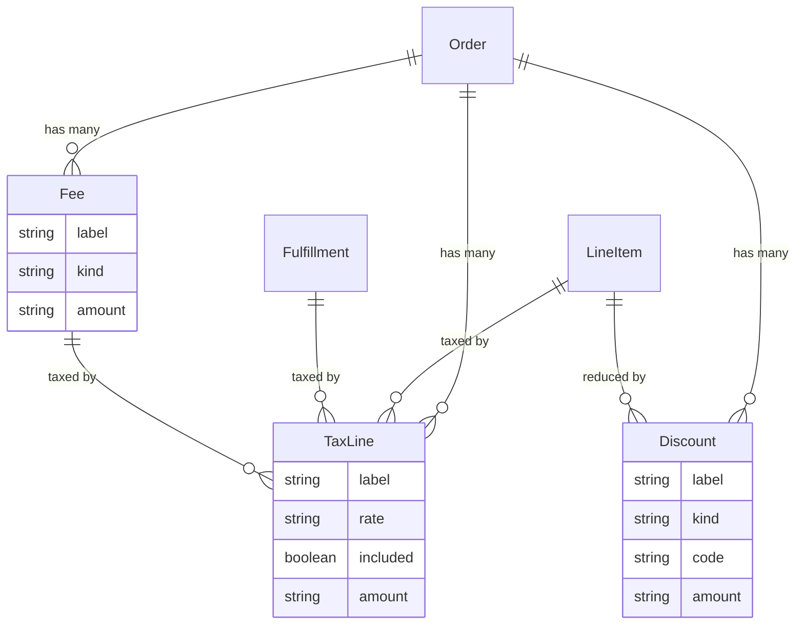

## Overview

An order total is rarely just the sum of item prices. Tax gets added, a promo code takes something off, gift wrapping costs extra. Spree records each of those as its own row, of one of three kinds:

| Kind | Effect | What it is |
|---|---|---|
| **Tax line** | adds | Tax charged on an item, on delivery, or on a fee |
| **Discount** | subtracts | A promotion or a manual reduction |
| **Fee** | adds | A surcharge — handling, gift wrap, cash on delivery |

Keeping them apart means a direct question gets a direct answer. "What tax did we charge on this order?" is one request against tax lines, rather than filtering a mixed list and hoping you caught every case.



<Note>
Money is sent as a **string** — `"15.99"`, not `15.99`. JavaScript numbers can't represent every decimal exactly, and `0.1 + 0.2` gives `0.30000000000000004`, which is not something you want inside a total. If you need to do arithmetic, use a decimal library or work in whole cents.
</Note>

## Building an order summary

Most storefronts never need the individual rows. The order already carries a total for each kind, so you can render a summary directly:

```typescript
const order = await client.orders.get('or_xxx')

order.display_item_total      // "$120.00"  items before tax and discounts
order.display_discount_total  // "-$12.00"  everything taken off
order.display_delivery_total  // "$5.00"    delivery
order.display_tax_total       // "$22.60"   all tax
order.display_total           // "$135.60"  what the customer pays
```

Every total comes in two forms: `total` is the raw value (`"135.60"`) and `display_total` is formatted for the order's currency (`"$135.60"`). Render the `display_` one — it handles the symbol, decimal separator and where the symbol goes.

| Attribute | What it sums |
|---|---|
| `item_total` | Line item prices before tax and discounts |
| `discount_total` | All discounts |
| `tax_total` | All tax |
| `included_tax_total` | Tax already inside displayed prices |
| `additional_tax_total` | Tax added on top |
| `delivery_total` | Delivery charges |
| `total` | What the customer pays |

<Warning>
If you add up a subtotal yourself, include `additional_tax_total` only. `included_tax_total` is **already inside** the item prices — adding it again counts the tax twice. This is the most common mistake when building a European storefront.
</Warning>

## Tax lines

A tax line records one tax charge and what it was charged on.

| Attribute | Description |
|---|---|
| `label` | What the customer sees, e.g. `VAT 20%` |
| `rate` | The rate applied, e.g. `"0.2"` |
| `included` | Whether the tax was already inside the displayed price |
| `amount` / `display_amount` | Tax charged |
| `line_item_id` / `fulfillment_id` / `fee_id` | What was taxed — exactly one is set |
| `tax_rate_id` | The configured rate, when tax came from Spree rather than an outside service |

`included` is the field that trips people up. In most of Europe a €120 price already contains €20 of VAT, so the tax line is there for information — the customer pays €120, not €140. In the US, tax is added at checkout, so the same field is `false` and the amount really is extra.

```typescript Admin SDK
const taxLines = await adminClient.orders.taxLines.list('or_xxx')
```

You never create tax lines yourself. They're written whenever the order total is worked out — see [Taxes](/developer/core-concepts/taxes).

## Discounts

| Attribute | Description |
|---|---|
| `label` | What the customer sees, e.g. `Summer Sale` |
| `kind` | `promotion` or `manual` |
| `code` | The coupon code used, if any |
| `value` / `value_type` | The rule behind it, e.g. `"10"` / `percent`. Accepts a string or a number on write. |
| `amount` / `display_amount` | The reduction, as a negative amount |
| `promotion_id` | The promotion it came from |
| `line_item_id` / `fulfillment_id` | What it reduced |

Most discounts come from [Promotions](/developer/core-concepts/promotions) — a customer applies a code and the rows appear. A **manual** discount is one an admin adds directly, for a goodwill gesture or a price match:

<CodeGroup>

```typescript Admin SDK
// 10% off a single line item
await adminClient.orders.discounts.create('or_xxx', {
  label: 'Goodwill discount',
  value: '10',
  value_type: 'percent',
  line_item_id: 'li_xxx',
})

// A flat amount across the order
await adminClient.orders.discounts.create('or_xxx', {
  label: 'Price match',
  value: '15.00',
  value_type: 'flat',
})
```

```bash cURL
curl -X POST 'https://api.mystore.com/api/v3/admin/orders/or_xxx/discounts' \
  -H 'X-Spree-API-Key: sk_xxx' \
  -H 'Content-Type: application/json' \
  -d '{ "label": "Goodwill discount", "value": 10, "value_type": "percent" }'
```

</CodeGroup>

Only manual discounts can be edited or deleted. Changing one that came from a promotion returns a `422` — those belong to the promotion that created them, and letting an order disagree with its own promotion is how reporting stops adding up.

A discount on the whole order is shared out across the items rather than kept as one lump sum. So if the customer later returns one item, Spree knows how much of the discount belonged to it.

## Fees

| Attribute | Description |
|---|---|
| `label` | What the customer sees, e.g. `Gift wrapping` |
| `kind` | `surcharge`, `handling`, `gift_wrap`, `cod`, `payment`, or your own |
| `amount` / `display_amount` | The charge |
| `line_item_id` / `fulfillment_id` | What it applies to — both empty means the whole order |

```typescript Admin SDK
await adminClient.orders.fees.create('or_xxx', {
  label: 'Gift wrapping',
  kind: 'gift_wrap',
  amount: '5.00',
  line_item_id: 'li_xxx',
})
```

Fees are always positive, and they're taxable — a fee can have its own tax lines. To take money off, create a discount instead. That way a refund never has to work out whether a negative fee was a charge or a credit.

## Where rows attach

Each row points at exactly the thing it applies to:

- **Tax lines** → a line item, a [fulfillment](/v6/developer/core-concepts/fulfillments), or a fee, so item tax and delivery tax stay separately visible
- **Discounts** → a line item or a fulfillment
- **Fees** → a line item, a fulfillment, or the order itself

Rows also keep a copy of where they came from — the rate and label on a tax line, the code and promotion on a discount. If someone deletes that promotion next month, the order still says what the customer was actually given.

## When totals change

Totals are worked out again whenever something changes on a cart — an item added, an address entered, a code applied. The response to every cart change already includes the new totals, so a follow-up request is never needed:

```typescript
// The returned cart already has updated totals
const cart = await client.carts.items.create(cartId, {
  variant_id: 'var_xxx',
  quantity: 2,
})

cart.display_total // already correct
```

Once an order is placed, the rows stop being regenerated. Editing a placed order re-adds its existing rows rather than starting from scratch, so today's promotions can't quietly rewrite what a customer agreed to last week.

## Related

- [Taxes](/developer/core-concepts/taxes) — how tax is worked out
- [Promotions](/developer/core-concepts/promotions) — where most discounts come from
- [Fulfillments](/v6/developer/core-concepts/fulfillments) — delivery charges
- [Orders](/v6/developer/core-concepts/orders) — order totals and statuses
