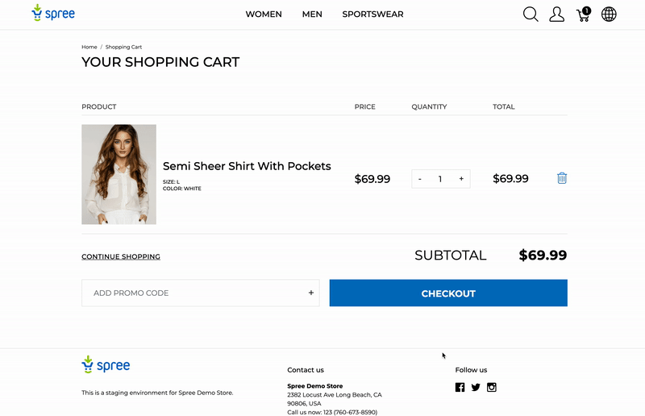

## Overview

The `Store` model is the center of the Spree ecosystem. Each Spree installation can have multiple Stores. 
Each Store operates on a different domain or subdomain, eg.

* Store A, `us.example.com`
* Store B, `eu.example.com`
* Store C, `another-brand.com`

## `current_store` method

All Spree controllers or any other controllers that includes [Spree::Core::ControllerHelpers::Store](https://github.com/spree/spree/blob/master/core/lib/spree/core/controller_helpers/store.rb) have access to the `current_store` method which returns the currently in use `Spree::Store` object. 
All parts of Spree (API v1, API v2, Storefront, Admin Panel) include this mechanism. This method is also available in views.

Under the hood `current_store` calls [Store.current](https://github.com/spree/spree/blob/master/core/app/models/spree/store.rb#L36).

## Default Store

If the system cannot find any Store that matches the current URL it will fallback to the Default Store. 

You can set the default Store in Admin Panel -> Configurations -> Store.

To get the default store in code you can call `Spree::Store.default`.

## Localization and Currency

Each Store can have different multiple locales and currencies. This configuration is stored in Store model attributes:

* `default_currency`- this is the default currency this is the default locale/language which will be pre-selected when visiting the store the first time, eg. `USD` 
* `supported_currencies` - if there are more than one supported currency visitor will be able to choose which currency they would like to browse your store, eg. `USD,CAD`
* `default_locale` - this is the default locale/language which will be pre-selected when visiting the store the first time, eg. `en`
* `supported_locales`, if there are more than one supported locale visitor will be able to choose which locale they would like to browse your store, eg `en,fr`. Locales are available upon installing [Spree I18n](https://github.com/spree-contrib/spree_i18n)

## Checkout configuration

Each Store can be configured to ship to only selected countries. This is achieved via `checkout_zone_id` attribute which holds the ID of the selected [Zone record](/user/configuration/configuring_geography.html).

Available Shipping Methods on the Checkout are determined based on the [Zone and Shipping Methods configuration](/developer/internals/shipments.html).

This will also have an effect on what [Shipping / Billing Addresses](/developer/internals/addresses.html) user can add / select during Checkout. Only Addresses from Countries or States available in the selected Zone can be used and will be visible in the User's Address Book.

## Associated models

### Orders

When a user starts a checkout in a selected Store [Order](/developer/internals/orders.html) is associated with that Store. That means that items added to the Cart will be visible only in a selected Store. If a user switches to another Store they will have a separate `Order` record for that Store. Order is created when a User adds the first item to the Cart. This means you can host multiple brands on one single Spree instance.

### Payment Methods

Each [Payment Method](/developer/internals/payments.html#payment-methods) can be associated with multiple Stores, eg. you would like to have Stripe and PayPal in Store A, but only Stripe in Store B, and Braintree in Store C.

### Products

There's no direct association between Stores and Products in Spree Core, however which Products are available in which Store is determined on the selected currency. If Product A has prices in `USD` and `EUR` it will be available for purchase in all Stores that support that currency.

If you would like to have more granual level control of Products availability in Stores you can install [Spree Multi Domain extension](https://github.com/spree-contrib/spree-multi-domain). It lets you choose Stores for Products. That extension will be pulled into Spree Core in Spree 4.3.

## Store layout

<alert kind="note">
  This feature is only available with [Spree Multi Domain extension](https://github.com/spree-contrib/spree-multi-domain) at the moment but will be included in Spree Core in 4.3 release.
</alert>

<alert kind="note">
  This is only applicable to Spree default Storefront
</alert>

Each Store record has a unique attribute called `code`. This an internal name for your Store.

Based on this attribute, each store can have its own layout - these layouts should be located in your site's theme extension in the `app/views/spree/layouts/<store#code>/` directory. 

So, if you have a store with a code of `eu` you should store its layout in `app/views/spree/layouts/eu/spree_application.html.erb`.

If there's no custom layout it will fallback to the default one located in `app/views/spree/layouts/spree_application.html.erb`.
