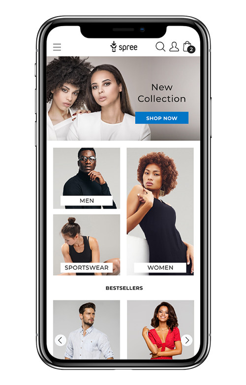

## Overview

The new Spree UX is here for the taking. Feel free to customize it according to your needs: overall styling, header, footer, placeholder images and text, SEO settings.

## Styling with SASS variables

Spree 4.x uses [Bootstrap 4 with built-in Sass variables](https://www.example.com) for global style preferences for easy theming and component changes.

All the Sass variables needed for customizing the new Spree UX are in the variables.scss file. Color variables listed there could be assigned any CSS color value:

- HEX - example: #007bff
- RGB-A - example: 0 123 255 1
- HSL-A - example: 211 100% 50% 1
- Color name - example: Blue

To make those changes live you need to update
[app/assets/stylesheets/spree/frontend/variables/variables.scss](https://github.com/spree/spree/blob/master/frontend/app/assets/stylesheets/spree/frontend/variables/variables.scss) 
in your project directory with your values and then commit those changes to your project code repository.

### Header

__*$header-background*__ - header background color variable with 2 examples: white and blue one. By default set with __*$primary-background*__ value but feel to replace it with any other value in the variables.scss file.

White

Blue

__*$header-font-color*__- Header font color. By default set with __*$font-color*__ value but feel to replace it with any other value in the variables.scss file.

Dark Grey

Blue

White

### Footer
__*$footer-background*__ - variable that overrides $primary-background and allows you to change footer color. See a white and a blue example below.

__*$footer-font-color*__ - variable that overrides __*$font-color*__ and allows you to change footer font color. See black and blue font examples below.

### Meganav menu
__*$meganav-background*__ - variable that allows you to change the mega nav menu background color. By default meganav menu is set to __*$primary-background*__ value but feel to replace it with any other value in the variables.scss file.

__*$meganav-font-color*__ - font color variable in the mega nav menu. By default mega nav font color is set to $font-color value but feel to replace it with any other value in the variables.scss file.

### Background

__*$primary-background*__ - main background color across the whole site. Two examples below - a white one and a black one. Please note that you can also use an image as a background.

__*$secondary-background*__ - second background color present across the whole site with two examples attached below.

__*$font-color*__ - this variable affects all fonts on $primary-background. Please see two examples below.

__*$secondary-font-color*__ - affects all fonts on $secondary-background. By default set with $font-color value but feel to replace it with any other value in the variables.scss file.

### Border color
__*$global-border-style*__ - affects border and separator color throughout the whole site

### Fonts

__*$font-family*__ - sets the font family used across your site. By default it is Sans Serif but feel to replace it with any other value in the variables.scss file. Check out these font families you could use.

### Input fields

__*$input-background*__ - allows you to set a color for all input field backgrounds across the site. See two examples below - a white one and a yellow one.

__*$second-global-border*__ - allows you to set a color for all input field borders across the whole site. See an example below with red input field borders.

### Primary color

#### Home Page
__*$primary-color*__ variable changes

+ The color of __SHOP NOW__ button on the main hero image

+ The color of __Summer 2019__ and __READ MORE__ button

+ The color of __NEW COLLECTION & SUMMER SALE__ headers inside the categories section

#### Search Results

__*$primary-color*__ variable changes

+ The color of __No Results__ icon

#### Mega Menu

__*$primary-color*__ variable changes

+ The color of __NEW COLLECTION & SUMMER SALE__ headers inside the banners

#### PDP

__*$primary-color*__ variable changes

+ The color of IN STOCK text

+ The color of ADD TO CART button

#### Cart Page

__*$primary-color*__ variable changes

+ The color of Trash delete icon

+ The color of CHECKOUT button

#### Cart pop-up

__*$primary-color*__ variable changes
+ The color of __CHECKOUT__ and __VIEW CART__ buttons

#### Cart - empty

__*$primary-color*__ variable changes

+ The color of __CONTINUE SHOPPING__ button

+ The color of __Empty Cart__ icon

#### Checkout - Registration Step

__*$primary-color*__ variable changes

+ The color of __LOG IN, SIGN UP and CONTINUE AS A GUEST__ buttons

#### Checkout - Address Step

__*$primary-color*__ variable changes

+ The color of __SAVE AND CONTINUE__ button (this element remains the same across the whole checkout process)

+ The color of __EDIT__ icon

#### Checkout - Payment step

__*$primary-color*__ variable changes

+ The color of __APPLY__ button

#### Checkout - Confirm Step

__*$primary-color*__ variable changes

+ The color of __PLACE ORDER__ buttons

#### Sign In Page

__*$primary-color*__ variable changes

The color of __LOG IN__ and __SIGN UP__ buttons

#### Sign Up Page

__*$primary-color*__ variable changes

+ The color of __SIGN UP__ and __LOG IN__ buttons

#### My Account Page

__*$primary-color*__ variable changes

+ The color of __Edit__ and __Trash__ icons

#### Edit Account Page

__*$primary-color*__ variable changes

+ The color of __UPDATE__ button

#### Pop-ups

__*$primary-color*__ variable changes

+ The color of __CANCEL__ and __OK__ buttons

### Secondary color

#### PLP

__*$secondary-color*__ variable changes
+ The color of chosen __color__ border variant

+ The color of chosen __size__ border variant

+ The color of chosen __length__ border variant

+ The color of chosen __price__ border variant

#### PDP
__*$secondary-color*__ variable changes

+ The color of chosen __color__ border variant

+ The color of chosen __size__ border variant

+ The color of chosen __length__ border variant

+ The color of chosen __image__ border

#### Pop-ups
__*$secondary-color*__ variable changes

+ The color of Add to bag successfully icon

Log-in and Sign-in page

__*$secondary-color*__ variable changes

+ The color of __Remember me__ checkbox

+ The color of __input: focus__

#### Checkout

__*$secondary-color*__ variable changes

+ The color of __individual steps__ (box, name step and guide line) - this element remain the same across whole checkout process

#### Checkout - Address Step

__*$secondary-color*__ variable changes

+ The color of Use shipping address checkbox

#### Checkout - Delivery Step

__*$secondary-color*__ variable changes

+ The color of delivery type radio buttons

#### Checkout - Payment Step

__*$secondary-color*__ variable changes
 + The color of payment type radio buttons

+ The color of payment card radio buttons

#### Order confirmation page

__*$secondary-color*__ variable changes

  + The color of __successful checkmark__ icon

### Grid breakpoints

[Grid breakpoint variable](https://github.com/spree/spree/blob/master/frontend/app/assets/stylesheets/spree/frontend/variables/bootstrap-overrides.scss) allow you to slightly change element sizes on various devices - mostly images and their scale ratio. Feel free to learn more from the [Bootstrap manual](https://getbootstrap.com/docs/4.0/layout/grid/). We don’t recommend changing these values unless you really need to.

### Rounding for components

__*$enable-rounded*__ - Enable rounding for components.

Possible values: __true__ or __false__

__“True” example__

__“False” example__

### Shadows for components

__*$enable-shadows*__ - Enable shadow for components

Possible values: __true__ or __false__

### Gradient for components

__*$enable-gradients*__ - Enable gradient for components

Possible values: __true__ or __false__

## Header and footer customization

Feel free to customize header and footer elements as outlined below.

### Logo replacement

In order to replace the default Spree logo with yours [please follow these steps](https://guides.spreecommerce.org/developer/customization/view.html#switch-storefront-logo) in the Spree guides. We do recommend using 127x52 dimensions for your logo in the SVG, PNG or JPEG formats, however, if you would like to use a higher resolution it will scale down automatically.

### Mega menu categories

Categories visible in the Megamenu are defined in the `spree_storefront.yml`. The file is automatically copied to `config/spree_storefront.yml` in your application directory.

Make sure that these categories are also defined in the Admin panel on your site. You will find them in the Products > Taxonomies menu. Learn more about [categories (taxonomies and taxons)](https://guides.spreecommerce.org/user/products/taxonomies_and_taxons.html) in the Spree guides.

### Social media icons in the footer

Replace social media URLs with yours in the Spree admin panel by going to Configuration > Stores and editing (pencil icon) your store settings in the Social section.

Make sure to place the part of the URL trailing after .com/, for example:
SCREEN
You don’t have to use any slashes.

If you leave any of the Social fields empty the corresponding social media icon will disappear.

If you would like to replace the default social media icons you could replace images in this path: frontend/app/assets/images/facebook.svg <- default facebook icon. Make sure to use SVG files.

### Contact us in the footer

The footer contains a “Contact us” section with your store contact information. You can change the contents of this section in the ___footer.html.erb__ file in lines 30 to 38. The file is automatically copied to shared/_footer.html.erb in your application directory.

### Product categories in the footer

The footer by default contains a list of product categories in your store. Feel free to change the contents of this section in the __config/spree_storefront.yml__. The file is automatically copied to your application after running Spree installer.

## Replacing placeholders with your images and copy

You will need to replace promo banner placeholder images as well as some text (buttons, promo banners) with your own:

+ on the homepage
  + multiple promo banners described below (each in 4 sizes listed on the following pages for various devices)
  + text on the main promo banner (“Summer Collection” and “SHOP NOW” button), descriptions on all three category banners, slider title
(“BESTSELLERS”, “TRENDING”), mid-page promo block (“FASHION TRENDS”), bottom promo banners (“STREETSTYLE”, “UP TO 60%”)
+ product listing page - one category promo banner
+ meganav menu - two promo banners for each main category

### Homepage placeholder slots

In the screenshot below you’ll find homepage promo banner slots with the default image placeholders indicating desktop placeholder sizes in pixels. Please note that each of these placeholders requires 4 images for various devices listed below. This is just a desktop example.

Homepage text values may be replaced in your project repository in the /app/views/spree/home/index.html.erb. Please note that this file will be automatically copied to your project directory after running Spree installer.

You’ll need to upload 4 sizes for each of these promo banners:

#### Main banner
+ Main banner __1440 x 600__ (this is a desktop file)
+ Main banner mobile __575 x 240__ (this is a mobile file)
+ Main banner tablet landscape __992 x 413__ (this is a tablet landscape file)
+ Main banner tablet portrait __768 x 320__ (this is a tablet portrait file)

#### Big category banner
+ Big category banner __540 x 800__ (this is a desktop file)
+ Big category banner mobile __262 x 388__ (this is a mobile file)
+ Big category banner tablet landscape __470 x 696__ (this is a tablet landscape file)
+ Big category banner tablet portrait __358 x 530__ (this is a tablet portrait file)

#### Upper and lower category banner
+ Category banner __540 x 388__  (this is a desktop file)
+ Category banner mobile __262 x 188__ (this is a mobile file)
+ Category banner tablet landscape __470 x 338__ (this is a tablet landscape file)
+ Category banner tablet portrait __358 x 257__ (this is a tablet portrait file)

#### Left and right promotion banners
+ Promo banner __540 x 350__  (this is a desktop file)
+ Promo banner mobile __542 x 351__ (this is a mobile file)
+ Promo banner tablet landscape __470 x 305__ (this is a tablet landscape file)
+ Promo banner tablet portrait __734 x 476__ (this is a tablet portrait file)

Please find all the [placeholder images and their size variations in this Google Drive folder](https://drive.google.com/drive/folders/1lbUMNFB2jcwpx4Jpr9uVLd_lUGw9GpVJ) for your reference.

In order to replace those placeholder images you will probably want to perform two operations:
+ change the file names in the `app/views/spree/home/index.html.erb` in your project repository
+ upload those images to your Spree project code repo into this `app/assets/images` homepage folder. The files are automatically copied to your application folder after running Spree installer, preserving the file name structure and just changing `big_category_banner` to your file name:
+  `big_category_banner.jpg`
+  `big_category_banner_mobile.jpg`
+ `big_category_banner_tablet_landscape.jpg`
+ `big_category_banner_tablet_portrait.jpg`

Those file names will be used in the srcset attribute which specified the URL of the image to use for various screen sizes and orientations.

If you’d like to change the file names in the `app/views/spree/home/index.html.erb` please find below line number where to place new image files names.

__Main banner code lines__

 Line 3: data-src="<%= asset_path('homepage/main_banner.jpg') %>"

 Line 4: data-srcset="<%= image_source_set('homepage/main_banner') %>"

__Big category banner code lines__

Line 54: data-src="<%= asset_path('homepage/big_category_banner.jpg') %>"

Line 55: data-srcset="<%= image_source_set('homepage/big_category_banner') %>"

__Both category banners code lines__

Line 24: data-src="<%= asset_path('homepage/category_banner_upper.jpg') %>"

Line 25: data-srcset="<%= image_source_set('homepage/category_banner_upper) %>"

Line 37: data-src="<%= asset_path('homepage/category_banner_lower.jpg') %>"

Line 38: data-srcset="<%= image_source_set('homepage/category_banner_lower) %>"

__Both promo banners code lines__

Line 101: data-src="<%= asset_path('homepage/promo_banner_left.jpg') %>"

Line 102: data-srcset="<%= image_source_set('homepage/promo_banner_left.jpg) %>"

Line 121: data-src="<%= asset_path('homepage/promo_banner_right.jpg') %>"

Line 122: data-srcset="<%= image_source_set('homepage/promo_banner_right') %>"

### Category banner on PLP

Category product listing page (PLP) banner is displayed on the top of each product category. You need to upload just one such promo banner sized 1110 x 300 px through the admin panel. To do that in the Spree admin panel go to Products > Taxonomies and edit the category for which you’d like to replace an image.

### Product images

Add a product image for each product in just one resolution (650 x 870) using the admin panel. Here’s a full explanation of how [to edit your products](/user/products/creating_products.html#images) in the Spree guides.

That single product image will be automatically resized into multiple files and its variations appropriate for the user’s device will be used in the homepage carousels, on the product listing page (PLP), product detail page (PDP), cart pop-up, in the cart and order confirmation page.

### Mega menu
In order to modify category promo banners in the Mega nav menu (by default New Collection and Special Offers) you have to modify __spree_storefront.yml__. The file is automatically copied to your application after running Spree installer.

## SEO recommendations

### Sitemap

We highly recommend adding a sitemap to your site. It might affect how Google bot crawls your store pages. There is + an official extension [Spree Sitemap](https://github.com/spree-contrib/spree_sitemap) for that exact purpose.

1. vper region, language or currency)
2. click the Edit button (indicated with a pencil icon) for the right store,
3. enter title, keywords and description values for that store homepage
4. click the Update button at the bottom of the page

To set title, meta keywords and description for each store category page (PLP), in the admin panel:
1. go to Products > Taxonomies
2. go into a Categories list by pressing the Edit button (pencil icon)
3. pick the category you’d like to edit by right-clicking (control + click on a Mac) a child in the tree to access the menu for adding, deleting or sorting a child.

4. click the Edit link for that category
5. replace the default values for title, meta keywords and description with your own
6. click the Update button at the bottom of the page

You’ll have to edit every category and subcategory to your liking in a similar fashion.

To set title, meta keywords and description for each __product page (PDP)__, in the admin panel:
7. go to __Products > Products__
8. in the product list pick the right one by pressing the Edit button (pencil icon)
9. while in the Details tab, scroll down and place your values for title, meta keywords and description
10. click the Update button at the bottom of the page

### Social sharing and search preview

The new Spree UX has the following social sharing features implemented:
+ Facebook sharing with [Open Graph tags](https://ogp.me/) to enable a nice page preview
+ Google visibility with structured data using [Schema.org](http://schema.org/) with [JSON-DL](https://json-ld.org/)

Feel free to [test the Open Graph tags implementation](https://developers.facebook.com/tools/debug/) and the also [test the Schema.org implementation](https://search.google.com/structured-data/testing-tool/u/0/) for your store.
