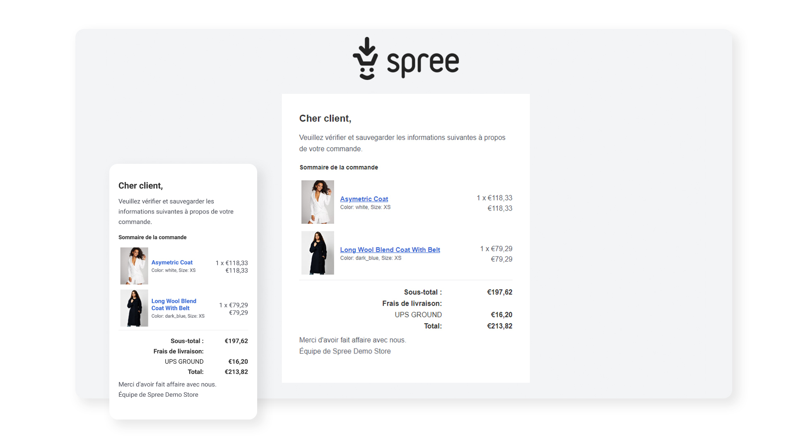

## Overview

**Spree 4.2** is a collaborative work of **34 amazing individuals** from around the globe who contributed **over 1500 commits** since Spree 4.1.

This release was intended to make Spree **accessible to anyone** in every place of our planet in **every country** and **every major language**. Besides new features, this release includes hundreds of bug fixes and improvements.

## Major/New Features

### Ruby 3.0 and Rails 6.1 support

Spree 4.2 can be run on Ruby 2.5, 2.6, 2.7 and recently released 3.0. Spree 4.2 supports **both Rails 6.0 and 6.1** out of the box, so you don't need to upgrade to Rails 6.1 straight away, you can first move to Spree 4.2 and later perform the Rails upgrade minimizing the risk of any issues. Please see [Rails 6.1 announcement](https://weblog.rubyonrails.org/2020/12/9/Rails-6-1-0-release/) to check out the new amazing features that are packed in that release.

### New responsive Admin Panel UI

Thanks to the awesome work of [Matthew Kennedy](https://github.com/spree/spree/pulls?q=is%3Apr+is%3Aclosed+label%3A%22Admin+Panel+%E2%9A%99%EF%B8%8F%22+author%3AMatthewKennedy) supported by Spark team we were able
to deliver a brand new and modern Admin UI which works great on mobile and tablet devices.

This was done in a gradual enhancement process of the current codebase so all of the existing Extensions and customizations will still work as it's fully backward compatible.

The next releases will bring more Admin UI improvements such as a new Reporting dashboard.

### Built-in Multi-Currency and Multi-Language

We've pulled the best parts of [Spree Multi-Currency gem](https://github.com/spree-contrib/spree_multi_currency) of [Spree I18n](https://github.com/spree-contrib/spree_i18n) into Spree itself and improved upon it combined with new multi Store support.

* each Store can have **a default currency and a list of other supported currencies** - this will affect products shown in each Store (only Products with prices in those currencies)

* each Store can have **default locale (language) and a list of other supported locales**

* each Product can have **different prices in each currency** for different Variants

* you can have **multiple Stores with different default locales/currencies** or **a single Store with multiple locales / languages** which you can switch between in the Storefront UI

* this is also **supported by API v1 and v2** by passing simply `?locale=fr` and/or `?currency=EUR` in the URL

* Locale and Currency settings will be also **respected in all Spree extensions**
  
* Additional language packs are available via [Spree I18n gem](https://github.com/spree-contrib/spree_i18n)

### Improved MultiStore support

Besides currency and language, we've greatly improved the Multi-Store support in Spree.

There are new additional settings and features for Store management available in the Admin UI:

* **Logo** - you can now upload logo, through Admin Panel for each Store :) ([Spark Solutions](https://github.com/spree/spree/pull/10386))

* **Mailer Logo** - same as above but will be displayed in the email notifications ([Spark Solutions](https://github.com/spree/spree/pull/10489))

* **Checkout Zone** - which [Zone record](https://guides.spreecommerce.org/user/configuration/configuring_geography.html#zones) is used for Checkout, which in fact limits the Checkout for selected Countries or States ([Spark Solutions](https://github.com/spree/spree/issues?q=label%3A%22Multi-Store+%F0%9F%8F%AC%22+is%3Aclosed+checkout))

* **Default Country** - which country should be pre-selected on Checkout Address ([Spark Solutions](https://github.com/spree/spree/pull/10139))

* **Order Notification Email** for Store Owners ([Derek Johnson](https://github.com/spree/spree/pull/10253))

* **Checkout Payment Methods** - which Payment Methods should be available in each Store. Each payment method can be now assigned to multiple stores instead of one ([Spark Solutions](https://github.com/spree/spree/pull/10457) and [Matthew Kennedy](https://github.com/spree/spree/pull/10684))

* **Store Contact info** that appears in the Storefront footer can be set now in the UI [Spark Solutions](https://github.com/spree/spree/pull/10128)

### New modern mobile first Email templates

Thanks to [El Passion team](https://www.elpassion.com/) we have now brand new and mobile-first email templates
for notifications such as Order Confirmation, Shipment notification and so on. All emails were rebuilt with [Postmark Email Templates](https://github.com/wildbit/postmark-templates) to meet current needs and standards.

To improve developer happiness our friends at [El Passion](https://www.elpassion.com/) prepared [email previews](https://guides.rubyonrails.org/action_mailer_basics.html#previewing-emails) for all email types to make it more convenient to work with emails in a development environment.

As part of these improvements, more of the email layouts can be managed via Admin UI, this includes:

* setting different logo for each Store
* setting locale (language) of Store will be reflected in emails which will be translated automatically, based on [Spree I18n](https://github.com/spree-contrib/spree_i18n)
* setting Store name will automatically change copy in emails
* all URLs in emails will point to the selected Store, this is also supported by Spree Auth Devise emails as well

### WCAG 2.1 AA compatible Storefront

We've invested a lot of time to make the default Storefront accessible for everyone. We've [enhanced Storefront](https://github.com/spree/spree/issues?q=label%3AAccessibility+is%3Aclosed) to be compatible with all [Web Content Accessibility Guidelines](https://www.w3.org/WAI/standards-guidelines/wcag/) version 2.1.

## Installation

1. [Install Docker](https://docs.docker.com/get-docker/)
2. Download [Spree Starter](https://github.com/spree/spree_starter/archive/main.zip)
3. Unzip it
4. Run `bin/setup` in `spree_starter-main` directory

## Upgrade

[Follow 4.1 to 4.2 upgrade guide](/developer/upgrades/four-dot-one-to-four-dot-two.html)

## Noteworthy changes

Please review each of the noteworthy changes to ensure your customizations or extensions are not affected. If you are affected by a change, and have any suggestions please submit a PR to help the next person!

### Storefront

* Admin users able to set which Option Types should be shown as a filter option in Storefront [Spark Solutions](https://github.com/spree/spree/pull/10536)

* Added Compare At price to Products [Spark Solutions](https://github.com/spree/spree/pull/10105)

* Added support of OpenGraph meta tags in Storefront [Spark Solutions](https://github.com/spree/spree/pull/10524)

* Allow user to add names to addresses [Matthew Kennedy](https://github.com/spree/spree/pull/10250)

* Set Product Variant Via URL Query Parameter [Matthew Kennedy](https://github.com/spree/spree/pull/10156)

* Adds The Ability To Show / Not Show Specific Product Properties [Matthew Kennedy](https://github.com/spree/spree/pull/10163)

* Add ship-to address on Checkout "Choose Delivery Method" page [Matthew Kennedy](https://github.com/spree/spree/pull/10239)

* Added support for multiple Relation Types via [Related Products](https://github.com/spree-contrib/spree_related_products) gem on product page [Spark Solutions](https://github.com/spree/spree/pull/10711)

* Added `last_modified` and `etag` helper methods for `Spree::ProductsController` [Spark Solutions](https://github.com/spree/spree/pull/10515)

* Replace jquery.payment with cleave [Matthew Kennedy](https://github.com/spree/spree/pull/10363)

* Make config `show_raw_product_description` usable in new storefront [Matthew Kennedy](https://github.com/spree/spree/pull/10395)

* Adds `product_add_to_cart` event triggering [Spark Solutions](https://github.com/spree/spree/pull/10389)

* use `Spree.ready` instead of document ready on checkout address book [Chien-Fu](https://github.com/spree/spree/pull/10369)

* Shows my account store credits in current currency [Spark Solutions](https://github.com/spree/spree/pull/10238)

* Improved Performance and caching [Spark Solutions](https://github.com/spree/spree/pulls?q=is%3Apr+is%3Aclosed+performance+author%3Adamianlegawiec+milestone%3A4.2)

### API

* Added `API v2 Stores` endpoints [Prabin Poudel](https://github.com/spree/spree/pull/10453)

* Added `concat_taxons` filter to API v2 Products endpoint [Florian Bergmann](https://github.com/spree/spree/pull/10151)

* Moved from `fast_jsonapi` to `jsonapi-serializer` [Spark Solutions](https://github.com/spree/spree/pull/10587)

* Fixed N+1 queries on `/api/v2/storefront/taxons` [Yann Petitjean](https://github.com/spree/spree/pull/10508)

* API v1 controllers now inherit from `ActionController::API` rather than `ActionController::Base`

### Admin Panel

* Replace jquery.ui calendar with mobile friendly Flatpickr Cal [Matthew Kennedy](https://github.com/spree/spree/pull/10326)

* Refactored splitting order products into shipments by stock location [Spark Solutions](https://github.com/spree/spree/pull/10541)

* Add random string instead of 'new' in duplicated promotions [Spark Solutions](https://github.com/spree/spree/pull/10486)

* Add timezone to dates across entire app [Spark Solutions](https://github.com/spree/spree/pull/10382)

* Improve customer attribute editor [Gary Lai](https://github.com/spree/spree/pull/10262)

* includes translations to avoid n + 1 query [Gary Lai](https://github.com/spree/spree/pull/10173)

* Upgraded Select2 to 4.x [Spark Solutions and Matthew Kennedy](https://github.com/spree/spree/pulls?q=is%3Apr+is%3Aclosed+select2+)

### Core

* Added `Store#unique_name` method [Mathew Kennedy](https://github.com/spree/spree/pull/10568)

* Added `Product#default_variant_cache_key` method [Spark solutions](https://github.com/spree/spree/pull/10447)

* Improve `Carmen` Data Import [Matthew Kennedy](https://github.com/spree/spree/pull/10483)

* Normalize promotion code before validation [Maksim Shylau](https://github.com/spree/spree/pull/10523)

* Outstanding balance uses reimbursement [Chris Hummel](https://github.com/spree/spree/pull/10411)

* Added unique index on `taxon_id` and `product_id` in `spree_products_taxons` [Spark Solutions](https://github.com/spree/spree/pull/10462)

* Added `active_storage_validations` gem to dependencies [Spark Solutions](https://github.com/spree/spree/pull/10495)

* Use [Spree Dev Tools](https://github.com/spree/spree_dev_tools) in extension generator [Spark Solutions](https://github.com/spree/spree/pull/10162)

* Updated migrations with column_exists checks to avoid upgrade issues [Spark Solutions](https://github.com/spree/spree/pull/10152)

## Full Changelog

You can view the full changes using [Github Compare](https://github.com/spree/spree/compare/4-1-stable...4-2-stable).
