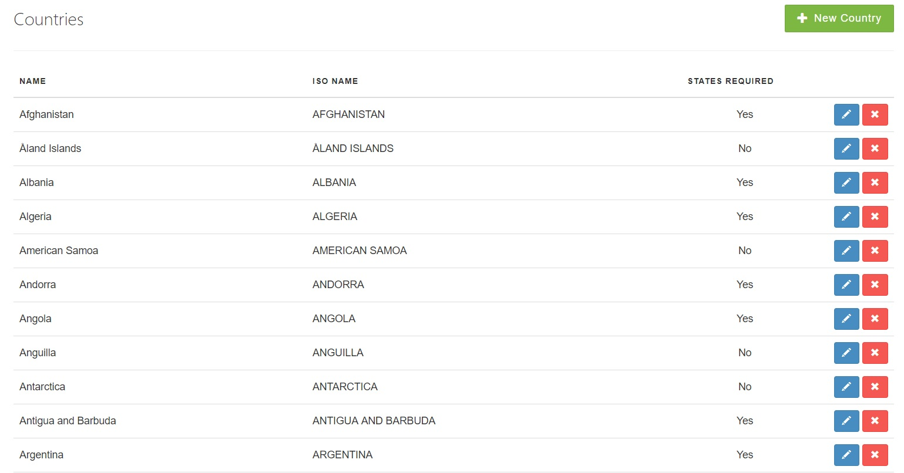
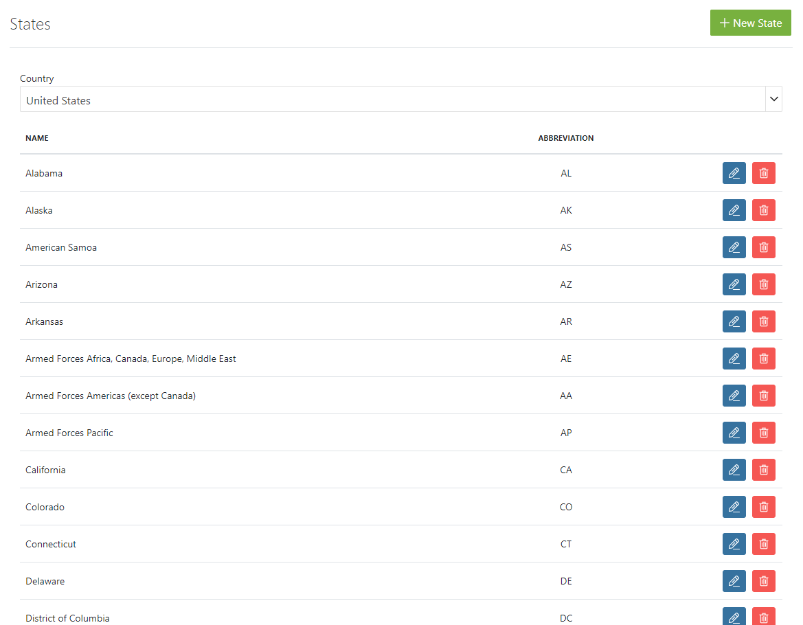

## Introduction

Your Spree store allows you to make decisions about which parts of the world you will sell products to, and how those areas are grouped into geographical regions for the convenience of setting [shipping](/user/shipments/) and [taxation](/user/configuration/configuring_taxes.html) policies. This is accomplished through the use of:

## Zones

Within a Spree store, zones are geographical groupings - collections of either states or countries. You can read all about zones in the [zones guide](/user/shipments/zones.html), including how to [create zones](/user/shipments/zones.html#creating-a-zone), how to [add members to a zone](/user/shipments/zones.html#adding-members-to-a-zone), and how to [remove members from a zone](/user/shipments/zones.html#removing-members-from-a-zone).

## Countries

You already should have several countries configured. You may want to edit items in this list based on your needs. To access the Countries list, go to your Admin Interface, click "Configuration", then click "Countries".

## States

A Spree store pre-loaded with seed data already has all of the states in the US and other countries.

