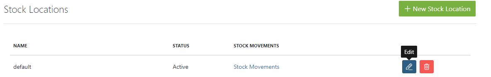
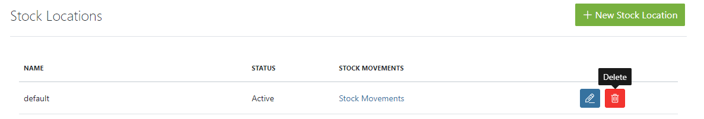
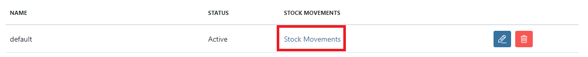
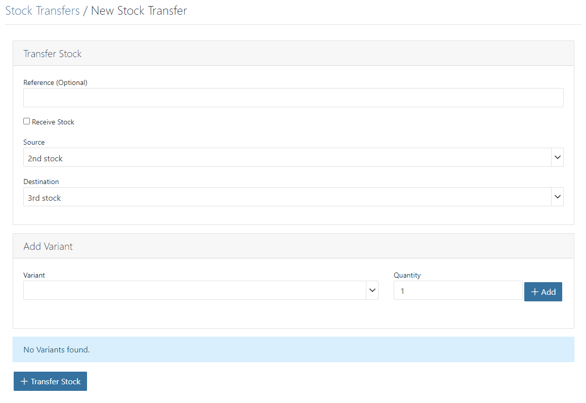
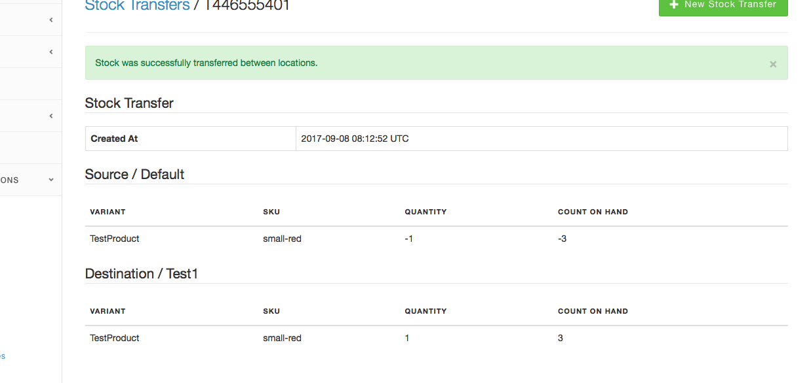
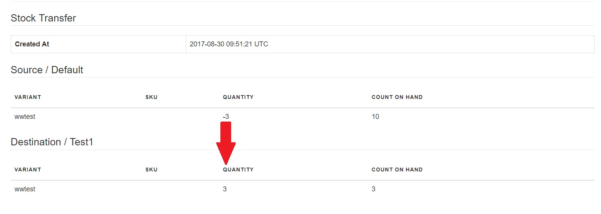

## Introduction

The Spree store gives you a great deal of leverage in managing your business' inventory. You can set up multiple [stock locations](#stock-locations), each of which represents a physical location at which you store your products for delivery to customers. As you add new products and make sales, [stock movements](#stock-movements) are recorded. You can receive stock from a supplier, and even move products from one stock location to another by recording [stock transfers](#stock-transfers). All of this helps to keep your inventorying manageable and current.

### Stock Locations

To reach the Stock Locations management panel, go to your Admin Interface, click "Configuration", then click "Stock Locations". Your store should already have at least one default stock location. If you keep all of your inventory in one place, this may be all you need.

#### Create a New Stock Location

To add a stock location to your store, click the "New Stock Location" button.

Here, you can input everything of relevance about your stock location: name, address, and phone are the most obvious. The three checkboxes on the right-hand side merit more explanation:

* **Active** - Denotes whether the stock location is currently in operation and serving inventory for orders.
* **Backorderable Default** - Controls whether inventory items at this location can be backordered when they run out. You can still change this on an item-by-item basis as needed.
* **Propagate All Variants** - Checking this option when you create a new stock location will loop through all of the products you already have in your store, and create an entry for each one at your new location, with a starting inventory amount of 0.

Input the values for all of the fields, and click "Create" to add your new stock location.

#### Edit a Stock Location

To edit a stock location, click the "Edit" icon next to it in the Stock Locations list.

Make the desired changes in the form and click "Update".

#### Delete a Stock Location

To remove a stock location, click the "Delete" icon next to it in the Stock Locations list.

Click "OK" to confirm the deletion.

### Stock Movements

Notice the "Stock Movements" link on the Stock Locations list.

Clicking this link will show you all of the stock movements that have taken place for this stock location, both positive and negative.

Stock movements are actions that happen automatically through the normal management and functioning of your store. You do not have to (and in fact, can not) manually manipulate them. This is just a way for you to see which things are moving in and out of a particular stock location.

### Stock Transfers

If you have more than one stock location, your Spree store offers you a way to record the movement on inventory from one location to another: the stock transfer.

To create a new stock transfer, go to your Admin Interface, click "Configuration", then "Stock Transfers", then click the "New Stock Transfer" button.

You can enter an optional Reference Number - this could correlate to a PO number, a transfer request number, a tracking number, or any other identifier you wish to use.

Next, select your Source and Destination stock locations. If you are receiving stock from a supplier, check the "Receive Stock" checkbox and the "Source" drop-down box will be hidden.

Select a product variant from the "Variant" drop-down list and enter the quantity of that product being transferred. Click the "Add" button.

***
If you try to transfer an item that you do not have in stock at your Source location, the Spree system will record a stock transfer with a quantity of 0.
***

The new stock transfer is readied. Once you have added all of the items you want to transfer, click the "Transfer Stock" button.

Now when you look at the [Stock Movements](#stock-movements) for each of the stock locations, you see that there are two new entries that correspond to the stock transfer, both with a system-assigned "Action" number (actually, the id for the stock transfer).

