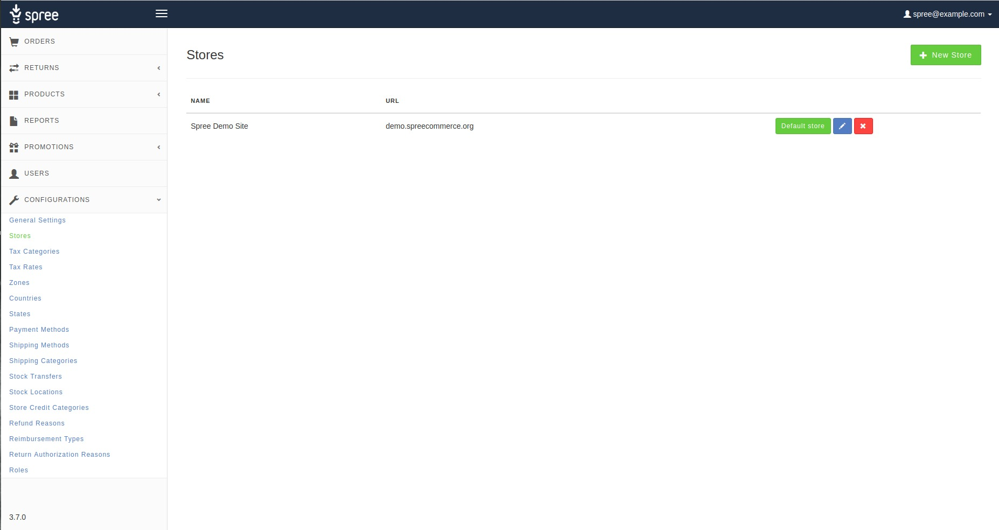
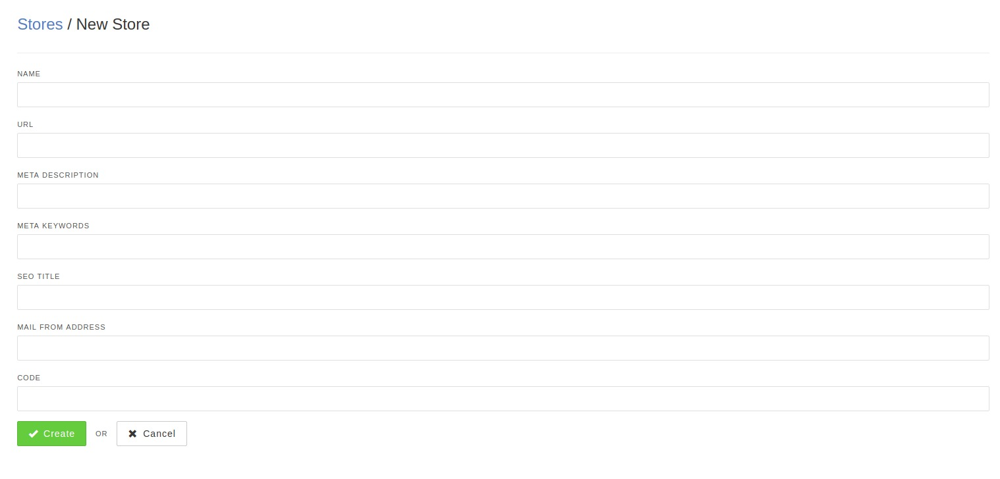
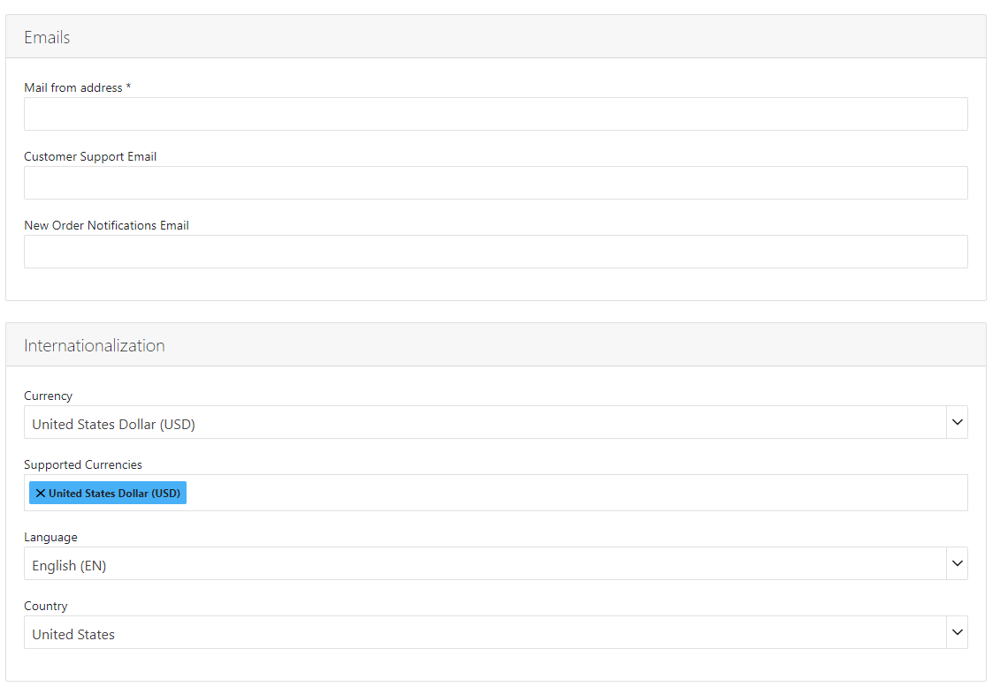
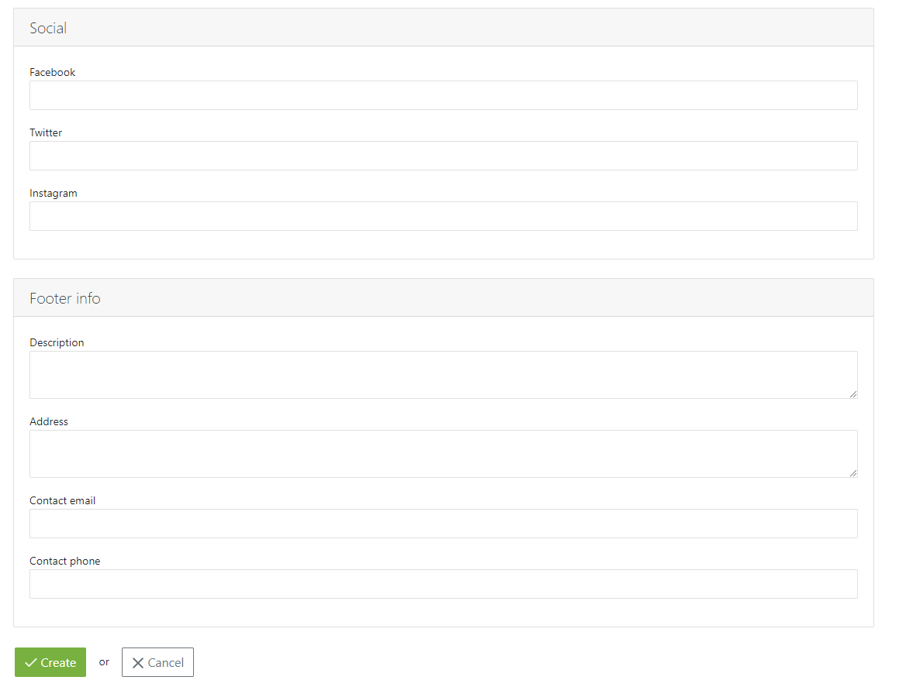
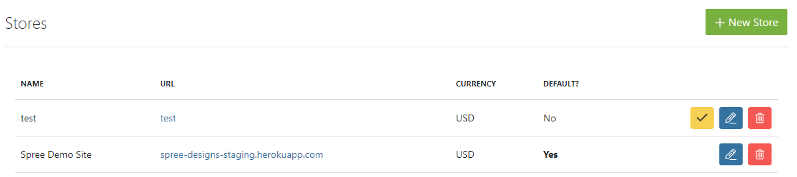
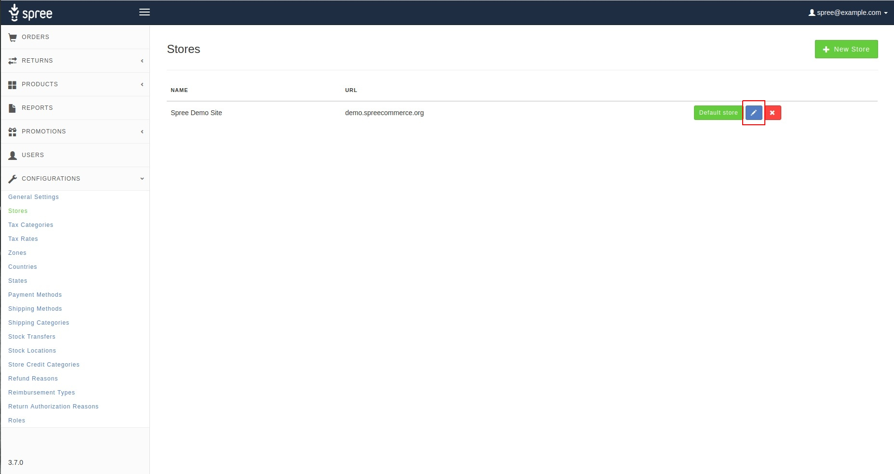
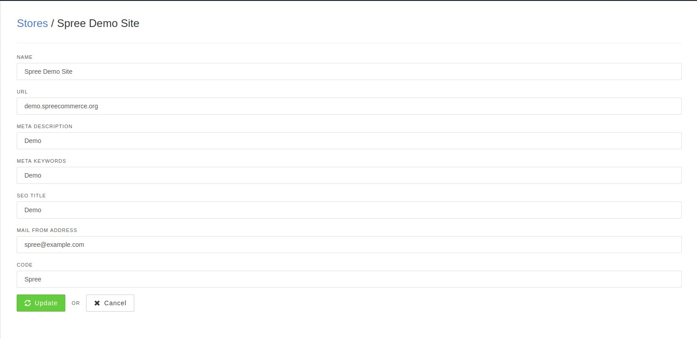
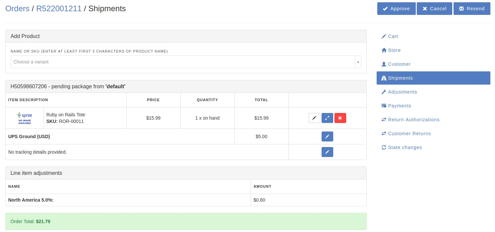

## Introduction

Spree 3.5 was released with Multi Store support. This means that in a single Spree Admin panel you can control multiple shops based on Spree, assign domains and manage orders, besides that there is an option to personalize products for certain shop described [here](#product-and-shop-currency).

### Setup

It is really simple. All you need is at least 2 sites based on Spree with registered domain.

Open Spree Admin panel and under Configurations tab search for Stores.

As you can see, there is already one site setup, default one that you're currently using. We took care of that to make it even easier to setup. All you need is to press [Edit](#edit-store) button in order to personalize it for you.

### Create New Store

In the right upper corner press *New Store* button present on the Screenshot above.

* **Name** - value for you to recognize it
* **URL** - a line separated list of fully qualified domain names used to associate a customers session with a particular store (you can use localhost and/or IP addresses too).
* **Meta Description** - to make it easier for a customer using Google search to click your link
* **Meta Keywords** - words to describe your page as good and close as they can
* **SEO title** - SEO title is present to the user when the page is visited, it can be found for example on Chrome tab
* **Mail from address** - mail which will send notifications such as order confirmation/shipping to the users
* **CODE** - which is a abbreviated version of the store's name (used as the layout directory name, and also helpful for separating partials by store).

Then just press the Create. That's it, multi store is setup and ready to go.

### Edit Store

In order to Edit already existing Store just simply press Edit button next to the Default and Delete.

Inside you can find the same values as described above in [Create New Store](#create-new-store).

Then just press Update button.

### Customization

Each store can have its own layout(s) - these layouts should be located in your site's theme extension in the app/views/spree/layouts/store#code/ directory. So, if you have a store with a code of "alpha" you should store its default layout in app/views/spree/layouts/alpha/spree_application.html.erb.

It is worth to mention that [Analytics](/user/configuration/configuring_analytics.html) can be associated with a store.

### Orders

If the user places order on any of your sites you can observe which store processed the Order.
Simply just enter Orders tab (you can learn more about it [here](/user/orders/index.html))and choose any order that you would like to check, inside it look for the "Store" option on the right side panel.

### Future development

In later Spree version 4.0 or 4.1 approximately, 2 additional extensions should be included to the Spree Core in order to improve Multi Store management and possibilities.

[Spree Multi Domain](https://github.com/spree-contrib/spree-multi-domain)

[Spree Multi Currency](https://github.com/spree-contrib/spree_multi_currency)
