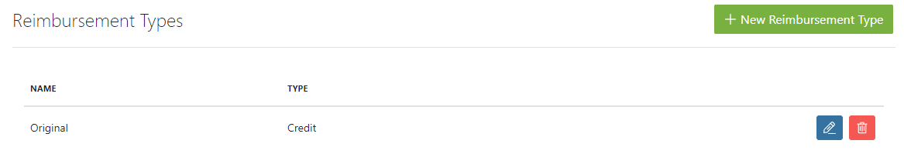
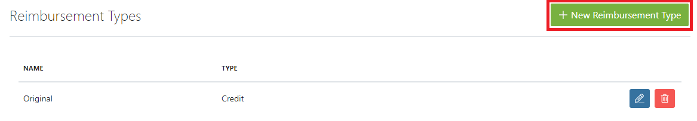
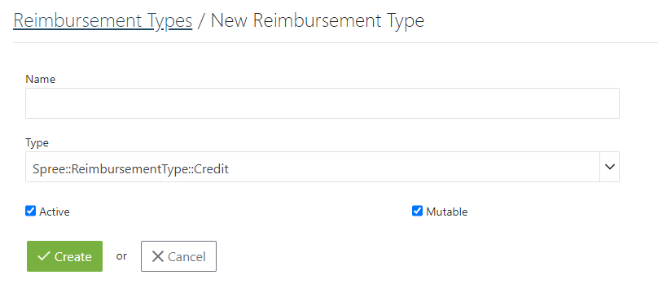
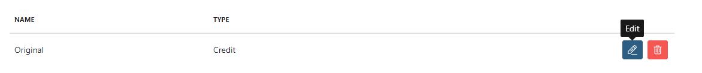
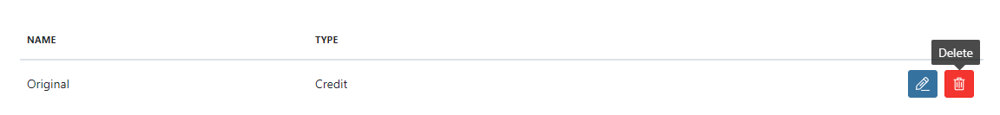

## Introduction

To make it easier for you when you need to make a reimbursement, there are various reimbursement types that help you define what kind of return to give to the customer (e.g store credit, credit card or exchange for a new item).

## Creating a Reimbursement Type

You simply open the **Configuration** tab and press **Reimbursement Types**.
Now, you can see all previously set up types, with the possibility to add a new one.

To add New Reimbursement Type, press the **Add New Reimbursement Type** button which is placed in the upper right corner.

You now only have to add a name and choose the type that you would like to have in your store.

The type is created via backend work and we're at your service to make it easy. This option defines what kind of return to give to the user, such as a credit card refund or an exchange for a new item.

Now simply check the **Active** checkbox and press the **Create** button to create a brand new reimbursement type in your shop!

## Editing and Deleting an existing Reimbursement Type

Once you have created a type that you would like to edit, you can press the **Edit Icon** on the right side of the type's name.

To delete, press the **Delete Icon** next to the **Edit Icon**.

