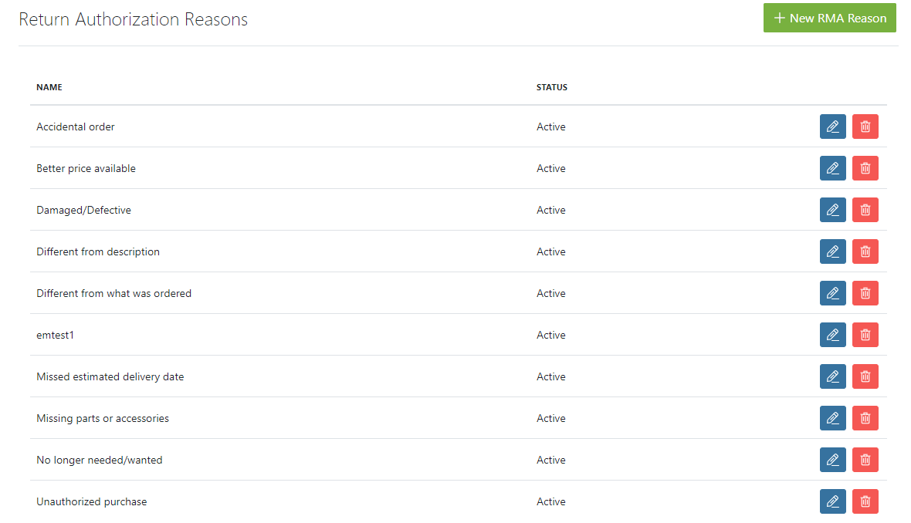
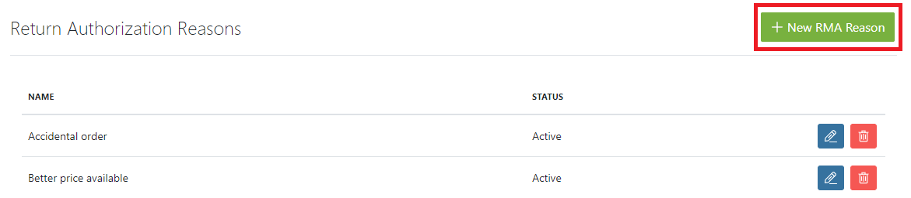
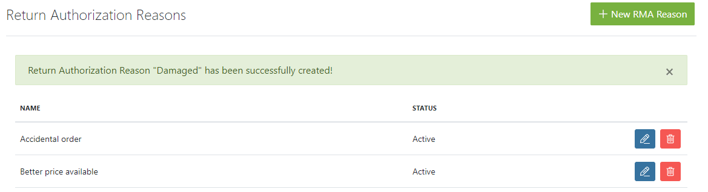
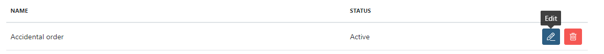
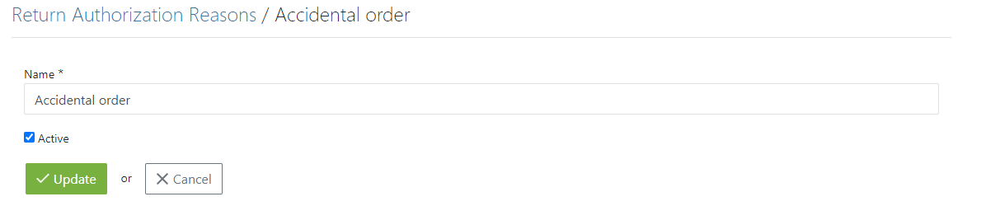

## Introduction

Before you make any return you must describe the reasons why the user wants to return the items. This is the place where you can create Reasons and name them.

Press the **New RMA Reason** button in upper right corner.

Input the name that will be present during the Return process and click the **Create** button. It is not necessary to activate the Reason instantly. You can choose when you want to make a Return Reason active. For example you might want to create a Holiday refund reason - the user ordered something during holiday but wants to return it when you already deactivated this certain reason.

## Deleting and Editing RMA Reasons

To make an additional Edit to an RMA Reason, simply click the **Edit** button. You can now change the name of a reason or deactivate it.

To delete an RMA Reason just press the **Delete** button next to **Edit**.
