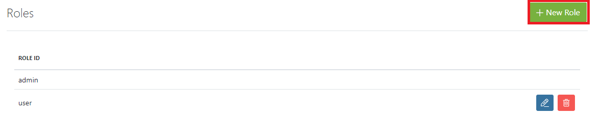
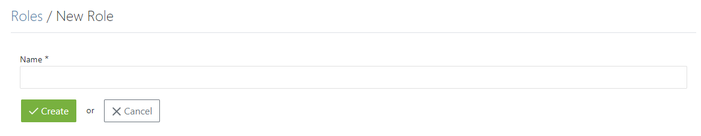
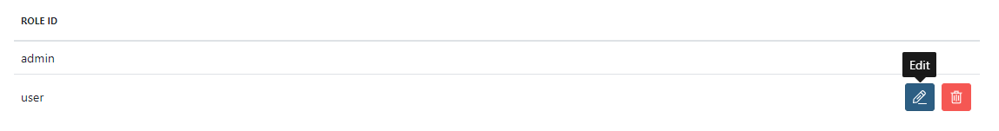
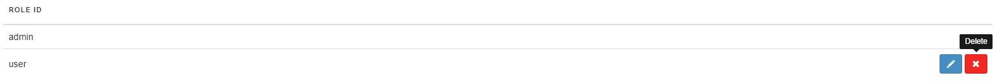
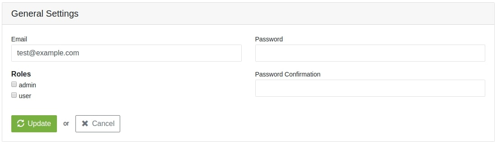

## Introduction

Roles are used to define user’s permissions on your website. This option gives you the ability to control users rights. By default Spree offers two kinds of Roles - **Admin** and **User**. If you would like to make more roles with specific features than Admin and User role, our company offers making those by backend work.
You can extend Roles with additional development for specific features other than Admin and User roles. To open the **Roles** tab extend **Configuration** dropdown and find **Roles**.

## Creating new Role

To create new role you have to click **New Role** button that is placed in the right upper corner of this page.

Simply input name for the certain role and press Update button.

When the role is created you can still edit the name by pressing **Edit** button.

Or Delete it by pressing **Delete** button.

## Assigning Role to the User

To assign a new Role, you need to open edition for the certain User.

To find out more [click here](/user/users/editing_users.html).
