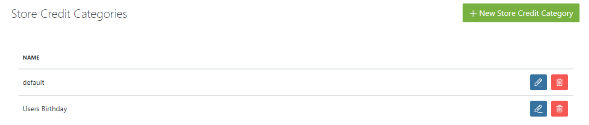
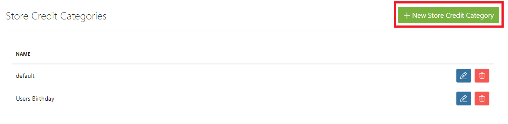
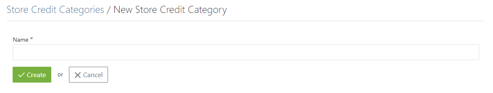
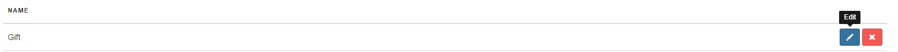
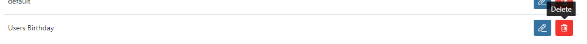

## Introduction

In order to assign Store Credits to the User's account you have to create **Store Credit Categories**, category defines reason for which the User received Store Credits to spent in your's store.

To find **Store Credit Categories** click on **Configuration** dropdown and look for Store Credit Categories option.

## Creating New Store Credit Category

Now, it is simple way to create new Store Credit Category, find **New Store Credit Category** button in the right upper corner and press it.

There is only one input box that tells what kind of category you will create. Simply input name and press **Create** button.

## Editing and Deleting Store Credit Categories

Previously created Category is visible on Store Credit Categories settings. Now, you can create more of them or make additional changes to existing ones.
Simple as that, in every other section in Spree you can see **Edit** and **Delete** buttons next to the name of category.

Now you can assign Store Credit to the User's accounts. You can learn more about it [here](/user/users/editing_users.html)
