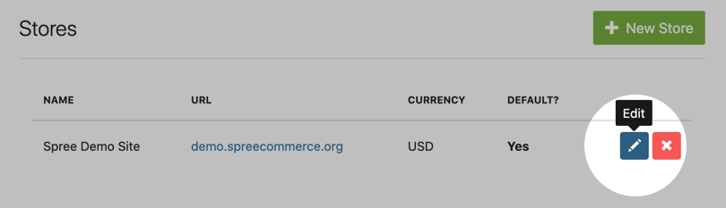
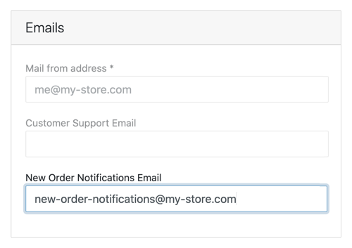

## Introduction

As a store owner, you may wish to receive an email notification each time your store receives a new order. Let's set that up now.

## Enabling Order Notifications

To find your store's **Order Notifications** settings click on the **Configuration** dropdown and then click **Stores**. Find the store you're looking for and click the **Edit** button.

Scroll down to the **Emails** category, and add your desired email address to the field labeled **New Order Notifications Email**.

Click the **Update** button at the bottom of the page and you're all set!

## Disabling Order Notifications

To disable order notifications, simply remove the email address from the field labeled **New Order Notifications Email**, and click the **Update** button at the bottom of the page.
