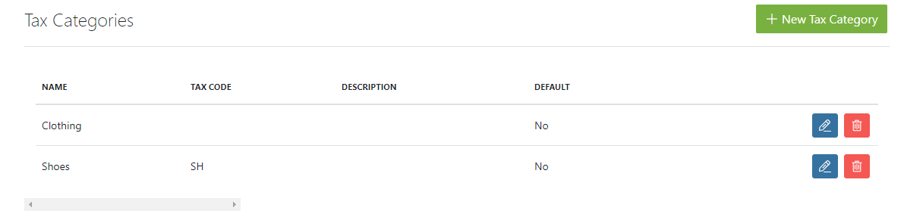
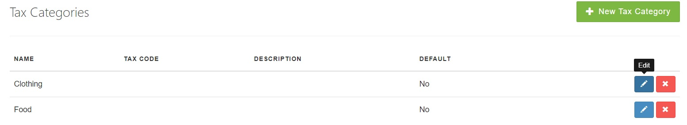
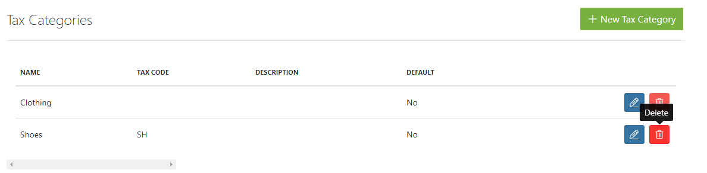
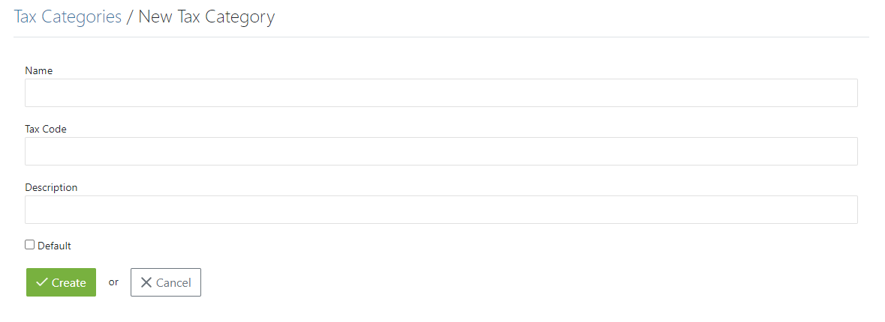
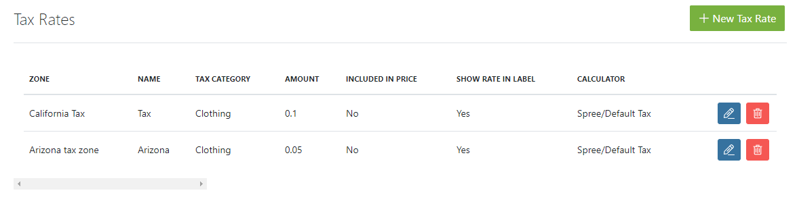

## Introduction

Taxation, as you undoubtedly already know, is a very complicated topic. It can be challenging to manage taxation settings in an e-commerce store - particularly when you sell a variety of types of goods - but the Spree shopping cart system gives you simple, yet effective tools to manage it with ease.

There are a few concepts you need to understand in order to configure your site adequately:

- [Tax Categories](#tax-categories)
- [Zones](#zones)
- [Tax Rates](#tax-rates)
- [Tax Settings](#tax-settings)

## Tax Categories

Tax Categories is Spree's way of grouping products into those which are taxed in the same way. This is behind-the-scenes functionality; the customer never sees the category a product is in. They only see the amount they will be charged based on their order's delivery address.

To access your store's existing Tax Categories, go to your Admin Interface, click "Configuration" then "Tax Categories".

You can edit existing Tax Categories by clicking the "Edit" icon next to each in the list.

You can also remove a Tax Category by clicking the "Delete" icon next to the category, then clicking "OK" to confirm.

To create a new Tax Category, click the "New Tax Category" button.

You supply a name, an optional description, and whether or not this is the default tax category for this store.

Each product in your store will need a tax category assigned to it to accurately calculate the tax due on an order. Any product that does not have a tax category assigned will be put in the default tax category. If there is no default tax category set, the item will be treated as non-taxable.

## Zones

In addition to a product's tax category, the zone an order is being shipped to will play a role in determining the tax amount. You can read more about how zones work in the [Zones guide](https://guides.spreecommerce.org/user/shipments/zones.html).

## Tax Rates

Tax rates are how it all comes together. A product with a given [Tax Category](#tax-categories), being shipped to a particular [Zone](#zones), will accrue tax charges based on the relevant tax rate that you create.

To add a new Tax Rate, go to your Admin Interface. Click "Configuration" then "Tax Rates".

Here, you can see all of your existing tax rates and how they are configured. To create a new tax rate, click the "New Tax Rate" button.

* **Name** - Give your new tax rate a meaningful name (like "Taxable US Goods", for example)
* **Zone** - You'll need to make separate tax rates for each zone you serve, per category. Suppose you have a "Clothing" tax category, and you sell to both the US and Europe. You'll need to make two different tax rates - one for the US zone, and one for the European zone.
* **Rate** - The actual percentage amount you are charging. 8% would be expressed as .08 in this field.
* **Tax Category** - The [tax category](#tax-categories) that relates to this tax rate.
* **Included in Price** - Check this box if you have already added the cost of tax into the price of the items.
* **Show Rate in Label** - When this box is checked, order summaries will include the tax rate, not just the tax amount.
* **Calculator** - By default, Spree uses the Default Tax calculator (a simple tax rate times item price adjusted for any promotions) calculation to determine tax. If you need something more specific or customized than this, it can be done - you'll just need to work with your development team to make it happen.

## Tax Settings

Finally, European stores will benefit from the Tax Settings page.

When this option is checked, your Spree site will take it as a default [tax category](#tax-categories), find the corresponding [tax rate](#tax-rates), and multiply it times the shipping rate for each available [shipping method](/user/shipments/shipping_methods.html) offered to a customer during checkout.
