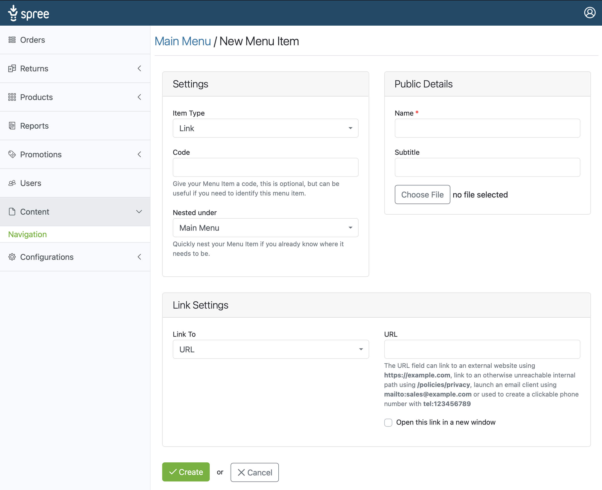
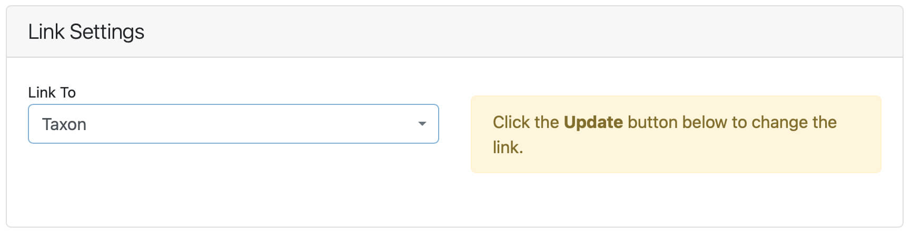
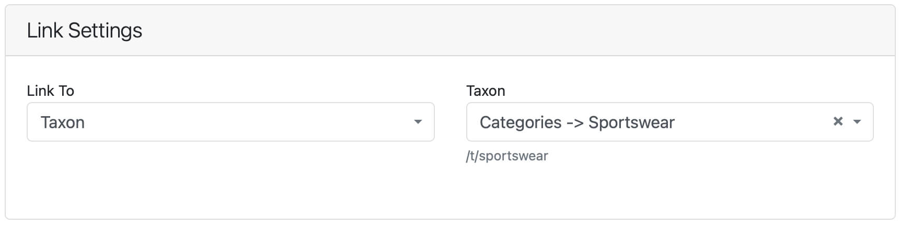

## Introduction

This part of the guide assumes you have created a menu and are now ready to add some items to the menu items area pictured below; if this is not the case, [click here](/user/navigation/creating_menus.html) to view the guide to creating a new menu.

To get start adding items to your menu click the Add New Menu Item button found in the top right of the Menu Item Area; once clicked, you will be taken to the New Menu Item page shown in the image below.

You will be presented with three panels, **Settings**, **Public Details** and **Link Settings**.

## Settings Panel

The Settings panel contains Menu Item specific settings, such as **Item Type**, **Code** and **Nest Under**.

* **Item Type:** The Item Type selector allows you to set if this menu item is a **Link** or a **Container** type. Links are used for linking to Products, Taxons and other parts of your website. In contrast, containers are used to group links together, creating organized sections of a menu.

* **Code:** A menu item code is an optional setting that allows you to identify your link or container for specific uses; for example, if a container has the code of promo, links that are nested inside that container will appear as promotion links with large image and the name and subtitle displayed, while links placed within a container with the code category will be displayed as standard menu text links.

* **Nest Under** The Nest Under option allows you to quickly nest your new item within other menu items, don't worry; if you forget to nest your new menu item, you can re-arrange the items on the main menu items area,

Using the combination of **Item Type** and **Code** allows you as a designer to create menus of any kind imaginable. An example this would be to set the menu code in the footer view file to look for a container with the code of social; any links nested inside this container would be displayed as SVG icons to your company social media pages.

## Public Settings

Public setting is where your public-facing information is set.

* **Name:** This is the name used for the link or container displayed in the view.
* **Subtitle:** The Subtitle used for standard links as the title attribute text, or on promotional items, the subtitle is displayed in the banner.
* **Image:** You have the option to add a photo or SVG icon to your links or containers as you please. Once an image is added, you also have the opportunity to add image alt text for SEO.

## Link Settings

The link settings panel is where you set the link destination, by default, you are offered the URL field.

### URL
You can enter a URL to an external website such as `https://example.com`. Link to a path in your store by simply setting the path `/some/page`. Or you could set the link to launch an email client or trigger a phone call by entering `mailto:sales@example.com` or `tel:123456789`.

To change the **Link To** option, you will need to select the link you desire, then click **Update** as prompted to load the appropriate link credentials.

### Taxon / Product
To link to a Taxon or Product, select the desired item from the *Link To* selector and click **Update** when prompted, as shown in the image above.

You will then be presented with a search box that allows you to search for the Taxon or Product you wish to link to. Once set, click **Update**, and the path to item will be displayed under the search field.

### Home Page

Select **Home** from the **Link To** selector and click **Update**. Your link will now be set to the home page of your store.