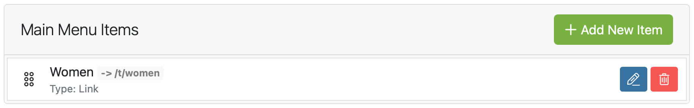
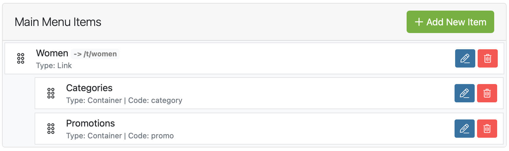
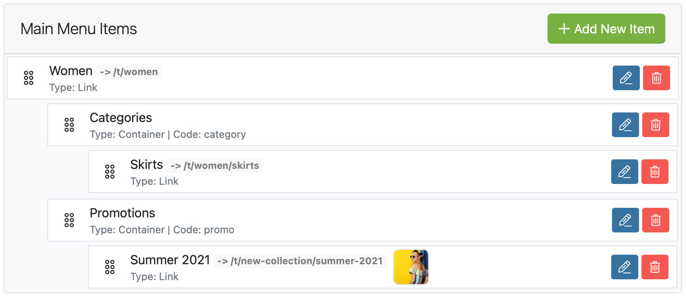

## Introduction

This guide walks you through building the mega menu found in the Spree demo store, and assumes that you have created a new menu with the location set to Header.

If this is not the case please visit the [Create A Menu](/user/navigation/creating_menus.html) section of
the documentation to create your new menu before continuing.

## Add A Top Level Item

1. Click The **Add New Item** button to take you to the New Menu Item screen.

2. Within the New Menu Item screen enter your desired link name, for this demo we called this link `Women`.

3. Use the Link Setting panel to choose where your link points, you can leave this as a blank URL if you have no products or taxons to link to, and then click **Create**.

4. Click **Main Menu** from the breadcrumbs at the top of the screen to take you back to the **Edit Menu** screen, you should see the following menu item added to your menu.

In the image below you can see that we named our menu item Women and linked to the Women taxon, and the menu item is a link.

### Add The Category & Promotions Container

1. Click The **Add New Item** button to take you to the New Menu Item screen.

2. From the options set **Item Type:** `Container`, **Code:** `category`, **Nested under:** `Women`, you can name this menu item anything you like, and then click **Create**.

3. Once your item is saved click **Main Menu** from the breadcrumbs at the top of the screen to take you back to the **Edit Menu** screen.

The promotions container used in the Spree mega menu is exactly the same as the Catagories container, except it uses the **Code:** `promo`, go ahead and repeat the three steps above replacing the code `categories` with `promo`.

In the image below you can see we now have two containers nested under the Women link that we created earlier, we named our containers **Categories** and **Promotions**, they are of the type container and have the appropriate codes.

## Adding Links To Containers

### Add A Link To Categories Container

Adding a link under the categories container is just a case of creating a new menu item as you did before when adding a top level item, only this time from the nest under option you are going to select
Nest Under: `Categories`, if you forget to nest your item while creating it, you can always rearange your items on the menu edit page, and nest the item from there.

### Add A Link To Promotions Container

Adding a promotion link under the Promotions container is just as easy as adding the link under the Categories container. The only difference is we are nesting this new link under the Promotions container,
and using the **Name** to set the banner name **Subtitle** to set the banner subtitle and Image field to add our promo image.

