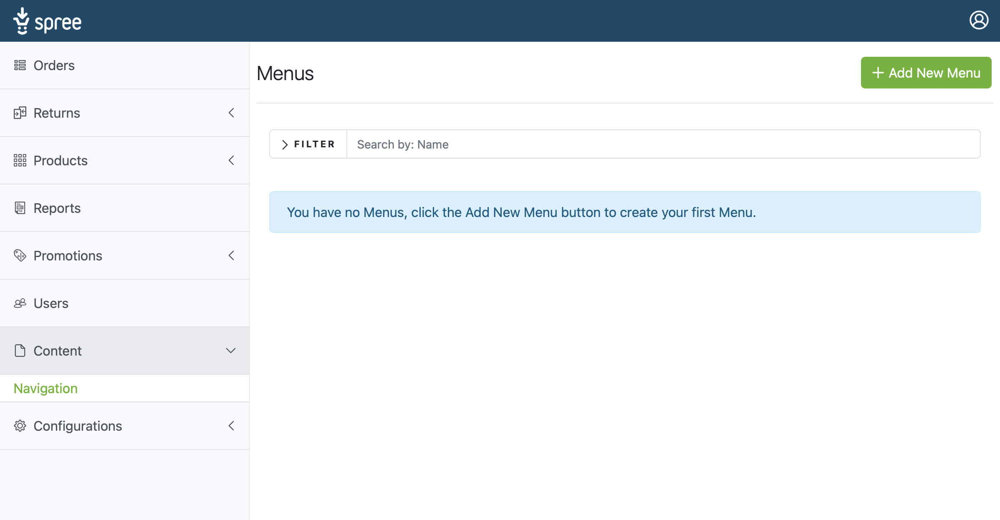
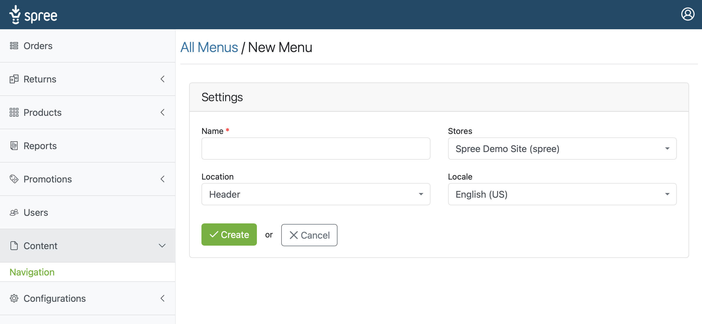
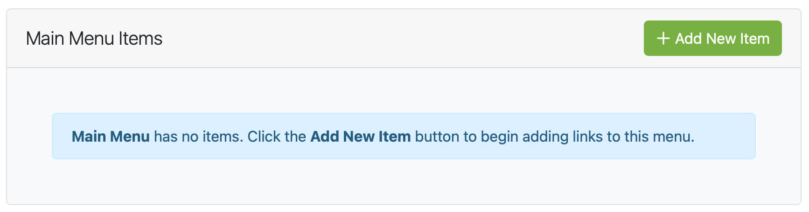

## Introduction

To create a new menu in Spree, log into the admin and click the Content tab from the admin menu. Within the submenu options, click the Navigation link, you will then be taken to the menus area.

Once you are in the menus area, you will see a button in the top right of the screen + Add New Menu, click this button to create your first menu.

## New Menu Options

Once you have entered the New Menu screen, you are presented with four options.

* **Name:** You must give your menu a name; the menu name is not displayed in the frontend store view, so feel free to name your menu something you can quickly identify.

* **Store:** Each menu belongs to one store; set the store that you want this menu to appear in.

* **Location:** Choose the location of your menu. By default, you are offered the choice of Header or Footer; if you wish to add more options, click here to view the developer docs.

* **Locale:** Each Menu is unique by **Store**, **Location** and **Language**; for example, you can not have two menus for your **Default Store**, that both appear in the **Header**, and
both use the language **English**.

Once you have familiarized yourself with the options above, populate each field as required and click **Create**.

Upon creating your first menu, you will be presented with a Menu Items Area; this is where you organize the links of your menu.

View the [Add Items To A Menu](/user/navigation/add_menu_items.html) page of the Navigation documentation to begin adding items to your new menu.