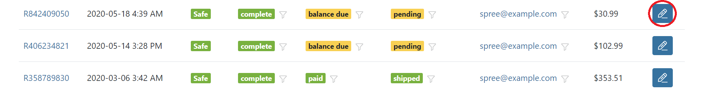
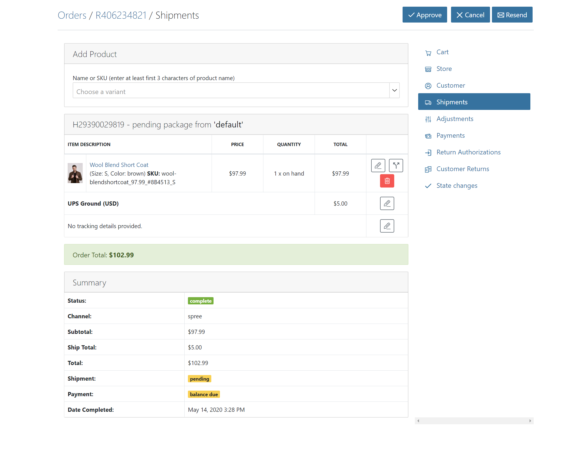

## Introduction

There will come times when you need to edit orders that are placed in your store. Some examples:

* A customer may call you to adjust the quantity of items they want to purchase.
* You may sell out of an item and need to remove it from an item altogether.
* You may need to change the shipping being charged on an order.
* The customer holds a store credit you need to manually apply to their order.

## Editing an Order

First, go to your Admin Interface. Click the "Orders" tab, and [locate the order](/user/orders/searching_orders.html) you want to change.

This will bring up the order edit page:

You can change any of the following components of an order from here:

* [The types and quantities of products](/user/orders/entering_orders.html#add-products)
* [Shipping method](/user/orders/entering_orders.html#shipments)
* Tracking details for shipments
* [Customer information](/user/orders/entering_orders.html#customer-details)
* [Adjustments](/user/orders/entering_orders.html#adjustments)
* [Payment information](/user/orders/entering_orders.html#payments)
* [Return authorizations](/user/orders/returning_orders.html)
