## Introduction

An order can be created in one of two ways:

1. An order is generated when a customer purchase an item from your store.
2. An order can be created manually in your store's Admin panel

This guide covers how to create a manual order in the Admin Panel.

## Add Products

To create new order manually, go into the Admin Interface, click the "Orders" tab, and click the "New Order" button.

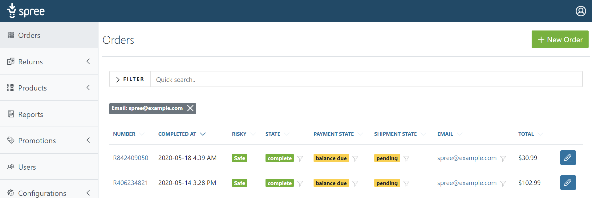

Type the name of the product you would like to add to the order in the search field. A list of matching products and variants combinations will show up in the drop-down menu. Select the product/variant option you want to add to the order.

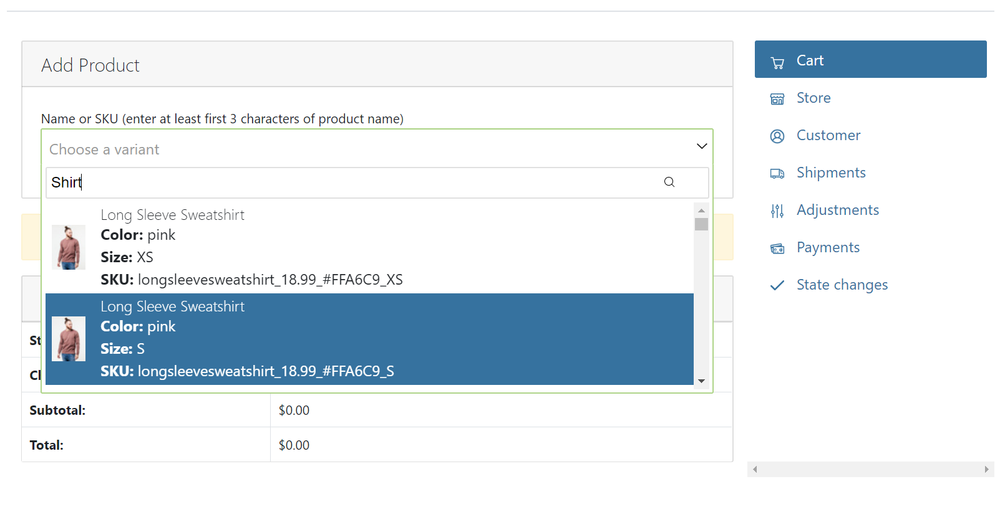

The interface will show you you how many of that product/variant you currently have "on hand". Enter the quantity to add to the new order, and click the "Add" icon next to the item.

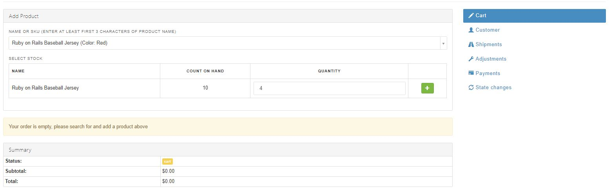

The system creates the order and shows you the line items in it.

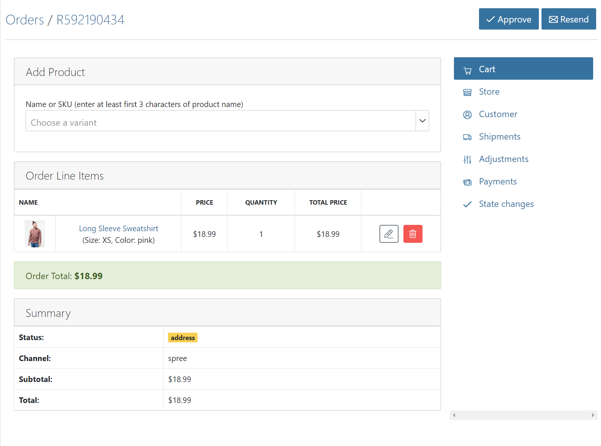

Follow the same steps to add more products to the order.

## Customer Details

Click the "Customer" link. You can either select a name from the "Customer Search" field if the customer has ordered from you before, or you can enter the customer's email address in the "Email" field of the "Account" section. The setting for "Guest Checkout" will automatically change accordingly.

Enter the customer's billing address and the shipping address for the order. You can click "USE BILLING ADDRESS" checkbox to use the same address for both. If you do so, the shipping address fields will become invisible.

Click the "Update" button.

## Shipments

After you input the customer information, you might want to choose a shipping method. When you pressed the "Update" button, the page will reload on "Shipments" tab.

The default shipping method for your store (if you have one) should already be assigned to this order. Depending on the items you added and the location you're shipping to, there could be additional methods available. You may also have shipping methods that are only available for your site's administrator to assign (in-store pickup, for example).

Click the "Edit" link next to the order's shipping line.

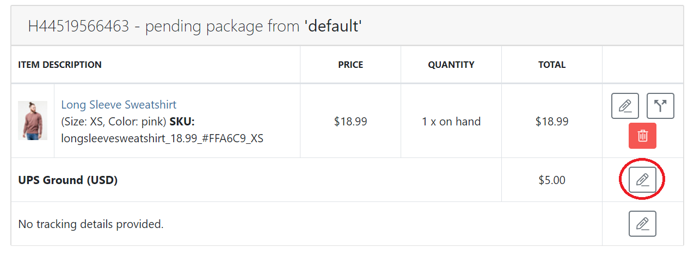

Click the "Shipping Method" drop-down menu, and make your selection.

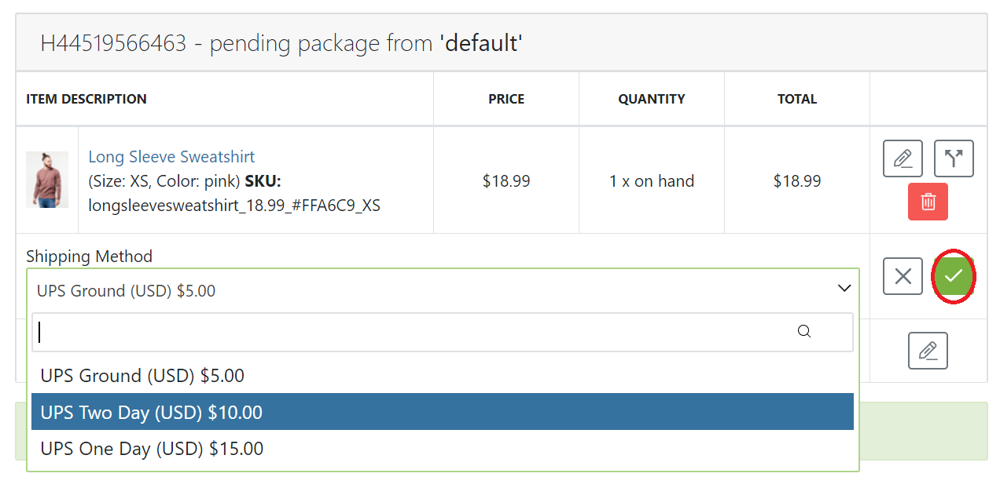

Click the "Save" icon to confirm your change. Your Spree site will re-calculate the shipping, any relevant adjustments, and total for your order.

## Adjustments

The Spree shopping cart will automatically add the cost of the Shipping Method to your order as an adjustment - you can change or remove this.

### Editing Adjustments

To edit an existing order adjustment, just click the "Adjustments" link in the order summary, then click the "Edit" icon next to the adjustment in the Adjustments list.

### Deleting Adjustments

To remove an adjustment, click the "Delete" icon next to it in the Adjustments list.

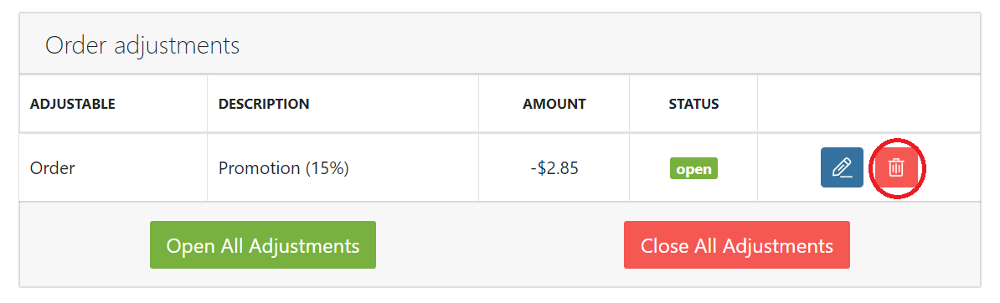

Confirm the deletion by clicking "OK".

### Opening and Closing Adjustments

Some types of adjustments - tax and shipping, for example - may re-calculate as the order changes, new products are added to it, etc. If you want to be sure that the amount of an adjustments will remain the same, you can lock them. This is also known as closing the adjustments.

***
Closed adjustments can be re-opened and changed, up to the moment when the order is shipped. At that point, the adjustment is finalized and cannot be changed.
***

To open or close all of the adjustments in an order, just click the "Open All Adjustments" or "Close All Adjustments" buttons on the Adjustments list.

### Adding Adjustments

You can also add further adjustments - positive or negative - to the order to account for things like handling charges, store credits, etc. To add a new adjustment, click the "New Adjustment" button.

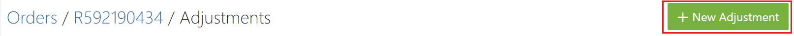

You need only enter the "Amount" (positive for a charge on the order; negative for a credit) and a "Description", then click the "Continue" button.

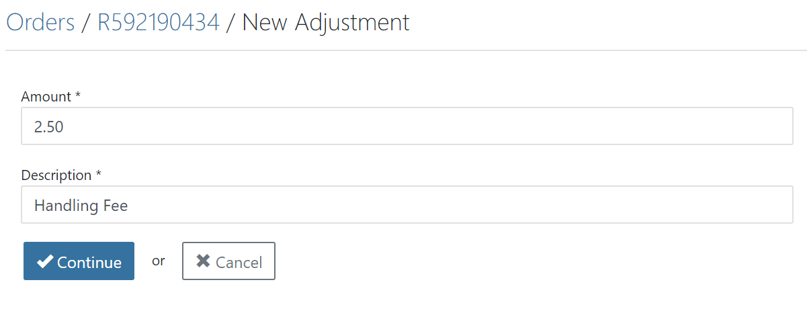

For a better understanding of adjustments, please read the [Developer Adjustments Guide](/developer/core/adjustments.html).

Once you have finished all of the changes you want in the order's Adjustments, click "Continue".

## Payments

If you are manually entering this order, it is presumed that you have received payment either in person, on the phone, or through some other non-website means. You can manually enter payment using any of your site's configured [payment methods](/user/payments/payment_methods.html).

Just click the "Payments" link in the right panel section.

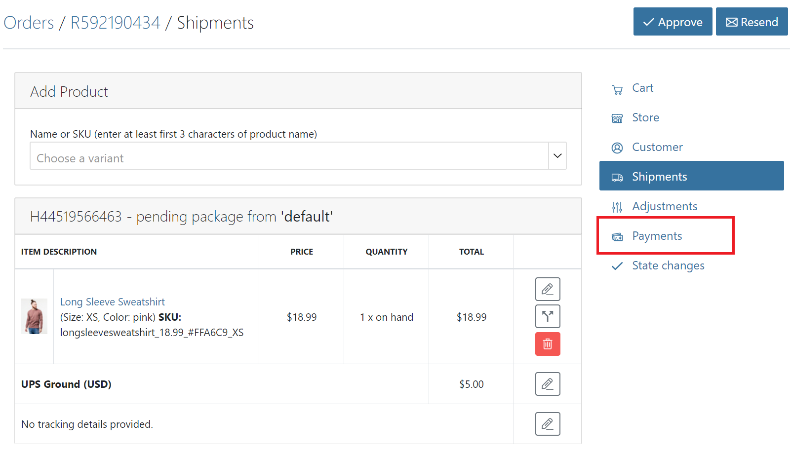

This form is pretty self-explanatory; you enter the amount of the payment, the method, and the credit card information (if applicable).

One thing to note is that you can enter multiple payments on the same order. This is useful if, for example, a customer wants to pay part of their order in cash and put the rest on a credit card. In that case, all you have to do is create the first payment for the Cash amount, check the "Cash" payment method (be sure you have it configured in your store first!), and click Update.

Then, click the "New Payment" link to enter the information for the credit card portion of the payment.

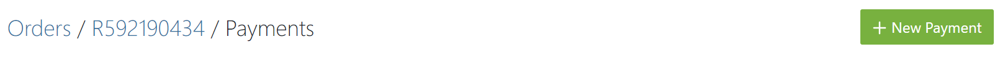

Don't forget that you will need to [capture the payment](/user/payments/payment_states.html#authorize-vs-capture) on the credit card (unless your store is set up to automatically authorize and capture a paymentś).

For more on payments, be sure to read both the [Payment Methods](/user/payments/payment_methods.html) and [Payment States](/user/payments/payment_states.html) guides.
