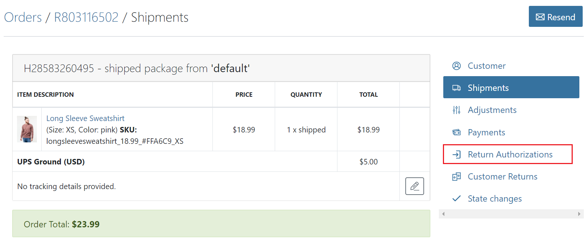
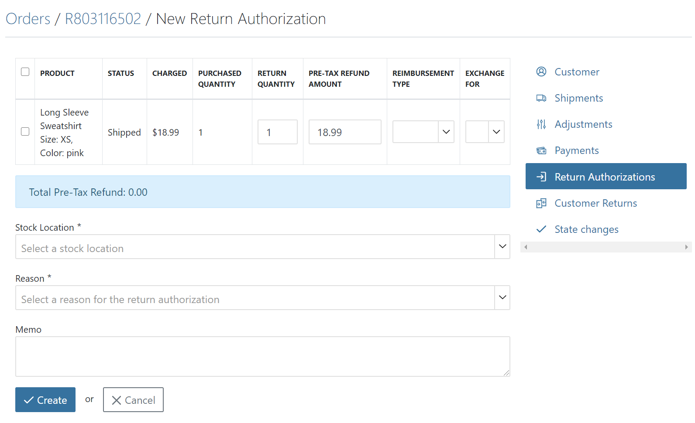
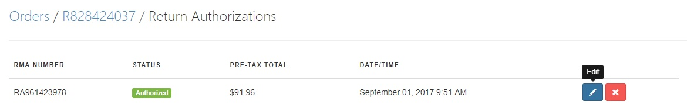
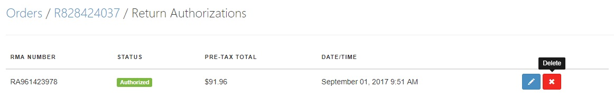
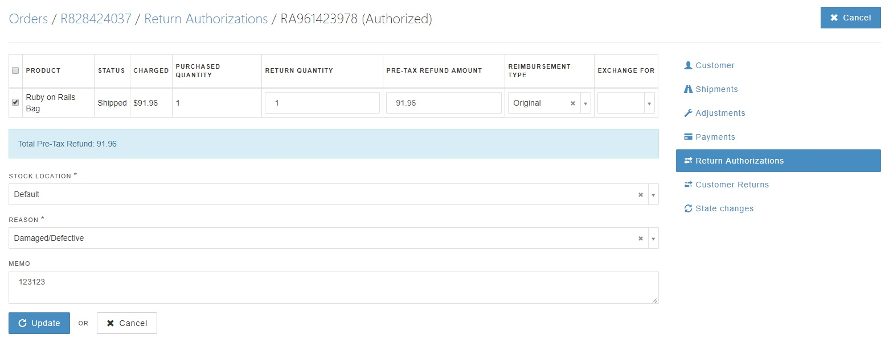
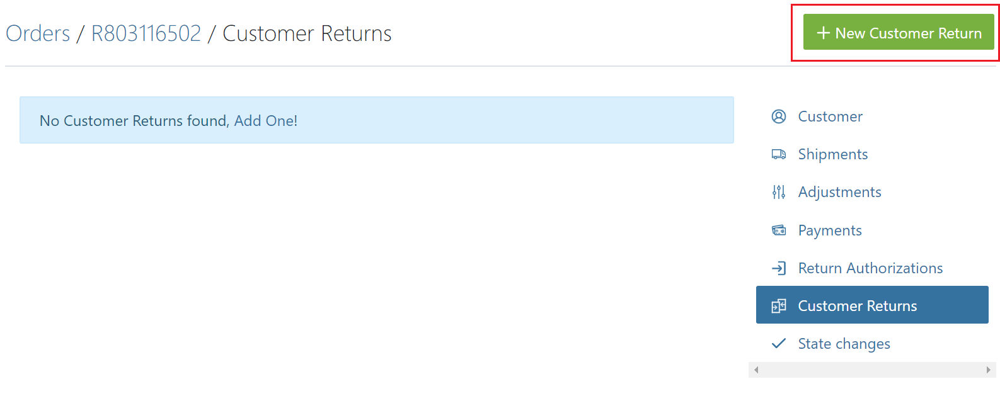
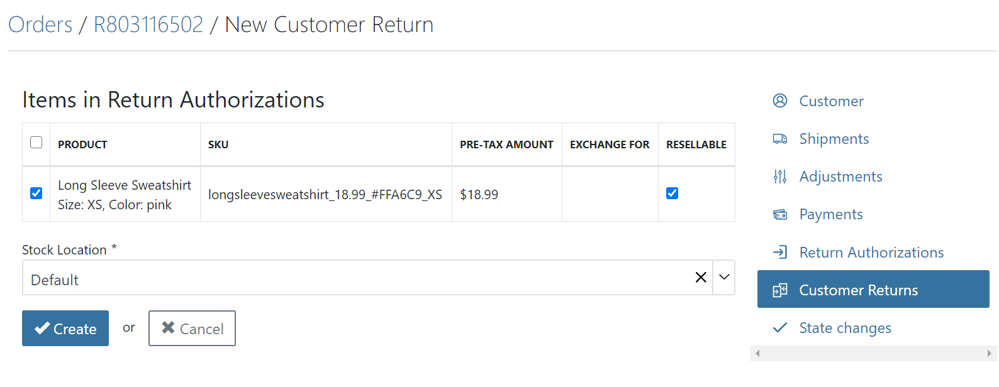
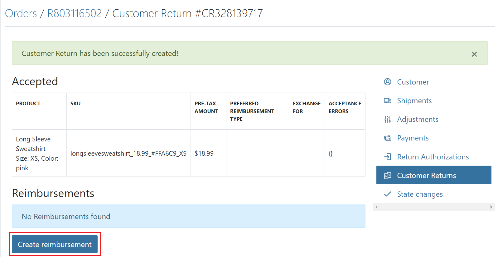
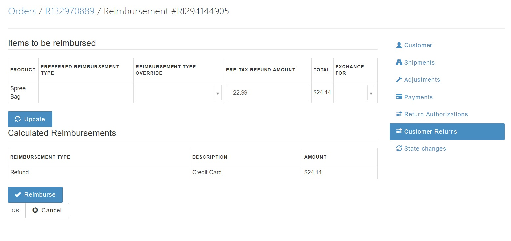
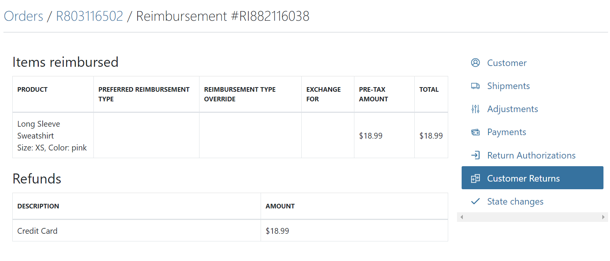

## Introduction

Returns are a reality of doing business for most e-commerce sites. A customer may find that the item they ordered doesn't fit, or that it doesn't suit their needs. The product may have been damaged in shipping. There are many reasons why a customer might choose to return an item they purchased from your store. This guide covers how you, as the site administrator, issue RMAs (Return Merchandise Authorizations) and process returns.

## Creating RMAs for Returns

You can only create RMAs for orders that have already been shipped. That makes sense, as you wouldn't authorize a return for something you haven't sent out yet.

To create an RMA for a shipped order, click the order's "Return Authorizations" link, then click the "New Return Authorization" button. The form that opens up enables you to select which items will be authorized to be returned, and issue an RMA for the corresponding amount.

To use it, just select each line item to be returned, either a reimbursement type or exchange item. Firstly, select the quantity of the item(s) to be returned. This is set to "1" by default but can be adjusted if the customer is returning a number of goods.
Next, choose if you are returning the customer's money or shipping a replacement item.
If reimbursing money, selecting the "Original" reimbursement type will refund a user via their original payment method when the items are returned and approved.
Selecting an exchange item will create a new shipment of a replacement item for the customer. The form will automatically calculate the RMA value based on the sale price of the item(s), but you will have to confirm the amount when the reimbursement is issued. This gives you a chance to adjust for handling fees, restocking fees, damages, etc.

Input the reason and any memo notes for the return, and select the [Stock Location](/user/configuration/configuring_inventory.html) that the item is being sent back to. Click the "Create" button.

Now, you just need to wait for the package to be received at your location.

Even a created Return Authorization can be edited or deleted, most commonly when the user changes his or her mind. As an Admin in your shop, you can still make additional changes to the Return action.

Inside of the Return Authorization Edit, you'll find the same layout as for creating one. Just make your changes and press the **Update** button.

## Processing Returns

Once you receive a return package, you need to create a "Customer Return". To do so, go to the order in question and click "Customer Returns". Click the "New Customer Return" button.

Select which of the authorized return items were received or mark all of them by simply clicking the check box on the left-hand side of the product, and the [Stock Location](/user/products/creating_products.html) at which the item was received. You can also select whether the item that has been returned by the User is still **Resellable** or not. Once you are done, click the "Create" button.

The return items are marked as accepted, and now you can create a reimbursement for the $24.14 you owe the customer.

The reimbursement form will be populated according to your original reimbursement or exchange selections that were chosen in the return authorization form.  You may now override the selected reimbursement type or exchange item, if required. If not, click the "Reimburse" button to create the refund.

Your return-processing is complete! As you can see, there is $24.14 refund issued to the original credit card or store credits to the user's account.

