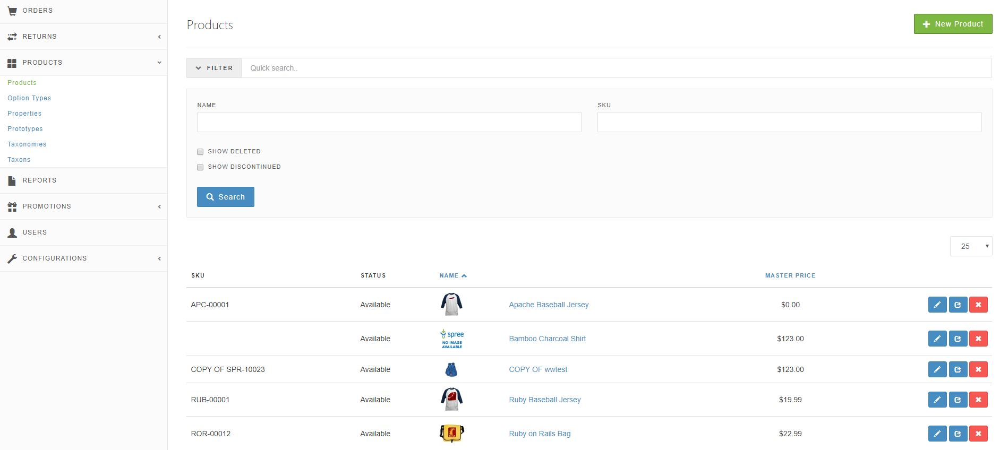

Products are at the core of any e-commerce site. Selling them is the whole reason behind opening a store in the first place.

From your store's Admin Interface, you can manage all of the common tasks associated with managing your products. To reach the Admin Interface, first log into your store with your admin user account, then go to the `/admin` directory of your site. Click the "Products" tab.

From here you can:

* [Create New Products](/user/products/creating_products.html)
* [Delete Existing Products](/user/products/deleting_products.html)
* [Edit Existing Products](/user/products/editing_products.html)
* [Clone Existing Products](/user/products/cloning_products.html)
* [Search Existing Products](/user/products/searching_products.html)
* [Manage Taxonomies and Taxons](/user/products/taxonomies_and_taxons.html)
* [Set product Option types](/user/products/product_options.html) (allows you to manage variant types)
* [Set product category](/user/products/product_prototypes.html)

In addition, you can set up new [Product Option Types and Values](/user/products/product_options.html); add, edit, and remove [Product Properties](/user/products/product_properties.html); and work with [Product Prototypes](/user/products/product_prototypes.html).
