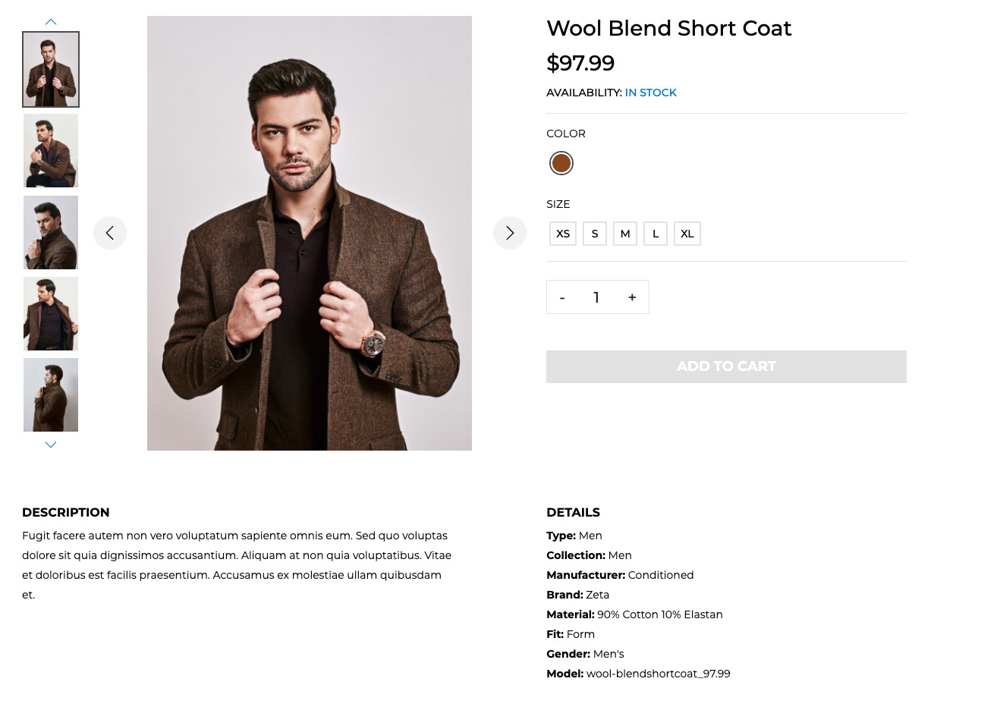
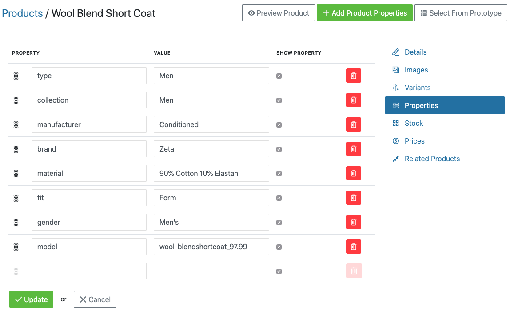

## Product Properties

Depending on the nature of your store and the products you sell, you may want to add "Properties" to your product descriptions. Properties are typically used to provide additional information about a product to help the customer make a better purchase decision. Here is an example of how a product's properties would display on the customer-facing area of a store:

### Adding a Product Property

Follow these steps to add a product Property. In this example, we are going to add a Property called "Country of Origin" with a value of "USA".

1. Click the "Products" tab in your Admin Interface.
2. Click "Properties".
3. Click the "New Property" button.
4. Enter values for the "Name" and "Presentation" fields, such as "Origin" and "Country of Origin", respectively.
5. Click the "Create" button.
6. Navigate to the edit page for one of the products in your store.
7. Click the "Product Properties" link.
8. Click in the empty text box field under "Property" and start typing the name of the property you want to use: "Origin". After you type a few letters, the property name will display, and you can click it to select it.
9. Enter a country name for the "Value" field, such as "USA".
10. Click "Update".

Now, when you navigate to the product's page in your store, you will see the new Country of Origin property in the "Properties" list.

***
You can add as many "Product Properties" to an individual "Product" as you like - just use the "Add Product Properties" button on the Product Properties page for an individual product.
***

You can also add "Product Properties" on the fly as you're editing a "Product" - you don't have to specify them ahead of time. Just be cautious of defining too many similar properties ("Origin", "Country Origin", "Country of Origin"). It's best to re-use existing properties wherever you can.
