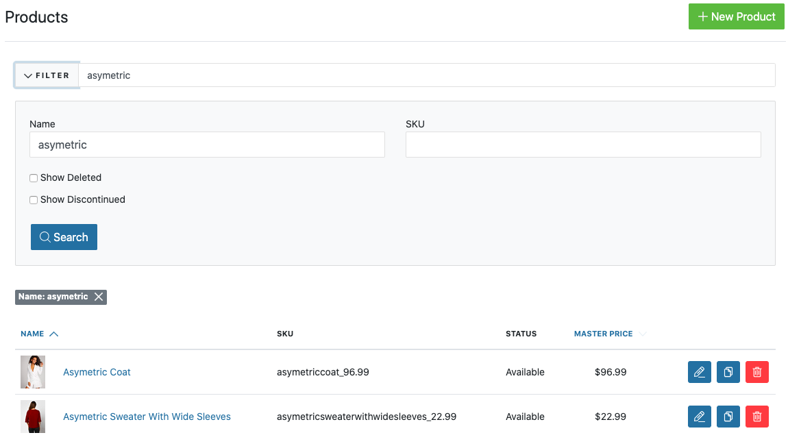

# Searching Products

When you click the **Products** tab, you will see dropdown with the **Products settings** on the Admin Interface. In the next step click **Products** tab in the **Products settings**. Now you are presented with a summary of all actual products in the shop.

The list shows you the following information about each order:

* **SKU Number** - Product's unique ID.
* **Status** - Sets if the product is available in the shop.
* **Name with image** - Actual name and the image visible on front.
* **Master price** - Main price of the product (there might also be different price for the variants).

Next to each product there are 3 buttons.

* **Edit** - Allows you to make [additional edition in the product](/user/products/editing_products.html).
* **Clone** - Allows you to make a [duplicate of the certain product](/user/products/cloning_products.html).
* **Delete** - Allows you to [delete certain product](/user/products/deleting_products.html).

## Filtering products

You may not always want to see all of the products in the shop - the Spree default. You may want to view only those products that you want to make additional changes. Default way of sorting products that are present is by the name, but there is also possibility to sort them by Master price.

You can choose one or more of the following options to narrow your product search, then click the **Filter** button to extend filter options in dropdown.

* **Name** - You can filter particular product by its name.

* **SKU** - Every time you create a product you may want to assign an SKU Number to make a search much faster and simplify shipping flow. You can use that number to search product.
